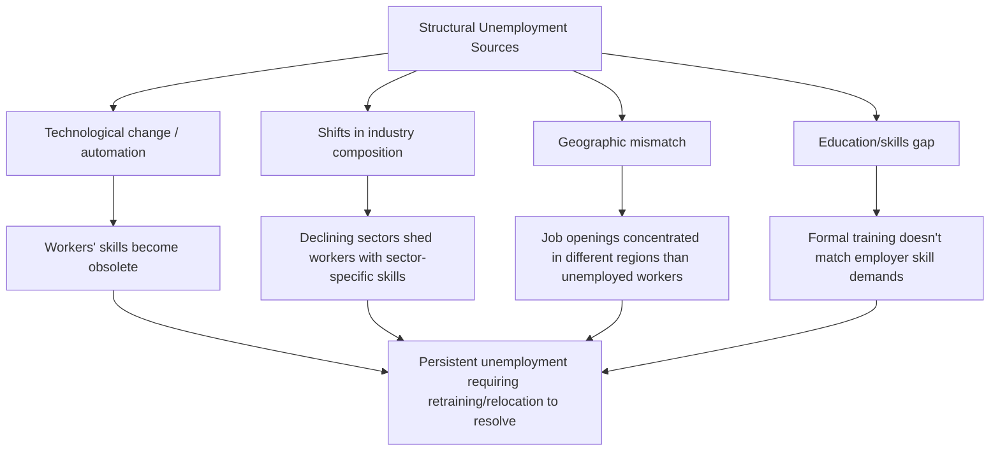

## Structural Unemployment

### Overview

Structural unemployment arises from a persistent mismatch between the skills, location, or characteristics of available workers and the requirements of available jobs, driven by fundamental, long-lasting shifts in the economy rather than the normal churn of job search or a temporary shortfall in aggregate demand. It is generally considered more difficult to resolve and more prolonged in duration than frictional unemployment.

### Definition

Structural unemployment is unemployment that results from a fundamental mismatch between the skills, qualifications, or location of unemployed workers and the requirements or locations of available job vacancies, typically arising from long-term structural changes in the economy such as technological change, shifts in industry composition, or geographic economic decline.

### Key Characteristics

**Key Points**

- Structural unemployment is generally **longer in duration** than frictional unemployment, since resolving a fundamental skills or location mismatch typically requires retraining, relocation, or education — processes that take considerably more time than a typical job search.
- Like frictional unemployment, structural unemployment is considered a component of the **natural rate of unemployment**, meaning it persists even when the economy is operating at full employment or potential output.
- Structural unemployment is **not resolved by aggregate demand stimulus** in the way cyclical unemployment can be, since the underlying problem is a mismatch of skills or location rather than an overall insufficiency of job openings; simply increasing aggregate spending does not, by itself, help a displaced worker acquire skills they lack.

### Causes of Structural Unemployment

**Technological Change and Automation**

- Advances in technology and automation can permanently reduce or eliminate demand for certain types of labor, particularly routine manual or cognitive tasks, leaving affected workers without directly transferable skills for newly emerging roles.
- Workers whose skills become obsolete due to technological change often require significant retraining to transition into new roles, and this transition period can be extended, particularly for workers with specialized skills tied closely to declining industries.

**Structural Shifts in Industry Composition**

- Long-term shifts in the composition of an economy (e.g., a decline in manufacturing employment share alongside growth in service-sector or technology-sector employment) can leave workers with industry-specific skills poorly matched to the skill requirements of growing sectors.
- Globalization and international trade patterns can shift comparative advantage away from certain domestic industries, leading to structural job losses in previously competitive sectors. [Inference: the relative contribution of trade versus technology to specific instances of structural unemployment is a matter of ongoing empirical debate among economists, and likely varies by industry and time period.]

**Geographic Mismatch**

- Economic decline concentrated in specific regions (e.g., due to the decline of a dominant local industry) can leave a geographically concentrated pool of unemployed workers whose skills may not be in demand locally, while relevant job openings exist primarily in other regions.
- Limited labor mobility — due to housing costs, family ties, or other relocation barriers — can prevent workers from moving to regions with better job matches, prolonging structural unemployment in economically declining areas.

**Skills Mismatch from Education and Training Gaps**

- A divergence between the skills taught through the prevailing education and training system and the skills demanded by employers in a changing economy can create persistent structural unemployment, particularly among workers whose formal education did not include emerging in-demand skills (e.g., certain digital or technical competencies).

**Minimum Wage and Labor Market Regulation** [Inference: the following represents one perspective within a broader, contested economic debate rather than a settled consensus]

- Some economic analyses suggest that minimum wage levels set above the market-clearing wage for certain low-skill labor categories can contribute to a form of structural unemployment among affected worker groups, though the magnitude and even the direction of employment effects from minimum wage policy is a genuinely and extensively debated empirical question in labor economics, with different studies reaching different conclusions depending on methodology, context, and the specific labor market studied. [Unverified: this remains one of the most actively contested empirical questions in labor economics, and this document does not take a position on the net employment effects of minimum wage policy.]

### Example

Consider a manufacturing worker who spent 20 years operating specialized machinery at a textile factory. The factory closes permanently due to increased automation and international competition in textile production.

- The worker's highly specific, machine-operation skills have limited transferability to other available job openings in the local economy, which increasingly consist of roles in healthcare, technology support, or logistics — sectors requiring substantially different skill sets.
- Even with active job searching, the worker may remain unemployed for an extended period, not due to a lack of effort or a lack of overall job openings in the broader economy, but because of a fundamental mismatch between the worker's existing skills and the requirements of currently available positions.
- Resolving this unemployment would likely require a retraining program, further education, or possibly geographic relocation to a region with stronger demand for the worker's existing skill set — processes that take considerably more time than a typical frictional job search.

This scenario illustrates structural unemployment as distinct from frictional unemployment: the issue is not simply the time needed to find a similar role, but a fundamental incompatibility between the worker's current skill set and the economy's current labor demand structure.

### The Beveridge Curve and Structural Unemployment

**Key Points**

- The **Beveridge Curve** plots the job vacancy rate against the unemployment rate, and is used by economists to help assess the relative importance of structural versus cyclical factors in the labor market.
- An **outward shift** in the Beveridge Curve (higher unemployment *and* higher vacancy rates occurring simultaneously) is generally interpreted as a signal of rising structural (or matching) mismatch in the labor market, since it indicates that job openings exist but are not being filled by the pool of currently unemployed workers, in contrast to a movement *along* the curve, which is more consistent with cyclical demand fluctuations. [Inference: the interpretation of Beveridge Curve shifts as evidence of structural mismatch versus other explanations (e.g., changes in job search intensity or matching efficiency for other reasons) is a matter of ongoing empirical and methodological debate among labor economists.]

### Structural Unemployment and the Natural Rate

$$\text{Natural Rate of Unemployment} = \text{Frictional Unemployment} + \text{Structural Unemployment}$$

**Key Points**

- Because structural unemployment reflects a fundamental economic mismatch rather than a temporary demand shortfall, it is not considered responsive to short-run monetary or fiscal stimulus in the way cyclical unemployment is.
- Persistently high structural unemployment can raise the estimated natural rate of unemployment (and the associated NAIRU — non-accelerating inflation rate of unemployment) for an economy, which has implications for how policymakers interpret whether a given headline unemployment rate reflects genuine labor market slack or a structural floor.

### Policy Approaches to Reducing Structural Unemployment

**Key Points**

- **Retraining and reskilling programs**: Government-funded or employer-sponsored training initiatives aimed at helping displaced workers acquire skills relevant to growing sectors of the economy.
- **Education system reform**: Adjusting curricula and vocational training programs to better align with evolving employer skill demands, particularly in fields experiencing rapid technological change.
- **Labor mobility support**: Policies aimed at reducing barriers to geographic relocation (such as relocation assistance or addressing housing affordability constraints) can help workers move toward regions with stronger demand for their skills.
- **Wage subsidies and hiring incentives**: Some policy approaches attempt to encourage employers to hire and train structurally unemployed workers by offsetting a portion of the initial training cost or reduced initial productivity. [Inference: the empirical effectiveness of specific retraining and subsidy programs varies substantially across studies, program designs, and economic contexts, and represents an active area of policy research rather than a settled consensus.]

### Structural Unemployment vs. Other Types

| Feature | Structural Unemployment | Frictional Unemployment | Cyclical Unemployment |
| --- | --- | --- | --- |
| Root cause | Skills/location mismatch from long-term economic shifts | Time needed for job search/matching | Deficient aggregate demand |
| Typical duration | Long-term | Short-term | Varies with business cycle |
| Present at full employment? | Yes | Yes | No (by definition) |
| Resolved by demand stimulus? | Generally no | Generally no | Generally yes |
| Typical policy response | Retraining, education, labor mobility support | Improve job-matching information | Monetary/fiscal stimulus |
| Beveridge Curve signal | Outward shift (higher unemployment and vacancies together) | N/A (not a primary driver of curve position) | Movement along a stable curve |

### Broader Economic Significance

- Structural unemployment represents a genuine economic inefficiency in the sense that it reflects unrealized potential output — workers who want to work and job vacancies that need filling, yet the two are not successfully matched due to underlying mismatches.
- Persistent structural unemployment in a region or sector can contribute to broader social and economic challenges, including long-term unemployment scarring effects on affected workers' future earnings and employability (sometimes discussed in the context of labor market hysteresis), and can widen regional economic disparities within a country. [Inference: the specific magnitude and persistence of these scarring and regional disparity effects vary by context and are subjects of ongoing empirical research.]
- Distinguishing structural from cyclical unemployment in real-time economic analysis is often genuinely difficult, since both can contribute to an elevated unemployment rate simultaneously, and policymakers must often rely on a range of indicators (including the Beveridge Curve, unemployment duration data, and sector-specific vacancy data) to assess the relative importance of each in a given economic episode.

**Next Steps**

- Frictional unemployment: causes and distinctions from structural unemployment
- Cyclical unemployment and the business cycle
- The Beveridge Curve in depth
- The natural rate of unemployment and NAIRU
- Labor market hysteresis and long-term unemployment scarring effects
- Retraining and active labor market policy program evaluation
- Minimum wage policy debates in labor economics
- Technological change and the future of work