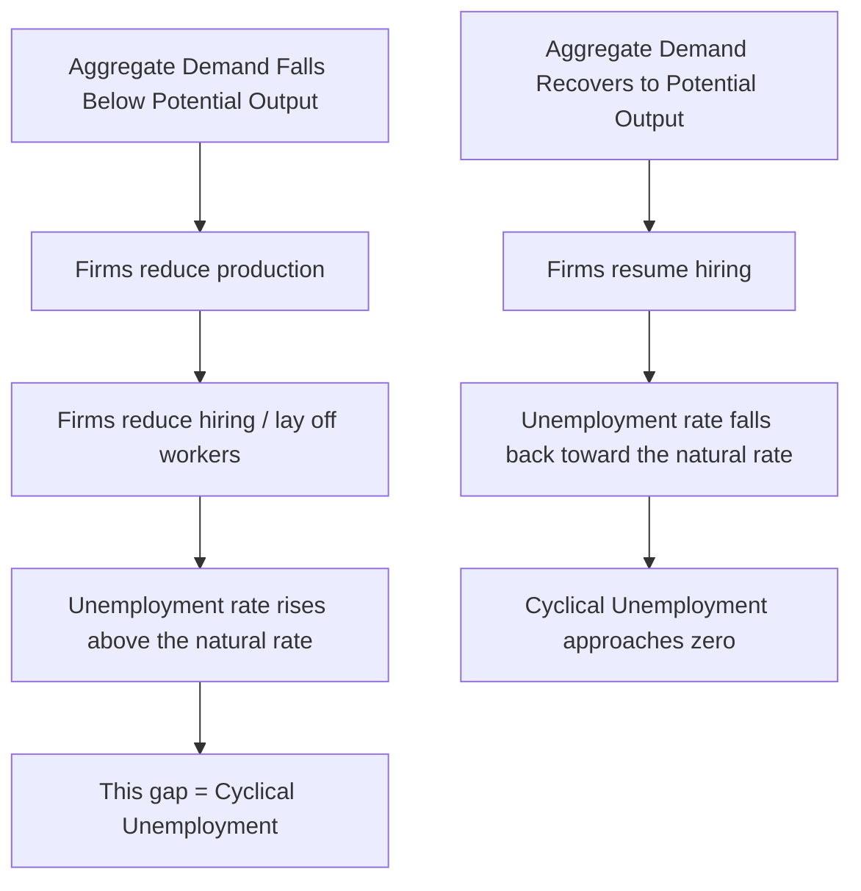
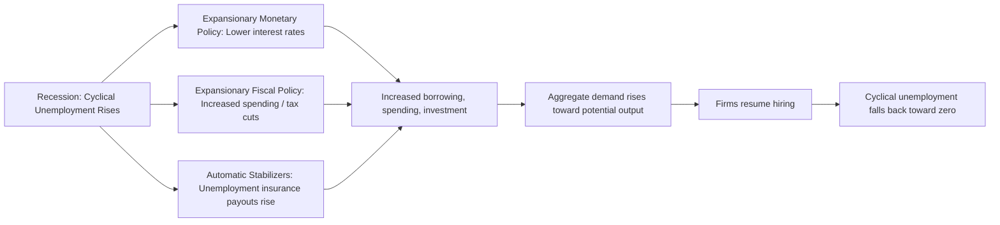

## Cyclical Unemployment

### Overview

Cyclical unemployment refers to the portion of total unemployment that arises from fluctuations in the business cycle, specifically from a deficiency in aggregate demand for goods and services that leads firms to reduce employment below the level associated with full employment. Unlike frictional and structural unemployment, cyclical unemployment is, by definition, absent when the economy operates at full employment or potential output, and it is the primary target of countercyclical monetary and fiscal policy.

### Definition

Cyclical unemployment is the component of unemployment caused by a shortfall in aggregate demand relative to the economy's productive capacity, typically arising during recessions or periods of economic slowdown, and it rises and falls with the business cycle rather than reflecting structural mismatches or normal labor market churn.

### Key Characteristics

**Key Points**

- Cyclical unemployment is fundamentally a **demand-side phenomenon**: it arises because there is insufficient aggregate spending in the economy to support employment at the full-employment level, not because of a skills mismatch or normal job-search friction.
- By definition, cyclical unemployment is **zero when the economy is at full employment** (operating at potential GDP), and positive when actual output falls below potential output (a negative output gap).
- Cyclical unemployment tends to be the most **responsive to monetary and fiscal policy**, since expansionary policy can directly address the aggregate demand shortfall that causes it, unlike frictional or structural unemployment.

### The Relationship to the Business Cycle and Output Gap

**Formula**

$$\text{Actual Unemployment Rate} = \text{Natural Rate of Unemployment} + \text{Cyclical Unemployment}$$

Equivalently:

$$\text{Cyclical Unemployment} = \text{Actual Unemployment Rate} - \text{Natural Rate of Unemployment}$$

**Key Points**

- When actual GDP falls below potential GDP (a negative output gap, indicating a recession or economic slack), cyclical unemployment is positive, and the actual unemployment rate exceeds the natural rate.
- When actual GDP is at or above potential GDP, cyclical unemployment is at or near zero (or, in some cases, could be interpreted as slightly negative during periods of extremely tight labor markets, though this interpretation is debated).
- The natural rate of unemployment (comprising frictional and structural unemployment) serves as a benchmark against which cyclical unemployment is measured, since it represents the "floor" of unemployment that would persist even absent any demand deficiency.

### Okun's Law

**Definition**

Okun's Law is an empirically observed relationship, first identified by economist Arthur Okun, describing an inverse relationship between the unemployment rate and real GDP growth relative to potential GDP growth — specifically, it estimates how much cyclical unemployment tends to rise for a given shortfall in output relative to potential.

**Formula (General Form)**

$$\frac{Y - Y^*}{Y^*} \approx -\beta(u - u^*)$$

where $Y$ is actual real GDP, $Y^*$ is potential real GDP, $u$ is the actual unemployment rate, $u^*$ is the natural rate of unemployment, and $\beta$ is an empirically estimated coefficient (a commonly cited historical rule-of-thumb value for the U.S. economy is approximately 2, though this coefficient can vary over time and across studies). [Unverified: the precise value of Okun's coefficient varies by country, time period, and estimation methodology, and should not be treated as a fixed universal constant.]

**Example**

If potential GDP growth is 2% per year and the natural rate of unemployment is 4.5%, and actual GDP growth for the year comes in at 0% (i.e., a 2 percentage point shortfall relative to potential growth), Okun's Law (using a coefficient of approximately 2) would suggest cyclical unemployment might rise by roughly:

$$\Delta u \approx \frac{2\%}{2} = 1 \text{ percentage point}$$

This would imply the unemployment rate might rise to approximately 5.5% (4.5% natural rate + 1 percentage point cyclical component), though this is an approximation based on a historically estimated relationship rather than a precise mechanical law. [Inference: actual realized unemployment changes in any specific historical episode can deviate from Okun's Law predictions due to other concurrent factors affecting labor markets.]

### Causes of Cyclical Unemployment

**Demand-Side Shocks**

- A decline in consumer spending, often triggered by falling consumer confidence, reduced wealth (e.g., following an asset price decline), or tightening credit conditions.
- A decline in business investment, often triggered by pessimistic expectations about future demand, tightening financial conditions, or reduced access to credit.
- A decline in net exports, potentially driven by weaker demand from trading partners or exchange rate movements that reduce export competitiveness.
- Contractionary fiscal or monetary policy, whether implemented deliberately to control inflation or occurring due to other policy considerations, can reduce aggregate demand and contribute to cyclical unemployment as a side effect.

**Amplification Mechanisms**

- Falling aggregate demand leads firms to reduce production, which reduces the need for labor input, leading to layoffs or reduced hiring.
- Laid-off workers reduce their own spending, which further reduces aggregate demand (a multiplier effect), potentially deepening the initial downturn and further increasing cyclical unemployment.
- This dynamic connects cyclical unemployment closely to broader business cycle theory and the concept of the Keynesian expenditure multiplier.

### Example

Consider an economy operating near full employment with a natural rate of unemployment of 4.5%. A sharp decline in consumer confidence, triggered by a financial market disruption, leads households to reduce discretionary spending significantly.

- Retailers and service providers, facing reduced demand for their goods and services, begin reducing staff hours and implementing layoffs.
- As laid-off workers reduce their own spending, the demand shortfall spreads to other sectors of the economy, including suppliers to the initially affected retailers.
- Over the following months, the unemployment rate rises from 4.5% to 7.5%, with the additional 3 percentage points representing cyclical unemployment — unemployment attributable specifically to the demand shortfall rather than to any change in workers' skills or normal job-search friction.
- As the economy recovers (e.g., aided by expansionary monetary policy that lowers borrowing costs and stimulates spending, or fiscal stimulus that directly boosts demand), aggregate demand gradually returns toward its prior level, firms resume hiring, and the unemployment rate falls back toward the 4.5% natural rate, eliminating the cyclical component.

### Policy Responses to Cyclical Unemployment

**Key Points**

- **Expansionary monetary policy**: Central banks can lower policy interest rates to reduce borrowing costs, encouraging consumption and investment spending, thereby boosting aggregate demand and reducing cyclical unemployment.
- **Expansionary fiscal policy**: Governments can increase spending or reduce taxes to directly or indirectly boost aggregate demand, aiming to restore output toward potential GDP and reduce cyclical unemployment.
- **Automatic stabilizers**: Programs such as unemployment insurance automatically increase government transfer payments during downturns (as more people qualify for benefits), which helps support aggregate demand without requiring new discretionary policy action.
- Because cyclical unemployment is specifically a demand-side phenomenon, it is generally considered the type of unemployment for which countercyclical demand-management policy is most appropriate and effective, in contrast to frictional or structural unemployment, which require different types of interventions (improved job matching or retraining, respectively). [Inference: the specific effectiveness, timing, and magnitude of monetary and fiscal policy responses in any given cyclical downturn depends on numerous context-specific factors and remains an area of active macroeconomic research and debate.]

### Cyclical Unemployment vs. Other Types

| Feature | Cyclical Unemployment | Frictional Unemployment | Structural Unemployment |
| --- | --- | --- | --- |
| Root cause | Deficient aggregate demand | Time needed for job search/matching | Skills/location mismatch |
| Relationship to business cycle | Rises in recessions, falls in expansions | Relatively stable across the cycle | Relatively stable across the cycle (absent major structural shifts) |
| Present at full employment? | No (by definition, zero) | Yes | Yes |
| Typical policy response | Monetary/fiscal stimulus | Improve job-matching information | Retraining, education, labor mobility |
| Related empirical relationship | Okun's Law | N/A | Beveridge Curve shifts |

### Cyclical Unemployment and Inflation: The Phillips Curve Connection

**Key Points**

- Cyclical unemployment is closely connected to the **Phillips Curve** framework, which describes an observed short-run inverse relationship between unemployment and inflation (or wage growth): as cyclical unemployment falls (the labor market tightens), upward wage and price pressures have historically tended to increase, and vice versa. [Unverified: the stability and strength of this short-run relationship has varied considerably across different historical periods and is a subject of extensive ongoing empirical and theoretical debate among macroeconomists.]
- This connection underlies why central banks pursuing dual mandates (both price stability and full employment, such as the U.S. Federal Reserve) must carefully calibrate policy responses to cyclical unemployment, since aggressive demand stimulus aimed at eliminating cyclical unemployment could, according to this framework, risk generating undesired inflationary pressure if pursued beyond the point where cyclical unemployment reaches zero.

### Broader Economic Significance

- Cyclical unemployment represents a direct and measurable form of economic inefficiency, since it reflects idle labor resources and forgone output that could otherwise have been produced had aggregate demand been sufficient to sustain full employment.
- Extended periods of elevated cyclical unemployment can, in some cases, evolve into structural unemployment through a process called **hysteresis**, whereby workers who remain unemployed for long periods experience skill atrophy, reduced attachment to the labor force, or employer perceptions of reduced employability, making it progressively harder for them to be re-absorbed into the labor market even after aggregate demand recovers. [Inference: the extent and conditions under which cyclical unemployment converts into more persistent structural unemployment via hysteresis is an active area of macroeconomic research, and the phenomenon's magnitude appears to vary across different economic episodes.]
- This hysteresis risk is one of the arguments used by some economists in favor of prompt and sufficiently forceful policy responses to cyclical downturns, in order to minimize the risk of temporary cyclical unemployment becoming embedded as longer-term structural unemployment. [Inference: the appropriate scale, timing, and design of such policy responses remains a matter of ongoing macroeconomic policy debate.]

**Next Steps**

- Okun's Law: derivation, estimation, and limitations
- The Phillips Curve and the inflation-unemployment trade-off
- Hysteresis in labor markets and long-term unemployment scarring
- Monetary policy transmission mechanisms
- Fiscal policy multipliers and automatic stabilizers
- The natural rate of unemployment and NAIRU
- Business cycle theory: causes of recessions and expansions
- Aggregate demand and aggregate supply framework