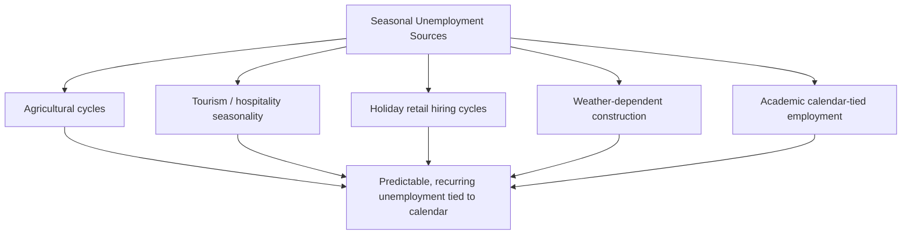
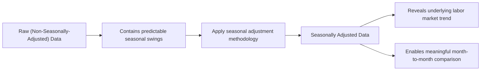

## Seasonal Unemployment

### Overview

Seasonal unemployment refers to joblessness that arises from predictable, recurring fluctuations in labor demand tied to the time of year, industry cycles, or calendar-driven patterns in economic activity. It is distinct from frictional, structural, and cyclical unemployment in that its timing and recurrence are largely predictable in advance, allowing for specific measurement and adjustment techniques in labor market statistics.

### Definition

Seasonal unemployment is unemployment that results from regular, predictable variations in labor demand across different times of the year, driven by factors such as weather patterns, holiday cycles, agricultural growing seasons, or tourism patterns, causing certain jobs to be available only during specific portions of the calendar year.

### Key Characteristics

**Key Points**

- Seasonal unemployment is **predictable and recurring**, following a regular annual pattern rather than arising unexpectedly, which distinguishes it from cyclical unemployment (tied to unpredictable business cycle fluctuations) and structural unemployment (tied to longer-term economic shifts).
- Because it is predictable, seasonal unemployment can be **statistically adjusted for** in published labor market data through a technique known as seasonal adjustment, allowing analysts to distinguish genuine underlying labor market trends from routine calendar-driven fluctuations.
- Seasonal unemployment is generally **not considered a significant policy concern** in the same way cyclical or structural unemployment are, since it reflects a normal and anticipated feature of certain industries rather than a market failure or demand deficiency requiring correction.

### Causes of Seasonal Unemployment

**Agricultural Cycles**

- Many agricultural jobs, such as planting, harvesting, and crop processing, are only available during specific growing and harvest seasons, leaving agricultural workers without employment in this sector during off-seasons.

**Tourism and Hospitality Patterns**

- Tourist destinations often experience sharply higher demand for hospitality, recreation, and service workers during peak travel seasons (such as summer beach destinations or winter ski resorts), with substantially reduced staffing needs during off-peak periods.

**Retail and Holiday-Driven Demand**

- Retail employment often surges during the holiday shopping season (e.g., in the months leading up to major year-end holidays in many countries), with temporary and seasonal workers hired specifically for this period, followed by widespread layoffs once the peak shopping season concludes.

**Construction and Weather-Dependent Industries**

- Outdoor construction activity in regions with harsh winter climates often slows or halts during winter months, leading to temporary layoffs of construction workers until conditions improve in warmer seasons.

**Education-Related Employment Patterns**

- Employment in certain roles tied to the academic calendar (such as specific school-support staff positions) can exhibit seasonal patterns tied to school terms and academic breaks.

### Example

Consider a ski resort town where employment in hospitality, food service, and recreation roles rises sharply each year from approximately November through March (the winter tourist season) and falls substantially during the remaining months.

- Workers hired specifically for the winter season are frequently laid off once the season ends in spring, becoming unemployed until the following winter season begins again, or until they find alternative seasonal or year-round work.
- This pattern of hiring and layoffs recurs predictably each year, following the same general calendar timing, in contrast to cyclical unemployment, which follows the unpredictable timing of broader economic booms and recessions.
- A worker experiencing this pattern year after year is not considered to be suffering from a skills mismatch (structural unemployment) or from insufficient economywide demand (cyclical unemployment) — rather, their unemployment reflects the predictable, seasonal nature of the specific industry in which they are employed.

Similarly, consider retail employees hired specifically for the year-end holiday shopping season. Once this period concludes, many of these seasonal positions are eliminated, and the affected workers become unemployed until the following year's holiday hiring cycle begins, unless they secure other employment in the interim.

### Seasonal Adjustment in Labor Market Statistics

**Definition**

Seasonal adjustment is a statistical technique applied to raw labor market data (such as the unemployment rate or nonfarm payroll figures) to remove the predictable, recurring effects of seasonal patterns, allowing analysts to more clearly observe underlying labor market trends and identify genuine changes in economic conditions.

**Key Points**

- Raw (non-seasonally-adjusted) unemployment data can show substantial month-to-month swings purely due to predictable seasonal hiring and layoff patterns (e.g., a typical rise in raw unemployment figures each January following the conclusion of holiday retail hiring), which can obscure the underlying trend if not accounted for.
- Statistical agencies, such as the U.S. Bureau of Labor Statistics, commonly publish **seasonally adjusted** unemployment and employment figures, which apply statistical techniques (such as the X-13ARIMA-SEATS methodology used by the U.S. Census Bureau) to remove the average expected seasonal effect from each month's figures, based on historical seasonal patterns observed over many years. [Unverified: the specific seasonal adjustment methodology and its precise technical parameters may be updated periodically by the relevant statistical agency, and readers seeking current methodological details should consult the agency's published documentation directly.]
- Both seasonally adjusted and non-seasonally-adjusted (raw) figures are typically published, since raw figures remain useful for certain specific purposes (such as understanding the actual current labor market conditions for someone seeking a job in a specific season), while seasonally adjusted figures are generally preferred for month-to-month trend analysis and cross-period comparisons.

**Example**

Consider a hypothetical retail sector where raw employment figures might show approximately 500,000 additional retail jobs in November and December due to holiday hiring, followed by a comparable decline in January and February as these seasonal positions end.

- Without seasonal adjustment, this pattern might create the appearance of a significant "employment boom" in November-December followed by a "labor market collapse" in January-February, even though this same predictable pattern occurs every year and does not reflect any genuine change in the underlying health of the labor market.
- With seasonal adjustment applied, analysts can instead observe the underlying employment trend after removing this well-established, predictable seasonal pattern, allowing for more meaningful comparisons across different months and years.

### Seasonal Unemployment vs. Other Types

| Feature | Seasonal Unemployment | Frictional Unemployment | Structural Unemployment | Cyclical Unemployment |
| --- | --- | --- | --- | --- |
| Root cause | Predictable calendar/industry cycles | Time needed for job search/matching | Skills/location mismatch | Deficient aggregate demand |
| Predictability | High (recurs annually in a known pattern) | Low (individual-specific timing) | Low (long-term, gradual) | Low (tied to unpredictable business cycle) |
| Typically addressed via | Seasonal adjustment in statistics | Improved job-matching information | Retraining, education, mobility support | Monetary/fiscal stimulus |
| Considered part of "natural rate"? | Generally excluded via seasonal adjustment before natural rate analysis | Yes | Yes | No |

### Why Seasonal Unemployment Is Treated Differently in Policy Analysis

**Key Points**

- Because seasonal unemployment is predictable and recurs on a known schedule, it does not typically warrant the same type of policy intervention as cyclical or structural unemployment, since workers, employers, and policymakers can generally anticipate its occurrence and, in many cases, plan around it (e.g., through unemployment insurance systems, seasonal work arrangements, or workers holding multiple seasonal jobs across different times of year).
- Some seasonal industries and their associated workforces have developed structural arrangements to manage seasonal unemployment, such as workers who intentionally pursue complementary seasonal roles across different times of year (e.g., working at a ski resort in winter and a summer camp or agricultural role in warmer months) to maintain more consistent year-round income.
- Labor economists and policymakers primarily focus analytical and policy attention on the **non-seasonal components** of unemployment (frictional, structural, and cyclical), since seasonally adjusted unemployment rate figures are specifically designed to strip out the predictable seasonal component before broader labor market health assessments are made.

### Broader Economic Significance

- Seasonal unemployment illustrates an important methodological principle in macroeconomic measurement: not all fluctuations in reported unemployment reflect meaningful changes in underlying economic conditions, and properly distinguishing predictable, calendar-driven patterns from genuine shifts in labor market health is essential for accurate economic analysis and policymaking.
- The existence of well-established, predictable seasonal patterns in many industries also has implications for labor market and business planning at the microeconomic level, as both firms and workers in seasonally sensitive industries often develop institutional arrangements (temporary contracts, unemployment insurance eligibility structured around seasonal work, multi-season employment strategies) to manage the predictable nature of this specific type of unemployment.

**Next Steps**

- Seasonal adjustment methodology (X-13ARIMA-SEATS and related techniques)
- Frictional, structural, and cyclical unemployment in comparison
- The natural rate of unemployment and how seasonal effects are excluded
- Nonfarm payroll employment reporting and seasonal adjustment
- Agricultural labor markets and seasonal employment patterns
- Tourism-dependent regional economies and employment cycles
- Unemployment insurance eligibility for seasonal workers