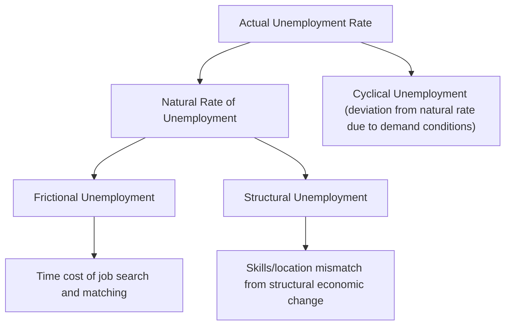
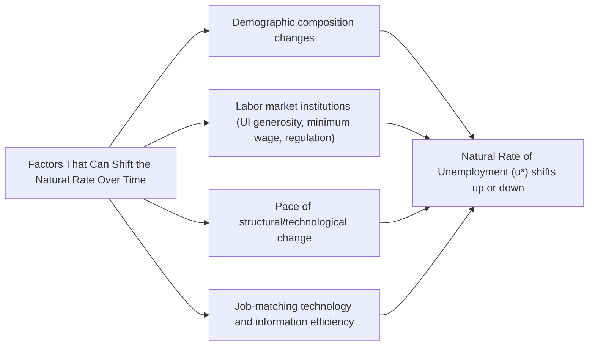

## Natural Rate of Unemployment Concept

### Overview

The natural rate of unemployment represents the level of unemployment that persists in an economy even when it is operating at full employment or potential output, reflecting the combined effects of frictional and structural unemployment rather than any deficiency in aggregate demand. This concept serves as a critical benchmark for distinguishing genuine labor market slack from unemployment that is a normal, unavoidable feature of a well-functioning economy.

### Definition

The natural rate of unemployment is the unemployment rate that exists when an economy is at full employment and actual real GDP equals potential real GDP, comprising frictional and structural unemployment but excluding cyclical unemployment, which is by definition zero at this benchmark level of economic activity.

**Formula**

$$u^* = u_{frictional} + u_{structural}$$

where $u^*$ denotes the natural rate of unemployment.

The actual unemployment rate at any point in time can then be decomposed as:

$$u = u^* + u_{cyclical}$$

where $u_{cyclical}$ can be positive (during a downturn, when actual unemployment exceeds the natural rate), zero (at full employment), or, in some interpretations, slightly negative during periods of an unusually tight labor market. [Inference: whether cyclical unemployment can meaningfully be negative, and what this would imply, is a matter of some theoretical and empirical debate, particularly given how "full employment" itself is estimated.]

### Historical Development of the Concept

**Key Points**

- The natural rate of unemployment concept was notably developed and popularized by economist **Milton Friedman** and, independently, economist **Edmund Phelps** in the late 1960s, as part of a broader critique of the simple, stable long-run Phillips Curve trade-off between inflation and unemployment that had been influential in earlier macroeconomic thinking.
- Friedman and Phelps argued that attempts by policymakers to permanently hold unemployment below its natural rate through sustained expansionary demand policy would not succeed in the long run, but would instead lead to accelerating inflation, as workers' inflation expectations adjusted over time to anticipate the higher inflation resulting from such policy. [Unverified: while this general theoretical argument is widely taught, the practical, real-time application and precise empirical validation of this framework in specific historical episodes remains a subject of ongoing macroeconomic research and debate.]
- This theoretical development contributed to the modern understanding of the **long-run vertical Phillips Curve**, in which, according to this framework, there is no long-run trade-off between inflation and unemployment — the economy tends to return to the natural rate of unemployment regardless of the sustained inflation rate, once inflation expectations fully adjust.

### Components of the Natural Rate

**Frictional Unemployment Component**

- Reflects the time required for workers to search for and find suitable job matches, and for employers to search for and select suitable candidates, given imperfect information and the inherent time cost of the matching process.
- Considered a largely unavoidable feature of any dynamic labor market with voluntary job mobility.

**Structural Unemployment Component**

- Reflects persistent mismatches between the skills or location of available workers and the requirements or location of available job vacancies, arising from long-term structural changes such as technological change, shifting industry composition, or geographic economic decline.

### NAIRU: The Non-Accelerating Inflation Rate of Unemployment

**Definition**

NAIRU (Non-Accelerating Inflation Rate of Unemployment) is closely related to, and in much of modern macroeconomic literature often used interchangeably or nearly interchangeably with, the natural rate of unemployment concept, referring specifically to the unemployment rate at which inflation remains stable (neither accelerating nor decelerating) over time.

**Key Points**

- If the actual unemployment rate falls below the NAIRU, inflationary pressure is expected to build and accelerate over time, according to the theoretical framework underlying this concept, as tight labor markets push wages upward faster than productivity growth can offset, leading to rising costs that get passed through to prices.
- If the actual unemployment rate rises above the NAIRU, disinflationary pressure is expected to emerge, as slack labor markets reduce upward pressure on wages and prices.
- The NAIRU is not directly observable and must be **statistically estimated**, typically through econometric models relating inflation dynamics to labor market slack, and these estimates carry substantial uncertainty and are subject to revision over time as new data becomes available. [Unverified: specific numerical NAIRU estimates for any given economy at a given time are model-dependent and subject to considerable estimation uncertainty; current point estimates should be obtained from up-to-date sources such as central bank or government agency publications rather than relying on historical or memorized figures.]

### Why the Natural Rate Is Not Fixed or Directly Observable

**Key Points**

- Unlike a fixed physical constant, the natural rate of unemployment is a **theoretical construct that can change over time** in response to structural changes in the economy, demographic shifts, labor market institutions, and policy environments.
- Because it is not directly observable, economists must **estimate** the natural rate using statistical and econometric techniques, and different methodologies or models can produce different natural rate estimates for the same economy and time period, introducing genuine uncertainty into any policy application of the concept.
- Factors that can cause the natural rate to shift over time include:
  - Changes in demographic composition of the labor force (e.g., a labor force with a different age distribution may exhibit different average frictional unemployment patterns, since job search duration can vary systematically across demographic groups).
  - Changes in labor market institutions, such as unemployment insurance generosity, minimum wage levels, or labor market regulations, which can influence the duration of job search or the ease of matching between workers and vacancies.
  - Changes in the pace of technological change or structural economic shifts, which can affect the extent of skills mismatch (structural unemployment) prevailing in the economy at a given time.
  - Changes in labor market matching efficiency and information technology, potentially influencing frictional unemployment through faster or slower job-search processes over time. [Inference: the specific net effect of technologies such as online job platforms on the natural rate is a subject of ongoing empirical research and does not have a single settled conclusion.]

### Example: Interpreting Actual Unemployment Relative to the Natural Rate

Consider an economy where the estimated natural rate of unemployment is approximately 4.5%, based on current econometric estimates from a relevant statistical or central bank source.

- If the actual reported unemployment rate is 4.5%, this suggests the economy is roughly at full employment, with cyclical unemployment near zero, and the observed unemployment consists essentially entirely of frictional and structural components.
- If the actual reported unemployment rate is 7.0%, this suggests approximately 2.5 percentage points of cyclical unemployment (7.0% − 4.5%), signaling a demand shortfall that expansionary monetary or fiscal policy might appropriately address, according to the standard framework.
- If the actual reported unemployment rate is 3.5%, this suggests the economy may be operating with negative cyclical unemployment relative to the estimated natural rate (an unusually tight labor market), which, according to the NAIRU framework, could signal building inflationary pressure — though this interpretation depends heavily on the accuracy of the natural rate estimate itself, which carries inherent uncertainty. [Inference: interpreting unemployment below an estimated natural rate as necessarily inflationary depends on the validity of the underlying NAIRU estimate and model, both of which are subject to genuine measurement uncertainty and are actively debated by macroeconomists.]

### Policy Implications of the Natural Rate Concept

**Key Points**

- The natural rate of unemployment concept underlies the argument that monetary policy has **limited long-run ability to reduce unemployment below its natural level** without generating accelerating inflation, which has significant implications for how central banks approach dual mandates involving both price stability and employment objectives.
- Central banks operating under a dual mandate (such as the U.S. Federal Reserve's mandate for both maximum employment and price stability) generally interpret their employment objective in relation to some estimate of the natural rate or a related concept, rather than seeking to minimize unemployment without limit, since pursuing unemployment persistently below the natural rate is expected to generate unsustainable, accelerating inflation according to this framework.
- Given the substantial uncertainty inherent in real-time estimation of the natural rate, policymakers generally treat natural rate estimates as one input among several in formulating monetary policy, rather than as a precise, mechanically applied target, acknowledging the risk of policy errors arising from natural rate mis-estimation. [Inference: the specific weight given to natural rate/NAIRU estimates relative to other indicators in actual policy deliberations varies across central banks and over time, and is a matter of ongoing institutional practice and debate.]

### Comparative Summary

| Concept | Definition | Relationship to Natural Rate |
| --- | --- | --- |
| Frictional unemployment | Time cost of job search/matching | Component of the natural rate |
| Structural unemployment | Skills/location mismatch | Component of the natural rate |
| Cyclical unemployment | Deficiency in aggregate demand | Deviation of actual unemployment from the natural rate |
| NAIRU | Unemployment rate consistent with stable inflation | Closely related to, often used interchangeably with, the natural rate |
| Full employment | Economy operating at potential GDP | Occurs when actual unemployment equals the natural rate |

### Broader Economic Significance

- The natural rate of unemployment concept fundamentally reshaped macroeconomic thinking about the long-run relationship between unemployment and inflation, moving away from the idea of a stable, permanently exploitable trade-off and toward the modern view that sustained attempts to hold unemployment below its natural rate primarily generate inflation rather than permanently lower unemployment.
- Because the natural rate is not directly observable and must be estimated with meaningful uncertainty, and because it can shift over time due to structural, demographic, and institutional changes, its practical application in real-time policymaking remains an area requiring careful judgment, ongoing empirical reassessment, and appropriate humility about estimation error, rather than treating it as a fixed, precisely known parameter. [Inference: this characterization of appropriate policy humility reflects a widely shared view among macroeconomists regarding the practical challenges of natural rate estimation, though specific approaches to incorporating this uncertainty into policy vary by institution.]

**Next Steps**

- Frictional and structural unemployment components in depth
- Cyclical unemployment and Okun's Law
- The Phillips Curve: short-run trade-off vs. long-run vertical curve
- NAIRU estimation methodologies and their uncertainty
- Central bank dual mandates and employment objectives
- Rational expectations theory and adaptive expectations in wage-price dynamics
- Historical episodes of natural rate shifts (e.g., demographic or structural changes)
- Milton Friedman and Edmund Phelps: original theoretical contributions