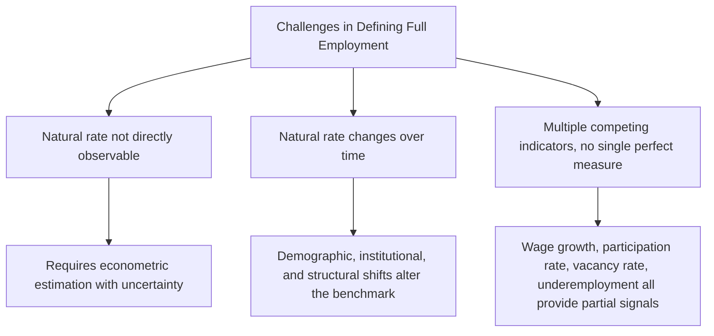
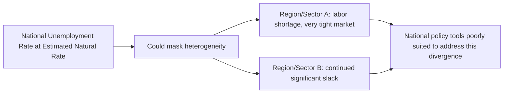

## Full Employment and Its Measurement Challenges

### Overview

Full employment is a foundational macroeconomic concept describing the state of an economy in which unemployment consists only of its unavoidable frictional and structural components, with no cyclical unemployment present. Despite its central role in macroeconomic theory and policy, full employment is notoriously difficult to define precisely and measure in real time, and its practical application involves considerable estimation uncertainty.

### Definition

Full employment refers to the level of economic activity at which the actual unemployment rate equals the natural rate of unemployment, meaning the economy is operating at its potential real GDP and cyclical unemployment is zero, even though frictional and structural unemployment remain present.

**Key Points**

- Full employment does **not** mean zero unemployment; rather, it refers to the absence of cyclical (demand-deficient) unemployment specifically, while frictional and structural unemployment persist even under full employment conditions.
- This distinguishes the economic concept of full employment from a colloquial or intuitive interpretation of the term that might imply everyone who wants a job has one at every moment.

### Why Full Employment Is Difficult to Define Precisely

**The Natural Rate Is Not Directly Observable**

- As discussed in relation to the natural rate of unemployment, the specific unemployment rate corresponding to full employment (i.e., the natural rate) cannot be directly measured; it must be statistically estimated using econometric models, and these estimates carry meaningful uncertainty and are subject to revision as new data becomes available. [Unverified: any specific current numerical estimate of the natural rate or full-employment unemployment rate for a given economy should be obtained from up-to-date sources rather than relied upon from historical or memorized figures.]

**The Natural Rate Itself Changes Over Time**

- Because the natural rate is influenced by demographic composition, labor market institutions, the pace of structural economic change, and job-matching technology, the specific unemployment rate consistent with full employment is not a fixed constant but can shift over years or decades, complicating efforts to identify a stable, universally applicable target.

**Multiple Competing Indicators**

- Economists and policymakers often examine a range of indicators beyond the headline unemployment rate to assess whether an economy is at full employment, including wage growth trends, labor force participation rates, job vacancy rates, and measures of underemployment (such as the U-6 broader unemployment measure), since no single indicator perfectly captures the complex, multidimensional concept of full employment.

### Measurement Challenges in Detail

**Challenge 1: Distinguishing Cyclical from Structural/Frictional Unemployment in Real Time**

- At any given point in time, policymakers observing an elevated unemployment rate must assess how much of that elevation reflects cyclical (demand-deficient) unemployment, which would respond to stimulus, versus structural unemployment, which would not.
- This distinction is often genuinely difficult to determine in real time, since both types of unemployment can be elevated simultaneously (for example, following a severe recession that also accelerates structural economic changes, such as increased automation adoption during a downturn), and analysts frequently must rely on indirect evidence, such as the Beveridge Curve relationship between vacancies and unemployment, unemployment duration data, and sector-specific analysis, none of which provide a fully precise real-time answer. [Inference: given the inherent difficulty of this real-time decomposition, reasonable analysts and policymakers can and do reach different conclusions about the relative importance of cyclical versus structural factors during any given episode, and such disagreements are a normal feature of macroeconomic policy debate.]

**Challenge 2: The Discouraged Worker and Labor Force Participation Problem**

- As discussed in relation to discouraged workers, a weak labor market can cause some individuals to stop actively searching for work and exit the labor force altogether, which removes them from the standard unemployment rate calculation entirely.
- This means the headline unemployment rate can appear to approach or reach the estimated natural rate even when genuine labor market slack persists in the form of discouraged and marginally attached workers who have exited the labor force, potentially leading to a premature or overly optimistic assessment that full employment has been reached.
- Broader measures of labor underutilization (such as U-6) and the labor force participation rate are often examined alongside the headline unemployment rate specifically to help address this measurement blind spot, though even these broader measures do not perfectly resolve the underlying ambiguity, since it is not always straightforward to distinguish structural declines in participation (e.g., due to population aging) from cyclical discouragement.

**Challenge 3: Wage Growth as an Imperfect Signal**

- Some economists use accelerating wage growth as an indicator that an economy may be approaching or exceeding full employment, based on the theoretical expectation that tight labor markets (low cyclical unemployment) should generate upward pressure on wages as employers compete for a more limited pool of available workers.
- However, wage growth can be influenced by numerous other factors beyond labor market tightness, including productivity growth trends, inflation expectations, and changes in labor market bargaining power or institutions, making it an imperfect and potentially lagging signal of full employment on its own. [Inference: the specific reliability and lead/lag properties of wage growth as a full-employment indicator have varied across different historical periods and are subjects of ongoing empirical debate among macroeconomists.]

**Challenge 4: Sectoral and Regional Heterogeneity**

- An economy can exhibit significant variation in labor market conditions across different regions, industries, or demographic groups even when the aggregate national unemployment rate is at or near the estimated natural rate, meaning a single national full-employment assessment may mask considerable underlying heterogeneity — some regions or groups may be experiencing labor shortages while others continue to experience significant slack.
- This heterogeneity complicates the practical application of a single national full-employment benchmark for policy purposes, since national-level monetary policy tools in particular are generally not well suited to addressing regionally concentrated labor market imbalances.

### Example: Interpreting Ambiguous Full-Employment Signals

Consider a hypothetical economy where the headline unemployment rate has fallen to a level close to most economists' estimated natural rate, suggesting the economy may be at or near full employment. However, further examination reveals:

- The labor force participation rate remains notably below its pre-recession level, raising the possibility that a meaningful number of discouraged workers have simply exited the labor force rather than genuinely finding satisfactory employment, which would understate the true extent of remaining labor market slack.
- Wage growth remains modest despite the seemingly low headline unemployment rate, which some analysts interpret as evidence that genuine slack remains (contradicting a full-employment assessment), while others attribute the modest wage growth to weak productivity growth or other factors unrelated to labor market tightness.
- Certain regions or industries report significant difficulty filling open positions (suggesting tightness in those specific segments), while other regions continue to report elevated joblessness (suggesting continued slack there).

This scenario illustrates why declaring an economy to be precisely "at full employment" based on the headline unemployment rate alone is often contested among economists, and why policymakers typically weigh a range of indicators rather than relying on any single figure. [Inference: the appropriate resolution of such ambiguous signals in any specific real-world episode depends on the particular economic context and is a matter of genuine analytical judgment and debate rather than a mechanically determined conclusion.]

### Indicators Commonly Used to Assess Proximity to Full Employment

| Indicator | What It Attempts to Capture | Key Limitation |
| --- | --- | --- |
| Headline (U-3) unemployment rate | Standard measure of joblessness among active job seekers | Misses discouraged/marginally attached workers |
| Labor force participation rate | Share of population engaged in labor market | Affected by both cyclical and structural/demographic factors, hard to disentangle |
| U-6 broader unemployment measure | Includes discouraged, marginally attached, and involuntary part-time workers | Still an estimate, not a perfect capture of all slack |
| Wage growth | Signal of labor market tightness via bargaining pressure | Influenced by productivity, inflation expectations, and institutional factors beyond tightness |
| Job vacancy rate / Beveridge Curve position | Employer demand for labor relative to unemployment | Interpretation of shifts can be ambiguous (structural vs. cyclical/matching efficiency) |
| Quits rate | Worker confidence in ability to find alternative employment | An indirect signal; also influenced by non-labor-market factors |

### Policy Implications of Measurement Uncertainty

**Key Points**

- Given the substantial uncertainty in identifying the precise point of full employment in real time, central banks and other policymakers generally adopt a **risk-management approach**, weighing the relative costs of under-shooting (leaving genuine labor market slack unaddressed) against over-shooting (allowing the economy to run persistently below the true natural rate, risking accelerating inflation), rather than assuming they can precisely identify the exact full-employment threshold. [Inference: the specific risk-management framework and relative weighting of these risks varies by institution, prevailing economic conditions, and the specific policymakers involved.]
- This measurement uncertainty is part of the rationale for central banks relying on a broad range of labor market indicators, rather than a single unemployment rate threshold, when assessing progress toward full-employment mandates.
- Historical experience has shown that estimates of the natural rate and full-employment benchmarks are sometimes revised significantly after the fact, as economists gain additional data and hindsight regarding a given period's true underlying inflationary dynamics, which further underscores the genuine, unavoidable uncertainty involved in real-time full-employment assessment. [Unverified: specific historical instances and magnitudes of such natural rate revisions vary by country and time period and would require reference to specific contemporary economic research for precise figures.]

### Comparative Summary

| Concept | Relationship to Full Employment |
| --- | --- |
| Natural rate of unemployment | The unemployment rate that defines full employment |
| Cyclical unemployment | Zero at full employment, by definition |
| Frictional and structural unemployment | Persist even at full employment |
| NAIRU | Closely related; the unemployment rate consistent with stable inflation |
| Potential GDP | The output level corresponding to full employment |

**Next Steps**

- The natural rate of unemployment and NAIRU in depth
- Cyclical, frictional, and structural unemployment definitions
- The Beveridge Curve and vacancy-unemployment analysis
- Central bank dual mandates and employment policy frameworks
- Labor force participation trends and discouraged workers
- Wage growth as a labor market indicator
- Potential GDP and output gap estimation
- Historical revisions to natural rate estimates