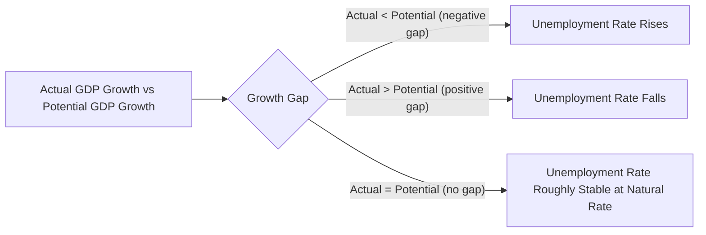
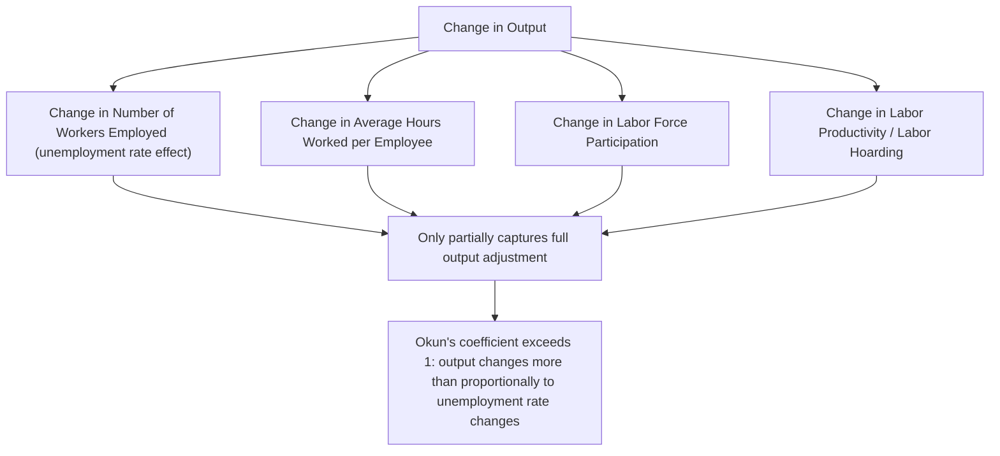

## Okun's Law and the Output-Unemployment Relationship

### Overview

Okun's Law is an empirically observed macroeconomic relationship describing the inverse association between changes in the unemployment rate and changes in real GDP relative to potential output. Formulated by economist Arthur Okun in the early 1960s, it provides a practical rule-of-thumb for estimating how much cyclical unemployment is likely to change given a shortfall or surplus in output growth relative to the economy's potential growth rate.

### Definition

Okun's Law states that for every percentage point that actual real GDP growth falls short of (or exceeds) potential real GDP growth, the unemployment rate tends to rise (or fall) by some multiple of that gap, based on an empirically estimated coefficient relating output fluctuations to labor market outcomes.

### Historical Origin

**Key Points**

- Okun's Law was developed by economist **Arthur Okun** in 1962, based on his empirical observation of the U.S. economy's historical relationship between quarterly changes in the unemployment rate and corresponding changes in real GNP (gross national product, the standard output measure used at the time).
- Okun's original estimate suggested that a 1 percentage point increase in the unemployment rate was historically associated with an approximately 3 percentage point shortfall in real GNP relative to potential GNP for the U.S. economy of that era. [Unverified: this specific historical coefficient reflects Okun's original 1960s-era estimate; subsequent research has produced varying coefficient estimates depending on time period, country, and methodology, as discussed further below.]
- The relationship is best understood as an **empirical regularity** derived from historical data patterns, rather than a strict theoretical law with a single universally fixed numerical parameter, and this distinction is reflected in ongoing academic debate about the appropriate coefficient value for different economies and eras.

### Two Common Formulations

**Difference (Gap) Version**

This version relates the output gap (the percentage difference between actual and potential GDP) to the deviation of the unemployment rate from the natural rate:

$$\frac{Y - Y^*}{Y^*} = -\beta(u - u^*)$$

where $Y$ is actual real GDP, $Y^*$ is potential real GDP, $u$ is the actual unemployment rate, $u^*$ is the natural rate of unemployment, and $\beta$ is the empirically estimated Okun's coefficient.

**Dynamic (Growth Rate) Version**

This version relates the *growth rate* of real GDP relative to potential GDP growth to the *change* in the unemployment rate over the same period:

$$\Delta u \approx -\frac{1}{\beta}(g_Y - g_Y^*)$$

where $\Delta u$ is the change in the unemployment rate, $g_Y$ is the actual real GDP growth rate, and $g_Y^*$ is the potential (trend) real GDP growth rate.

**Key Points**

- Both versions capture the same underlying inverse relationship but are structured differently depending on whether the analysis focuses on *levels* (the output gap) or *rates of change* (GDP growth versus unemployment rate changes).
- The dynamic version is often more practically useful for short-term forecasting and policy analysis, since GDP growth rate data is typically more readily available and timely than precise potential GDP level estimates. [Inference: the relative practical preference for one formulation over the other can vary by analytical context and the specific data available to a given researcher or institution.]

### Example: Applying Okun's Law

Suppose an economy has an estimated potential real GDP growth rate of 2.2% per year, and an Okun's coefficient of approximately 2 (a commonly cited illustrative value, though actual estimates vary).

**Scenario 1: Recession**

If actual real GDP growth for the year comes in at -0.8% (a 3 percentage point shortfall relative to the 2.2% potential growth rate):

$$\Delta u \approx \frac{3\%}{2} = 1.5 \text{ percentage points}$$

This suggests the unemployment rate might be expected to rise by approximately 1.5 percentage points over the year, reflecting the emergence of cyclical unemployment associated with the output shortfall.

**Scenario 2: Above-Trend Growth**

If actual real GDP growth for the year comes in at 4.2% (a 2 percentage point surplus relative to the 2.2% potential growth rate):

$$\Delta u \approx -\frac{2\%}{2} = -1 \text{ percentage point}$$

This suggests the unemployment rate might be expected to fall by approximately 1 percentage point, reflecting a reduction in cyclical unemployment (or even a move toward negative cyclical unemployment, an unusually tight labor market) as the economy expands faster than its long-run potential.

### Why the Coefficient Exceeds One: The "Okun Multiplier" Explanation

**Key Points**

- A key and somewhat counterintuitive feature of Okun's Law is that the empirically estimated coefficient $\beta$ has historically tended to be greater than 1 (Okun's original estimate was approximately 3, though more recent estimates for various economies often fall in a lower range) — meaning a given percentage point change in unemployment is historically associated with a *larger* percentage point change in output. [Unverified: specific current coefficient estimates vary by country, time period, and study methodology, and readers seeking a precise current value for a specific economy should consult up-to-date econometric research or relevant statistical agencies.]
- This occurs because changes in output are driven not only by changes in the number of people employed, but also by several other adjustment margins that firms use during output fluctuations, including:
  - **Hours per worker**: Firms often adjust average hours worked per employee (e.g., reducing overtime or shifting to part-time schedules) before resorting to layoffs, meaning some output adjustment occurs without a corresponding change in the headcount-based unemployment rate.
  - **Labor force participation changes**: As discussed in relation to discouraged workers, some individuals may exit the labor force entirely during a downturn (rather than remaining classified as unemployed), which mutes the rise in the measured unemployment rate relative to the actual decline in labor utilization.
  - **Labor productivity fluctuations**: Firms may also adjust output partly through changes in labor productivity (e.g., retaining workers during a mild downturn in anticipation of recovery, a practice sometimes called "labor hoarding," which reduces measured productivity during the downturn but limits the rise in unemployment relative to the output decline).

### Limitations and Caveats of Okun's Law

**Key Points**

- Okun's Law is an **empirical regularity based on historical averages**, not a precise mechanical or structural economic law; actual relationships between output and unemployment in any specific episode can and do deviate from the historically estimated average coefficient. [Inference: the degree of deviation in any specific historical episode depends on numerous concurrent economic factors and cannot be predicted with certainty from the Okun's Law relationship alone.]
- The estimated Okun's coefficient has been found to **vary over time and across countries**, reflecting changes in labor market institutions, the composition of industries in the economy, and firms' typical labor-hoarding behavior, among other factors. [Unverified: specific historical patterns of coefficient instability over time have been documented in various academic studies, but citing precise current comparative figures would require reference to up-to-date econometric research.]
- The relationship also depends on an accurate estimate of **potential GDP**, which, like the natural rate of unemployment, is not directly observable and must itself be estimated, introducing an additional layer of uncertainty into any practical application of Okun's Law.
- Okun's Law describes a **statistical association**, and while it is often used descriptively and for practical forecasting and back-of-envelope estimation, care is generally warranted in extending it to strong causal claims about the precise mechanism linking specific policy actions to unemployment outcomes.

### Practical Applications of Okun's Law

**Key Points**

- **Economic forecasting**: Analysts and policymakers sometimes use Okun's Law as a quick, practical tool to translate GDP growth forecasts into approximate expected unemployment rate changes, or vice versa, without needing to build a full structural labor market model.
- **Policy analysis**: Okun's Law can help provide a rough estimate of the potential labor market impact of a given fiscal or monetary policy action expected to influence GDP growth, offering policymakers an approximate sense of the scale of the employment effects associated with a projected change in aggregate output.
- **Real-time economic assessment**: During periods of economic uncertainty, Okun's Law can offer a useful cross-check or sanity check against other unemployment forecasts or nowcasts, helping analysts identify whether reported labor market data appears broadly consistent with concurrent output data, or whether a notable divergence (an "Okun's Law puzzle" or gap) warrants further investigation into why the two indicators might be diverging from their historical relationship.

### Comparative Summary

| Feature | Description |
| --- | --- |
| Originator | Arthur Okun (1962) |
| Core relationship | Inverse relationship between output gap/growth and unemployment rate |
| Typical coefficient | Greater than 1 (varies by economy, era, and estimation method) |
| Nature of relationship | Empirical regularity, not a strict structural law |
| Key limitation | Coefficient instability over time; requires potential GDP estimate |
| Primary use | Forecasting, policy impact estimation, real-time labor market sanity checks |

### Broader Economic Significance

- Okun's Law provides an important practical bridge between the **output/production side** of macroeconomic analysis (GDP, potential output, output gaps) and the **labor market side** (unemployment rates, cyclical unemployment), helping to connect these two commonly used but distinct lenses on economic performance.
- The relationship reinforces the broader concept that unemployment fluctuations and output fluctuations are two closely linked manifestations of the same underlying business cycle dynamics, rather than entirely separate economic phenomena, which is a key reason both indicators are typically monitored together by policymakers, financial markets, and economic analysts assessing the state of the business cycle.
- Instances where actual unemployment and output data appear to significantly diverge from the historically expected Okun's Law relationship (sometimes discussed in economic commentary as an "Okun's Law puzzle") have, at various points, prompted researchers to investigate potential explanations, such as unusual labor hoarding behavior, structural shifts in labor markets, or measurement issues in either output or labor force data. [Unverified: specific historical episodes and their proposed explanations would require reference to the relevant contemporary economic research and are not generalized here as a settled matter.]

**Next Steps**

- Cyclical unemployment and its relationship to the business cycle
- Potential GDP and output gap estimation methodologies
- Labor hoarding and firms' short-run labor adjustment behavior
- The natural rate of unemployment and NAIRU
- GDP measurement and national income accounting
- Business cycle theory and recession dynamics
- The Phillips Curve and inflation-unemployment dynamics
- Labor productivity trends and their macroeconomic implications