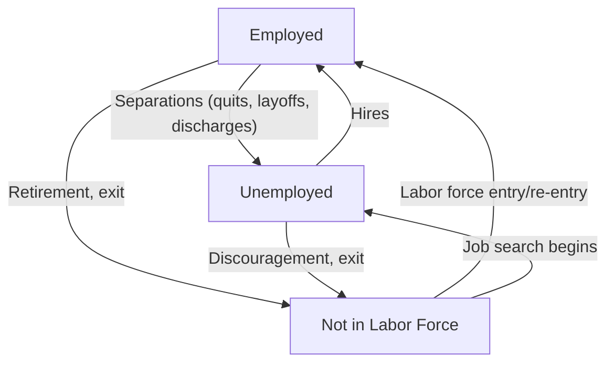

## Labor Market Flows: Hires, Separations, and Job Creation/Destruction

### Overview

Labor market flows analysis examines the dynamic movement of workers into and out of jobs and the labor force, and the corresponding creation and destruction of jobs at the establishment level, rather than focusing solely on static stock measures such as the unemployment rate at a single point in time. This flows-based perspective, substantially advanced through datasets such as the U.S. Job Openings and Labor Turnover Survey (JOLTS) and the Business Employment Dynamics data, reveals a labor market characterized by continuous, large-scale churn even when aggregate stock measures like the unemployment rate appear relatively stable.

### Stocks vs. Flows in Labor Market Analysis

**Key Points**

- Standard labor market statistics such as the unemployment rate, employment level, and labor force size are **stock measures** — they capture the state of the labor market at a specific point in time.
- Labor market **flows** capture the movement of workers and jobs between these stocks over a given period, revealing the underlying dynamics that produce the net changes observed in stock measures.
- A stable unemployment rate does not imply a static labor market; substantial simultaneous inflows and outflows can occur even when the net change in the unemployment rate is small or zero, since large gross flows can offset each other to produce a small net change.

### Worker Flows: Hires and Separations

**Hires**

**Definition**: A hire refers to any addition to a firm's payroll during a reference period, including new employees, recalls of previously laid-off workers, and workers transferring from other establishments within the same firm.

**Separations**

**Definition**: A separation refers to any removal from a firm's payroll during a reference period, generally decomposed into three primary categories:

1. **Quits**: Voluntary separations initiated by the employee, such as leaving for a better job opportunity, retirement (in some classification systems), or personal reasons.
2. **Layoffs and discharges**: Involuntary separations initiated by the employer, including layoffs due to lack of work (which may be temporary or permanent) and discharges for cause (such as performance-related terminations).
3. **Other separations**: A residual category capturing separations not classified as quits or layoffs/discharges, such as retirements (in some classification frameworks), deaths, or transfers to other establishments within the same firm.

**Key Points**

- The **quits rate** is often used by economists and analysts as an indicator of worker confidence in the labor market, since workers are generally more willing to voluntarily leave a job when they perceive good alternative employment opportunities to be available; a rising quits rate is therefore often interpreted as a signal of a strengthening, tighter labor market.
- The **layoffs and discharges rate** tends to rise sharply during economic downturns, reflecting employer-initiated reductions in response to weakening demand, and is often used as a real-time indicator of deteriorating labor market conditions, sometimes providing earlier signals of labor market weakening than the aggregate unemployment rate itself. [Inference: the relative timeliness of layoff data versus the aggregate unemployment rate as a leading indicator can vary across different economic episodes.]

### The JOLTS Framework (Job Openings and Labor Turnover Survey)

**Overview**

The Job Openings and Labor Turnover Survey (JOLTS), published by the U.S. Bureau of Labor Statistics, is a monthly survey of U.S. employers that collects data on job openings, hires, and separations (broken into quits, layoffs/discharges, and other separations), providing a detailed flows-based complement to the standard stock-based unemployment statistics derived from the Current Population Survey. [Unverified: specific current JOLTS survey design details, sample sizes, and methodology should be confirmed against the BLS's current published documentation, as survey methodologies can be updated over time.]

**Key JOLTS Metrics**

| Metric | Definition |
| --- | --- |
| Job openings | Positions that are open, could start within 30 days, and for which the employer is actively recruiting |
| Hires | Total additions to payroll during the reference period |
| Quits | Voluntary employee-initiated separations |
| Layoffs and discharges | Employer-initiated involuntary separations |
| Other separations | Retirements, deaths, transfers, and similar separations not classified elsewhere |

**Key Points**

- JOLTS data enables construction of the **Beveridge Curve** (plotting the job openings rate against the unemployment rate), a key tool for assessing labor market matching efficiency and distinguishing structural from cyclical unemployment dynamics, as discussed in relation to structural unemployment.
- The relationship between job openings and hires, and between separations and net employment change, provides a richer picture of labor market dynamics than the net employment change figure alone, since a given net employment change can result from very different combinations of gross hiring and separation flows.

### Job Creation and Job Destruction

**Definition**

Job creation refers to the total increase in employment positions occurring at expanding or newly created business establishments during a given period, while job destruction refers to the total decrease in employment positions occurring at contracting or closing business establishments during the same period. Net employment change is the difference between gross job creation and gross job destruction.

**Formula**

$$\text{Net Employment Change} = \text{Gross Job Creation} - \text{Gross Job Destruction}$$

**Key Points**

- Even during periods of positive net employment growth, substantial gross job destruction is typically occurring simultaneously at contracting or closing establishments, offset by even larger gross job creation at expanding or new establishments.
- This **simultaneous creation and destruction** phenomenon, extensively documented in academic labor economics research (notably by economists such as Steven Davis and John Haltiwanger using U.S. Census Bureau microdata), reveals that even a labor market with a stable or growing net employment level involves a great deal of underlying establishment-level churn, reallocating workers from less productive or declining firms toward more productive or expanding firms. [Unverified: specific quantitative magnitudes of gross job creation and destruction rates for any current period should be obtained from up-to-date Business Employment Dynamics data published by the relevant statistical agency.]

### Example: Illustrating Gross Flows Behind a Small Net Change

Consider a hypothetical month in which the aggregate net employment change reported for an economy is a modest increase of 150,000 jobs. Examining the underlying gross flows might reveal:

- Gross hires during the month: 5.5 million
- Gross separations during the month: 5.35 million (comprising, for example, 3.4 million quits, 1.6 million layoffs/discharges, and 0.35 million other separations)

$$\text{Net Change} = 5{,}500{,}000 - 5{,}350{,}000 = 150{,}000$$

This example illustrates that even a relatively small headline net employment change can mask enormous underlying churn — millions of workers changing jobs, being laid off, or being newly hired — that would be entirely invisible if only the net figure were examined. [Note: figures used here are illustrative for pedagogical purposes and do not represent actual reported statistics for any specific period; readers seeking current JOLTS data should consult the BLS's published releases directly.]

### Why Labor Market Flows Analysis Matters

**Key Points**

- **Richer diagnostic power**: Flows data can reveal whether a rising unemployment rate is being driven primarily by rising layoffs (suggesting weakening firm-level demand conditions) or by falling hires (suggesting reduced firm confidence in expanding, even without active layoffs), which carry different implications for the appropriate diagnosis of labor market conditions and potential policy responses.
- **Understanding labor market dynamism**: High rates of gross job creation and destruction, and high rates of worker hires and separations, are generally associated with a more dynamic economy in which resources (including labor) are being reallocated toward more productive uses, though this reallocation process can also impose adjustment costs on displaced workers, connecting to the broader discussion of structural unemployment and worker transition costs. [Inference: the appropriate balance between valuing labor market dynamism for aggregate productivity gains versus the individual costs borne by displaced workers is a matter of ongoing debate in labor economics and policy discussions.]
- **Early signals of labor market turning points**: Because layoffs, hires, and quits can sometimes shift before the aggregate unemployment rate fully reflects a change in underlying conditions, flows-based indicators such as JOLTS data are often monitored by economists and policymakers as potentially earlier or complementary signals of labor market inflection points, alongside the standard unemployment rate. [Inference: the specific lead-lag relationship between flow-based indicators and the aggregate unemployment rate can vary across different economic episodes and is not a fixed, mechanically reliable timing relationship.]

### Comparative Summary

| Concept | Description | Primary Data Source (U.S. context) |
| --- | --- | --- |
| Hires | Additions to payroll | JOLTS |
| Quits | Voluntary employee-initiated separations | JOLTS |
| Layoffs/discharges | Involuntary employer-initiated separations | JOLTS |
| Job openings | Actively recruited, available-to-start positions | JOLTS |
| Job creation | Employment gains at expanding/new establishments | Business Employment Dynamics |
| Job destruction | Employment losses at contracting/closing establishments | Business Employment Dynamics |
| Net employment change | Creation minus destruction (or hires minus separations) | Derived from either dataset |

### Broader Economic Significance

- Labor market flows analysis complements the stock-based unemployment rate framework by revealing the underlying dynamic processes that generate observed net changes, offering a more complete and nuanced picture of labor market health than net figures alone can provide.
- This flows-based perspective has become increasingly central to modern labor economics and macroeconomic policy analysis, particularly through its connection to search-and-matching theoretical models (such as the Diamond-Mortensen-Pissarides framework referenced in relation to frictional unemployment), which explicitly model the hiring and separation processes underlying observed unemployment dynamics, rather than treating unemployment as a simple residual stock.
- Understanding the composition of separations (quits versus layoffs) and the balance between job creation and destruction provides policymakers, businesses, and researchers with important context for interpreting the underlying health, dynamism, and cyclical position of the labor market, beyond what any single point-in-time stock measure like the unemployment rate can convey on its own.

**Next Steps**

- The JOLTS survey: detailed data series and applications
- The Beveridge Curve and job openings-unemployment relationship
- Search and matching theory (Diamond-Mortensen-Pissarides framework)
- Business Employment Dynamics data and establishment-level analysis
- The quits rate as a labor market confidence indicator
- Worker displacement and job loss costs (Davis-Haltiwanger research tradition)
- Labor market dynamism and productivity-enhancing reallocation
- Frictional and structural unemployment in relation to flows data