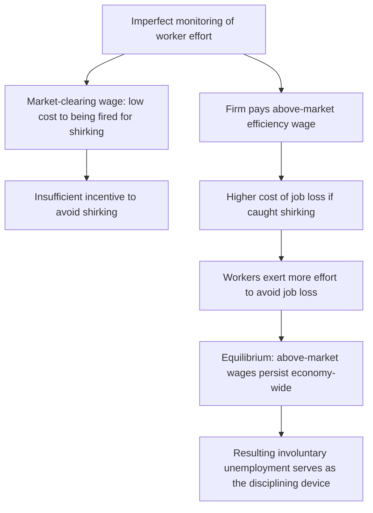
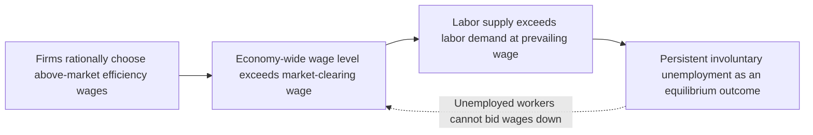

## Efficiency Wage Theories

### Overview

Efficiency wage theories provide a set of explanations for why employers may voluntarily pay wages above the market-clearing level, even in the presence of unemployed workers willing to work for less, and why such above-equilibrium wages can persist without competitive pressure eliminating them. These theories offer an important microeconomic foundation for understanding real-world wage rigidity and its connection to persistent involuntary unemployment, complementing other explanations for structural and cyclical unemployment.

### Definition

Efficiency wage theory posits that firms may find it profitable to pay wages above the market-clearing equilibrium wage because higher wages can increase worker productivity, effort, or retention sufficiently to offset the higher direct labor cost, leading to a wage that maximizes firm profit rather than one that simply clears the labor market.

### Core Theoretical Insight

**Key Points**

- In a standard competitive labor market model, wages adjust to a market-clearing equilibrium level at which labor supply equals labor demand, implying no involuntary unemployment persists in equilibrium.
- Efficiency wage theory challenges this prediction by arguing that a firm's optimal wage-setting decision may not simply be to pay the lowest wage at which workers are willing to work, but rather to pay a wage that **maximizes profit per unit of effective labor**, which can be higher than the market-clearing wage if higher wages sufficiently boost worker productivity or reduce costly turnover.
- If many or all firms in an economy behave this way, the resulting economy-wide wage level can settle above the market-clearing wage, creating persistent involuntary unemployment as an equilibrium outcome, rather than a temporary disequilibrium condition that market forces would be expected to correct.

$$\text{Firm's Objective: Maximize } \frac{\text{Output}}{\text{Wage Cost}} \text{, not simply minimize wage paid}$$

### Major Efficiency Wage Theory Variants

**1. The Shirking Model (Shapiro-Stiglitz)**

**Mechanism**

- In many employment relationships, employers cannot perfectly and costlessly monitor worker effort at all times, creating an incentive for some workers to shirk (exert less than full effort) if the expected cost of being caught is sufficiently low.
- If a firm pays only the market-clearing wage, a worker caught shirking and fired faces little real cost, since they could presumably find another job paying the same market-clearing wage relatively easily, providing insufficient deterrent against shirking.
- By paying an above-market wage, the firm raises the cost of job loss for the worker (since finding another job paying an equivalent above-market wage may take time or may not be available at all comparable firms), which creates a stronger incentive for workers to exert effort in order to avoid the risk of being fired and losing this premium wage.
- This model, formally developed by economists Carl Shapiro and Joseph Stiglitz in a widely cited 1984 paper, demonstrates that if all firms behave this way, the resulting equilibrium wage will be set above the market-clearing level, and this necessarily creates equilibrium involuntary unemployment — the very existence of this pool of unemployed workers actually serves as the disciplining mechanism, since it represents the real cost a worker would bear if fired (a period of unemployment before finding another comparably paying job). [Unverified: this represents the formal theoretical result of the Shapiro-Stiglitz model; empirical validation of the precise mechanism's real-world quantitative importance varies across studies and industries.]

**2. The Labor Turnover Model**

**Mechanism**

- Hiring, onboarding, and training new employees is costly for firms, involving direct recruitment costs, lost productivity during the training period, and administrative expenses.
- Higher wages tend to reduce voluntary employee turnover (the quit rate), since employees are less likely to leave a job that pays notably above what they could readily obtain elsewhere.
- Firms may find that the cost savings from reduced turnover (lower recruitment, hiring, and training costs) can more than offset the higher direct wage expense, making an above-market wage a profit-maximizing choice for reducing costly turnover, particularly in industries or roles with high training costs. [Inference: the specific magnitude of turnover cost savings relative to higher wage costs, and thus the applicability of this model, likely varies substantially by industry, occupation, and the specific skill/training requirements of a given role.]

**3. The Adverse Selection Model**

**Mechanism**

- In many hiring contexts, firms cannot perfectly observe a job applicant's true underlying ability or productivity prior to hiring, creating an information asymmetry between the firm and prospective employees.
- If a firm offers only a low, market-clearing wage, this may disproportionately attract lower-quality applicants (since higher-ability workers, who typically have more attractive outside options, may be less willing to apply for a low-wage position), a phenomenon analogous to adverse selection in other markets with asymmetric information.
- By offering an above-market wage, a firm can attract a larger and, on average, higher-quality pool of applicants, since higher-ability workers who might otherwise seek employment elsewhere are now more likely to find the position attractive, allowing the firm to select more productive workers from the resulting applicant pool. [Inference: the practical significance of this specific channel, relative to other efficiency wage mechanisms, in explaining real-world above-market wage-setting behavior is a matter of ongoing empirical research.]

**4. The Sociological/Fair Wage-Effort Model**

**Mechanism**

- This variant, associated significantly with the work of economist George Akerlof, incorporates sociological and behavioral considerations into wage-setting theory, arguing that worker effort is influenced by perceptions of fairness regarding their compensation relative to some reference standard (such as prevailing industry wages, coworkers' pay, or the worker's own sense of a "fair" wage for their contribution).
- If workers perceive their wage as fair or generous relative to this reference standard, they may reciprocate with higher effort or greater loyalty to the firm, functioning somewhat like an implicit reciprocal gift exchange between employer and employee (this framing is often referred to as the "gift exchange" model of efficiency wages).
- Conversely, if workers perceive their wage as unfairly low relative to their reference standard, effort, morale, and productivity may decline, even if the wage technically exceeds what would be required to attract sufficient labor supply in a simple market-clearing sense. [Unverified: while this behavioral mechanism is well documented in relevant economic and psychological literature, the precise magnitude of these effort-fairness effects across different labor market contexts is a subject of continued empirical research.]

**5. The Nutrition/Health Model** [Primarily relevant to developing-economy contexts]

**Mechanism**

- This variant, most relevant in contexts of significant poverty or malnutrition, proposes that in economies where workers' basic nutritional or health status is precarious, higher wages can directly improve worker health, nutrition, and physical capacity for labor, thereby directly increasing worker productivity in a fairly literal biological sense.
- This model is generally considered most applicable to developing-economy contexts with significant subsistence-level poverty, and is typically considered less directly relevant to wage-setting dynamics in advanced, high-income economies. [Inference: the specific applicability and continued empirical relevance of this model to particular economic contexts should be assessed based on the specific income and health conditions of the labor market being analyzed.]

### Comparative Summary of Efficiency Wage Models

| Model | Core Mechanism | Primary Context of Relevance |
| --- | --- | --- |
| Shirking model (Shapiro-Stiglitz) | Higher wages raise the cost of job loss, deterring shirking | General; particularly relevant where effort monitoring is difficult |
| Labor turnover model | Higher wages reduce costly voluntary quits | Industries/roles with high hiring/training costs |
| Adverse selection model | Higher wages attract a higher-quality applicant pool | Hiring contexts with significant asymmetric information about worker ability |
| Fair wage-effort (gift exchange) model | Perceived fairness of wage influences worker effort/reciprocity | General; emphasizes behavioral/sociological factors |
| Nutrition/health model | Higher wages improve worker health and physical capacity | Primarily developing-economy, subsistence-level contexts |

### Example: The Shirking Model in Practice

Consider a firm employing sales representatives whose individual effort is difficult for management to monitor continuously, since much of their work involves independent client interactions outside direct supervisory observation.

- If the firm pays only the prevailing market wage for comparable sales roles, a representative who shirks and is eventually caught and fired faces relatively low personal cost, since comparable positions paying the same market wage are presumed to be readily available elsewhere.
- If the firm instead pays a wage notably above the prevailing market rate for comparable roles, a representative who shirks and risks being fired now faces a more significant cost: the loss of this premium wage, and the need to search for a new position that may not offer an equivalent premium, potentially involving a period of unemployment or a pay cut.
- This higher cost of job loss creates a stronger incentive for the sales representative to exert genuine effort even without constant direct supervision, potentially making the higher wage a profitable choice for the firm despite its higher direct cost, if the resulting effort and reduced shirking sufficiently offset the wage premium.

### Efficiency Wages and Involuntary Unemployment

**Key Points**

- A key implication of efficiency wage theory is that it provides a **microeconomic explanation for the persistence of involuntary unemployment as an equilibrium phenomenon**, rather than treating unemployment purely as a temporary disequilibrium condition, a frictional matching phenomenon, or a structural mismatch issue.
- Under efficiency wage theory, even workers willing to work for a lower wage than the prevailing efficiency wage may be unable to find employment at that lower wage, since firms rationally choose not to lower wages to the market-clearing level, given that doing so would undermine the very productivity, retention, or effort benefits the higher wage was designed to secure.
- This theoretical framework connects to the broader macroeconomic discussion of **wage rigidity** and its role in explaining why labor markets may not clear as smoothly or completely as simple competitive market models would predict, complementing other explanations such as minimum wage floors, labor union bargaining power, and long-term implicit or explicit employment contracts.

### Policy and Analytical Implications

**Key Points**

- Efficiency wage theory has implications for interpreting observed wage rigidity in labor markets, suggesting that some degree of above-market wage-setting behavior by firms may reflect **rational, profit-maximizing firm behavior** rather than simply market frictions, institutional constraints (such as minimum wage laws or union bargaining), or behavioral anomalies alone.
- The theory has also been used to help explain certain empirical labor market patterns, such as observed wage differentials across industries for seemingly similar worker skill levels (sometimes referred to as inter-industry wage differentials), where firms in some industries may find it more profitable to pay efficiency wage premiums than others, depending on factors such as monitoring difficulty, turnover costs, or the importance of worker quality selection. [Inference: while efficiency wage theory is one commonly cited explanation for such observed wage differentials, other competing or complementary explanations (such as unmeasured skill differences or compensating differentials for job characteristics) also exist in the relevant literature, and the relative importance of each explanation remains a subject of ongoing empirical research.]

### Comparative Context: Efficiency Wages vs. Other Wage Rigidity Explanations

| Explanation | Core Mechanism | Source of Wage Rigidity |
| --- | --- | --- |
| Efficiency wage theory | Firms voluntarily choose above-market wages for productivity/retention reasons | Firm-level profit-maximizing choice |
| Minimum wage laws | Legal wage floor set above market-clearing level | Government regulation |
| Labor unions / collective bargaining | Negotiated wages above market-clearing level | Worker collective bargaining power |
| Implicit/explicit long-term contracts | Wages set in advance, adjusted infrequently | Contractual/institutional friction |

**Next Steps**

- The Shapiro-Stiglitz shirking model in formal detail
- Wage rigidity and its role in unemployment theory more broadly
- Inter-industry wage differentials: empirical evidence and explanations
- Akerlof's gift exchange model and behavioral labor economics
- Minimum wage theory and its employment effects debate
- Labor union bargaining models and their wage effects
- Adverse selection and asymmetric information in labor markets
- Structural unemployment and its relationship to wage-setting institutions