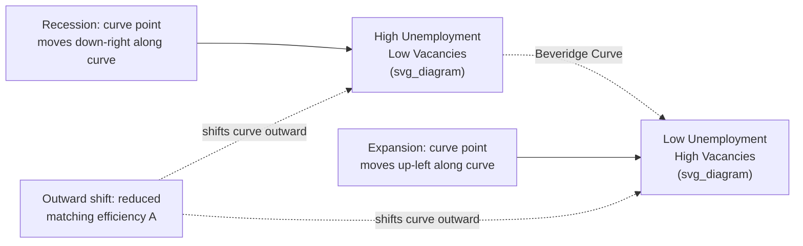

## Search and Matching Models of Unemployment


### Overview

Search and matching models explain unemployment as an equilibrium outcome of frictions in the labor market, rather than as a simple disequilibrium between labor supply and labor demand. Unlike the Walrasian labor market model, where wages adjust instantaneously to clear the market, search and matching theory recognizes that workers and firms must spend time and resources finding each other. This class of models forms the theoretical backbone of modern labor macroeconomics and is often referred to as the **Diamond-Mortensen-Pissarides (DMP) framework**, named after Peter Diamond, Dale Mortensen, and Christopher Pissarides, who jointly received the 2010 Nobel Memorial Prize in Economic Sciences for this work.

**Key Points**

- Unemployment exists in equilibrium even when wages are flexible, because matching workers to jobs is costly and time-consuming.
- The labor market is modeled as a decentralized process of search, rather than a centralized auction market.
- Both unemployed workers and vacant jobs coexist simultaneously, a phenomenon that classical supply-demand models struggle to explain without invoking rigidities.
- Wages are typically determined by bilateral bargaining (commonly Nash bargaining) rather than by a market-clearing price.

### Motivation: Why Search Frictions Matter

In a frictionless labor market, any excess supply of labor (unemployment) would immediately push wages down until the market clears, eliminating unemployment except for measurement lags. Yet real economies persistently exhibit:

- Unemployed workers actively looking for jobs
- Firms simultaneously posting unfilled vacancies
- Both existing at the same time, in the same labor market

This coexistence is known as the **Beveridge Curve** relationship, and it is the central empirical fact that search and matching models are built to explain. Frictions arise from imperfect information (workers do not know instantly where suitable jobs exist, and firms do not know instantly where suitable workers are), heterogeneity in skills and job requirements, and the geographic or logistical costs of connecting the two sides.

### The Matching Function

The foundational building block of these models is the **matching function**, which aggregates the search efforts of unemployed workers and vacancy-posting firms into a flow of new hires.

$$M = m(U, V)$$

Where:

- $M$ = number of new matches (hires) formed per period
- $U$ = number (or measure) of unemployed workers searching
- $V$ = number (or measure) of vacancies posted by firms

The matching function is typically assumed to have properties analogous to a production function:

- Increasing in both arguments: $\partial M/\partial U > 0$, $\partial M/\partial V > 0$
- Concave in each argument (diminishing returns to congestion)
- Frequently assumed to exhibit **constant returns to scale (CRS)**, which is a standard simplifying assumption supported reasonably well by empirical estimates, though this is a modeling convention rather than a physical law [Inference].

A widely used functional form is the **Cobb-Douglas matching function**:

$$M = A \cdot U^{\alpha} V^{1-\alpha}$$

Where:

- $A > 0$ is a matching efficiency parameter (captures technology, information systems, labor market institutions)
- $\alpha \in (0,1)$ is the elasticity of matches with respect to unemployment

### Labor Market Tightness

A central derived variable is **labor market tightness**, denoted $\theta$:

$$\theta = \frac{V}{U}$$

This ratio of vacancies to unemployed workers indicates how "tight" or "slack" the labor market is. A high $\theta$ means many vacancies chasing few job seekers (favorable to workers); a low $\theta$ means many job seekers chasing few vacancies (favorable to firms).

### Job Finding and Vacancy Filling Rates

From the matching function, two key hazard rates are derived, both expressed as functions of tightness $\theta$:

**Job finding rate** (probability an unemployed worker finds a job per period):

$$f(\theta) = \frac{M}{U} = m(1, \theta) = A\theta^{1-\alpha}$$

**Vacancy filling rate** (probability a vacancy is filled per period):

$$q(\theta) = \frac{M}{V} = m\left(\frac{1}{\theta}, 1\right) = A\theta^{-\alpha}$$

Note the relationship:

$$f(\theta) = \theta \cdot q(\theta)$$

Both $f(\theta)$ and $q(\theta)$ inherit properties from the matching function: $f'(\theta) > 0$ (tighter markets make it easier for workers to find jobs) and $q'(\theta) < 0$ (tighter markets make it harder for firms to fill vacancies). This creates a **congestion externality**: an individual firm posting a vacancy makes it slightly harder for other firms to fill their vacancies (competing for the same searching workers), while an individual worker searching makes it slightly harder for other workers to find jobs.

### The Beveridge Curve

The Beveridge Curve is the empirical and theoretical negative relationship between the unemployment rate and the vacancy rate.



Below is an SVG rendering of the standard Beveridge Curve diagram:

<svg xmlns="http://www.w3.org/2000/svg" viewBox="0 0 520 420">
<text x="260" y="25" font-size="16" font-weight="bold" text-anchor="middle" fill="#1a1a1a">Beveridge Curve (svg_diagram)</text>
<line x1="70" y1="360" x2="480" y2="360" stroke="#333" stroke-width="2" />
<line x1="70" y1="360" x2="70" y2="50" stroke="#333" stroke-width="2" />
<text x="275" y="395" font-size="13" text-anchor="middle" fill="#333">Unemployment Rate (u)</text>
<text x="25" y="205" font-size="13" text-anchor="middle" fill="#333" transform="rotate(-90 25 205)">Vacancy Rate (v)</text>
<path d="M 100 90 Q 180 100 260 180 Q 340 260 440 330" stroke="#0b6e99" stroke-width="3" fill="none" />
<text x="330" y="200" font-size="12" fill="#0b6e99" font-weight="bold">Beveridge Curve BC0</text>
<path d="M 150 110 Q 230 120 310 200 Q 390 280 470 340" stroke="#c0392b" stroke-width="2.5" fill="none" stroke-dasharray="6,4" />
<text x="360" y="130" font-size="12" fill="#c0392b" font-weight="bold">BC1 (outward shift)</text>
<circle cx="180" cy="150" r="5" fill="#0b6e99" />
<text x="185" y="145" font-size="11" fill="#1a1a1a">Expansion</text>
<circle cx="380" cy="290" r="5" fill="#0b6e99" />
<text x="330" y="315" font-size="11" fill="#1a1a1a">Recession</text>
<line x1="70" y1="360" x2="470" y2="60" stroke="#999" stroke-width="1" stroke-dasharray="3,3" />
<text x="420" y="90" font-size="10" fill="#999">45° line (u = v)</text>
</svg>

Movements **along** the curve reflect cyclical fluctuations in aggregate demand (a recession moves the economy down the curve toward high unemployment and low vacancies). Outward **shifts** of the curve indicate a decline in matching efficiency—for example, mismatch between the skills of the unemployed and the requirements of open vacancies, or reduced search intensity.

### Flows in the Labor Market: The Stock-Flow Approach

Search and matching models treat unemployment as the result of continuous flows between labor market states, not a static stock. The basic two-state model (employment $E$, unemployment $U$) tracks:

- **Job separation rate** $s$: the rate at which employed workers lose or leave jobs and become unemployed
- **Job finding rate** $f(\theta)$: the rate at which unemployed workers become employed


### The Steady-State Unemployment Rate

In steady state, the flow out of unemployment must equal the flow into unemployment:

$$s(1-u) = f(\theta) \cdot u$$

Solving for the steady-state unemployment rate $u^*$:

$$u^* = \frac{s}{s + f(\theta)}$$

**Example**

Suppose the monthly job separation rate is $s = 0.03$ (3% of employed workers separate each month) and the job finding rate is $f(\theta) = 0.45$ (45% of unemployed workers find jobs each month, a figure broadly consistent with historical U.S. estimates) [Unverified—precise values vary by country, time period, and dataset].

$$u^* = \frac{0.03}{0.03 + 0.45} = \frac{0.03}{0.48} \approx 0.0625 \text{ or } 6.25\%$$

This illustrates a core insight: the steady-state unemployment rate depends only on the ratio of the separation rate to the sum of the separation and finding rates, and is entirely determined by these two flow hazards rather than by any stock disequilibrium.

### The Value Functions: Bellman Equations

The DMP model characterizes the labor market using asset-value (Bellman) equations for each type of agent and each labor market state, typically in continuous time with discount rate $r$.

**Value of unemployment to a worker**, $U_w$ (b = flow value of unemployment, e.g., unemployment benefits plus value of leisure):

$$rU_w = b + f(\theta)(W - U_w)$$

**Value of employment to a worker**, $W$ (w = wage):

$$rW = w + s(U_w - W)$$

**Value of a filled job to a firm**, $J$ (p = worker productivity):

$$rJ = p - w + s(V_f - J)$$

**Value of a vacancy to a firm**, $V_f$ (c = flow cost of posting a vacancy):

$$rV_f = -c + q(\theta)(J - V_f)$$

**Free entry condition**: Firms post vacancies until the value of doing so is driven to zero (this is the mechanism that pins down equilibrium tightness $\theta$):

$$V_f = 0 \implies \frac{c}{q(\theta)} = J$$

This condition states that the expected cost of hiring a worker (cost per vacancy divided by the probability of filling it) equals the value the firm derives from that worker.

### Wage Determination: Nash Bargaining

Since a filled match generates a surplus over the outside options (unemployment for the worker, an unfilled vacancy for the firm), the wage is indeterminate under simple marginal-product pricing. The standard resolution is **Nash bargaining**, where the wage splits the total match surplus according to bargaining power.

The **total surplus** of a match is:

$$S = (W - U_w) + (J - V_f)$$

The Nash bargaining solution has the worker capture a share $\beta \in (0,1)$ (the worker's bargaining power) of the total surplus:

$$W - U_w = \beta S$$


$$J - V_f = (1-\beta)S$$

Solving the system yields the well-known **wage equation**:

$$w = \beta(p + c\theta) + (1-\beta)b$$

**Key Points**

- The wage is a weighted average of the worker's full contribution to output (productivity plus the savings on recruiting costs the firm avoids by having a filled job) and the worker's reservation value ($b$).
- Higher labor market tightness $\theta$ raises wages, because tighter markets make replacement costlier for firms, strengthening workers' bargaining position.
- The parameter $\beta$ is often calibrated, and in many quantitative applications is set to satisfy the **Hosios condition** (see below) for constrained efficiency [Inference: this is a common modeling choice but not a universal empirical finding].

### The Hosios Condition

Because search generates externalities (each vacancy makes it harder for other vacancies to be filled; each searching worker makes it harder for other workers to find jobs), the decentralized equilibrium is not automatically efficient. The **Hosios condition** specifies the bargaining power $\beta$ that internalizes these externalities and restores constrained efficiency:

$$\beta = \eta$$

Where $\eta$ is the elasticity of the matching function with respect to unemployment (i.e., $\eta = \partial \ln m(U,V)/\partial \ln U$). When the worker's bargaining share equals the elasticity of matches with respect to unemployment, the search equilibrium achieves the constrained-efficient allocation of vacancy creation and search effort, given that frictions themselves cannot be eliminated.

### Equilibrium Determination

The DMP model's equilibrium is typically solved using two key relationships plotted against labor market tightness $\theta$:

1. **The Job Creation Curve**, derived from combining the free-entry condition, the firm's value functions, and the wage equation. This traces out the tightness consistent with firms' vacancy-posting incentives.
2. **The Beveridge Curve relationship** (from the flow steady-state condition), which links tightness to the unemployment rate.

```mermaid
flowchart TD
    A[Matching Function m(U,V)] --> B[Job Finding Rate f(theta)]
    A --> C[Vacancy Filling Rate q(theta)]
    B --> D[Steady-State Unemployment u*]
    C --> E[Free Entry Condition: c/q(theta) = J]
    E --> F[Job Creation Curve]
    G[Nash Bargaining: w = beta*p + beta*c*theta + 1-beta*b] --> E
    F --> H[Equilibrium Tightness theta*]
    H --> D
```

### The Shimer Puzzle

A major empirical challenge to the baseline DMP model, identified by Robert Shimer (2005), is that the standard calibration generates far too little volatility in unemployment and vacancies in response to productivity shocks compared to what is observed in U.S. data. Under standard Nash bargaining, wages absorb most of a productivity shock (since $w$ moves closely with $p$ in the wage equation), leaving little of the shock to affect firms' profits $J$ and thus little incentive to change vacancy postings. This is known as the **Shimer Puzzle**.

**Key Points**

- The empirical volatility of the vacancy-unemployment ratio $\theta$ is roughly an order of magnitude larger than the basic model predicts, given realistic productivity shock volatility [Unverified—the magnitude estimate is calibration- and dataset-dependent and has been debated extensively in the literature].
- Proposed resolutions include:
  - **Wage rigidity models** (e.g., Hall 2005, Hall and Milgrom 2008): wages are sticky or bargained using alternative protocols (like alternating-offer bargaining) that make wages less responsive to productivity, so that the burden of shocks falls more on firm profits and vacancy creation.
  - **Small surplus calibrations**: setting $b$ close to $p$ (a high reservation wage relative to productivity) amplifies the sensitivity of $J$ to productivity shocks (Hagedorn and Manovskii, 2008).
  - **On-the-job search and endogenous separations**: richer models with additional margins of adjustment.

### Extensions of the Basic Model

**On-the-job search**: Employed workers can also search for better jobs, generating job-to-job transitions and wage-tenure dynamics not present in the two-state model.

**Endogenous job destruction**: Building on Mortensen and Pissarides (1994), match-specific productivity shocks can cause firms to endogenously dissolve matches when a "reservation productivity" threshold is breached, endogenizing the separation rate $s$ rather than treating it as exogenous.

**Directed search / competitive search**: An alternative to random matching and bargaining, where firms post wages (or contracts) in advance and workers direct their search toward the most attractive postings, which can restore constrained efficiency without requiring the Hosios condition.

**Multi-worker firms**: Extending the single-vacancy-firm assumption to firms that post multiple vacancies and employ many workers simultaneously (e.g., Cooper, Haltiwanger, and Willis).

**Search and matching in New Keynesian DSGE models**: The DMP framework has been integrated into medium-scale macro models (e.g., following Christiano, Eichenbaum, and Trabandt) to jointly study labor markets, monetary policy, and business cycles.

### Alternative Wage-Setting Mechanisms

| Mechanism | Description | Implication for Shimer Puzzle |
| --- | --- | --- |
| Nash Bargaining | Standard sharing rule based on relative bargaining power $\beta$ | Wages highly responsive to productivity; contributes to puzzle |
| Alternating-Offer Bargaining (Hall-Milgrom) | Wages depend on the cost of delay in bargaining rather than the value of unemployment | Dampens wage response, amplifying vacancy/unemployment volatility |
| Rigid/Sticky Wages (Hall) | Wages fixed within a bargaining set, insulated from short-run productivity fluctuations | Directly increases cyclical volatility of $\theta$ |
| Competitive/Directed Search | Wages posted ex ante; workers direct search based on posted terms | Can restore efficiency without Hosios condition; different volatility implications |

### Policy Applications

Search and matching models provide a natural framework for analyzing labor market policy:

- **Unemployment insurance (UI)**: Raising $b$ increases workers' reservation value, raising equilibrium wages (via the wage equation) and reducing job creation incentives ($J$ falls), which raises equilibrium unemployment — a mechanism absent in simple supply-demand models where UI has no such role.
- **Hiring subsidies and firing taxes**: These affect the free-entry condition and the value of a filled job directly, altering vacancy posting behavior.
- **Active labor market policies**: Modeled as increases in matching efficiency $A$, shifting the Beveridge Curve inward.
- **Minimum wage**: Can be analyzed as a floor imposed on the Nash bargaining outcome, potentially reducing job creation when the floor binds above the bargained wage.

### Empirical Estimation Considerations

Estimating matching functions and calibrating DMP models in practice involves:

- Using **JOLTS** (Job Openings and Labor Turnover Survey) data in the U.S. context to measure vacancies, hires, and separations
- Recognizing that aggregate matching function estimates may mask heterogeneity across industries, occupations, and regions
- Accounting for **time aggregation bias**, since matches and separations occur continuously but are typically measured at discrete (e.g., monthly) intervals
- Behavior of calibrated models may vary meaningfully depending on the specific functional form assumed for the matching function and the parameter values used, so simulated moments should be interpreted as model-dependent rather than universal predictions [Inference]

### Summary Comparison: Classical vs. Search and Matching View

| Feature | Classical (Walrasian) Labor Market | Search and Matching (DMP) Model |
| --- | --- | --- |
| Wage determination | Market-clearing price | Nash bargaining (or posted wages) over match surplus |
| Unemployment | Disequilibrium / voluntary at market wage | Equilibrium phenomenon due to frictions |
| Vacancies | Not typically modeled | Central variable; jointly determined with unemployment |
| Adjustment mechanism | Instantaneous price adjustment | Time-consuming matching process governed by $m(U,V)$ |
| Policy relevance of UI | Minimal (wage floor distortion only) | Central (affects reservation value and bargaining outcomes) |

**Next Steps**

- The Mortensen-Pissarides model of endogenous job destruction
- Hall and Milgrom's alternating-offer bargaining model
- Hagedorn and Manovskii's calibration critique and the "small surplus" resolution to the Shimer Puzzle
- Directed/competitive search theory (Moen, 1997)
- On-the-job search models (Burdett-Mortensen wage dispersion model)
- Integrating search and matching frictions into New Keynesian DSGE models
- Empirical estimation of matching functions using JOLTS or international labor force survey data
- The Beveridge Curve shifts during and after the COVID-19 pandemic as a case study in matching efficiency shocks