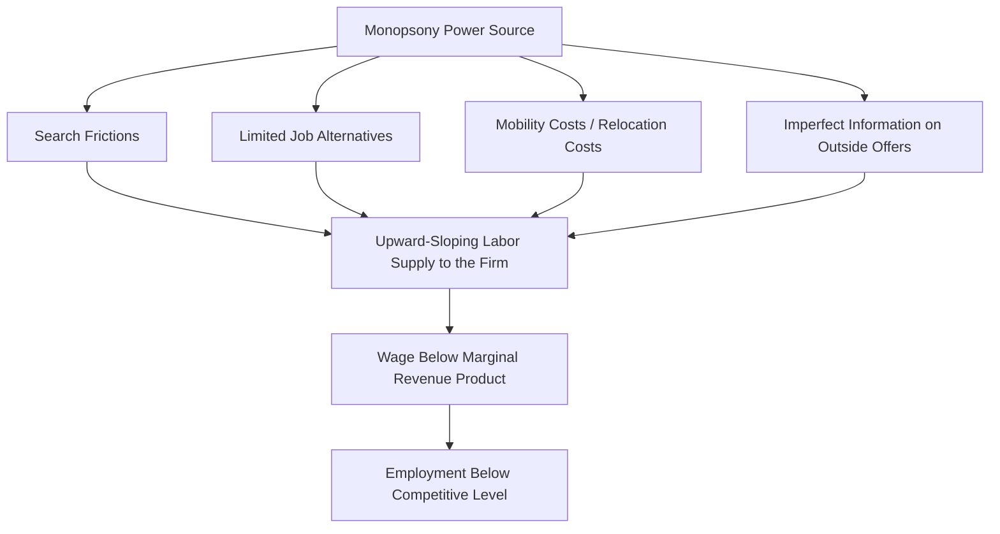
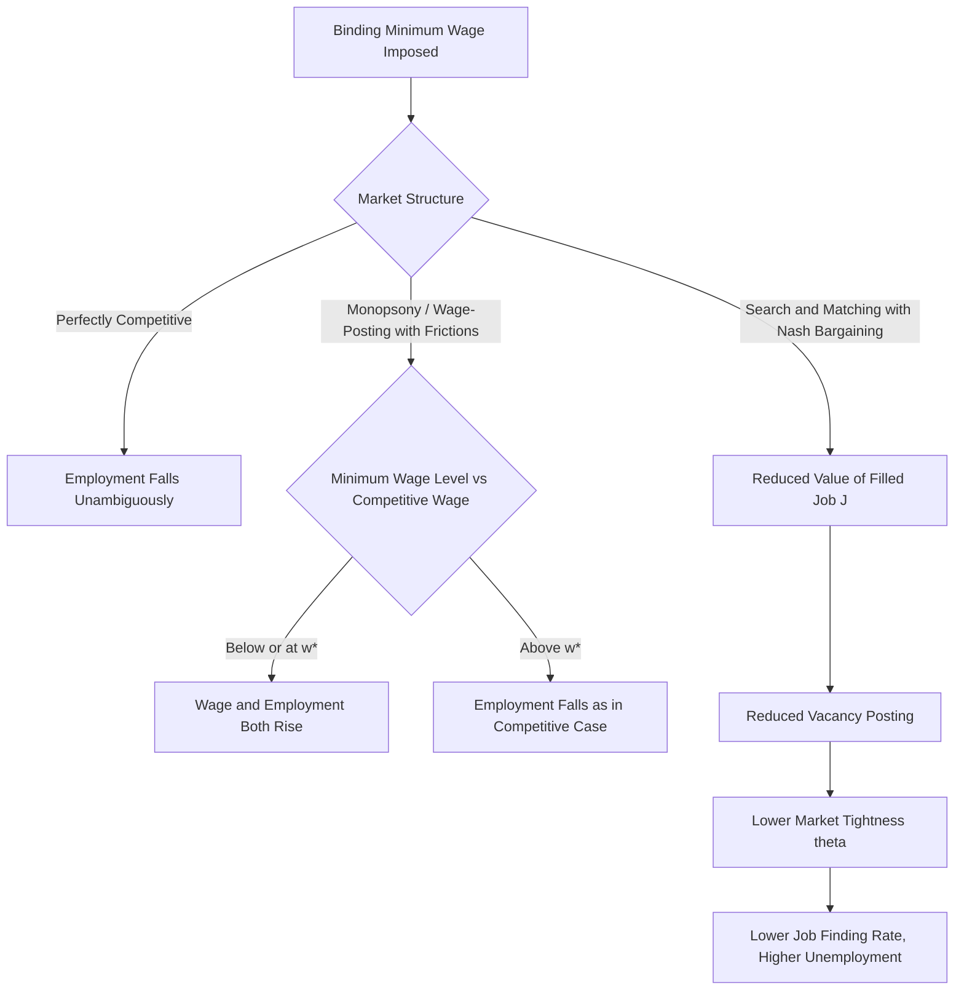

## Minimum Wage Effects and Labor Market Frictions

### Overview

The minimum wage is a legally mandated price floor on labor, and its employment effects depend critically on the underlying structure assumed for the labor market. In a perfectly competitive labor market, a binding minimum wage above the market-clearing wage necessarily reduces employment. However, when labor markets exhibit **frictions**—search costs, imperfect information, mobility constraints, or employer market power—the predicted effects change substantially, and under certain conditions a minimum wage can even increase employment. This topic bridges standard price-floor analysis with search and matching theory and monopsony theory to explain the mixed empirical evidence on minimum wage effects.

**Key Points**

- The competitive model predicts unambiguous employment losses from a binding minimum wage.
- Monopsony and search-friction models predict that a moderate minimum wage can raise both wages and employment.
- Empirical evidence is genuinely mixed, and economists disagree substantially on the magnitude and even the sign of minimum wage employment effects in many contexts [Unverified—this reflects a long-standing and active empirical debate rather than a settled consensus].

### The Competitive Labor Market Benchmark

In the standard competitive model, labor demand $L^D(w)$ is downward-sloping (from diminishing marginal product of labor) and labor supply $L^S(w)$ is upward-sloping. The equilibrium wage $w^*$ clears the market where $L^D(w^*) = L^S(w^*)$.

A minimum wage $\bar{w}$ is **binding** only if $\bar{w} > w^*$. When binding:

$$L^D(\bar{w}) < L^S(\bar{w})$$

This creates:

- **Employment reduction**: employment falls from $L^*$ to $L^D(\bar{w})$
- **Involuntary unemployment**: the gap $L^S(\bar{w}) - L^D(\bar{w})$ represents workers willing to work at $\bar{w}$ but unable to find jobs
- A **deadweight loss** triangle in the standard supply-demand diagram, reflecting the loss of mutually beneficial trades that would have occurred at wages between $w^*$ and $\bar{w}$

Below is an SVG diagram of the classical competitive minimum wage model:

<svg xmlns="http://www.w3.org/2000/svg" viewBox="0 0 520 420">
<text x="260" y="25" font-size="16" font-weight="bold" text-anchor="middle" fill="#1a1a1a">Competitive Labor Market Minimum Wage (svg_diagram)</text>
<line x1="70" y1="360" x2="480" y2="360" stroke="#333" stroke-width="2" />
<line x1="70" y1="360" x2="70" y2="50" stroke="#333" stroke-width="2" />
<text x="275" y="395" font-size="13" text-anchor="middle" fill="#333">Quantity of Labor (L)</text>
<text x="25" y="205" font-size="13" text-anchor="middle" fill="#333" transform="rotate(-90 25 205)">Wage (w)</text>
<line x1="90" y1="340" x2="440" y2="90" stroke="#0b6e99" stroke-width="2.5" />
<text x="430" y="85" font-size="12" fill="#0b6e99" font-weight="bold">Labor Supply</text>
<line x1="90" y1="90" x2="440" y2="340" stroke="#c0392b" stroke-width="2.5" />
<text x="400" y="345" font-size="12" fill="#c0392b" font-weight="bold" text-anchor="end">Labor Demand</text>
<line x1="70" y1="215" x2="270" y2="215" stroke="#666" stroke-width="1" stroke-dasharray="4,4" />
<circle cx="270" cy="215" r="4" fill="#1a1a1a" />
<text x="278" y="212" font-size="11" fill="#1a1a1a">Equilibrium (w*, L*)</text>
<line x1="70" y1="150" x2="480" y2="150" stroke="#27ae60" stroke-width="2" stroke-dasharray="6,3" />
<text x="440" y="145" font-size="12" fill="#27ae60" font-weight="bold">Minimum Wage w̄</text>
<line x1="215" y1="360" x2="215" y2="150" stroke="#999" stroke-width="1" stroke-dasharray="2,2" />
<text x="200" y="378" font-size="10" fill="#c0392b">L^D(w̄)</text>
<line x1="325" y1="360" x2="325" y2="150" stroke="#999" stroke-width="1" stroke-dasharray="2,2" />
<text x="315" y="378" font-size="10" fill="#0b6e99">L^S(w̄)</text>
<line x1="215" y1="150" x2="325" y2="150" stroke="#e67e22" stroke-width="4" />
<text x="230" y="140" font-size="11" fill="#e67e22" font-weight="bold">Involuntary Unemployment</text>
</svg>

### Elasticity of Labor Demand and the Magnitude of Job Losses

Within the competitive framework, the size of the employment effect depends on the **wage elasticity of labor demand**:

$$\varepsilon_D = \frac{\%\Delta L^D}{\%\Delta w}$$

- If $|\varepsilon_D|$ is large (elastic demand), even a small minimum wage increase produces substantial job losses.
- If $|\varepsilon_D|$ is small (inelastic demand), employment effects are muted, though the model still predicts some reduction in a purely competitive setting.

**Example**

Suppose a firm faces a labor demand elasticity of $\varepsilon_D = -0.3$ (a commonly cited empirical range for low-wage labor demand in some studies, though estimates vary widely across the literature) [Unverified—elasticity estimates are highly context- and study-dependent]. A 10% increase in the minimum wage would be predicted to reduce employment by approximately:

$$\%\Delta L^D = \varepsilon_D \times \%\Delta w = -0.3 \times 10\% = -3\%$$

### Monopsony in the Labor Market

**Monopsony** describes a labor market with a single (or dominant) buyer of labor, or more generally, one where individual firms face an upward-sloping labor supply curve because workers face mobility costs, imperfect information, or limited outside options. This is a foundational alternative to the competitive model for analyzing minimum wage effects.

Under monopsony, the firm's marginal cost of labor $MC_L$ exceeds the wage $w$, because hiring an additional worker requires raising the wage paid to *all* workers (not just the marginal hire), assuming a single posted wage:

$$MC_L(L) = w(L) + L \cdot \frac{dw}{dL}$$

The monopsonist maximizes profit by hiring where marginal revenue product equals marginal cost of labor:

$$MRP_L = MC_L$$

This yields an equilibrium wage $w_M$ and employment level $L_M$ that are **both below** the competitive (efficient) levels $w^*$ and $L^*$ that would prevail if the labor market were competitive.

### The Minimum Wage Under Monopsony

The key theoretical result: in a monopsonistic labor market, imposing a minimum wage **at or below the competitive wage** $w^*$ can simultaneously **raise both the wage and employment**.

Intuition: A binding minimum wage $\bar{w}$ set between $w_M$ and $w^*$ effectively makes the labor supply curve **flat** (perfectly elastic) at $\bar{w}$ up to the point where it would have intersected the original supply curve. This eliminates the firm's incentive to restrict hiring in order to avoid raising wages for inframarginal workers, because the firm can now hire additional workers at the fixed wage $\bar{w}$ without bidding up the wage of existing workers.

$$MC_L = \bar{w} \quad \text{for } L \leq L^S(\bar{w})$$

The employment-maximizing minimum wage under simple monopsony is exactly $\bar{w} = w^*$, the competitive wage—beyond this point, further increases in the minimum wage reduce employment just as in the competitive model.

<svg xmlns="http://www.w3.org/2000/svg" viewBox="0 0 540 440">
<text x="270" y="25" font-size="16" font-weight="bold" text-anchor="middle" fill="#1a1a1a">Minimum Wage Under Monopsony (svg_diagram)</text>
<line x1="80" y1="380" x2="490" y2="380" stroke="#333" stroke-width="2" />
<line x1="80" y1="380" x2="80" y2="50" stroke="#333" stroke-width="2" />
<text x="285" y="410" font-size="13" text-anchor="middle" fill="#333">Quantity of Labor (L)</text>
<text x="30" y="215" font-size="13" text-anchor="middle" fill="#333" transform="rotate(-90 30 215)">Wage (w)</text>
<line x1="100" y1="360" x2="450" y2="100" stroke="#0b6e99" stroke-width="2.5" />
<text x="440" y="95" font-size="12" fill="#0b6e99" font-weight="bold">Labor Supply (to firm)</text>
<path d="M 100 340 Q 300 260 450 130" stroke="#8e44ad" stroke-width="2.5" fill="none" stroke-dasharray="5,3" />
<text x="380" y="150" font-size="11" fill="#8e44ad" font-weight="bold">Marginal Cost of Labor (MCL)</text>
<line x1="100" y1="120" x2="450" y2="370" stroke="#c0392b" stroke-width="2.5" />
<text x="410" y="365" font-size="12" fill="#c0392b" font-weight="bold" text-anchor="end">MRP of Labor</text>
<circle cx="230" cy="280" r="4" fill="#1a1a1a" />
<text x="238" y="278" font-size="11" fill="#1a1a1a">Monopsony (w_M, L_M)</text>
<circle cx="300" cy="240" r="4" fill="#27ae60" />
<text x="308" y="255" font-size="11" fill="#27ae60" font-weight="bold">Competitive (w*, L*)</text>
<line x1="80" y1="240" x2="300" y2="240" stroke="#27ae60" stroke-width="2" stroke-dasharray="4,3" />
<text x="90" y="232" font-size="10" fill="#27ae60">Optimal Min Wage w̄ = w*</text>
</svg>

**Key Points**

- Under monopsony, the minimum wage functions as a **corrective policy** analogous to breaking a monopolist's output restriction, rather than as a distortionary price floor.
- Card and Krueger's (1994) New Jersey/Pennsylvania fast-food study is frequently cited as early empirical evidence consistent with monopsony-type predictions, though its methodology and conclusions have been extensively debated and contested in subsequent literature [Unverified—this remains a contested empirical result].
- Modern **dynamic monopsony** models (e.g., Manning, 2003; Card, Cardoso, Heining, and Kline, 2018) ground employer wage-setting power in search frictions rather than assuming a literal single-employer market, making monopsony power a matter of degree rather than an all-or-nothing condition.

### Search Frictions as a Microfoundation for Monopsony Power

Modern labor economics generally does not rely on literal single-buyer monopsony (rare in most real markets) but instead derives employer wage-setting power from **search frictions**, connecting this topic directly to the Diamond-Mortensen-Pissarides (DMP) framework.

In search-theoretic models of monopsony (following Burdett and Mortensen, 1998), workers face:

- Costly on-the-job search (it takes time to find and evaluate alternative offers)
- Imperfect information about the wage distribution across firms
- Positive but finite job-to-job transition rates

Because workers cannot instantly and costlessly move to the highest-paying firm, individual firms retain some wage-setting power even in a market with many employers—this power arises from the **elasticity of the firm's labor supply with respect to its posted wage**, denoted $\varepsilon_{LS}$:

$$\varepsilon_{LS} = \frac{\partial L/\partial w \cdot w}{L}$$

A finite (rather than infinite) $\varepsilon_{LS}$ generates monopsonistic wage-setting even absent a single dominant employer. Empirical estimates of firm-level labor supply elasticities in modern search-based studies are often found to be far from infinite, which some researchers interpret as evidence for pervasive employer wage-setting power [Unverified—elasticity estimates and their interpretation vary substantially across studies, industries, and estimation methods].

### Reconciling Search Frictions with the DMP Wage-Bargaining Framework

Within the DMP search and matching model (see companion topic), wages are set via Nash bargaining rather than a monopsonistic posted-wage rule. Introducing a minimum wage into this framework changes the analysis as follows:

The Nash bargained wage (from the standard DMP wage equation) is:

$$w^{NB} = \beta(p + c\theta) + (1-\beta)b$$

A minimum wage $\bar{w}$ becomes relevant only if it exceeds $w^{NB}$:

$$w = \max(w^{NB}, \bar{w})$$

If binding, the imposed wage $\bar{w}$ replaces $w^{NB}$ in the firm's value function:

$$rJ = p - \bar{w} + s(V_f - J)$$

Because $J$ (the value of a filled job to the firm) is what drives vacancy creation via the free-entry condition $c/q(\theta) = J$, a binding minimum wage that pushes $\bar{w}$ above $w^{NB}$ **reduces $J$, reduces vacancy posting, and reduces equilibrium market tightness $\theta$**—ultimately reducing the job-finding rate $f(\theta)$ and raising steady-state unemployment, similar in direction to the competitive model's prediction, but transmitted through the vacancy-posting margin rather than instantaneous employment adjustment. This differs from the monopsony result because DMP wage bargaining does not typically feature the same wedge between wage and marginal cost of labor that generates the monopsony "sweet spot."

**Key Points**

- Search-and-matching models with Nash bargaining generally predict negative employment effects from a binding minimum wage, similar in sign to the competitive model, though the adjustment channel (vacancy creation and job destruction, rather than instantaneous employment cuts) and the speed of adjustment differ [Inference: sign and channel depend on specific model assumptions about bargaining and separations].
- Models combining search frictions **with** monopsony-style wage-posting (rather than bargaining) more readily generate the "employment-increasing" minimum wage result, because they retain the upward-sloping firm-level labor supply curve.
- The distinction between wage-posting and bargaining protocols is therefore central to whether a given search-friction model predicts positive or negative minimum wage employment effects.

### Adjustment Margins Beyond Employment

Even where employment effects are small, firms facing a binding minimum wage may adjust along other margins, which frictional models help formalize:

- **Hours reduction**: cutting scheduled hours per worker rather than headcount
- **Reduced non-wage benefits**: lower fringe benefits, training investment, or workplace amenities, as firms substitute away from non-mandated compensation
- **Turnover and separation rates**: search-friction models predict that a minimum wage can reduce voluntary quits (since the outside option of unemployment becomes relatively less attractive, and current jobs pay more), potentially *lowering* the separation rate $s$ and partially offsetting employment losses through longer job durations
- **Price pass-through**: firms raising output prices to absorb higher labor costs, especially in less competitive product markets
- **Reduced vacancy posting / slower hiring**: consistent with the DMP mechanism above, showing up as reduced job creation rather than layoffs of incumbent workers—an important distinction for interpreting employment data, since job creation effects (fewer new hires) can be harder to detect in aggregate employment counts than outright layoffs

### Monopsony vs. Competitive vs. Search-Frictional Predictions

| Feature | Competitive Model | Static Monopsony | Search-and-Matching (DMP, Nash Bargaining) |
| --- | --- | --- | --- |
| Pre-minimum-wage outcome | Efficient $(w^*, L^*)$ | Wage and employment below efficient level | Wage above $b$, below full marginal product, tightness $\theta^*$ |
| Effect of moderate minimum wage | Reduces employment | Can increase both wage and employment | Reduces vacancy creation and tightness; raises unemployment |
| Adjustment margin | Instant employment cut | Movement along $MC_L$ curve | Reduced job creation over time (flow adjustment) |
| Optimal minimum wage (employment-maximizing) | Zero / non-binding | $\bar{w} = w^*$ | Generally non-positive employment effect at any binding level [Inference: depends on model specification] |

### Empirical Debates and Identification Challenges

The mixed theoretical predictions map onto genuinely contested empirical findings:

- **Card-Krueger (1994) and successors**: found no significant negative, and in some specifications positive, employment effects from New Jersey's minimum wage increase relative to Pennsylvania, often cited as consistent with monopsony-type models.
- **Neumark and Wascher and related work**: using different data and methods, found more traditional negative employment effects, consistent with the competitive model.
- **Seattle minimum wage studies** (University of Washington team vs. Berkeley team): produced conflicting estimates of hours and employment effects from the same policy change, illustrating sensitivity to data source, comparison group selection, and empirical specification.
- **Meta-analyses** (e.g., Card, Katz, Krueger surveys; Dube's later reviews) generally suggest that employment elasticities with respect to the minimum wage are small in absolute value for the range of minimum wage increases studied historically in the U.S., though this finding is actively debated and may not generalize to much larger minimum wage increases [Unverified—this is a live area of ongoing empirical research and disagreement].

**Key Points**

- Much of the empirical disagreement stems from identification challenges: isolating the causal effect of a minimum wage change from other confounding local economic trends is methodologically difficult.
- The "bite" of a minimum wage (how far above the market-clearing or median wage it is set) likely matters for whether monopsony-consistent or competitive-consistent effects dominate; a very high minimum wage relative to local wage levels is more likely to generate the traditional competitive-model job losses even in frictional markets [Inference].

### Related Concept: Efficiency Wages and Minimum Wage Interactions

Search-friction models sometimes interact with **efficiency wage** considerations, where firms pay above the market-clearing wage to reduce turnover, increase effort, or reduce shirking. A binding minimum wage can, in some circumstances, substitute for or reinforce efficiency wage incentives, since it raises the cost of job loss to the worker (the gap between the wage and outside options), potentially reducing shirking or turnover independent of the frictional mechanisms discussed above. This interaction is generally treated as a secondary or complementary channel rather than the primary explanation for minimum wage employment effects in mainstream search-and-matching literature [Inference].

### Summary Diagram: Channels of Minimum Wage Impact Under Frictions

**Next Steps**

- Dynamic monopsony models and firm-level labor supply elasticity estimation (Manning, 2003; Card et al., 2018)
- The Burdett-Mortensen wage posting and on-the-job search model
- Efficiency wage theory and the Shapiro-Stiglitz shirking model
- Minimum wage and the DMP job creation/job destruction margins (Mortensen-Pissarides extension)
- Empirical minimum wage research design: synthetic control and bunching estimators
- Monopsony power and its measurement across modern labor markets (concentration ratios, employer market power indices)
- International comparisons: minimum wage institutions in collective bargaining vs. statutory minimum wage economies