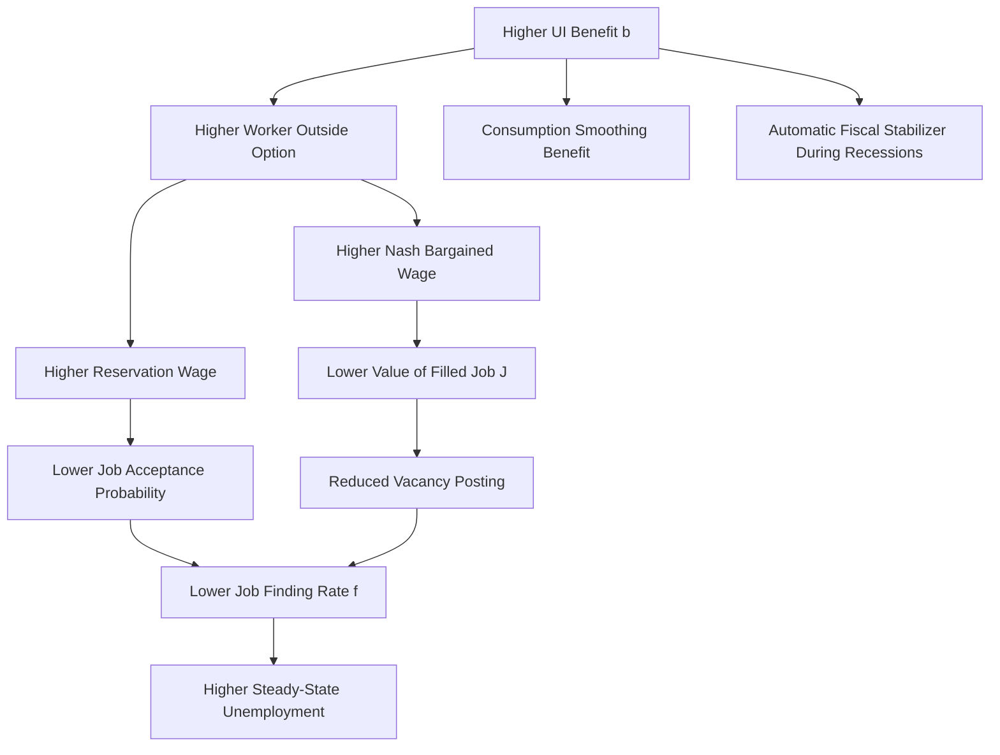

## Unemployment Insurance and Labor Market Incentives

### Overview

Unemployment insurance (UI) is a social insurance program that provides temporary income replacement to workers who lose their jobs, typically financed through payroll taxes on employers (and in some systems, employees). While UI serves an important consumption-smoothing and macroeconomic stabilization function, it also alters the incentives of both workers and firms in ways that labor economists analyze extensively using search and matching theory. This topic examines the fundamental **efficiency-equity tradeoff** at the heart of UI design: insurance against income loss versus distortion of job search and separation behavior.

**Key Points**

- UI addresses a genuine market failure: private insurance markets for unemployment risk are largely absent due to moral hazard and adverse selection problems.
- UI generosity (benefit level and duration) affects the job finding rate, reservation wages, and layoff behavior.
- The optimal UI design balances the **consumption-smoothing benefit** against the **search-disincentive cost**, a framework formalized in the Baily-Chetty optimal UI model.

### Why Unemployment Insurance Exists: The Market Failure Rationale

Unemployment risk is difficult to insure privately for several reasons:

- **Moral hazard**: A worker who knows they will be compensated for job loss may exert less effort to find or keep a job, and private insurers cannot perfectly monitor search effort or the circumstances of separation.
- **Adverse selection**: Workers who know they face higher unemployment risk (due to occupation, industry, or personal circumstances) are more likely to purchase private unemployment insurance, driving up premiums and potentially causing the market to unravel.
- **Correlated/systemic risk**: Unemployment risk is correlated across workers during recessions, making it difficult for private insurers to diversify risk pools, unlike idiosyncratic risks such as fire or theft.

Because of these market failures, most economies provide UI as a public, mandatory social insurance program rather than relying on private markets.

### Modeling Worker Search Behavior: The Reservation Wage Framework

UI's incentive effects are typically modeled using **job search theory**, a partial-equilibrium precursor to and complement of the search and matching framework. An unemployed worker receiving UI benefits $b$ decides whether to accept a job offer with wage $w$ by comparing it to a **reservation wage** $w^R$—the minimum wage the worker will accept.

The worker's value of unemployment (searching) satisfies a Bellman equation:

$$rU_w = b + \lambda \int_{w^R}^{\infty} [W(w') - U_w] \, dF(w')$$

Where:

- $\lambda$ = arrival rate of job offers
- $F(w')$ = the cumulative distribution function of wage offers
- $W(w')$ = the value of being employed at wage $w'$

The **reservation wage condition** requires that the worker be indifferent between accepting and rejecting an offer exactly at $w^R$:

$$W(w^R) = U_w$$

This yields the reservation wage as an increasing function of the UI benefit level:

$$\frac{\partial w^R}{\partial b} > 0$$

**Key Points**

- A higher UI benefit $b$ raises the reservation wage, since unemployment becomes relatively less costly, causing workers to reject more low-wage offers.
- A higher reservation wage reduces the effective job acceptance probability (since fewer wage draws exceed $w^R$), which is mathematically equivalent to lowering the job finding rate $f$ in the DMP framework.
- This is the central microeconomic channel through which UI generosity is predicted to increase unemployment duration.

### Effects on Job Finding Rate and Unemployment Duration

Combining the reservation wage mechanism with the offer arrival process, the **job finding rate** is:

$$f = \lambda \cdot [1 - F(w^R)]$$

Since $w^R$ rises with $b$, and $F$ is increasing, $[1 - F(w^R)]$ falls with $b$, so:

$$\frac{\partial f}{\partial b} < 0$$

This directly implies that **expected unemployment duration**, which is inversely related to the job finding rate in a simple exponential search model ($E[\text{duration}] = 1/f$), rises with UI generosity.

**Example**

Suppose a worker's job finding rate is $f = 0.20$ (20% chance of finding a job each month) absent UI benefits. If UI benefits are introduced and raise the reservation wage enough to reduce the job finding rate to $f = 0.15$:

$$E[\text{duration, no UI}] = \frac{1}{0.20} = 5 \text{ months}$$

$$E[\text{duration, with UI}] = \frac{1}{0.15} \approx 6.67 \text{ months}$$

This illustrates a roughly 33% increase in expected unemployment duration from this hypothetical benefit change, though actual magnitudes depend heavily on benefit levels, labor market conditions, and worker characteristics [Unverified—this is a stylized illustrative calculation, not an empirical estimate].

### Two Distinct Effects: Benefit Level vs. Benefit Duration

UI programs vary along at least two key dimensions, which the literature treats as having distinct incentive effects:

**Benefit level (replacement rate)**: The fraction of prior wages replaced by UI benefits, denoted $\rho = b/w_{\text{prior}}$. Higher replacement rates raise the reservation wage as described above.

**Benefit duration**: The maximum number of weeks a worker can claim UI benefits. Search theory predicts that as a worker approaches **benefit exhaustion**, the option value of continued search declines, and the reservation wage should fall as the exhaustion date nears—generating a predicted **spike in the job finding rate just before benefits run out**. This is one of the most robust and frequently tested predictions of search-theoretic UI models.

Below is an SVG illustration of the classic hazard-rate spike pattern documented in the empirical literature:

<svg xmlns="http://www.w3.org/2000/svg" viewBox="0 0 540 400">
<text x="270" y="25" font-size="16" font-weight="bold" text-anchor="middle" fill="#1a1a1a">Job Finding Hazard Rate Over Unemployment Spell (svg_diagram)</text>
<line x1="80" y1="340" x2="490" y2="340" stroke="#333" stroke-width="2" />
<line x1="80" y1="340" x2="80" y2="60" stroke="#333" stroke-width="2" />
<text x="285" y="370" font-size="13" text-anchor="middle" fill="#333">Weeks of Unemployment</text>
<text x="30" y="200" font-size="13" text-anchor="middle" fill="#333" transform="rotate(-90 30 200)">Job Finding Hazard Rate</text>
<path d="M 100 300 L 180 290 L 260 280 L 340 270 L 380 260 L 400 150 L 415 320" stroke="#0b6e99" stroke-width="2.5" fill="none" />
<line x1="400" y1="340" x2="400" y2="60" stroke="#c0392b" stroke-width="1.5" stroke-dasharray="5,3" />
<text x="405" y="80" font-size="11" fill="#c0392b" font-weight="bold">Benefit Exhaustion Date</text>
<circle cx="400" cy="150" r="4" fill="#e67e22" />
<text x="330" y="130" font-size="11" fill="#e67e22" font-weight="bold">Spike Before Exhaustion</text>
<line x1="415" y1="340" x2="480" y2="330" stroke="#0b6e99" stroke-width="2.5" stroke-dasharray="3,3" />
<text x="430" y="325" font-size="10" fill="#666">Post-exhaustion (lower hazard)</text>
</svg>

**Key Points**

- Empirical studies using discrete-time hazard models frequently find evidence of elevated exit rates from unemployment in the weeks immediately preceding benefit exhaustion, consistent with the search-theoretic prediction, though the magnitude of this spike varies across studies and time periods [Unverified—empirical magnitudes are study-specific].
- Extensions to UI duration during recessions (e.g., extended benefits programs) are a recurring policy tool, and their employment effects are a major focus of applied labor economics research, particularly following the 2008–09 and 2020 recessions.

### Moral Hazard vs. Liquidity: The Two Channels of UI's Effect on Search

A key theoretical and empirical distinction, formalized prominently by Chetty (2008), separates the effect of UI benefits on job search into two conceptually distinct channels:

1. **Moral hazard channel**: Higher benefits reduce the *effective price* of search effort reduction—since UI cushions the cost of remaining unemployed, workers rationally reduce search intensity or raise reservation wages, exactly as described in the standard search model above. This channel represents a genuine efficiency cost.
2. **Liquidity channel**: Many unemployed workers face binding liquidity constraints (limited savings, limited borrowing capacity) and are unable to smooth consumption during unemployment absent UI benefits. For these workers, higher benefits allow them to search longer and find *better-matched* jobs, rather than being forced to accept the first available offer due to a lack of resources. This channel does not represent pure moral hazard—it reflects insurance against a genuine welfare loss (borrowing constraints), and Chetty's decomposition suggests that a substantial share of the observed increase in unemployment duration from higher UI benefits reflects this liquidity effect rather than pure moral hazard [Unverified—the specific split between channels is model- and dataset-dependent and remains debated].

**Key Points**

- This distinction matters enormously for welfare analysis: an increase in unemployment duration driven by the liquidity channel is not necessarily inefficient, because it may reflect improved job match quality and consumption smoothing rather than pure shirking on search effort.
- Empirical identification of the two channels typically relies on comparing the behavioral response of liquidity-constrained versus unconstrained workers (e.g., by asset holdings) to UI benefit changes.

### The Baily-Chetty Optimal Unemployment Insurance Formula

The canonical framework for determining the **optimal UI replacement rate** balances the marginal insurance benefit of UI against its marginal moral hazard cost. The Baily (1978) and Chetty (2006) formula for the optimal replacement rate can be expressed (in a simplified sufficient-statistics form) as:

$$\frac{c'(C_u)}{c'(C_e)} - 1 = \varepsilon_{D,b} \cdot \frac{b}{1-b}$$

Where (in a stylized version):

- $c'(C_u)$ and $c'(C_e)$ are the marginal utilities of consumption while unemployed and employed, respectively
- The left-hand side represents the **consumption-smoothing benefit** of an additional dollar of UI (larger when the drop in consumption upon job loss, $C_e - C_u$, is larger)
- $\varepsilon_{D,b}$ is the elasticity of unemployment duration with respect to the benefit level, capturing the **moral hazard cost**
- The right-hand side scales this elasticity by the benefit-to-wage ratio

**Key Points**

- This is a "sufficient statistics" approach: rather than requiring a fully specified structural model, the formula shows that optimal UI generosity can be characterized using two empirically estimable objects—the consumption drop upon unemployment, and the elasticity of unemployment duration with respect to benefits.
- Empirical estimates of the consumption drop upon job loss (used to calibrate the left-hand side) and the duration elasticity (used to calibrate the right-hand side) vary across studies, income groups, and countries, so specific numerical conclusions about optimal replacement rates should be treated as context-dependent [Unverified—both key parameters are estimated quantities subject to ongoing empirical revision].
- A larger observed consumption drop upon unemployment implies UI should be more generous (higher insurance value); a larger duration elasticity implies UI should be less generous (higher moral hazard cost).

### Firm-Side Effects: Experience Rating and Layoff Incentives

UI incentive effects are not limited to worker search behavior—the financing structure of UI also affects **firm layoff decisions** through a mechanism called **experience rating**.

In many UI systems (notably the U.S.), employer payroll tax rates for UI are partially tied to that employer's history of layoffs (their "experience rating"), intended to internalize the cost that layoffs impose on the UI system.

- **Perfect experience rating**: Firms pay a tax exactly equal to the expected UI benefits their laid-off workers will draw, fully internalizing the social cost of layoffs.
- **Imperfect experience rating** (the empirically observed case in most systems, including the U.S.): firms do not pay the full marginal cost of layoffs, because tax rates are capped, subject to minimum and maximum rates, or only partially adjust to a firm's layoff history.

**Key Points**

- Imperfect experience rating creates a **subsidy to layoffs at the margin**, since firms do not bear the full cost of the UI benefits their separated workers receive, potentially leading to excessive temporary layoffs (particularly in seasonal or cyclical industries) relative to the socially optimal level.
- This connects to the DMP framework's separation margin: imperfect experience rating can be modeled as effectively lowering the firm's cost of separation, raising the equilibrium separation rate $s$ above its efficient level.
- Some economists have proposed UI systems with more complete experience rating, or "layoff taxes," as a policy response to this distortion, though implementation raises administrative complexity and equity concerns for firms facing genuine demand shocks.

### General Equilibrium and Macroeconomic Effects

Beyond partial-equilibrium search effects on individual workers, UI has broader macroeconomic implications when analyzed within the DMP search and matching framework (see companion topic):

- **Effect on wage bargaining**: Since UI benefits $b$ enter directly into the worker's outside option (value of unemployment $U_w$), higher UI benefits raise the bargained wage via the Nash bargaining wage equation:

$$w = \beta(p + c\theta) + (1-\beta)b$$

- **Effect on vacancy creation**: A higher bargained wage $w$ reduces the value of a filled job $J = p - w + \ldots$, which reduces vacancy posting via the free-entry condition, lowering equilibrium market tightness $\theta$.
- **Effect on aggregate unemployment**: The combination of a lower job finding rate $f(\theta)$ (both from reduced tightness and from the direct reservation-wage channel) raises the steady-state unemployment rate $u^* = s/(s+f(\theta))$.
- **Automatic stabilizer role**: Despite these microeconomic distortions, UI is widely regarded as an important **automatic fiscal stabilizer** during recessions, since UI payments rise automatically as unemployment increases, supporting aggregate demand without requiring new legislation—a macroeconomic benefit that is analytically distinct from, and in the view of many economists outweighs, the microeconomic search-disincentive costs during downturns [Inference: the relative weighting of stabilization benefits versus search disincentive costs is a matter of ongoing policy debate, particularly regarding the appropriate generosity of extended benefits during recessions].

### Empirical Estimation Approaches

Common empirical strategies for identifying UI's effects on labor market outcomes include:

- **Regression discontinuity designs**: Exploiting sharp cutoffs in benefit eligibility (e.g., based on prior earnings or work history thresholds) to compare workers just above and below eligibility rules.
- **Difference-in-differences**: Comparing unemployment duration or job finding outcomes across states or countries that change UI generosity at different times, relative to those that do not.
- **Bunching estimators**: Analyzing bunching in unemployment spell durations at benefit exhaustion points to estimate the duration elasticity with respect to benefits.
- **Natural experiments from extended benefits programs**: Using the state-by-state and time-varying rollout of federal extended UI benefit programs (such as those enacted during the 2008–09 and 2020 recessions) as quasi-experimental variation.

**Key Points**

- Estimated elasticities of unemployment duration with respect to UI benefit levels vary considerably across studies, time periods, and countries, and depend on the specific labor market conditions (tight vs. slack markets) prevailing at the time of the benefit change [Unverified—elasticity estimates are heterogeneous across the empirical literature and are sensitive to specification].
- Some research suggests that duration elasticities may be smaller during recessions (when job offers are scarce regardless of reservation wage behavior) than during expansions, an important consideration for the design of counter-cyclical UI extensions [Inference: this finding is empirically supported in some studies but is not universally established across all contexts].

### International Comparisons

UI system design varies substantially across countries, which the search and matching framework helps interpret:

| Feature | United States (typical) | Continental Europe (typical) |
| --- | --- | --- |
| Replacement rate | Moderate (roughly 40–50% of prior wage, program- and state-dependent) | Often higher (60–80%+ in several systems) |
| Benefit duration | Typically 26 weeks standard, extendable during recessions | Often longer standard duration |
| Experience rating | Present but imperfect | Often less directly tied to individual employer layoff history |
| Job search requirements / activation policies | Present, varying by state | Often more extensive "active labor market policy" requirements paired with benefits |

These institutional differences interact with the search and matching framework's predictions: economies with higher replacement rates and longer durations are predicted, all else equal, to exhibit higher reservation wages, longer unemployment durations, and higher structural unemployment rates, though actual cross-country unemployment differences reflect many additional factors (employment protection legislation, collective bargaining institutions, active labor market policies) beyond UI generosity alone [Inference: cross-country unemployment differences are multi-causal and cannot be attributed to UI design alone].

**Next Steps**

- The Baily-Chetty sufficient statistics approach to optimal social insurance design more broadly
- Chetty's (2008) moral hazard vs. liquidity decomposition methodology in detail
- Experience rating reform proposals and layoff tax mechanisms
- Extended and emergency UI benefits during the 2008–09 and 2020 recessions as case studies
- Active labor market policies and job search monitoring/sanctions regimes
- Integrating UI policy analysis into the full DMP general equilibrium model
- Cross-country comparative studies of UI generosity and structural unemployment (OECD data)