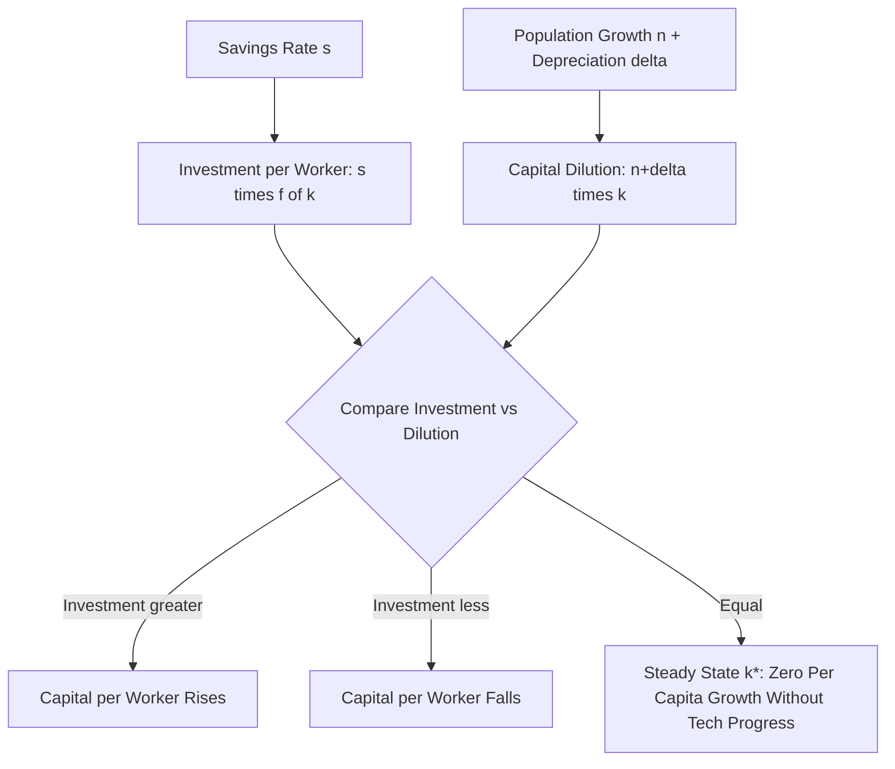
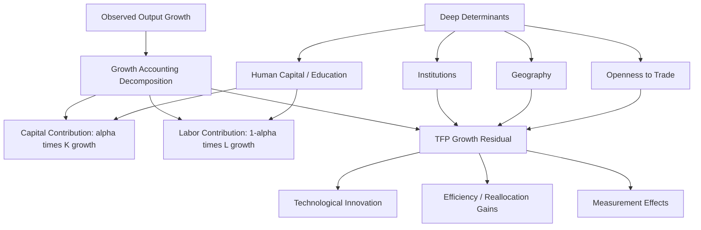

## Sources of Long-Run Economic Growth

### Overview

Long-run economic growth refers to the sustained increase in an economy's productive capacity over time, typically measured by growth in real GDP per capita. Unlike short-run business cycle fluctuations, which are driven by demand shocks and nominal rigidities, long-run growth is fundamentally a **supply-side phenomenon**, determined by the accumulation of productive factors and improvements in the efficiency with which those factors are combined. Growth theory identifies a small set of proximate sources of growth—capital accumulation, labor force growth, human capital, and total factor productivity—and a much larger and more contested set of deep/fundamental determinants underlying them.

**Key Points**

- Growth accounting decomposes observed output growth into contributions from measurable factor inputs and a residual (total factor productivity).
- Capital accumulation alone cannot sustain long-run per capita growth due to diminishing returns; this is the central insight of the Solow model.
- Technological progress and productivity growth are the primary drivers of sustained long-run growth in per capita output.
- Deep determinants of growth—institutions, human capital, geography, and openness to trade—help explain why productivity growth itself varies across countries.

### The Aggregate Production Function

The starting point for analyzing sources of growth is an aggregate production function relating output to factor inputs and technology:

$$Y = A \cdot F(K, L)$$

Where:

- $Y$ = aggregate output (real GDP)
- $K$ = capital stock
- $L$ = labor input (often adjusted for human capital)
- $A$ = total factor productivity (TFP), representing the efficiency with which inputs are converted into output

A common specification is the **Cobb-Douglas production function**:

$$Y = A K^{\alpha} L^{1-\alpha}$$

Where $\alpha \in (0,1)$ is capital's share of output (empirically often estimated around one-third in many advanced economies, though this varies by country and time period) [Unverified—capital share estimates vary across studies, countries, and time periods, and have shown some secular decline in labor share in recent decades in various economies].

### Growth Accounting

**Growth accounting** decomposes the growth rate of output into the contributions of each factor, using the production function above. Taking logs and differentiating with respect to time:

$$\frac{\dot{Y}}{Y} = \frac{\dot{A}}{A} + \alpha \frac{\dot{K}}{K} + (1-\alpha) \frac{\dot{L}}{L}$$

This equation states that output growth equals the sum of:

- TFP growth ($\dot{A}/A$)
- The capital share $\alpha$ times capital growth ($\dot{K}/K$)
- The labor share $(1-\alpha)$ times labor growth ($\dot{L}/L$)

The TFP growth term is typically calculated as a **residual**—the portion of output growth not explained by measured input growth:

$$\frac{\dot{A}}{A} = \frac{\dot{Y}}{Y} - \alpha\frac{\dot{K}}{K} - (1-\alpha)\frac{\dot{L}}{L}$$

This residual is historically known as the **Solow residual**, following Robert Solow's foundational 1957 growth accounting study.

**Example**

Suppose an economy has capital share $\alpha = 0.35$, and observes the following annual growth rates: output growth $\dot{Y}/Y = 3.0\%$, capital growth $\dot{K}/K = 4.0\%$, and labor growth $\dot{L}/L = 1.0\%$.

$$\frac{\dot{A}}{A} = 3.0\% - (0.35 \times 4.0\%) - (0.65 \times 1.0\%) = 3.0\% - 1.4\% - 0.65\% = 0.95\%$$

In this example, TFP growth accounts for approximately 0.95 percentage points of the 3.0% output growth, with capital deepening contributing 1.4 points and labor growth contributing 0.65 points.

### Per Capita Growth Accounting

Since living standards are better captured by output *per worker* or *per capita* rather than aggregate output, it is useful to express growth accounting in per-worker terms. Dividing the production function by $L$ and defining $y = Y/L$ (output per worker) and $k = K/L$ (capital per worker):

$$\frac{\dot{y}}{y} = \frac{\dot{A}}{A} + \alpha \frac{\dot{k}}{k}$$

This reformulation isolates **capital deepening** (growth in capital per worker) and TFP growth as the two proximate sources of growth in living standards, removing the pure labor-force-growth term (which affects aggregate output but not, by itself, output per worker).

### The Solow-Swan Model: Why Capital Accumulation Cannot Sustain Growth Alone

The **Solow-Swan growth model** formalizes why capital accumulation, absent technological progress, leads only to a temporary growth phase followed by convergence to a **steady state** with zero per capita growth.

The capital accumulation equation (in per-worker terms, abstracting from technology for a moment) is:

$$\dot{k} = s \cdot f(k) - (n + \delta)k$$

Where:

- $s$ = the savings rate
- $f(k)$ = output per worker as a function of capital per worker
- $n$ = population/labor force growth rate
- $\delta$ = capital depreciation rate

The steady state occurs where $\dot{k} = 0$, i.e., where investment per worker $s \cdot f(k)$ exactly offsets capital dilution from depreciation and population growth $(n+\delta)k$:

$$s \cdot f(k^*) = (n+\delta)k^*$$

Below is an SVG diagram of the standard Solow diagram showing convergence to steady state:

<svg xmlns="http://www.w3.org/2000/svg" viewBox="0 0 540 420">
<text x="270" y="25" font-size="16" font-weight="bold" text-anchor="middle" fill="#1a1a1a">Solow Model Steady State (svg_diagram)</text>
<line x1="80" y1="360" x2="490" y2="360" stroke="#333" stroke-width="2" />
<line x1="80" y1="360" x2="80" y2="50" stroke="#333" stroke-width="2" />
<text x="285" y="390" font-size="13" text-anchor="middle" fill="#333">Capital per Worker (k)</text>
<text x="30" y="205" font-size="13" text-anchor="middle" fill="#333" transform="rotate(-90 30 205)">Output / Investment</text>
<path d="M 90 340 Q 200 180 300 110 Q 400 70 470 55" stroke="#0b6e99" stroke-width="2.5" fill="none" />
<text x="420" y="70" font-size="12" fill="#0b6e99" font-weight="bold">Output f(k)</text>
<path d="M 90 350 Q 200 260 300 200 Q 400 155 470 130" stroke="#27ae60" stroke-width="2.5" fill="none" />
<text x="400" y="175" font-size="12" fill="#27ae60" font-weight="bold">Investment s·f(k)</text>
<line x1="90" y1="340" x2="470" y2="80" stroke="#c0392b" stroke-width="2.5" />
<text x="440" y="95" font-size="12" fill="#c0392b" font-weight="bold">Break-even (n+δ)k</text>
<circle cx="300" cy="200" r="5" fill="#1a1a1a" />
<line x1="300" y1="360" x2="300" y2="200" stroke="#666" stroke-width="1" stroke-dasharray="4,3" />
<text x="290" y="378" font-size="11" fill="#1a1a1a">k*</text>
<text x="305" y="190" font-size="11" fill="#1a1a1a">Steady State</text>
</svg>

**Key Points**

- To the left of $k^*$, investment exceeds break-even needs, so capital per worker rises; to the right, the reverse holds—the steady state is stable.
- Because $f(k)$ exhibits **diminishing marginal returns to capital** ($f'(k) > 0$, $f''(k) < 0$), each additional unit of capital per worker adds progressively less to output, ensuring the investment curve $s \cdot f(k)$ eventually flattens relative to the break-even line and growth in $k$ ceases.
- This diminishing-returns property is the model's central mechanism for why **capital accumulation alone generates only transitional (temporary) growth**, not sustained long-run per capita growth.

### Introducing Technological Progress: The Solow Model with Labor-Augmenting Technology

To generate sustained long-run per capita growth, the Solow model must incorporate exogenous **labor-augmenting (Harrod-neutral) technological progress**, typically denoted $A$, growing at rate $g$:

$$Y = F(K, AL)$$

Defining effective labor $\tilde{L} = AL$ and capital per effective worker $\tilde{k} = K/(AL)$, the modified steady-state condition becomes:

$$s \cdot f(\tilde{k}^*) = (n + g + \delta)\tilde{k}^*$$

In this steady state:

- Capital per effective worker $\tilde{k}$ is constant
- Capital per worker $k = K/L$ grows at rate $g$ (the rate of technological progress)
- Output per worker $y = Y/L$ also grows at rate $g$ in steady state

**This is the central result of the Solow model: in the long run, sustained growth in output per capita is driven entirely by the exogenous rate of technological progress $g$, not by the savings rate or capital accumulation.** The savings rate affects the *level* of the steady-state growth path but not its long-run *growth rate*.

### Total Factor Productivity: The Growth Residual

Because TFP growth is measured as a residual (not directly observed), it captures a broad and heterogeneous set of underlying phenomena, including:

- **Technological innovation**: new production techniques, inventions, and process improvements
- **Efficiency gains**: better allocation of resources across firms and sectors (allocative efficiency)
- **Organizational and managerial improvements**: better business practices, supply chain management
- **Measurement effects**: quality improvements in goods and services not fully captured in price indices, changes in capacity utilization, and other measurement artifacts
- **Knowledge spillovers**: non-rival, partially non-excludable knowledge that benefits multiple firms or sectors simultaneously

**Key Points**

- Because TFP is a residual, it is sometimes described informally as "a measure of our ignorance"—it captures everything that growth accounting cannot attribute to measured capital and labor inputs.
- Historical growth accounting studies (following Solow's original work, and subsequent extensions such as Jorgenson and Griliches) have found that TFP growth accounts for a substantial share of long-run per capita output growth in many advanced economies, though the precise split between factor accumulation and TFP varies considerably across countries, time periods, and studies [Unverified—the quantitative decomposition is sensitive to data sources, time periods, and methodological choices regarding capital and labor quality adjustments].

### Endogenous Growth Theory: Explaining Sustained Growth Without Exogenous Technology

A key limitation of the basic Solow model is that it treats technological progress $g$ as **exogenous**—determined outside the model, with no economic explanation for its rate or persistence. **Endogenous growth theory**, developed by Paul Romer, Robert Lucas, and others beginning in the mid-1980s, attempts to explain the sources of technological progress and sustained growth from within the economic model itself.

**The AK Model**: The simplest endogenous growth model removes diminishing returns to capital by broadening the definition of capital to include human capital and knowledge:

$$Y = AK$$

With this specification, output grows at a constant rate proportional to the savings rate:

$$\frac{\dot{Y}}{Y} = \frac{\dot{K}}{K} = sA - \delta$$

Because there are no diminishing returns to (broadly defined) capital in this specification, higher savings rates can generate **permanently higher growth rates**, not just higher levels—a sharp contrast to the Solow model's prediction.

**Romer's Model of Endogenous Technological Change (1990)**: A more elaborate framework treats knowledge/ideas as a distinct, non-rival input produced by a research sector. Key features include:

- **Non-rivalry of ideas**: a blueprint or design can be used by many firms simultaneously without being "used up," unlike physical capital
- **Partial excludability**: patents, trade secrets, and first-mover advantages allow innovators to capture some (but not all) of the value they create, providing an incentive for R&D investment
- **Increasing returns at the aggregate level**: because ideas are non-rival, the economy can exhibit increasing returns to scale in the reproducible factors (capital and the stock of ideas combined), even though individual firms face constant or diminishing returns
- Growth is driven by a dedicated research sector, whose output (new ideas/technologies) depends on the existing stock of knowledge, the number of researchers, and the productivity of the research process

**Key Points**

- Endogenous growth models generate policy implications absent from the Solow model: because growth can depend on R&D investment, education, and innovation incentives, policies such as R&D subsidies, patent protection, and education spending can affect the long-run growth *rate*, not merely the level of output.
- Empirical testing of endogenous growth predictions (e.g., whether larger countries or economies with more researchers grow persistently faster) has produced mixed results, and the "scale effects" implied by some early endogenous growth models are considered a theoretical and empirical weakness addressed by later "semi-endogenous" growth models (e.g., Jones, 1995) [Unverified—this remains an active area of theoretical and empirical debate].

### Human Capital as a Source of Growth

Human capital—the stock of skills, education, training, and health embodied in the labor force—is frequently incorporated into growth models as an additional accumulable factor, either as an augmented labor input or as a distinct capital stock.

An augmented Cobb-Douglas production function incorporating human capital $H$:

$$Y = A K^{\alpha} H^{\beta} L^{1-\alpha-\beta}$$

**Mankiw, Romer, and Weil (1992)** extended the Solow model to include human capital accumulation, finding that this augmented Solow model substantially improves the model's ability to explain cross-country income differences compared to the basic two-factor Solow model, suggesting human capital is a quantitatively important source of growth and cross-country income variation [Unverified—this specific empirical finding, while influential, has also been subject to methodological critique in subsequent literature].

**Key Points**

- Human capital accumulation is subject to its own dynamics (education investment, health investment, learning-by-doing) and interacts with physical capital and technology (skill-biased technological change, complementarities between education and new technologies).
- Cross-country differences in average educational attainment, school quality, and health outcomes are widely cited as partial explanations for persistent income gaps between countries, though the precise quantitative contribution of human capital versus other factors remains debated [Inference: the relative importance of human capital versus institutions, geography, and TFP in explaining cross-country income gaps is not fully settled].

### Deep Determinants of Growth: Institutions, Geography, and Openness

Beyond the proximate sources of growth (capital, labor, human capital, TFP), a substantial literature examines the **deep or fundamental determinants** that explain why factor accumulation and productivity growth themselves vary so much across countries.

**Institutions**: Property rights protection, rule of law, contract enforcement, and political stability are argued by researchers such as Acemoglu, Johnson, and Robinson to be primary determinants of long-run growth, because secure institutions provide the incentives necessary for investment, innovation, and efficient resource allocation. Their influential work using colonial-era settler mortality as an instrument for institutional quality found that institutions have a strong association with long-run income differences across countries [Unverified—this instrumental variable strategy and its findings have been subject to significant methodological debate in subsequent literature].

**Geography**: Factors such as climate, disease burden, access to navigable waterways, and natural resource endowments have been proposed (e.g., by Jeffrey Sachs and coauthors) as direct and indirect influences on growth, operating both directly (agricultural productivity, health) and indirectly (through their influence on institutional development).

**Openness to trade and integration**: Cross-country evidence broadly associates greater trade openness with higher growth rates, operating through channels such as technology transfer, specialization according to comparative advantage, and competitive pressure on domestic firms to innovate, though the causal direction and magnitude of this relationship remains an area of active empirical research [Unverified—the trade-growth relationship is subject to ongoing debate regarding causality and the role of complementary institutional factors].

**Key Points**

- These deep determinants are not mutually exclusive and likely interact: for example, favorable geography may have historically shaped the type of institutions that colonial powers established, which persist and influence growth today.
- This branch of growth theory shifts the analytical focus from "how do capital and technology accumulate" to "why do some societies create the conditions for capital and technology to accumulate in the first place."

### Convergence: Absolute vs. Conditional

The Solow model generates a testable prediction about **convergence**—poorer countries should grow faster than richer countries, all else equal, because of diminishing returns to capital (countries with less capital per worker have a higher marginal product of capital, and hence higher returns to investment).

**Absolute convergence** predicts that poor countries grow faster than rich countries unconditionally. Empirically, this prediction largely fails when tested across the full sample of world economies—there is little evidence of unconditional convergence.

**Conditional convergence** predicts that countries converge to their *own* steady states, which differ based on savings rates, population growth rates, and other structural characteristics; a country only grows faster than another if it is farther below its *own* steady state. Empirically, conditional convergence—controlling for factors such as investment rates, education, and institutional quality—receives considerably more empirical support in cross-country growth regressions [Unverified—the precise speed of conditional convergence and the appropriate set of control variables remain subjects of methodological debate in the empirical growth literature].

### Summary Table: Sources of Growth Framework

| Source | Type | Sustains Long-Run Per Capita Growth? | Key Model |
| --- | --- | --- | --- |
| Physical capital accumulation | Proximate | No (diminishing returns) | Solow-Swan |
| Labor force growth | Proximate | No (affects aggregate, not per capita, output) | Solow-Swan |
| Human capital accumulation | Proximate | Contributes to level/transitional growth; contested role in sustained growth | Mankiw-Romer-Weil |
| Technological progress (exogenous) | Proximate | Yes, by construction | Solow-Swan with technology |
| R&D / endogenous innovation | Proximate/deep | Yes | Romer (1990), endogenous growth models |
| Institutions | Deep/fundamental | Indirectly, via effects on investment and innovation incentives | Acemoglu-Johnson-Robinson |
| Geography | Deep/fundamental | Indirectly, via effects on institutions and productivity | Sachs et al. |
| Trade openness | Deep/fundamental | Indirectly, via technology transfer and specialization | Various cross-country studies |

### Growth Accounting Summary Diagram

**Next Steps**

- The Solow-Swan model in full detail: the steady state, the Golden Rule savings rate, and transitional dynamics
- Endogenous growth models in depth: the Romer (1990) model, the Lucas (1988) human capital model, and semi-endogenous growth models (Jones, 1995)
- Growth accounting methodology and the Jorgenson-Griliches approach to measuring capital and labor quality
- The institutions-vs-geography debate in comparative development economics
- Conditional convergence empirics and cross-country growth regressions (Barro regressions)
- Skill-biased technological change and its interaction with human capital accumulation
- Total factor productivity slowdown debates (e.g., the post-2000s productivity slowdown in advanced economies)