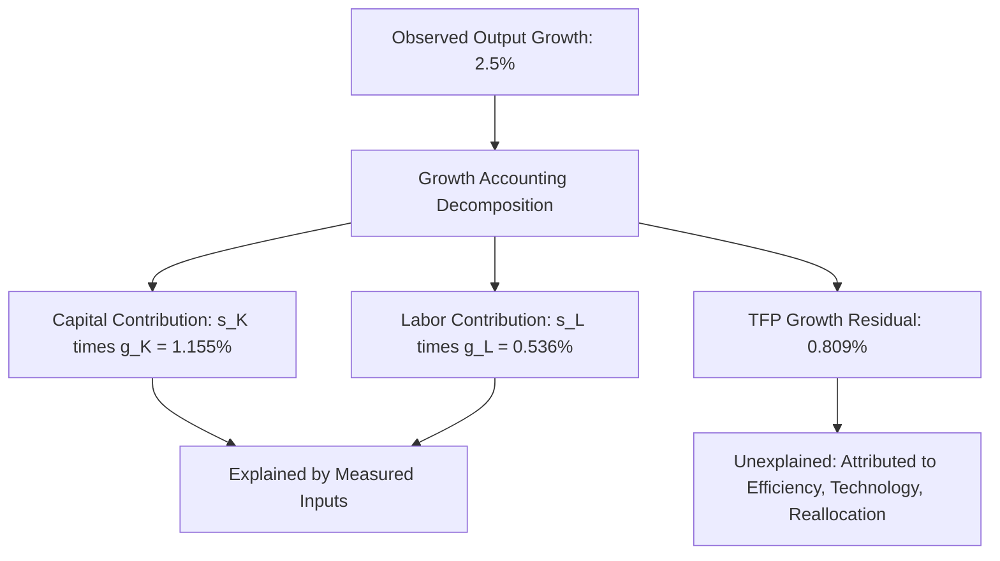
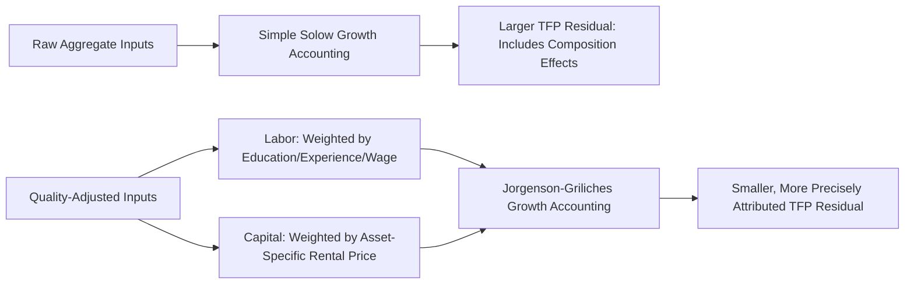
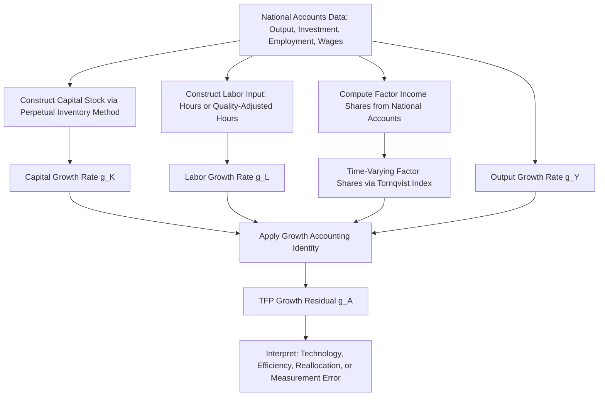

## Growth Accounting and Total Factor Productivity

### Overview

Growth accounting is the empirical methodology used to decompose observed output growth into contributions from measurable factor inputs—capital and labor—and an unexplained residual known as **total factor productivity (TFP)**. Developed originally by Robert Solow (1957), this framework remains the primary tool economists use to quantify how much of economic growth stems from simply using more inputs versus using inputs more efficiently. This topic covers the accounting methodology in detail, its underlying assumptions, extensions for factor quality, and the debates surrounding TFP measurement and interpretation.

**Key Points**

- Growth accounting relies on the neoclassical assumption of competitive factor markets, where factors are paid their marginal products, allowing factor income shares to serve as accounting weights.
- TFP is measured as a residual—the portion of output growth unexplained by measured input growth—not as a directly observed quantity.
- The methodology has been extended substantially since Solow's original work to account for capital and labor quality/composition changes, giving rise to the field of "sources of growth" accounting.

### The Basic Accounting Framework

Growth accounting begins with an aggregate production function:

$$Y = A \cdot F(K, L)$$

Assuming the production function exhibits constant returns to scale and factors are paid their marginal products (a standard competitive-market assumption), totally differentiating with respect to time and expressing in growth rates yields the fundamental growth accounting identity:

$$\frac{\dot{Y}}{Y} = \frac{\dot{A}}{A} + s_K \frac{\dot{K}}{K} + s_L \frac{\dot{L}}{L}$$

Where:

- $\dot{Y}/Y$ = growth rate of output
- $\dot{A}/A$ = growth rate of TFP
- $s_K = \frac{\partial Y/\partial K \cdot K}{Y}$ = capital's share of output (equal to the output elasticity with respect to capital under the competitive assumption)
- $s_L = \frac{\partial Y/\partial L \cdot L}{Y}$ = labor's share of output
- Under constant returns to scale, $s_K + s_L = 1$

**Key Points**

- The critical identifying assumption is that observed **factor income shares** (capital's and labor's share of national income, typically measured from national accounts data) can be used as proxies for the output elasticities $s_K$ and $s_L$. This substitution is valid if and only if markets are competitive and factors are paid their marginal products.
- This is what allows the residual to be computed using only observable data (output growth, capital growth, labor growth, and income shares) without needing to estimate the production function's parameters econometrically.

### Deriving the Solow Residual

Rearranging the growth accounting identity to isolate TFP growth gives the **Solow residual**:

$$\frac{\dot{A}}{A} = \frac{\dot{Y}}{Y} - s_K \frac{\dot{K}}{K} - s_L \frac{\dot{L}}{L}$$

In discrete time (the form typically used with annual data), this is approximated as:

$$g_A \approx g_Y - \bar{s}_K \cdot g_K - \bar{s}_L \cdot g_L$$

Where $g_X$ denotes the growth rate of variable $X$ and $\bar{s}_K, \bar{s}_L$ are typically calculated as the average of the factor shares in the current and prior period (a **Törnqvist index** approach, discussed further below), which better approximates continuous-time aggregation than using shares from a single period alone.

**Example**

Consider an economy with the following annual data:

- Output growth: $g_Y = 2.5\%$
- Capital stock growth: $g_K = 3.5\%$
- Labor input growth: $g_L = 0.8\%$
- Capital's income share: $s_K = 0.33$
- Labor's income share: $s_L = 0.67$

$$g_A = 2.5\% - (0.33 \times 3.5\%) - (0.67 \times 0.8\%)$$

$$g_A = 2.5\% - 1.155\% - 0.536\% = 0.809\%$$

In this example, TFP growth of approximately 0.81 percentage points accounts for roughly one-third of the total 2.5% output growth, with the remainder attributed to capital deepening (1.155 points) and labor input growth (0.536 points).

### The Cobb-Douglas Case

When the production function takes the Cobb-Douglas form:

$$Y = AK^{\alpha}L^{1-\alpha}$$

The output elasticities are constant and equal to the exponents: $s_K = \alpha$ and $s_L = 1-\alpha$. This simplifies the growth accounting identity to:

$$\frac{\dot{A}}{A} = \frac{\dot{Y}}{Y} - \alpha\frac{\dot{K}}{K} - (1-\alpha)\frac{\dot{L}}{L}$$

This is the most commonly used specification in applied growth accounting studies, both because of its tractability and because empirically, labor's share of income has historically been relatively stable across time and countries in many national accounts, lending some support to the constant-elasticity assumption, though labor shares have shown notable declines in numerous economies since roughly the early 2000s [Unverified—the stability and recent decline of labor shares, and their causes, remain active areas of empirical research and debate].

### Index Number Theory: Törnqvist and Divisia Indices

Because factor shares can change over time (reflecting changing relative factor scarcity or a genuinely non-Cobb-Douglas production structure), more sophisticated growth accounting studies use **superlative index numbers** rather than fixed-weight formulas.

The **Törnqvist index** approach computes TFP growth using time-varying, period-averaged factor shares:

$$g_A = g_Y - \left(\frac{s_{K,t} + s_{K,t-1}}{2}\right) g_K - \left(\frac{s_{L,t} + s_{L,t-1}}{2}\right) g_L$$

This discrete-time approximation corresponds to the continuous-time **Divisia index**, which is the theoretically ideal (exact, under fairly general conditions) method of aggregating heterogeneous inputs without assuming a specific functional form for the production function beyond the competitive factor-payment assumption. This distinction matters because it allows growth accounting to remain valid even if the "true" production function is not Cobb-Douglas, as long as markets are competitive.

**Key Points**

- The Törnqvist/Divisia approach is now the standard in official statistical agency growth accounting (e.g., the U.S. Bureau of Labor Statistics multifactor productivity program), superseding older fixed-weight approaches.
- This index number approach can be shown to be "exact" for a translog production function (a flexible functional form that nests Cobb-Douglas as a special case), giving it stronger theoretical justification than arbitrarily choosing fixed weights.

### Accounting for Factor Quality: The Jorgenson-Griliches Refinement

A major critique of early growth accounting (raised prominently by Dale Jorgenson and Zvi Griliches in the 1960s) was that simple measures of capital and labor **quantity** (e.g., aggregate hours worked, or a simple capital stock measure) fail to capture changes in factor **quality** or **composition**, leading to an overstated TFP residual—much of what Solow's original methodology attributed to "technology" was arguably due to unmeasured improvements in the input mix.

**Labor quality adjustment**: Rather than treating an hour worked by any employee as homogeneous, refined labor input measures decompose the workforce by education, experience, and demographic characteristics, weighting each group's hours by its relative wage (a proxy for marginal product):

$$L_{\text{quality-adjusted}} = \sum_i w_i \cdot h_i$$

Where $w_i$ is the relative wage of labor type $i$ and $h_i$ is hours worked by that type. This captures **compositional shifts**—for example, a rising share of college-educated workers in the labor force raises quality-adjusted labor input growth even if raw hours worked are unchanged.

**Capital quality adjustment**: Similarly, the capital stock is disaggregated by asset type (equipment, structures, information technology, software, intellectual property products), with each asset type weighted by its **rental price** (user cost of capital), which reflects differences in depreciation rates, expected asset-specific price changes, and tax treatment across asset types. This is particularly important for capturing the productivity contribution of rapidly depreciating but highly productive assets such as computer equipment and software.

**Key Points**

- The Jorgenson-Griliches refinement generally reduces the size of the measured TFP residual relative to simpler accounting methods, because a larger share of output growth is reallocated to explicitly measured improvements in input quality/composition.
- This refined approach underlies most modern official productivity statistics (e.g., BLS multifactor productivity data, EU KLEMS database), and is considered current best practice in applied growth accounting [Inference: "best practice" reflects a broad professional consensus in productivity measurement, though specific implementation choices continue to be refined].

### Capital Services vs. Capital Stock

A related refinement distinguishes between the **capital stock** (the cumulative, depreciation-adjusted quantity of capital goods) and **capital services** (the flow of productive services that capital provides in a given period). These can diverge if capacity utilization varies over the business cycle or if asset composition shifts toward assets with different service-to-stock ratios (e.g., short-lived IT equipment provides more service flow per dollar of stock than long-lived structures). Modern growth accounting typically aims to measure capital services rather than the raw stock, using asset-specific rental prices as aggregation weights, following the theoretical framework established by Jorgenson.

### What TFP Growth Actually Captures

Because TFP is measured residually rather than directly observed, it is important to understand precisely what economic phenomena it does and does not capture:

**TFP growth reflects:**

- Genuine technological innovation and new production techniques
- Improved allocative efficiency (resources moving from less productive to more productive uses/firms)
- Organizational and managerial improvements
- Economies of scale not otherwise captured in the production function specification
- Utilization changes not captured by quality-adjusted input measures

**TFP growth can also spuriously reflect (measurement issues):**

- Errors in output price deflators (particularly for quality-changing goods, such as computers or medical services), which distort real output measurement
- Errors in capital or labor input measurement not fully corrected by quality adjustment
- Aggregation bias from combining heterogeneous sectors or firms with an inappropriate index number method
- Cyclical mismeasurement of capacity utilization, which can make TFP appear procyclical (rising in booms, falling in recessions) even absent genuine technological change—a phenomenon extensively studied in the real business cycle literature

**Key Points**

- Because of these ambiguities, TFP has sometimes been described informally as "a measure of our ignorance," a phrase often attributed to Moses Abramovitz, reflecting the residual nature of the measurement.
- Distinguishing "true" technology shocks from mismeasured utilization changes was a central methodological challenge addressed by researchers such as Robert Hall and Susanto Basu in the 1980s–1990s real business cycle and TFP measurement literature.

### Growth Accounting and Total Factor Productivity: Cross-Country and Historical Applications

Growth accounting has been widely applied to explain historical and cross-country growth patterns:

- **East Asian growth "miracle" debate**: Alwyn Young's (1995) and Paul Krugman's (1994) influential growth accounting studies of East Asian economies (Singapore, South Korea, Taiwan, Hong Kong) found that a substantial share of their rapid output growth during the mid-20th century was attributable to extraordinary rates of factor accumulation (capital investment and rising labor force participation) rather than exceptional TFP growth, a finding that generated considerable debate about the sustainability of growth based primarily on factor accumulation versus genuine productivity gains [Unverified—the precise magnitudes in this literature depend on data sources and methodological choices, and remain subject to ongoing scholarly discussion].
- **U.S. productivity slowdown and rebound**: Growth accounting has been used extensively to document and explain the U.S. productivity slowdown of the 1970s–1980s, the productivity acceleration associated with information technology investment in the mid-to-late 1990s, and the renewed slowdown observed in the years following the 2008 financial crisis, with information technology capital deepening and TFP growth in IT-producing sectors frequently cited as key contributors to the 1990s acceleration [Unverified—the specific causal attribution of these episodes to particular factors remains a subject of ongoing macroeconomic research].

### Comparison of Growth Accounting Approaches

| Approach | Weighting Method | Handles Changing Factor Shares? | Adjusts for Input Quality? |
| --- | --- | --- | --- |
| Basic Solow (1957) | Fixed factor shares from single period | No | No |
| Cobb-Douglas fixed-elasticity | Fixed $\alpha$ across entire sample | No | No |
| Törnqvist/Divisia index | Period-averaged, time-varying shares | Yes | Not by itself |
| Jorgenson-Griliches | Törnqvist/Divisia weights applied to disaggregated, quality-adjusted inputs | Yes | Yes |

### Limitations of Growth Accounting as a Methodology

**Key Points**

- Growth accounting is fundamentally an **accounting exercise**, not a causal or structural model—it decomposes growth into components consistent with the assumed production function and competitive factor markets but does not explain *why* TFP grows at the rate it does (this is the domain of endogenous growth theory).
- The competitive factor markets assumption may be violated in economies with significant market power, labor market frictions (see search and matching models), or non-competitive pricing, potentially biasing the factor share weights used in the decomposition.
- Capital stock measurement (via the perpetual inventory method, using historical investment data and assumed depreciation rates) is subject to substantial data and methodological uncertainty, particularly for developing countries with limited historical investment data or fast-evolving asset types such as software and intellectual property products.
- Cross-country TFP comparisons require purchasing power parity (PPP) adjustments and consistent measurement conventions, which introduce additional sources of potential error beyond those present in single-country time-series growth accounting.

### Summary Diagram: The Full Growth Accounting Pipeline

**Next Steps**

- The perpetual inventory method for constructing capital stock series
- Superlative index number theory: Törnqvist, Fisher, and Divisia indices in depth
- Jorgenson-Griliches labor and capital quality adjustment methodology in detail
- Utilization-adjusted TFP measures (e.g., Basu-Fernald-Kimball methodology)
- The East Asian growth accounting debate (Young, Krugman, and responses)
- Endogenous growth theory as a causal complement to growth accounting's descriptive framework
- Official productivity statistics sources: BLS Multifactor Productivity Program, EU KLEMS, Penn World Table