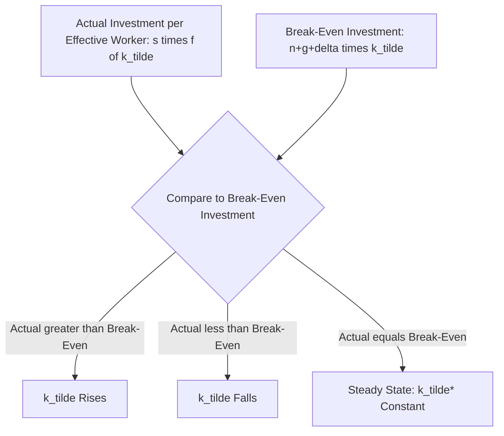
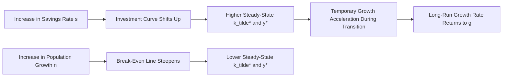
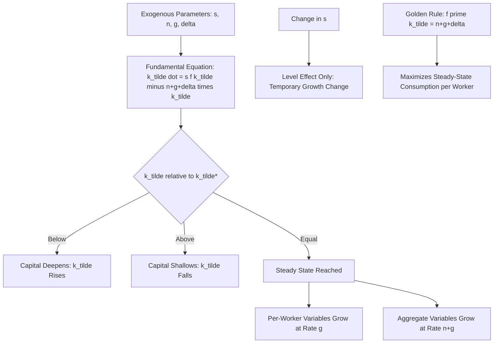

## Solow-Swan Neoclassical Growth Model

### Overview

The Solow-Swan model, developed independently by Robert Solow (1956) and Trevor Swan (1956), is the foundational neoclassical model of long-run economic growth. It explains how an economy's capital stock, output, and consumption evolve over time given exogenous rates of savings, population growth, and technological progress. The model's central contribution is demonstrating that capital accumulation by itself cannot sustain permanent growth in output per capita due to diminishing returns to capital, and that sustained long-run per capita growth requires exogenous technological progress. This model remains the essential building block for nearly all subsequent growth theory, including endogenous growth models.

**Key Points**

- The model treats the savings rate, population growth rate, and rate of technological progress as exogenous parameters, not explained within the model.
- The economy converges to a **steady state** in which capital per effective worker is constant.
- In steady state, output per worker grows only at the exogenous rate of technological progress—the model's central and most famous result.
- The model provides the theoretical foundation for the **convergence hypothesis** in cross-country growth empirics.

### Model Setup and Assumptions

The Solow-Swan model rests on the following core assumptions:

- **Aggregate production function**: $Y = F(K, AL)$, exhibiting constant returns to scale, positive and diminishing marginal products with respect to each input, and satisfying the **Inada conditions** ($\lim_{K \to 0} F_K = \infty$, $\lim_{K \to \infty} F_K = 0$), which ensure the model converges to an interior steady state.
- **Labor-augmenting (Harrod-neutral) technological progress**: Technology $A$ enters as an augmentation of labor, growing at exogenous rate $g$: $\dot{A}/A = g$.
- **Exogenous population/labor force growth**: $L$ grows at exogenous rate $n$: $\dot{L}/L = n$.
- **Constant savings rate**: A fixed fraction $s$ of output is saved and invested each period; the remainder $(1-s)Y$ is consumed.
- **Capital depreciation**: Capital depreciates at a constant rate $\delta$.
- **Closed economy, no government sector** (in the basic version): all output is either consumed or invested.

### Defining Variables in Effective Labor Units

To analyze the model, it is standard to express variables **per unit of effective labor** ($AL$), since this is the unit in which the model converges to a steady state (rather than per worker, which grows without bound due to technological progress).

Define:

$$\tilde{k} = \frac{K}{AL}, \quad \tilde{y} = \frac{Y}{AL} = f(\tilde{k})$$

Where $\tilde{k}$ is capital per effective worker and $\tilde{y}$ is output per effective worker, with $f(\tilde{k}) = F(\tilde{k}, 1)$ derived from the constant-returns-to-scale property of $F$.

### The Fundamental Dynamic Equation

The capital accumulation equation begins with the basic identity that the change in the capital stock equals gross investment minus depreciation:

$$\dot{K} = sY - \delta K$$

Converting to units of capital per effective worker $\tilde{k} = K/(AL)$ requires accounting for the growth of both $A$ and $L$. Using the quotient rule and the growth rates $\dot{A}/A = g$ and $\dot{L}/L = n$, this yields the **fundamental differential equation of the Solow-Swan model**:

$$\dot{\tilde{k}} = s f(\tilde{k}) - (n + g + \delta)\tilde{k}$$

This equation states that the change in capital per effective worker equals actual investment per effective worker, $sf(\tilde{k})$, minus the **break-even investment** required to keep $\tilde{k}$ constant, $(n+g+\delta)\tilde{k}$—the amount of investment needed to equip new workers (from population growth $n$), keep pace with technological progress (which effectively "dilutes" capital per effective worker at rate $g$), and replace depreciated capital (rate $\delta$).

### The Steady State

The **steady state** is defined as the level of capital per effective worker $\tilde{k}^*$ at which $\dot{\tilde{k}} = 0$:

$$s f(\tilde{k}^*) = (n+g+\delta)\tilde{k}^*$$

Below is an SVG diagram of the standard Solow diagram, showing the investment and break-even lines and their intersection at the steady state:

<svg xmlns="http://www.w3.org/2000/svg" viewBox="0 0 540 420">
<text x="270" y="25" font-size="16" font-weight="bold" text-anchor="middle" fill="#1a1a1a">Solow-Swan Steady State Diagram (svg_diagram)</text>
<line x1="80" y1="360" x2="490" y2="360" stroke="#333" stroke-width="2" />
<line x1="80" y1="360" x2="80" y2="50" stroke="#333" stroke-width="2" />
<text x="285" y="390" font-size="13" text-anchor="middle" fill="#333">Capital per Effective Worker (k̃)</text>
<text x="30" y="205" font-size="13" text-anchor="middle" fill="#333" transform="rotate(-90 30 205)">Output / Investment</text>
<path d="M 90 340 Q 200 180 300 110 Q 400 70 470 55" stroke="#0b6e99" stroke-width="2.5" fill="none" />
<text x="420" y="70" font-size="12" fill="#0b6e99" font-weight="bold">Output f(k̃)</text>
<path d="M 90 350 Q 200 260 300 200 Q 400 155 470 130" stroke="#27ae60" stroke-width="2.5" fill="none" />
<text x="400" y="175" font-size="12" fill="#27ae60" font-weight="bold">Investment s·f(k̃)</text>
<line x1="90" y1="340" x2="470" y2="80" stroke="#c0392b" stroke-width="2.5" />
<text x="435" y="95" font-size="12" fill="#c0392b" font-weight="bold">(n+g+δ)·k̃</text>
<circle cx="300" cy="200" r="5" fill="#1a1a1a" />
<line x1="300" y1="360" x2="300" y2="200" stroke="#666" stroke-width="1" stroke-dasharray="4,3" />
<text x="290" y="378" font-size="11" fill="#1a1a1a">k̃*</text>
<line x1="80" y1="200" x2="300" y2="200" stroke="#666" stroke-width="1" stroke-dasharray="4,3" />
<text x="85" y="195" font-size="10" fill="#1a1a1a">Consumption + Investment split at k̃*</text>
</svg>

**Stability**: The steady state $\tilde{k}^*$ is globally stable given the Inada conditions and diminishing returns: for $\tilde{k} < \tilde{k}^*$, investment exceeds break-even needs and $\tilde{k}$ rises; for $\tilde{k} > \tilde{k}^*$, the reverse holds. The economy converges to $\tilde{k}^*$ from any positive starting point.

### Growth Rates in the Steady State

Once the economy reaches $\tilde{k}^*$, the following growth rates characterize the steady-state balanced growth path:

| Variable | Steady-State Growth Rate |
| --- | --- |
| Capital per effective worker, $\tilde{k} = K/(AL)$ | $0$ |
| Output per effective worker, $\tilde{y} = Y/(AL)$ | $0$ |
| Capital per worker, $k = K/L$ | $g$ |
| Output per worker, $y = Y/L$ | $g$ |
| Total capital, $K$ | $n+g$ |
| Total output, $Y$ | $n+g$ |
| Total labor, $L$ | $n$ |

**This is the model's central result: in the long-run steady state, growth in output (and capital) per worker depends entirely on the exogenous rate of technological progress $g$.** The savings rate $s$, population growth rate $n$, and depreciation rate $\delta$ affect the *level* of the steady-state growth path (i.e., how much output per worker the economy achieves at each point in time) but have **no effect on the long-run growth rate** of output per worker.

### Comparative Statics: Effects of Parameter Changes

**An increase in the savings rate $s$**: Shifts the investment curve $sf(\tilde{k})$ upward, raising the steady-state level $\tilde{k}^*$ and hence the steady-state level of output per worker $y^*$. This produces a **temporary increase in the growth rate** during the transition to the new, higher steady-state path, but growth returns to rate $g$ once the new steady state is reached. The level effect is permanent; the growth rate effect is transitory.

**An increase in the population growth rate $n$**: Steepens the break-even line $(n+g+\delta)\tilde{k}$, lowering the steady-state level $\tilde{k}^*$ and thus lowering steady-state output per worker $y^*$—a higher population growth rate means more capital must be spread across more new workers, reducing capital per worker in steady state.

**An increase in the depreciation rate $\delta$**: Similarly steepens the break-even line, reducing $\tilde{k}^*$ and $y^*$, since more investment must be devoted to replacing worn-out capital.

### The Golden Rule Savings Rate

A natural normative question within the model is: what savings rate maximizes steady-state **consumption per worker**, rather than output per worker? Steady-state consumption per effective worker is:

$$\tilde{c}^* = f(\tilde{k}^*) - (n+g+\delta)\tilde{k}^*$$

Maximizing $\tilde{c}^*$ with respect to $\tilde{k}^*$ (treating the savings rate as adjustable to reach any feasible steady state) yields the **Golden Rule condition**:

$$f'(\tilde{k}_{gold}) = n + g + \delta$$

This condition states that at the Golden Rule capital stock, the marginal product of capital equals the effective depreciation rate $(n+g+\delta)$. Equivalently, since in a competitive economy $f'(\tilde{k}) = $ the interest rate/return to capital $r$, the Golden Rule condition can be restated as $r = n+g$, a benchmark frequently used in public finance and dynamic efficiency discussions.

**Key Points**

- If an economy's actual savings rate produces a capital stock **above** the Golden Rule level ($\tilde{k}^* > \tilde{k}_{gold}$), the economy is **dynamically inefficient**: it could increase consumption in *every* period (both now and in the future) by reducing the savings rate, since it is "over-accumulating" capital beyond what maximizes sustainable consumption.
- If actual capital is **below** the Golden Rule level, reaching the Golden Rule would require a period of reduced consumption (to raise savings and accumulate more capital) before consumption benefits are realized—a classic intertemporal tradeoff.
- The Golden Rule is a normative benchmark, not a description of what any particular constant savings rate will necessarily achieve; the basic Solow model does not endogenously select the Golden Rule savings rate, since $s$ is exogenous [Inference: whether real economies operate above, at, or below their Golden Rule level is an empirical question with mixed evidence across different studies and time periods].

### The Convergence Hypothesis

Because of diminishing returns to capital, the Solow-Swan model implies that **countries with less capital per effective worker (further below their steady state) should grow faster** than countries closer to their steady state, since the marginal product of capital—and hence the incentive to invest—is higher when $\tilde{k}$ is low.

**Absolute convergence**: The unconditional prediction that poorer countries (in terms of capital/output per worker) grow faster than richer countries. This receives little empirical support when tested across the full range of world economies, since countries differ substantially in their savings rates, population growth rates, and (in extended versions) human capital, meaning they have different steady states entirely.

**Conditional convergence**: The prediction that, after controlling for structural determinants of the steady state ($s$, $n$, human capital, and other factors), countries converge toward their own steady states at a common rate. This is much better supported empirically in cross-country growth regressions [Unverified—the estimated speed of conditional convergence and the appropriate control variables remain subjects of ongoing methodological debate in the empirical growth literature].

The model predicts a specific **speed of convergence**, derived from linearizing the fundamental dynamic equation around the steady state:

$$\dot{\tilde{k}} \approx -\lambda(\tilde{k} - \tilde{k}^*)$$

Where $\lambda = (1-\alpha)(n+g+\delta)$ in the Cobb-Douglas case (with $\alpha$ as capital's share), representing the rate at which the gap between current and steady-state capital per effective worker closes over time. Calibrated versions of the basic Solow model, using conventional parameter values, imply convergence speeds that are often found to be substantially faster than those estimated in empirical cross-country growth regressions—a discrepancy that motivated the human-capital-augmented Solow model discussed below [Unverified—the precise magnitude of this discrepancy depends on calibration choices and the specific empirical study].

### The Cobb-Douglas Special Case

Using the Cobb-Douglas production function $F(K, AL) = K^{\alpha}(AL)^{1-\alpha}$, so that $f(\tilde{k}) = \tilde{k}^{\alpha}$, the steady-state condition becomes:

$$s\tilde{k}^{*\alpha} = (n+g+\delta)\tilde{k}^*$$

Solving explicitly for the steady-state capital per effective worker:

$$\tilde{k}^* = \left(\frac{s}{n+g+\delta}\right)^{\frac{1}{1-\alpha}}$$

And steady-state output per effective worker:

$$\tilde{y}^* = \left(\frac{s}{n+g+\delta}\right)^{\frac{\alpha}{1-\alpha}}$$

**Example**

Suppose $\alpha = 0.3$, $s = 0.20$, $n = 0.01$, $g = 0.02$, $\delta = 0.05$.

$$n+g+\delta = 0.01 + 0.02 + 0.05 = 0.08$$

$$\tilde{k}^* = \left(\frac{0.20}{0.08}\right)^{\frac{1}{0.7}} = (2.5)^{1.4286} \approx 3.06$$

$$\tilde{y}^* = \left(\frac{0.20}{0.08}\right)^{\frac{0.3}{0.7}} = (2.5)^{0.4286} \approx 1.49$$

This gives the steady-state levels of capital and output per effective worker implied by this parameter combination; steady-state output per *worker* would then grow at rate $g = 2\%$ per year indefinitely along the balanced growth path.

### The Augmented Solow Model: Adding Human Capital

To address both the empirical convergence-speed puzzle and the model's limited ability to explain the magnitude of cross-country income differences, **Mankiw, Romer, and Weil (1992)** extended the basic model to include human capital $H$ as a third accumulable factor:

$$Y = K^{\alpha}H^{\beta}(AL)^{1-\alpha-\beta}$$

With human capital accumulated similarly to physical capital, via a fraction $s_H$ of output invested in education/training. This augmented model implies a slower predicted convergence speed (closer to empirical estimates) because the "effective" diminishing returns parameter becomes $(1-\alpha-\beta)$ rather than $(1-\alpha)$ alone—adding a second accumulable factor makes the aggregate production function closer to constant returns in the reproducible factors taken together, reducing the diminishing-returns force that drives rapid convergence, and the authors found this specification substantially improved the model's ability to fit cross-country income data [Unverified—this specific empirical claim, while influential, has been the subject of subsequent methodological critique in the literature].

### Limitations of the Solow-Swan Model

**Key Points**

- **Exogenous technological progress**: The model's central growth-driving parameter, $g$, is not explained within the model—it is simply assumed. This is the primary motivation for **endogenous growth theory** (Romer, Lucas, and others), which attempts to model the determinants of technological progress explicitly.
- **Exogenous savings rate**: The model does not derive $s$ from optimizing household behavior; the **Ramsey-Cass-Koopmans model** extends the framework by endogenizing the savings/consumption decision through intertemporal utility maximization, while preserving the same long-run steady-state growth results.
- **No role for institutions, trade, or policy** in the basic version, though many of these can be incorporated as extensions or reflected indirectly through their effects on $s$, $n$, or $g$.
- **Single good, single sector**: The basic model does not distinguish between capital goods and consumption goods sectors, or across industries, limiting its applicability to questions of structural change.

### Summary Diagram: Solow-Swan Model Logic

**Next Steps**

- The Ramsey-Cass-Koopmans model: endogenizing the savings rate via intertemporal utility maximization
- Endogenous growth theory as a response to the model's exogenous technology assumption
- The Mankiw-Romer-Weil augmented Solow model and human capital in growth accounting
- Dynamic efficiency and the Golden Rule in overlapping generations models
- Conditional convergence empirics: Barro-style cross-country growth regressions
- Calibrating the Solow model to match observed cross-country income and growth data
- Structural transformation and multi-sector extensions of the neoclassical growth framework