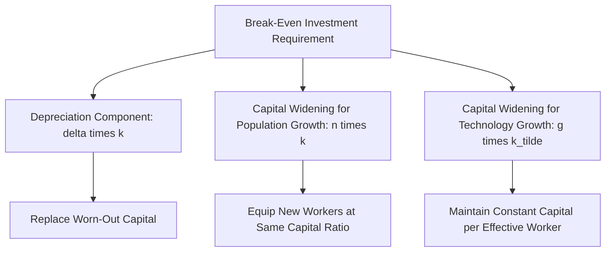
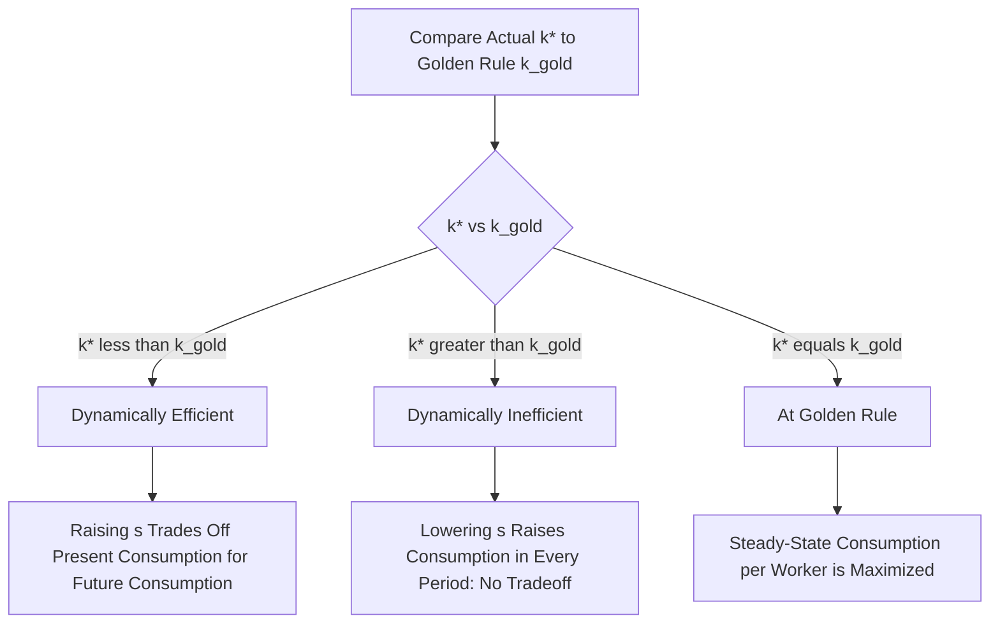

## Steady State, Capital Accumulation, and the Golden Rule

### Overview

This topic provides an in-depth treatment of the mechanics of capital accumulation within the Solow-Swan growth framework, focusing specifically on the determination of the steady state and the normative question of optimal capital accumulation embodied in the **Golden Rule**. While closely related to the broader Solow-Swan model, this treatment concentrates on the dynamics of the capital accumulation process itself, the mathematics of convergence to steady state, and the welfare economics of choosing among alternative steady states.

**Key Points**

- The steady state is a *positive* concept: it describes where the economy tends to settle given its exogenous parameters, regardless of whether that outcome is desirable.
- The Golden Rule is a *normative* concept: it identifies which steady state, among all those achievable by varying the savings rate, maximizes sustainable consumption per worker.
- An economy can be dynamically inefficient, over-accumulating capital beyond the Golden Rule level, in which case reducing savings would raise consumption in every period, both present and future.

### Capital Accumulation: The Basic Dynamic Process

Capital accumulation is governed by the fundamental identity that the net change in the capital stock equals gross investment minus depreciation:

$$\dot{K} = I - \delta K$$

In a closed economy with no government, saving equals investment, and if a constant fraction $s$ of output is saved:

$$I = sY$$

$$\dot{K} = sY - \delta K$$

To analyze this per worker (abstracting from technological progress momentarily, i.e., the basic Solow model without labor-augmenting technology), define $k = K/L$ and use the fact that $L$ grows at rate $n$. Applying the quotient rule to $k = K/L$:

$$\dot{k} = \frac{\dot{K}}{L} - \frac{K}{L}\cdot\frac{\dot{L}}{L} = \frac{\dot{K}}{L} - nk$$

Substituting $\dot{K} = sY - \delta K$ and dividing through by $L$, using $y = f(k) = Y/L$:

$$\dot{k} = sf(k) - \delta k - nk = sf(k) - (n+\delta)k$$

This is the **fundamental equation of capital accumulation** in the basic Solow model (without technological progress). It states that the change in capital per worker equals actual investment per worker minus the **break-even investment** required to maintain a constant capital-labor ratio in the face of population growth (which requires equipping new workers) and depreciation (which requires replacing worn-out capital).

### Interpreting the Break-Even Investment Term

The term $(n+\delta)k$ deserves careful interpretation, since it comprises two economically distinct effects:

- **$\delta k$**: The investment required to replace capital that wears out (depreciation) — necessary even in an economy with a completely stationary population.
- **$nk$**: The investment required to provide the *same* amount of capital per worker to new workers entering the labor force as population grows — sometimes referred to as **capital widening**, in contrast to **capital deepening** (an increase in capital per worker).

When labor-augmenting technological progress at rate $g$ is included (as in the full Solow-Swan model), a third term $gk$ (or more precisely $g\tilde{k}$ in effective-labor units) is added, reflecting the need for additional investment to keep capital per effective worker constant as the effectiveness of each worker rises via technology. The full fundamental equation (in effective-labor terms) becomes:

$$\dot{\tilde{k}} = sf(\tilde{k}) - (n+g+\delta)\tilde{k}$$

### The Steady State Condition

The **steady state** is the value $k^*$ (or $\tilde{k}^*$ with technology) at which capital per worker (or per effective worker) is unchanging, i.e., $\dot{k} = 0$:

$$sf(k^*) = (n+\delta)k^*$$

Geometrically, this is the intersection of the concave investment function $sf(k)$ with the linear break-even line $(n+\delta)k$, as illustrated in the standard Solow diagram.

<svg xmlns="http://www.w3.org/2000/svg" viewBox="0 0 540 420">
<text x="270" y="25" font-size="16" font-weight="bold" text-anchor="middle" fill="#1a1a1a">Capital Accumulation and Steady State (svg_diagram)</text>
<line x1="80" y1="360" x2="490" y2="360" stroke="#333" stroke-width="2" />
<line x1="80" y1="360" x2="80" y2="50" stroke="#333" stroke-width="2" />
<text x="285" y="390" font-size="13" text-anchor="middle" fill="#333">Capital per Worker (k)</text>
<text x="30" y="205" font-size="13" text-anchor="middle" fill="#333" transform="rotate(-90 30 205)">Output / Investment</text>
<path d="M 90 340 Q 200 180 300 110 Q 400 70 470 55" stroke="#0b6e99" stroke-width="2.5" fill="none" />
<text x="420" y="70" font-size="12" fill="#0b6e99" font-weight="bold">Output f(k)</text>
<path d="M 90 350 Q 200 260 300 200 Q 400 155 470 130" stroke="#27ae60" stroke-width="2.5" fill="none" />
<text x="400" y="175" font-size="12" fill="#27ae60" font-weight="bold">Investment s·f(k)</text>
<line x1="90" y1="340" x2="470" y2="80" stroke="#c0392b" stroke-width="2.5" />
<text x="435" y="95" font-size="12" fill="#c0392b" font-weight="bold">(n+δ)·k</text>
<circle cx="220" cy="255" r="4" fill="#8e44ad" />
<text x="150" y="280" font-size="10" fill="#8e44ad">k₀ &lt; k*: capital rising</text>
<circle cx="380" cy="145" r="4" fill="#e67e22" />
<text x="370" y="130" font-size="10" fill="#e67e22">k₁ &gt; k*: capital falling</text>
<circle cx="300" cy="200" r="5" fill="#1a1a1a" />
<line x1="300" y1="360" x2="300" y2="200" stroke="#666" stroke-width="1" stroke-dasharray="4,3" />
<text x="290" y="378" font-size="11" fill="#1a1a1a">k*</text>
</svg>

### Stability of the Steady State

The steady state $k^*$ is **globally stable** under the standard neoclassical assumptions (positive and diminishing marginal product of capital, satisfying the Inada conditions):

$$\dot{k} > 0 \text{ if } k < k^* \quad \text{(investment exceeds break-even)}$$

$$\dot{k} < 0 \text{ if } k > k^* \quad \text{(investment falls short of break-even)}$$

This stability follows from the concavity of $f(k)$: because $sf(k)$ is concave while $(n+\delta)k$ is linear, and both curves start at the origin (assuming $f(0)=0$), the investment curve lies above the break-even line for low $k$ and below it for high $k$, guaranteeing a unique positive crossing point (given standard Inada conditions ensuring the curves eventually cross) that is dynamically stable from either direction.

### Speed of Adjustment Toward the Steady State

The speed at which the economy converges to $k^*$ following a shock or parameter change can be characterized by linearizing $\dot{k} = sf(k) - (n+\delta)k$ around $k^*$:

$$\dot{k} \approx -\lambda(k - k^*), \quad \text{where } \lambda = (n+\delta) - sf'(k^*)$$

Using the steady-state condition $sf(k^*) = (n+\delta)k^*$ and the Cobb-Douglas case $f(k) = k^{\alpha}$, this simplifies to:

$$\lambda = (1-\alpha)(n+\delta)$$

This implies the economy closes a constant fraction $\lambda$ of the gap between current and steady-state capital each period—an exponential convergence pattern. A higher capital share $\alpha$ (closer to constant returns in capital alone) implies slower convergence, since diminishing returns to capital operate more weakly.

**Example**

If $\alpha = 0.33$, $n = 0.01$, and $\delta = 0.05$:

$$\lambda = (1 - 0.33)(0.01+0.05) = 0.67 \times 0.06 = 0.0402$$

This implies the economy closes approximately 4.02% of the remaining gap to its steady state each year—implying a "half-life" of convergence of roughly $\ln(2)/0.0402 \approx 17.2$ years. Calibrations of this type in the basic one-sector model often generate convergence speeds faster than those found in cross-country empirical growth regressions, a discrepancy addressed by extensions such as the human-capital-augmented Solow model [Unverified—both the calibrated convergence speed and its comparison to empirical estimates are sensitive to parameter choices and study-specific methodology].

### Golden Rule: The Consumption-Maximizing Steady State

While the steady state describes where the economy settles for a *given* savings rate, the **Golden Rule** asks a distinct, normative question: among all the steady states achievable by varying $s$, which one maximizes **steady-state consumption per worker**?

Steady-state consumption per worker is the residual of output after replacing/widening capital at the break-even rate:

$$c^* = f(k^*) - (n+\delta)k^*$$

To find the Golden Rule capital stock $k_{gold}$, maximize $c^*$ with respect to $k^*$ (treating $k^*$ as a free choice variable achievable via an appropriate choice of $s$):

$$\frac{dc^*}{dk^*} = f'(k^*) - (n+\delta) = 0$$

$$\Rightarrow f'(k_{gold}) = n+\delta$$

**This is the Golden Rule condition**: at the Golden Rule capital stock, the marginal product of capital equals the effective depreciation rate (the rate needed just to widen and replace capital to keep $k$ constant). In the full model with technological progress, this generalizes to $f'(\tilde{k}_{gold}) = n+g+\delta$.

Since in a competitive economy the interest rate equals the net marginal product of capital, $r = f'(k) - \delta$, the Golden Rule condition can be equivalently restated as:

$$r_{gold} = n \quad \text{(or } r_{gold} = n+g \text{ with technological progress)}$$

This is a widely cited benchmark in public finance and dynamic efficiency analysis: the Golden Rule holds when the real interest rate equals the (effective) growth rate of the economy.

<svg xmlns="http://www.w3.org/2000/svg" viewBox="0 0 540 420">
<text x="270" y="25" font-size="16" font-weight="bold" text-anchor="middle" fill="#1a1a1a">Golden Rule Capital Stock (svg_diagram)</text>
<line x1="80" y1="360" x2="490" y2="360" stroke="#333" stroke-width="2" />
<line x1="80" y1="360" x2="80" y2="50" stroke="#333" stroke-width="2" />
<text x="285" y="390" font-size="13" text-anchor="middle" fill="#333">Capital per Worker (k)</text>
<text x="30" y="205" font-size="13" text-anchor="middle" fill="#333" transform="rotate(-90 30 205)">Output</text>
<path d="M 90 340 Q 200 180 300 110 Q 400 70 470 55" stroke="#0b6e99" stroke-width="2.5" fill="none" />
<text x="420" y="70" font-size="12" fill="#0b6e99" font-weight="bold">Output f(k)</text>
<line x1="90" y1="340" x2="470" y2="80" stroke="#c0392b" stroke-width="2.5" />
<text x="440" y="95" font-size="12" fill="#c0392b" font-weight="bold">(n+δ)·k</text>
<circle cx="330" cy="115" r="5" fill="#1a1a1a" />
<line x1="330" y1="360" x2="330" y2="115" stroke="#666" stroke-width="1" stroke-dasharray="4,3" />
<text x="320" y="378" font-size="11" fill="#1a1a1a">k_gold</text>
<line x1="330" y1="115" x2="330" y2="163" stroke="#27ae60" stroke-width="6" />
<text x="340" y="140" font-size="11" fill="#27ae60" font-weight="bold">Max c* (vertical gap)</text>
<text x="345" y="105" font-size="10" fill="#333">Tangent slope f'(k_gold) = n+δ</text>
</svg>

**Key Points**

- Geometrically, the Golden Rule capital stock is where the **vertical distance between the output curve $f(k)$ and the break-even line $(n+\delta)k$ is maximized**—this vertical gap is precisely consumption per worker $c^*$.
- At $k_{gold}$, the tangent to $f(k)$ is parallel to the break-even line, i.e., the slopes are equal: $f'(k_{gold}) = n+\delta$.

### Dynamic Efficiency and Inefficiency

Comparing the actual steady-state capital stock $k^*$ (determined by the exogenous savings rate $s$) to the Golden Rule level $k_{gold}$ yields an important welfare distinction:

**Dynamically efficient** ($k^* < k_{gold}$, equivalently $s < s_{gold}$): Reaching the Golden Rule from below requires *increasing* the savings rate, which necessarily reduces consumption in the near term (since more output is diverted to investment) before yielding higher consumption once the new, higher steady state is reached. This represents a genuine intertemporal tradeoff—there is no way to raise consumption in every period simultaneously.

**Dynamically inefficient** ($k^* > k_{gold}$, equivalently $s > s_{gold}$): The economy has **over-accumulated** capital beyond the Golden Rule level. In this case, **reducing** the savings rate raises consumption immediately (since less output needs to be invested) *and* the economy converges to a new steady state with permanently higher consumption per worker $c^*$—consumption rises in *every* period along the transition, with no tradeoff at all.

**Key Points**

- Dynamic inefficiency represents a genuine Pareto improvement opportunity: an economy over-saving relative to the Golden Rule can make every generation better off by saving less, a striking result given that the basic model has no other distortions.
- Empirical assessments of whether real-world economies are dynamically efficient or inefficient typically compare the real interest rate/return on capital to the economy's growth rate ($r$ vs. $n+g$); most empirical evidence for major economies suggests $r > n+g$ historically, which is generally interpreted as evidence *against* dynamic inefficiency (i.e., most real economies appear to be dynamically efficient, below their Golden Rule level), though this comparison is sensitive to the measure of "the" interest rate used, the time period examined, and does not directly transfer to models with additional features such as uncertainty or overlapping generations with bequests [Unverified—dynamic efficiency assessment is an active empirical question and conclusions can be sensitive to methodology and time period].
- The overlapping generations (OLG) model of Diamond (1965) demonstrates that dynamic inefficiency is a theoretically real possibility (unlike in infinite-horizon representative-agent models such as Ramsey-Cass-Koopmans, where optimizing behavior with an operative bequest motive tends to rule out dynamic inefficiency), making the OLG framework a common setting for studying this phenomenon rigorously.

### The Model Does Not Self-Select the Golden Rule

An important and often-tested conceptual point: **the basic Solow-Swan model, with an exogenously fixed savings rate, has no mechanism that automatically drives the economy to the Golden Rule level of capital.** The savings rate $s$ is a free parameter; nothing within the model's mechanics pushes $s$ toward the specific value $s_{gold}$ that would deliver $k_{gold}$. Achieving the Golden Rule requires either a fortunate coincidence of parameters or deliberate policy intervention (e.g., adjusting national savings via fiscal policy).

This is a key motivation for the **Ramsey-Cass-Koopmans model**, which endogenizes the savings rate through household intertemporal utility maximization. In that framework, the optimal savings behavior of a representative household (discounting future utility at rate $\rho$) leads to a **modified Golden Rule** in the steady state:

$$f'(k^*) = n + \delta + \rho$$

Because household time preference $\rho > 0$ adds a positive wedge, the Ramsey model's optimal steady state features **less capital than the pure Golden Rule level** ($k^*_{Ramsey} < k_{gold}$)—households facing genuine impatience choose not to accumulate all the way to the consumption-maximizing steady state, since doing so would require sacrificing too much consumption in earlier periods relative to the utility gained later. This demonstrates that the Golden Rule, while a useful benchmark, is not necessarily the outcome of optimizing behavior once time preference is taken into account.

### Numerical Example: Locating the Golden Rule

Using the Cobb-Douglas case $f(k) = k^{\alpha}$, the Golden Rule condition $f'(k_{gold}) = n+\delta$ becomes:

$$\alpha k_{gold}^{\alpha - 1} = n+\delta$$

$$k_{gold} = \left(\frac{\alpha}{n+\delta}\right)^{\frac{1}{1-\alpha}}$$

**Example**

With $\alpha = 0.3$, $n = 0.01$, $\delta = 0.05$:

$$k_{gold} = \left(\frac{0.3}{0.06}\right)^{\frac{1}{0.7}} = (5)^{1.4286} \approx 8.28$$

The Golden Rule savings rate $s_{gold}$ that supports this capital stock as a steady state can be recovered from the steady-state condition $s_{gold}f(k_{gold}) = (n+\delta)k_{gold}$:

$$s_{gold} = \frac{(n+\delta)k_{gold}}{f(k_{gold})} = \frac{(n+\delta)k_{gold}^{1-\alpha}}{1} \cdot k_{gold}^{\alpha-1+1-\alpha}$$

More directly, in the Cobb-Douglas case it can be shown that $s_{gold} = \alpha$—**the Golden Rule savings rate exactly equals capital's share of output**. With $\alpha = 0.3$, the Golden Rule savings rate is $s_{gold} = 30\%$, a clean and widely cited special-case result of the Cobb-Douglas specification [Inference: this exact equality ($s_{gold} = \alpha$) is a property specific to the Cobb-Douglas functional form and does not generalize to arbitrary production functions].

### Summary Table: Steady State vs. Golden Rule

| Concept | Question Answered | Determined By | Nature |
| --- | --- | --- | --- |
| Steady state $k^*$ | Where does the economy settle given current $s$? | Exogenous $s$, $n$, $g$, $\delta$ | Positive (descriptive) |
| Golden Rule $k_{gold}$ | Which steady state maximizes consumption per worker? | $f'(k_{gold}) = n+g+\delta$ | Normative |
| Dynamic efficiency | Is the economy over- or under-saving relative to $k_{gold}$? | Comparison of $k^*$ to $k_{gold}$ (or $r$ to $n+g$) | Welfare assessment |
| Modified Golden Rule (Ramsey) | What steady state emerges from optimizing household behavior? | $f'(k^*) = n+\delta+\rho$ | Positive, with normative micro-foundation |

**Next Steps**

- The Ramsey-Cass-Koopmans model and the modified Golden Rule in full derivation
- Overlapping generations (OLG) models and the Diamond (1965) framework for dynamic inefficiency
- Empirical tests of dynamic efficiency: comparing real interest rates to GDP growth rates across countries
- Speed-of-convergence estimation in empirical cross-country growth regressions
- The relationship between the Golden Rule and optimal fiscal policy / public debt sustainability
- Extending the Golden Rule concept to models with human capital and multiple accumulable factors