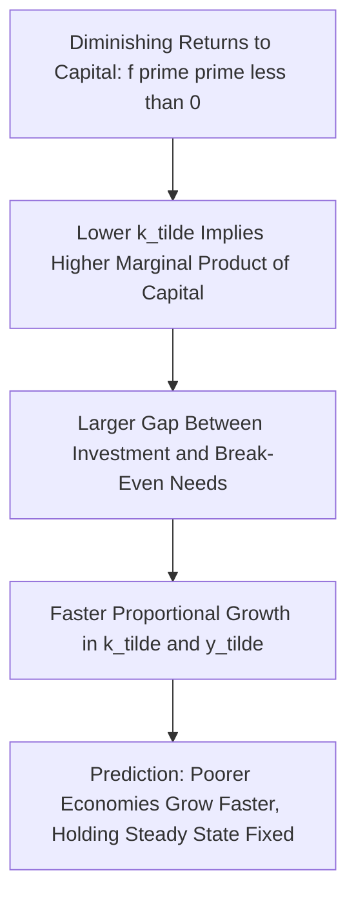
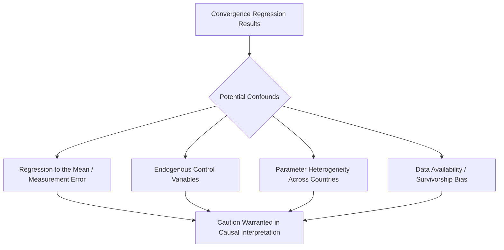
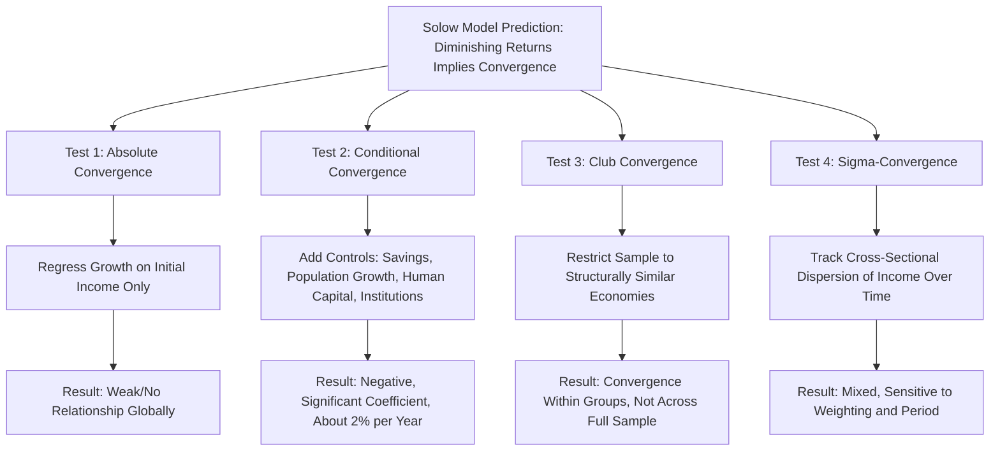

## Convergence Hypothesis: Absolute and Conditional Convergence

### Overview

The convergence hypothesis is one of the most extensively tested empirical predictions in growth economics, derived directly from the neoclassical Solow-Swan growth model's assumption of diminishing returns to capital. It asks a deceptively simple question: do poorer countries (or regions) tend to catch up with richer ones over time, or do income gaps persist or widen? The answer turns out to depend critically on what is held constant across the comparison, giving rise to the crucial distinction between **absolute (unconditional) convergence** and **conditional convergence**.

**Key Points**

- Absolute convergence predicts that poorer economies grow faster than richer ones unconditionally, and is strongly rejected in cross-country data covering the full range of world economies.
- Conditional convergence predicts that economies converge toward their *own* steady states, and receives substantially stronger empirical support once structural determinants of the steady state are controlled for.
- Club convergence describes an intermediate empirical pattern in which convergence occurs within groups of structurally similar economies but not across the full global sample.

### Theoretical Foundation: Why the Solow Model Predicts Convergence

The convergence prediction follows directly from the diminishing marginal product of capital assumption embedded in the neoclassical production function. Recall the fundamental Solow-Swan dynamic equation (in effective-labor units):

$$\dot{\tilde{k}} = sf(\tilde{k}) - (n+g+\delta)\tilde{k}$$

Because $f(\tilde{k})$ is concave ($f'' < 0$), economies with lower capital per effective worker $\tilde{k}$ have a **higher marginal product of capital** $f'(\tilde{k})$, and hence a larger gap between actual investment $sf(\tilde{k})$ and break-even investment relative to their distance from steady state. This generates faster proportional growth in capital, and hence output, per worker for economies further below their steady state.

Linearizing around the steady state yields the approximate convergence dynamics:

$$\frac{d\ln \tilde{y}}{dt} \approx \lambda \left(\ln \tilde{y}^* - \ln \tilde{y}\right)$$

Where $\lambda$ is the speed of convergence (as derived in the steady-state/Golden Rule treatment). This equation is the theoretical basis for empirical **convergence regressions**: an economy's growth rate should be a decreasing function of its current distance below its steady-state income level.

### Absolute (Unconditional) Convergence

**Absolute convergence** is the strong, unconditional version of the hypothesis: countries with lower initial income per capita should grow faster than countries with higher initial income, **regardless of** their savings rates, population growth rates, institutions, or other structural characteristics. This is the prediction that would hold if all countries shared an identical steady state and differed only in their initial capital stock.

The standard empirical test regresses the growth rate of income per capita on the (log of) initial income level alone:

$$g_{i} = a - b \ln(y_{i,0}) + \varepsilon_i$$

Where $g_i$ is the average growth rate of country $i$ over some period, $y_{i,0}$ is initial income per capita, and a negative and statistically significant coefficient $b > 0$ would support absolute convergence.

**Empirical finding**: When tested across the **full sample of world economies**, this regression typically produces a coefficient on initial income that is close to zero or even slightly positive—there is essentially **no evidence of absolute convergence** across the full range of rich and poor countries globally [Unverified—the precise coefficient estimates depend on the sample period, country sample, and data source, but the qualitative finding of little-to-no unconditional convergence across the full global sample is a widely replicated result in the empirical growth literature].

<svg xmlns="http://www.w3.org/2000/svg" viewBox="0 0 540 420">
<text x="270" y="25" font-size="16" font-weight="bold" text-anchor="middle" fill="#1a1a1a">Absolute Convergence: No Clear Pattern (svg_diagram)</text>
<line x1="80" y1="360" x2="490" y2="360" stroke="#333" stroke-width="2" />
<line x1="80" y1="360" x2="80" y2="50" stroke="#333" stroke-width="2" />
<text x="285" y="390" font-size="13" text-anchor="middle" fill="#333">Initial Income per Capita (log)</text>
<text x="30" y="205" font-size="13" text-anchor="middle" fill="#333" transform="rotate(-90 30 205)">Subsequent Growth Rate</text>
<circle cx="130" cy="290" r="4" fill="#0b6e99" />
<circle cx="160" cy="150" r="4" fill="#0b6e99" />
<circle cx="190" cy="320" r="4" fill="#0b6e99" />
<circle cx="220" cy="200" r="4" fill="#0b6e99" />
<circle cx="260" cy="280" r="4" fill="#0b6e99" />
<circle cx="290" cy="160" r="4" fill="#0b6e99" />
<circle cx="320" cy="240" r="4" fill="#0b6e99" />
<circle cx="350" cy="190" r="4" fill="#0b6e99" />
<circle cx="390" cy="270" r="4" fill="#0b6e99" />
<circle cx="420" cy="210" r="4" fill="#0b6e99" />
<circle cx="450" cy="230" r="4" fill="#0b6e99" />
<line x1="100" y1="245" x2="470" y2="235" stroke="#c0392b" stroke-width="2" stroke-dasharray="5,3" />
<text x="330" y="220" font-size="11" fill="#c0392b" font-weight="bold">Approximately Flat Fitted Line</text>
</svg>

**Key Points**

- The scattered, roughly flat relationship reflects the fact that poor and rich countries alike are found across the full range of subsequent growth outcomes—many poor countries stagnate or decline, while some grow rapidly, and rich countries show a similarly wide range of outcomes.
- This finding does not contradict the Solow model itself—it reflects the fact that countries have genuinely **different steady states** (different savings rates, population growth rates, institutions, and technology levels), so there is no reason to expect them to converge to a common income level.

### Conditional Convergence

**Conditional convergence** refines the hypothesis by asking whether countries converge toward their **own** steady states, once the structural determinants of those steady states are held constant (via statistical controls). The augmented regression takes the form:

$$g_i = a - b\ln(y_{i,0}) + \sum_j c_j X_{ij} + \varepsilon_i$$

Where $X_{ij}$ represents a vector of control variables proxying for steady-state determinants, typically including:

- The investment/savings rate
- Population growth rate
- Measures of human capital (average years of schooling, literacy rates)
- Institutional quality indicators (rule of law, property rights indices)
- Government policy variables (trade openness, fiscal policy stance)

**Empirical finding**: Once these steady-state determinants are controlled for, cross-country growth regressions (most famously in the tradition of **Robert Barro's** extensive empirical growth work beginning in the late 1980s and early 1990s) typically find a **statistically significant negative coefficient** on initial income, supporting conditional convergence—countries do appear to converge toward their own, structurally-determined steady states [Unverified—the magnitude of the convergence coefficient and the appropriate set of control variables remain the subject of extensive methodological debate, and results can be sensitive to model specification, sample period, and choice of controls].

### The Speed of Conditional Convergence: The "2% Puzzle"

A striking and much-discussed empirical regularity from the conditional convergence literature is that estimated convergence speeds across a wide range of countries, regions, and U.S. states cluster remarkably close to **2% per year**—implying that roughly half of the gap between a country's current income and its steady-state income closes approximately every 35 years (a "half-life" calculated as $\ln(2)/0.02 \approx 35$ years).

**Key Points**

- This approximately 2% convergence speed is notably **slower** than the speed implied by calibrating the basic one-sector Solow model with standard parameter values (typically implying convergence speeds of 4–6% per year or faster in simple calibrations), a discrepancy sometimes called the "convergence speed puzzle" [Unverified—the precise magnitude of both the empirical estimate and the calibrated benchmark vary across studies, and this remains an area of ongoing methodological discussion].
- This discrepancy motivated the **Mankiw-Romer-Weil (1992)** augmented Solow model incorporating human capital, since adding a second reproducible factor (alongside physical capital) reduces the effective degree of diminishing returns in the model, slowing the theoretically predicted convergence speed to better match the empirically observed rate.
- Some researchers have questioned whether the remarkable consistency of the ~2% estimate across very different contexts (countries, U.S. states, European regions, Japanese prefectures) might partly reflect common econometric biases (such as measurement error or model misspecification) rather than a genuinely universal structural parameter [Unverified—this is a methodological critique raised in the literature, not a settled conclusion].

### Club Convergence

An important intermediate empirical pattern, distinct from both absolute and conditional convergence, is **club convergence**: the observation that convergence appears to occur *within* certain groups of economies that share broadly similar structural characteristics (institutions, initial conditions, or policy regimes), even though it fails to hold across the full global sample.

For example, studies have found evidence consistent with convergence among:

- OECD/advanced economies as a group
- U.S. states and regions
- European Union member states, particularly in the pre-enlargement era

But not when these groups are pooled together with the full set of low-income developing economies globally.

**Key Points**

- Club convergence is theoretically consistent with models featuring **multiple steady states** (as can arise, for example, in models with poverty traps, threshold effects in human capital accumulation, or increasing-returns technology adoption dynamics), where economies starting within the "basin of attraction" of a high-income steady state converge to it, while economies starting below some critical threshold converge instead to a low-income steady state or stagnate.
- This pattern suggests that the appropriate comparison group matters greatly for convergence testing—pooling structurally dissimilar economies together in a single regression can mask convergence dynamics that are genuinely present within more homogeneous subgroups [Inference: the appropriate way to define "structurally similar" clubs, and whether club convergence reflects genuine multiple equilibria versus simply omitted heteroskedastic steady-state determinants, remains debated in the literature].

### Sigma-Convergence vs. Beta-Convergence

The convergence literature distinguishes two related but conceptually distinct notions:

**Beta-convergence** ($\beta$-convergence): The regression-based concept described above—a negative relationship between initial income and subsequent growth, indicating that poorer economies grow faster (either absolutely or conditionally). This is a **necessary but not sufficient** condition for the cross-sectional dispersion of income to shrink over time.

**Sigma-convergence** ($\sigma$-convergence): A direct measure of whether the **cross-sectional dispersion** (e.g., the standard deviation or variance of log income per capita) across countries or regions is declining over time:

$$\sigma_t = \text{std. dev.}(\ln y_{i,t})$$

Sigma-convergence occurs if $\sigma_t$ declines over time; sigma-divergence occurs if it rises.

**Key Points**

- Beta-convergence does **not** automatically imply sigma-convergence: it is theoretically and empirically possible for poorer economies to grow faster on average (beta-convergence, reducing dispersion) while simultaneously experiencing large idiosyncratic shocks that increase the variance of outcomes (working against sigma-convergence)—the two forces can offset each other.
- Empirical studies of global income dispersion have found mixed patterns of sigma-convergence and sigma-divergence across different time periods and country samples, with some evidence of increased dispersion (divergence) during periods such as the mid-20th century, and different patterns in subsequent decades as populous, previously low-income countries (such as China and India) experienced rapid growth [Unverified—precise sigma-convergence/divergence patterns depend heavily on the population-weighting of the analysis, the time period, and the specific measure of dispersion used].
- Population-weighted measures of global income dispersion (which give more weight to populous countries like China and India) often show different convergence patterns than simple unweighted cross-country measures, since rapid growth in a small number of very populous countries can substantially reduce population-weighted dispersion even if the majority of individual countries show no such pattern [Unverified—this distinction is well-documented in the literature but specific quantitative patterns are sensitive to methodology and time period].

### Econometric Challenges in Testing Convergence

Convergence regressions face several well-documented methodological challenges:

- **Galton's fallacy / regression to the mean**: A negative relationship between initial income and subsequent growth can arise mechanically from measurement error or transitory shocks to income, even absent any genuine structural convergence process—this is analogous to the statistical phenomenon Francis Galton originally identified regarding the heights of parents and children.
- **Endogeneity of control variables**: Many of the control variables used in conditional convergence regressions (investment rates, institutional quality, human capital) are themselves partly determined by the same factors that determine growth, raising concerns about reverse causality and omitted variable bias.
- **Parameter heterogeneity**: Pooled cross-country regressions implicitly assume that the convergence coefficient $\beta$ and the effects of control variables are identical across all countries in the sample, an assumption that may not hold given the vast heterogeneity of economies included in typical global samples.
- **Survivorship and data availability bias**: Historical cross-country growth datasets may disproportionately include countries with more reliable statistical systems, which could correlate with other growth-relevant characteristics.

### Convergence at the Regional/Sub-National Level

Convergence has also been extensively studied at the sub-national level, where the assumption of similar institutions, currency, and policy environment (satisfied automatically within a single country) helps address some of the confounding factors present in cross-country studies:

- **U.S. states**: Classic studies (e.g., Barro and Sala-i-Martin) found evidence of convergence among U.S. states at a rate consistent with the broader ~2% cross-country finding, in a setting where institutional and policy heterogeneity is far more limited than in cross-country comparisons.
- **European regions**: Similar convergence patterns have been documented among regions within the European Union, particularly among founding and early-accession member states, though patterns following EU enlargement to include lower-income Eastern European economies have been more heavily studied and debated.

**Key Points**

- Sub-national convergence studies are often viewed as providing a cleaner test of the underlying neoclassical convergence mechanism, since institutional and policy differences (a major confound in cross-country work) are minimized within a single country or currency union, though other confounds such as internal migration patterns remain relevant considerations.

### Summary Table: Types of Convergence

| Concept | Definition | Empirical Support | Key Reference |
| --- | --- | --- | --- |
| Absolute (unconditional) convergence | Poor countries grow faster than rich countries, no controls | Weak/absent across full global sample | Baumol (1986), subsequent critiques |
| Conditional convergence | Countries converge to own steady states, controlling for structural determinants | Reasonably strong support | Barro (1991), Barro and Sala-i-Martin (1992) |
| Club convergence | Convergence within groups of structurally similar economies | Mixed but documented in several contexts (OECD, US states) | Various regional studies |
| Beta-convergence | Negative relationship between initial income and growth rate | Present conditionally, largely absent unconditionally | Standard regression framework |
| Sigma-convergence | Declining cross-sectional dispersion of income over time | Mixed; depends on weighting and time period | Quah (1996) and related distributional dynamics literature |

### Distributional Dynamics: An Alternative Approach

Danny Quah and others proposed studying the **entire distribution** of relative country incomes over time, rather than relying solely on regression-based convergence tests, using tools such as Markov transition matrices to track how countries move between relative income categories (e.g., poor, middle-income, rich) over multi-decade periods. This approach highlighted the phenomenon of a **"twin peaks"** distribution—a tendency for the world income distribution to polarize into clusters of rich and poor countries with a thinning middle, rather than converging to a single peak (which pure convergence would imply) or maintaining a stable single-peaked distribution [Unverified—the twin-peaks characterization and its persistence in more recent data, particularly given rapid growth in several large middle-income economies since Quah's original work, is a matter of ongoing empirical assessment].

### Summary Diagram: The Convergence Testing Framework

**Next Steps**

- Barro-style cross-country growth regressions: methodology and key findings in detail
- The Mankiw-Romer-Weil augmented Solow model as a response to the convergence speed puzzle
- Poverty traps and multiple equilibria models explaining club convergence
- Quah's distributional dynamics approach and Markov transition matrix methods
- Sub-national convergence studies: U.S. states, European regions, and within-country analyses
- Econometric critiques of convergence regressions: Galton's fallacy and parameter heterogeneity
- Recent global income convergence patterns given rapid growth in large emerging economies (China, India) since the 1990s