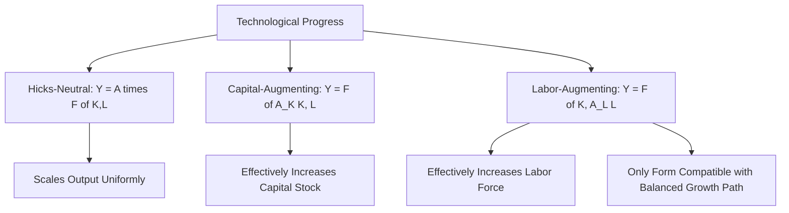
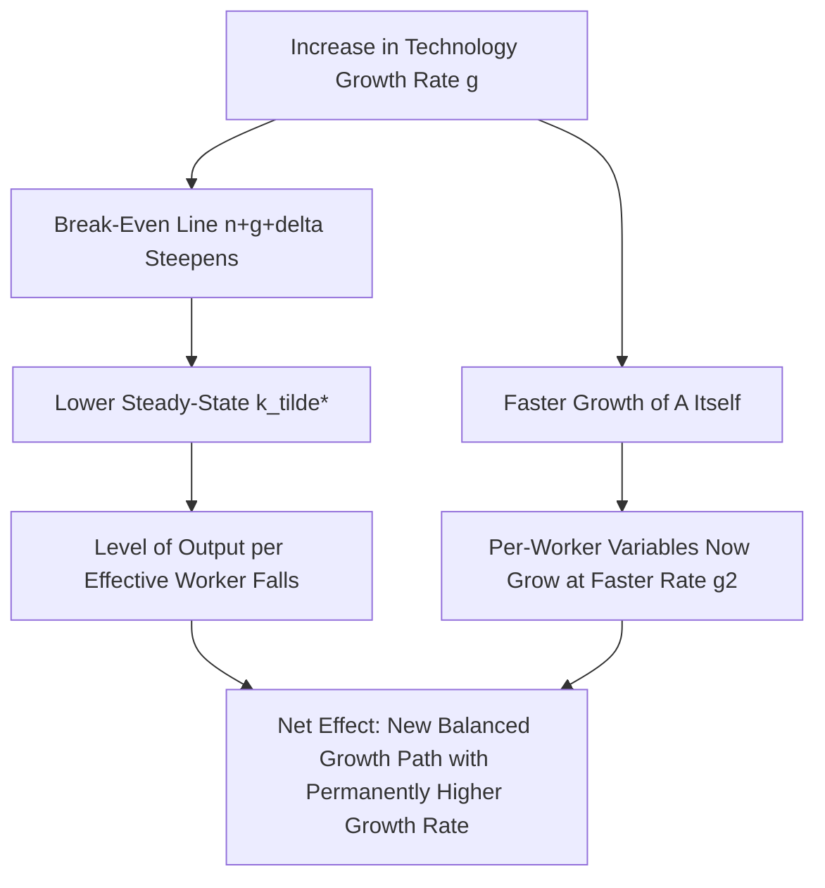
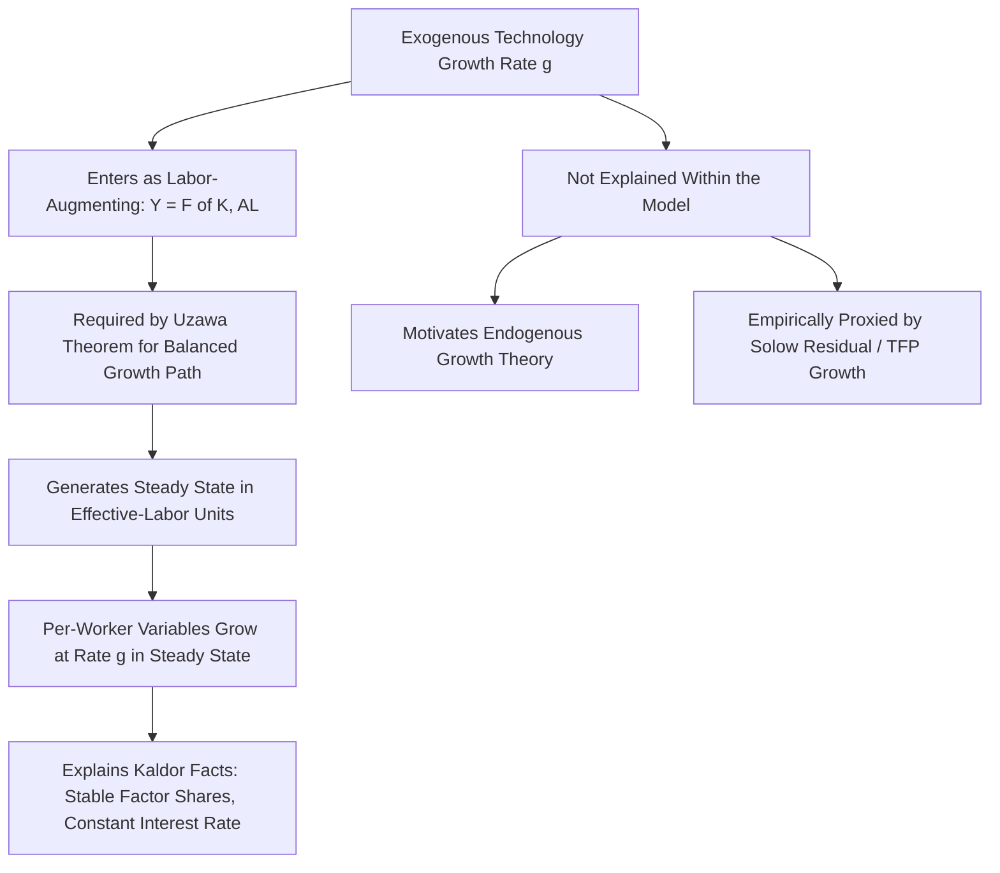

## Exogenous Technological Progress in the Solow Model

### Overview

Exogenous technological progress is the mechanism the Solow-Swan model relies upon to generate sustained long-run growth in output per worker. Without it, the model predicts that per capita growth eventually ceases as the economy converges to a steady state with diminishing returns to capital fully offsetting investment. This topic examines in detail how technology is formally incorporated into the model, the different functional forms technological progress can take (labor-augmenting, capital-augmenting, and Hicks-neutral), why labor-augmenting technology is uniquely compatible with a balanced growth path, and the model's core limitation: it assumes rather than explains the ultimate source of productivity growth.

**Key Points**

- The term "exogenous" means the rate of technological progress, $g$, is a parameter set outside the model, not derived from any economic decision-making process within it.
- Only labor-augmenting (Harrod-neutral) technological progress is consistent with a steady state exhibiting constant factor shares—a mathematical requirement known as the Uzawa Balanced Growth Theorem.
- This assumption is the model's principal shortcoming and the central motivation for endogenous growth theory.

### Three Forms of Technological Progress

Technological progress can enter an aggregate production function in three formally distinct ways, each with different implications for the model's steady-state behavior:

**Hicks-neutral (or "disembodied") technological progress**: Technology multiplies overall output for any given combination of inputs, without altering the relative marginal productivity of capital versus labor:

$$Y = A \cdot F(K, L)$$

**Capital-augmenting technological progress**: Technology effectively increases the productive capacity of the existing capital stock, as if more capital were available:

$$Y = F(A_K K, L)$$

**Labor-augmenting (Harrod-neutral) technological progress**: Technology effectively increases the productive capacity of labor, as if the labor force were more numerous or skilled:

$$Y = F(K, A_L L)$$

### Why Labor-Augmenting Technology Is Required for a Steady State

A central and somewhat subtle theoretical result, known as the **Uzawa Balanced Growth Theorem** (Uzawa, 1961), establishes that a neoclassical growth model can exhibit a **balanced growth path**—one along which output, capital, and consumption all grow at constant (though not necessarily equal) rates, and factor income shares remain constant—**if and only if** technological progress can be represented as purely labor-augmenting (Harrod-neutral), except in the special case of a Cobb-Douglas production function, where all three forms are mathematically equivalent.

**Intuition for why capital-augmenting or Hicks-neutral progress (in a general, non-Cobb-Douglas production function) is incompatible with a steady state**: If technology instead augmented capital, the effective capital-labor ratio would grow without bound relative to labor even if the physical capital-labor ratio $K/L$ stabilized, since $A_K K/L$ keeps rising with $A_K$. Because capital and labor are generally not perfect substitutes, this changing effective factor ratio would cause the capital share of income to drift continuously rather than settle at a constant value—violating the empirically observed **Kaldor facts** (stylized facts about growth, discussed below) that factor shares remain roughly stable over long periods.

**Key Points**

- This is why the Solow-Swan model, as standardly presented, specifies technology as labor-augmenting ($Y = F(K, AL)$) rather than in any other form—it is the form required to generate a steady state consistent with stable factor income shares, a well-documented empirical regularity, at least for the Solow model in its non-Cobb-Douglas generality.
- With a Cobb-Douglas production function specifically, $Y = K^{\alpha}(AL)^{1-\alpha}$ can be algebraically rewritten as $Y = A^{1-\alpha}K^{\alpha}L^{1-\alpha}$, showing that Hicks-neutral progress at rate $(1-\alpha)g$ is mathematically equivalent to labor-augmenting progress at rate $g$ in this special functional form—the distinction between the three forms of technology only matters when the production function is not Cobb-Douglas.

### Kaldor's Stylized Facts and the Case for Labor-Augmenting Technology

Nicholas Kaldor (1961) documented a set of long-run empirical regularities in developed economies that any satisfactory growth model should be able to replicate, several of which directly motivate the labor-augmenting technology assumption:

- Output per worker grows over time at a roughly constant rate (no tendency to accelerate or decelerate indefinitely)
- Capital per worker grows over time at a roughly constant rate
- The capital-output ratio $K/Y$ is roughly constant over long periods
- The return to capital (the real interest rate) is roughly constant over long periods
- The shares of capital and labor in national income are roughly constant over long periods
- The growth rate of output per worker varies substantially across countries

**Key Points**

- A stable capital-output ratio combined with a stable interest rate together imply, via the profit-maximization condition $r = f'(k) - \delta$, that the model must generate a genuine steady state in $\tilde{k} = K/(AL)$, which combined with the Uzawa theorem points to labor-augmenting technology as the theoretically required form.
- These stylized facts, while broadly influential in shaping growth theory for decades, are acknowledged to be approximations rather than universal laws—labor's share of income, in particular, has shown measurable decline in several advanced economies since roughly the early 2000s, a departure from Kaldor's stable-shares fact that has generated substantial recent research interest [Unverified—the causes and permanence of this labor share decline remain actively debated in the literature].

### Incorporating Labor-Augmenting Technology into the Model

With labor-augmenting technology $A$ growing at exogenous rate $g$ ($\dot{A}/A = g$), the production function is:

$$Y = F(K, AL)$$

Defining **effective labor** as $\hat{L} = AL$, and capital per effective worker $\tilde{k} = K/(AL)$, output per effective worker $\tilde{y} = Y/(AL) = f(\tilde{k})$, the fundamental Solow equation becomes:

$$\dot{\tilde{k}} = sf(\tilde{k}) - (n+g+\delta)\tilde{k}$$

The term $g$ appears alongside $n$ and $\delta$ in the break-even investment requirement because, even with a constant physical capital stock per worker $K/L$, the *effective* capital-labor ratio $\tilde{k} = K/(AL)$ would decline as $A$ grows—additional investment is required merely to keep $\tilde{k}$ constant as technology advances, analogous to how additional investment is needed to keep capital per worker constant as the population grows.

### The Balanced Growth Path

In the steady state ($\dot{\tilde{k}}=0$), the economy is on a **balanced growth path** (BGP)—a trajectory along which all key per-worker variables grow at constant, related rates:

| Variable | Definition | Steady-State Growth Rate |
| --- | --- | --- |
| $A$ | Technology level | $g$ |
| $\tilde{k} = K/(AL)$ | Capital per effective worker | $0$ |
| $k = K/L$ | Capital per worker | $g$ |
| $\tilde{y} = Y/(AL)$ | Output per effective worker | $0$ |
| $y = Y/L$ | Output per worker | $g$ |
| $c = C/L$ | Consumption per worker | $g$ |
| $w$ | Real wage (marginal product of labor) | $g$ |
| $r$ | Real interest rate (marginal product of capital minus depreciation) | $0$ |
| $Y$ | Total output | $n+g$ |
| $K$ | Total capital stock | $n+g$ |

**Key Points**

- The real wage grows at the same rate as technology, $g$, because in a competitive labor market the wage equals labor's marginal product, which rises directly with $A$.
- The real interest rate (return to capital) is **constant** in steady state ($0\%$ growth), consistent with the Kaldor fact of a roughly stable long-run return to capital—this is a direct consequence of $\tilde{k}$ being constant, since $r = f'(\tilde{k}) - \delta$ depends only on the (constant) effective capital-labor ratio.
- This differential pattern—wages rising with technology, the interest rate remaining constant—is a hallmark prediction of the labor-augmenting technology specification and would not emerge cleanly under capital-augmenting or Hicks-neutral technology in a non-Cobb-Douglas setting.

<svg xmlns="http://www.w3.org/2000/svg" viewBox="0 0 540 400">
<text x="270" y="25" font-size="16" font-weight="bold" text-anchor="middle" fill="#1a1a1a">Balanced Growth Path Variables Over Time (svg_diagram)</text>
<line x1="80" y1="340" x2="490" y2="340" stroke="#333" stroke-width="2" />
<line x1="80" y1="340" x2="80" y2="50" stroke="#333" stroke-width="2" />
<text x="285" y="370" font-size="13" text-anchor="middle" fill="#333">Time</text>
<text x="30" y="200" font-size="13" text-anchor="middle" fill="#333" transform="rotate(-90 30 200)">Log Level</text>
<line x1="90" y1="310" x2="470" y2="90" stroke="#0b6e99" stroke-width="2.5" />
<text x="380" y="105" font-size="12" fill="#0b6e99" font-weight="bold">Output per Worker (slope = g)</text>
<line x1="90" y1="320" x2="470" y2="100" stroke="#27ae60" stroke-width="2.5" stroke-dasharray="6,3" />
<text x="380" y="135" font-size="12" fill="#27ae60" font-weight="bold">Capital per Worker (slope = g)</text>
<line x1="90" y1="260" x2="470" y2="260" stroke="#c0392b" stroke-width="2.5" />
<text x="400" y="250" font-size="12" fill="#c0392b" font-weight="bold">Interest Rate (constant)</text>
<line x1="90" y1="180" x2="470" y2="180" stroke="#8e44ad" stroke-width="2" stroke-dasharray="3,3" />
<text x="380" y="170" font-size="12" fill="#8e44ad" font-weight="bold">Capital-Output Ratio (constant)</text>
</svg>

### Comparative Statics: An Increase in the Growth Rate of Technology

Distinct from a one-time increase in the *level* of technology, consider a permanent increase in the **growth rate** $g$ itself (e.g., $g$ rises from $g_1$ to $g_2 > g_1$):

- The break-even line $(n+g+\delta)\tilde{k}$ becomes steeper, since a larger $g$ requires more investment merely to keep $\tilde{k}$ constant as effective labor grows faster.
- The new steady-state level of capital per effective worker $\tilde{k}^*$ **falls** (since more investment is now devoted to widening capital to keep pace with faster technological growth, leaving a lower level sustainable in effective-labor terms).
- However, capital and output **per worker** now grow at the new, faster rate $g_2$ along the new balanced growth path—despite the lower $\tilde{k}^*$, actual per-worker variables grow faster because $A$ itself is now growing more quickly.

This illustrates an important conceptual distinction: a change in the *rate* of technological progress has a genuine effect on the long-run growth rate of per-worker variables (unlike a change in the savings rate, which only affects levels), precisely because $g$ enters the model as the source of sustained growth itself.

### The Exogeneity Problem: What the Model Does Not Explain

The single most important conceptual limitation of the Solow-Swan treatment of technology is captured by the word "exogenous" itself: the model provides **no economic explanation** for why $A$ grows, what determines the magnitude of $g$, or why $g$ might differ across countries or time periods. Technological progress is simply assumed to occur, at a constant rate, as if it fell like manna from heaven.

**Key Points**

- This is not merely a simplifying assumption of secondary importance—since $g$ is the *sole* driver of sustained long-run per capita growth in the model, the model's central quantitative prediction (the long-run growth rate) is entirely unexplained by the model's own mechanics.
- This limitation directly motivated the development of **endogenous growth theory** beginning in the mid-1980s (Romer, Lucas, and others), which sought to model the determinants of technological progress—R&D investment, human capital accumulation, knowledge spillovers—as outcomes of economic decisions within the model, rather than as an exogenous parameter.
- Even accepting the model's structure, cross-country differences in $g$ (which the Solow model treats as a free parameter that can simply be assigned different values for different countries) leave open the deeper question of what structural, institutional, or policy differences might cause technology to grow at different rates in different places—a question the augmented and endogenous growth literatures attempt to address (see companion topics on sources of growth and endogenous growth theory).

### Measuring Technological Progress Empirically: Connection to the Solow Residual

Empirically, the labor-augmenting technology parameter $A$ (or more precisely, its growth rate $g$) is not directly observable and is typically inferred using **growth accounting**, where it is closely related to (though not always identical to) the TFP growth residual discussed in the companion growth accounting topic. In the Cobb-Douglas case specifically, since Hicks-neutral and labor-augmenting technology are mathematically equivalent representations, the growth-accounting-derived Hicks-neutral TFP growth rate $\dot{A}_{Hicks}/A_{Hicks}$ relates to the labor-augmenting rate $g$ via:

$$g = \frac{1}{1-\alpha}\cdot\frac{\dot{A}_{Hicks}}{A_{Hicks}}$$

This relationship reflects the algebraic equivalence $Y = A_{Hicks}K^{\alpha}L^{1-\alpha} = K^{\alpha}(A_{Hicks}^{1/(1-\alpha)}L)^{1-\alpha}$ shown earlier, and underscores that empirically estimated Solow residuals and the theoretical labor-augmenting technology growth rate are closely linked but require care in interpretation, particularly outside the Cobb-Douglas case where the equivalence breaks down.

### Summary Table: The Three Forms of Technology Compared

| Property | Hicks-Neutral | Capital-Augmenting | Labor-Augmenting |
| --- | --- | --- | --- |
| Functional form | $Y = AF(K,L)$ | $Y = F(A_K K, L)$ | $Y = F(K, AL)$ |
| Compatible with steady state (general $F$) | No (except Cobb-Douglas) | No (except Cobb-Douglas) | Yes |
| Compatible with constant factor shares | No (except Cobb-Douglas) | No (except Cobb-Douglas) | Yes |
| Standard Solow model specification | Special case only | Not used | Standard specification |
| Equivalent to labor-augmenting under Cobb-Douglas? | Yes, at rate $g/(1-\alpha)$ relationship | Not typically used this way | — |

### Summary Diagram: Role of Exogenous Technology in the Solow Framework

**Next Steps**

- The Uzawa Balanced Growth Theorem: formal statement and proof sketch
- Kaldor's stylized facts and recent evidence on declining labor income shares
- Endogenous growth theory: modeling the determinants of $g$ within Romer (1990) and related frameworks
- The relationship between growth accounting's Solow residual and the theoretical labor-augmenting technology parameter
- Directed technical change and endogenous choice of capital- vs. labor-augmenting innovation (Acemoglu's work)
- Skill-biased technological change as a departure from simple factor-augmenting specifications