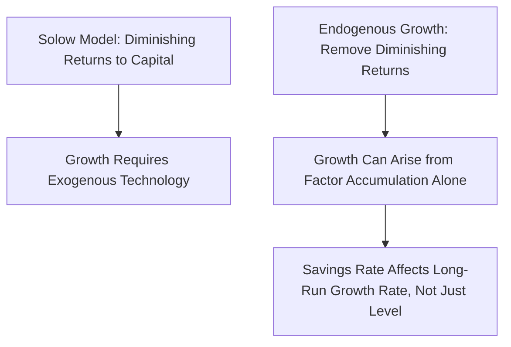
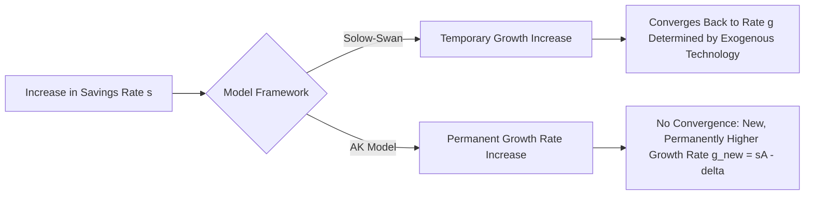
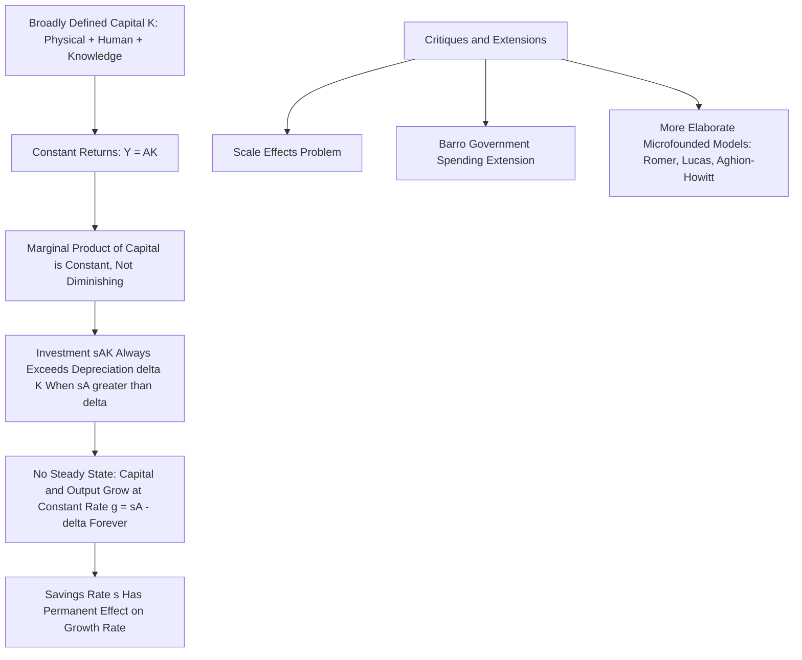

## Endogenous Growth Theory and the AK Model

### Overview

Endogenous growth theory emerged in the mid-1980s as a direct response to the central limitation of the Solow-Swan model: its reliance on an exogenous, unexplained rate of technological progress as the sole driver of sustained long-run growth. Endogenous growth models instead attempt to explain the sources of sustained growth from *within* the economic model itself, typically by removing the assumption of diminishing returns to the reproducible factors of production. The **AK model** is the simplest and most tractable endogenous growth framework, serving as the entry point into this broader research program associated with Paul Romer, Robert Lucas, Robert Barro, and others.

**Key Points**

- Endogenous growth theory seeks to explain *why* economies grow, not merely to describe the mechanics of convergence to an exogenously given growth rate.
- The AK model achieves sustained growth by eliminating diminishing returns to capital, broadly defined to include human capital and knowledge alongside physical capital.
- Unlike the Solow model, the AK model implies that policy variables such as the savings rate can have **permanent effects on the growth rate**, not just on the level of output.

### Motivation: The Limits of the Solow Model

Recall that in the Solow-Swan model, sustained per capita growth requires exogenous, labor-augmenting technological progress at rate $g$; the savings rate $s$ affects only the *level* of the balanced growth path, not its long-run slope. This result follows directly from the assumption of **diminishing marginal returns to capital**: as capital per effective worker rises, its marginal product falls, eventually driving net investment to zero in the absence of technological progress.

Endogenous growth theorists asked: what if this diminishing-returns assumption does not hold for a sufficiently broadly defined concept of "capital"? If accumulable factors as a whole do not experience diminishing returns, sustained growth could arise from **factor accumulation itself**, without needing to invoke unexplained technological progress.

### The AK Production Function

The simplest endogenous growth model replaces the neoclassical production function with a **linear** production function in a broadly defined capital stock:

$$Y = AK$$

Where $A > 0$ is a constant productivity parameter, and $K$ represents a **broad concept of capital**—typically interpreted as encompassing not only physical capital but also human capital, knowledge, infrastructure, and other reproducible factors of production, all aggregated into a single accumulable stock.

**Key Points**

- The critical feature of this specification is that the marginal product of capital, $\partial Y/\partial K = A$, is **constant**, not diminishing—there are no Inada conditions requiring $f'(K) \to 0$ as $K \to \infty$.
- This constant marginal product is what allows sustained growth: as long as $A$ exceeds a threshold determined by the savings rate and depreciation, investment continues to exceed break-even needs indefinitely, rather than converging to a steady state.

### Deriving the Growth Rate in the AK Model

Following the same capital accumulation logic as the Solow model, assume a constant savings rate $s$, capital depreciation rate $\delta$, and (for simplicity) no population growth ($n=0$, so aggregate and per-capita variables coincide). The capital accumulation identity is:

$$\dot{K} = sY - \delta K = sAK - \delta K$$

Dividing through by $K$ gives the growth rate of capital:

$$\frac{\dot{K}}{K} = sA - \delta$$

Since $Y = AK$, output grows at exactly the same rate as capital:

$$\frac{\dot{Y}}{Y} = \frac{\dot{K}}{K} = sA - \delta$$

**This is the AK model's central result: the growth rate of output is a constant, determined entirely by the savings rate $s$, the productivity parameter $A$, and the depreciation rate $\delta$—with no tendency to decline over time and no convergence to a zero-growth steady state.**

### Contrast with the Solow Diagram: No Steady State

The absence of diminishing returns fundamentally changes the geometry of the standard Solow-style diagram. In the AK model, both the investment curve $sAK$ (now a straight line through the origin, rather than a concave curve) and the break-even line $\delta K$ (also a straight line through the origin) are linear in $K$.

<svg xmlns="http://www.w3.org/2000/svg" viewBox="0 0 540 400">
<text x="270" y="25" font-size="16" font-weight="bold" text-anchor="middle" fill="#1a1a1a">AK Model: No Steady State (svg_diagram)</text>
<line x1="80" y1="340" x2="490" y2="340" stroke="#333" stroke-width="2" />
<line x1="80" y1="340" x2="80" y2="50" stroke="#333" stroke-width="2" />
<text x="285" y="370" font-size="13" text-anchor="middle" fill="#333">Capital Stock (K)</text>
<text x="30" y="200" font-size="13" text-anchor="middle" fill="#333" transform="rotate(-90 30 200)">Investment / Depreciation</text>
<line x1="90" y1="340" x2="470" y2="90" stroke="#27ae60" stroke-width="2.5" />
<text x="380" y="105" font-size="12" fill="#27ae60" font-weight="bold">Investment: s·A·K</text>
<line x1="90" y1="340" x2="470" y2="200" stroke="#c0392b" stroke-width="2.5" />
<text x="400" y="215" font-size="12" fill="#c0392b" font-weight="bold">Depreciation: δ·K</text>
<text x="150" y="300" font-size="11" fill="#1a1a1a">Investment always exceeds</text>
<text x="150" y="315" font-size="11" fill="#1a1a1a">depreciation (parallel, non-crossing)</text>
</svg>

**Key Points**

- Because both curves are straight lines through the origin with $sA > \delta$ (a necessary condition for positive growth), the investment line lies **everywhere above** the depreciation line, and the two lines never cross at any positive $K$—there is no steady state.
- Since $sK > \delta K$ holds at every level of $K$, and the *proportional* gap between investment and depreciation ($sA - \delta$) is the same at every $K$, capital grows at a **constant percentage rate forever**, rather than converging to zero growth as in the Solow model.

### Example: Calculating the AK Growth Rate

**Example**

Suppose an economy has AK productivity parameter $A = 0.30$, a savings rate $s = 0.25$, and a depreciation rate $\delta = 0.05$.

$$g = \frac{\dot{Y}}{Y} = sA - \delta = (0.25 \times 0.30) - 0.05 = 0.075 - 0.05 = 0.025$$

This economy grows at a constant 2.5% per year indefinitely, driven entirely by capital accumulation, with no role for exogenous technological progress.

### Policy Implications: Savings Rate Has a Permanent Growth Effect

The AK model's most striking departure from the Solow model is captured by differentiating the growth rate with respect to the savings rate:

$$\frac{\partial g}{\partial s} = A > 0$$

**This derivative is strictly positive and constant, in sharp contrast to the Solow model, where $\partial (\text{long-run growth rate})/\partial s = 0$.** In the AK framework, a permanent increase in the savings rate produces a **permanent increase in the growth rate** of output, not merely a temporary transition to a higher level.

**Key Points**

- This result gives the AK model strong and distinctive policy relevance: any policy that raises national savings (tax incentives for saving, reduced government deficits freeing resources for private investment, pension reform) is predicted to permanently raise the long-run growth rate, not just the level of output—a much stronger and more consequential claim than anything the Solow model can generate.
- Because of this powerful implication, the empirical validity of the AK specification (specifically, whether broad capital genuinely exhibits constant rather than diminishing returns) is a matter of considerable importance for growth policy debates, and is not something the model itself can verify—it must be assessed empirically [Inference: whether real economies exhibit AK-like constant returns to broad capital, versus Solow-like diminishing returns, remains a subject of ongoing empirical and theoretical assessment].

### Why "Broad" Capital Might Avoid Diminishing Returns

The plausibility of the AK model rests on interpreting $K$ broadly enough that diminishing returns genuinely do not set in. Several interpretations have been proposed in the endogenous growth literature:

- **Human capital broadly defined**: If $K$ includes not just machines and structures but also the skills, knowledge, and training embodied in workers, then investment in "capital" can take highly diverse forms (education, on-the-job training, R&D, physical investment) that may not exhibit the same diminishing returns pattern as narrowly defined physical capital alone.
- **Learning-by-doing and knowledge spillovers**: Building on earlier work by Kenneth Arrow (1962), some AK-style models incorporate the idea that each firm's capital investment generates knowledge spillovers that raise the productivity of *other* firms' capital as well, offsetting the diminishing returns any individual firm would otherwise face at the aggregate level (a form of externality-driven constant returns).
- **Infrastructure and public capital**: Public investment in infrastructure (as modeled in Barro's 1990 government spending and endogenous growth framework) may complement private capital in ways that sustain a roughly constant aggregate return.

**Key Points**

- These interpretations attempt to justify the AK model's key assumption—constant returns to broad capital—but each interpretation carries different empirical implications and has been subject to separate critique and testing in the growth literature.
- The AK model is generally regarded as a highly stylized, reduced-form representation rather than a fully microfounded account of *why* returns to capital fail to diminish; more elaborate endogenous growth models (discussed below) attempt to provide such microfoundations explicitly.

### Beyond the Simple AK Model: Barro's Government Spending Model

Robert Barro's (1990) influential extension incorporates **productive government spending** into an AK-style framework, where government expenditure on infrastructure or public goods enters the production function alongside private capital:

$$Y = A K^{1-\alpha} G^{\alpha}$$

Where $G$ is government spending (financed by distortionary taxation), and the combination of private capital and public spending, taken together, exhibits constant returns to scale, even though private capital alone faces diminishing returns holding $G$ fixed. This generates an important policy tradeoff: higher government spending raises the productivity of private capital (a positive growth effect), but the taxation required to finance it reduces the after-tax return to private investment (a negative growth effect), implying a **growth-maximizing tax rate/government spending share** rather than the unambiguous "more spending is always better" implication of a simpler model.

### More Elaborate Endogenous Growth Models: Beyond AK

While the AK model captures the core logic of endogenous growth in its simplest form, subsequent research developed richer models that provide explicit microfoundations for sustained growth, most notably:

- **Romer's (1990) model of endogenous technological change**: Growth arises from a dedicated research and development sector that produces new, non-rival "blueprints" or designs, which expand the variety or quality of intermediate goods available for production—growth is driven by purposeful innovation activity, incentivized by (partial) patent protection, rather than simple capital accumulation.
- **Lucas's (1988) human capital model**: Growth arises from the accumulation of human capital through education, with each individual's human capital accumulation also generating a positive externality that raises the productivity of the economy as a whole.
- **Aghion and Howitt's (1992) Schumpeterian growth model**: Growth arises from a process of "creative destruction," in which successive generations of innovation displace and improve upon existing technologies, drawing explicitly on Joseph Schumpeter's earlier conceptual framework.

**Key Points**

- These richer models share the AK model's core feature of endogenizing the growth rate (rather than treating it as exogenous), but they replace the AK model's simple linear production function with an explicit account of the innovation or human capital accumulation process that generates sustained growth.
- The AK model remains pedagogically valuable as the simplest possible vehicle for illustrating the core logic of endogenous growth—removing diminishing returns to accumulable factors—even though it is generally considered too stylized to serve as a complete, standalone theory of growth in contemporary research [Inference: this assessment of the AK model's role as a pedagogical stepping-stone rather than a complete theory reflects a broad but not universal view among growth economists].

### The Scale Effects Critique

A significant theoretical and empirical challenge to first-generation endogenous growth models (including some versions of the Romer model) is the **scale effects** prediction: many of these models imply that larger economies (with more researchers, more workers, or a larger total capital stock) should exhibit permanently higher growth rates, simply because a larger population generates more ideas or research effort in absolute terms.

**Key Points**

- This prediction is difficult to reconcile with the empirical observation that measures of research effort (e.g., the number of scientists and engineers engaged in R&D) have grown substantially over the 20th century in many advanced economies without a corresponding sustained acceleration in per capita growth rates—a pattern documented prominently by Charles Jones (1995).
- This critique led to the development of **"semi-endogenous" growth models** (Jones, 1995, and subsequent work), which modify the innovation production function so that population growth, rather than population *level*, drives long-run growth—removing the scale effect while preserving a role for economic mechanisms (rather than pure exogenous technology) in determining the growth rate.
- The scale effects debate remains an active area of theoretical and empirical growth research, and different classes of endogenous growth models (first-generation AK/Romer-style versus semi-endogenous) continue to be evaluated against this and other empirical benchmarks [Unverified—the relative empirical support for scale-effects versus semi-endogenous model classes is a subject of ongoing research and is not fully settled].

### Comparison: Solow Model vs. AK Model

| Feature | Solow-Swan Model | AK Model |
| --- | --- | --- |
| Production function | $Y=F(K,AL)$, diminishing returns to $K$ | $Y = AK$, constant returns to $K$ |
| Long-run growth driver | Exogenous technological progress $g$ | Savings rate $s$ and productivity $A$ |
| Effect of higher savings rate | Temporary growth increase; permanent level increase only | Permanent growth rate increase |
| Convergence to a steady state | Yes, globally stable | No steady state; growth continues indefinitely |
| Source of sustained per capita growth | Unexplained (exogenous) | Endogenized via capital accumulation |
| Policy relevance for long-run growth rate | Limited (savings policy affects levels only) | Substantial (savings policy affects growth rate) |

### Summary Diagram: The AK Model's Logic

**Next Steps**

- Romer's (1990) model of endogenous technological change and non-rival ideas in detail
- Lucas's (1988) human capital externality model
- Aghion and Howitt's Schumpeterian creative destruction growth model
- Barro's (1990) productive government spending model and the growth-maximizing tax rate
- The scale effects critique and semi-endogenous growth models (Charles Jones, 1995)
- Empirical tests distinguishing AK-style constant returns from Solow-style diminishing returns to capital
- Directed technical change and the endogenous direction (not just rate) of innovation