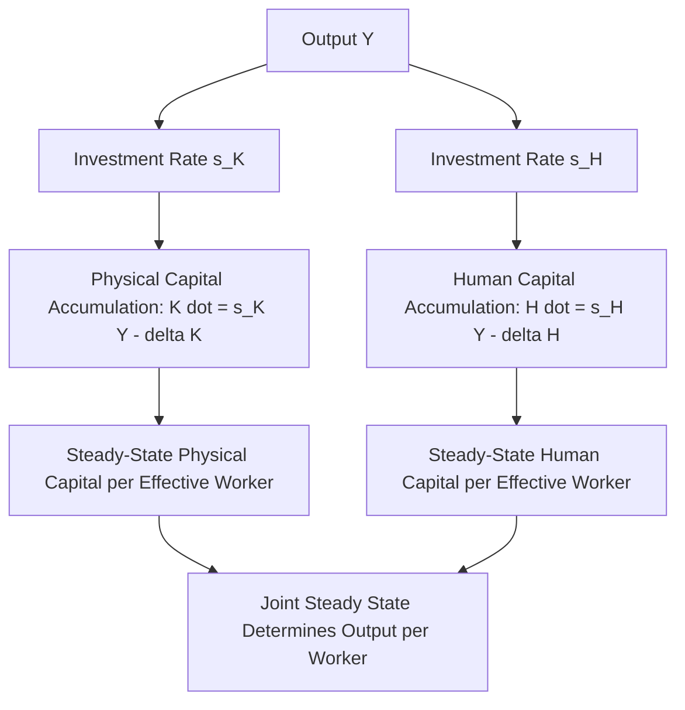
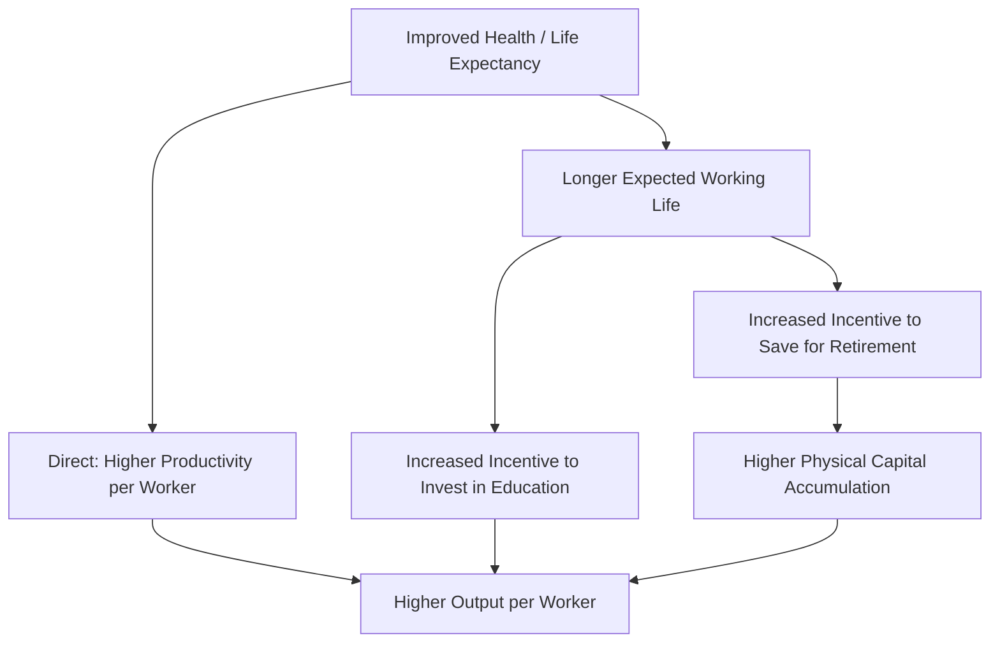
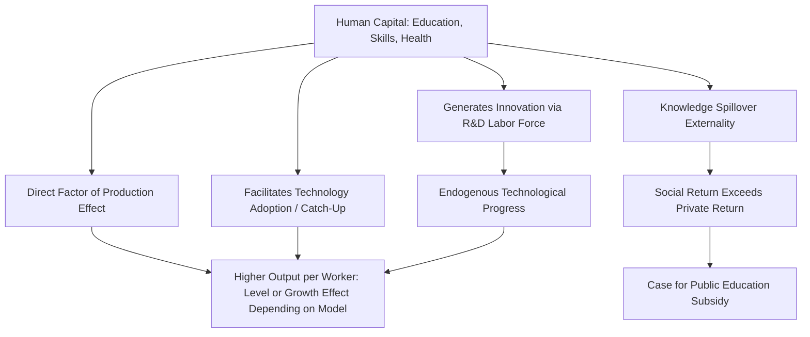

## Human Capital and Growth

### Overview

Human capital—the stock of knowledge, skills, competencies, and health embodied in individuals that enhances their productive capacity—occupies a central and multifaceted role in growth theory. It functions simultaneously as a factor of production analogous to physical capital, as an input into the innovation process in endogenous growth models, and as a candidate explanation for persistent cross-country income gaps. This topic surveys how human capital has been incorporated into neoclassical and endogenous growth frameworks, the empirical evidence linking education and health to growth outcomes, and the ongoing debates about how large its quantitative contribution actually is.

**Key Points**

- Human capital can be modeled either as an augmented labor input (raising effective labor supply) or as a distinct, separately accumulable capital stock alongside physical capital.
- The Mankiw-Romer-Weil augmented Solow model and Lucas's human capital externality model represent two influential but conceptually distinct approaches to incorporating human capital into growth theory.
- Empirical measures of human capital's contribution to growth vary substantially depending on measurement approach (years of schooling versus quality-adjusted measures) and methodology, and the magnitude of its causal effect on growth remains genuinely debated.

### Defining and Measuring Human Capital

Human capital is a broader concept than education alone, though education is its most commonly used empirical proxy. A fuller conception includes:

- **Formal education**: years of schooling, literacy rates, educational attainment by level (primary, secondary, tertiary)
- **Skill quality**: cognitive skills as measured by standardized test scores (e.g., international assessments), which may capture school quality better than years of schooling alone
- **On-the-job training and experience**: skills acquired through work experience, often proxied by age or tenure in labor economics applications
- **Health**: nutrition, life expectancy, disease burden, and general physical capacity to work productively

**Key Points**

- The most common empirical proxy in cross-country growth studies—average years of schooling in the adult population—is a **quantity** measure that does not directly capture the **quality** of education received, a limitation that has motivated a shift toward test-score-based measures in more recent research (e.g., Hanushek and Woessmann's work on cognitive skills and growth).
- Health-augmented human capital measures (incorporating life expectancy or disability-adjusted measures) have also been incorporated into growth accounting frameworks, reflecting the recognition that a healthier workforce is more productive independent of formal educational attainment.

### Human Capital as Augmented Labor: The Mincerian Approach

One common modeling strategy treats human capital as directly augmenting the effective quantity of labor, analogous to labor-augmenting technology in the Solow model. Following Jacob Mincer's influential labor economics framework, human capital per worker $h$ is often specified as an exponential function of years of schooling $S$:

$$h = e^{\phi(S)}$$

Where $\phi(S)$ is typically assumed to be piecewise linear, with the slope representing the **return to an additional year of schooling** (commonly estimated in labor economics using Mincerian wage regressions). Effective labor input is then:

$$L_{\text{eff}} = h \cdot L = e^{\phi(S)} \cdot L$$

This specification is incorporated into a standard neoclassical production function as:

$$Y = K^{\alpha}(A \cdot h \cdot L)^{1-\alpha}$$

**Key Points**

- This approach treats human capital as directly analogous to a labor-quality adjustment (similar to the Jorgenson-Griliches labor quality adjustment discussed in growth accounting), rather than as a separately accumulated capital stock with its own investment and depreciation dynamics.
- Estimated Mincerian returns to schooling (the percentage wage increase associated with an additional year of education) have historically clustered in a commonly cited range across many countries and time periods, though these estimates vary by country, time period, and estimation method, and are subject to well-known identification challenges (e.g., unobserved ability bias) [Unverified—the specific magnitude of the "true" causal return to schooling remains debated in the labor economics literature].

### Human Capital as a Distinct Accumulable Factor: The Mankiw-Romer-Weil Model

An alternative and highly influential approach, developed by **Mankiw, Romer, and Weil (1992)**, treats human capital $H$ as a separate factor of production, accumulated through its own investment process, alongside physical capital $K$:

$$Y = K^{\alpha}H^{\beta}(AL)^{1-\alpha-\beta}$$

In this augmented Solow framework, a fraction $s_H$ of output is invested in human capital accumulation (analogous to the physical capital investment rate $s_K$), and human capital accumulates according to its own dynamic equation, paralleling the physical capital accumulation equation:

$$\dot{H} = s_H Y - \delta_H H$$

Solving for the steady state (in effective-labor units) yields steady-state levels of both $\tilde{k}^*$ and $\tilde{h}^*$ jointly determined by $s_K$, $s_H$, $n$, $g$, and $\delta$.

**Key Points**

- This specification implies that the "effective" degree of diminishing returns operating on the combined reproducible factors $(K,H)$ together is $(1-\alpha-\beta)$, smaller than the $(1-\alpha)$ that applies to physical capital alone in the basic Solow model—since two accumulable factors are jointly closer to constant returns than one alone, diminishing returns to any single factor operate less forcefully, slowing the model's predicted speed of convergence toward the steady state.
- Mankiw, Romer, and Weil found that this augmented specification substantially improved the model's ability to explain the magnitude of cross-country income differences using empirically plausible parameter values, addressing a key quantitative shortcoming of the basic two-factor Solow model, though this specific empirical finding and its methodology have subsequently been the subject of considerable critique and re-examination in the literature [Unverified—the size of the improvement and the appropriate econometric approach for estimating this model remain actively debated].
- A notable critique of this approach, raised by subsequent researchers, concerns whether physical and human capital should really be modeled as accumulating via the same technology and depreciating at similar rates as assumed in the original specification, since these are conceptually quite different types of investment.

### Human Capital in Endogenous Growth: The Lucas Model

Robert Lucas's (1988) influential model takes a fundamentally different approach, treating human capital accumulation not merely as an additional accumulable factor subject to diminishing returns (as in Mankiw-Romer-Weil), but as the **engine of sustained endogenous growth**, analogous to the role broad capital plays in the AK model.

In Lucas's framework, individuals divide their time between working (a fraction $u$ of time) and accumulating human capital through education/training (the remaining fraction $1-u$). Human capital accumulates according to:

$$\dot{h} = \delta_h (1-u) h$$

Where $\delta_h$ is a productivity parameter for the human capital accumulation ("learning") technology. Crucially, this accumulation equation is **linear in $h$ itself**—there are no diminishing returns to accumulating human capital, analogous to the constant marginal product of capital in the AK model, meaning human capital (and hence output, which depends on it) can grow at a constant rate indefinitely.

**The Externality Component**: Lucas's model additionally incorporates an **external effect** of the *average* level of human capital in the economy, $h_a$, on every individual firm's productivity, over and above the direct effect of a worker's own human capital:

$$Y = K^{\alpha}(uhL)^{1-\alpha}h_a^{\gamma}$$

**Key Points**

- The externality term $h_a^{\gamma}$ represents a **knowledge spillover**: the average education level of the workforce raises the productivity of all workers, not just those who are more educated themselves—analogous to how a more educated society generates broader productivity benefits than the sum of private returns to individual education would suggest.
- This externality has an important normative implication: if individuals only consider their **private** return to education when deciding how much time to devote to human capital accumulation, they will under-invest relative to the **socially optimal** level, since they do not internalize the positive externality their own human capital confers on others—providing a standard economic rationale for public subsidization of education.
- Empirically distinguishing the private return to education (well-estimated via Mincerian wage regressions) from the social/externality return (the additional productivity benefit that education confers on others) has proven considerably more difficult, and the size of this externality remains a genuinely contested empirical question [Unverified—estimates of education externalities vary substantially across studies and identification strategies, and some researchers have found externality effects to be small or difficult to detect empirically].

### Empirical Evidence: Cross-Country Growth Regressions

Human capital has been a standard control variable (and variable of interest) in cross-country growth regressions since the influential work of **Robert Barro** in the late 1980s and 1990s, which found that measures of educational attainment (particularly secondary and higher education enrollment rates) were positively and often significantly associated with subsequent economic growth, even after controlling for initial income and other standard covariates.

**Key Points**

- Barro's early findings, along with related work, contributed to a broad (though not unanimous) consensus in the empirical growth literature that human capital is an economically important determinant of growth, both directly (as a factor of production) and indirectly (through its role in facilitating technology adoption and innovation).
- Subsequent research has raised methodological concerns about these findings, including: measurement error in cross-country education data (particularly for developing countries with less reliable historical records), potential reverse causality (richer countries may invest more in education because they can afford to, rather than education causing growth), and sensitivity of results to the specific set of control variables and country sample used [Unverified—these methodological critiques are well-documented in the literature, though the overall empirical relationship between education and growth remains a subject of active research rather than a fully settled matter].
- A notable finding from research using test-score-based (quality-adjusted) measures of human capital, rather than years-of-schooling quantity measures, suggests that **cognitive skills** may be more strongly and robustly associated with growth than raw schooling quantity alone, implying that the quality of education, not just its duration, may be central to human capital's growth contribution [Unverified—this specific finding, while influential in subsequent literature, depends on the particular test-score datasets and methodology used].

### Health as Human Capital

A distinct strand of the human capital literature emphasizes **health** as a component of human capital with its own growth implications, operating through several channels:

- **Direct productivity effects**: Healthier workers are more productive per hour worked, due to greater physical capacity and fewer sick days.
- **Longer working lives and altered savings incentives**: Higher life expectancy can increase the incentive to invest in education (since the returns to education are realized over a longer expected working life) and to save for retirement, potentially raising both human and physical capital accumulation.
- **Reduced disease burden**: Lower prevalence of debilitating diseases (which has historically been a major focus in the context of developing economies) can raise both labor force participation and productivity.

**Key Points**

- Estimating the causal effect of health improvements on economic growth is methodologically challenging, since health and income are jointly determined (richer societies can afford better healthcare, and healthier populations may become more productive and hence richer), requiring careful identification strategies (e.g., using disease eradication campaigns or medical innovations as natural experiments) to isolate causal effects.
- Some research using such natural-experiment approaches has found more modest short-to-medium-run effects of health improvements on aggregate income growth than earlier, more descriptive cross-country correlational studies suggested, an area of ongoing empirical investigation and debate [Unverified—findings in this literature are sensitive to the specific health intervention studied, time horizon considered, and identification strategy employed].

### Human Capital and Technology Adoption

A further channel through which human capital may affect growth, distinct from its direct role as a factor of production, is its role in facilitating the **adoption and effective use of new technologies**. This idea, associated with researchers such as Nelson and Phelps (1966) and subsequently incorporated into models of technology diffusion, suggests that human capital's growth contribution may be particularly important for countries that are technological followers (adopting and adapting technologies developed elsewhere) rather than technological leaders (developing entirely new technologies at the frontier).

**Key Points**

- This "catch-up" role of human capital implies that its growth contribution may vary systematically with a country's distance from the global technology frontier—human capital may matter more for enabling technology adoption in middle-income and developing economies than for driving frontier innovation in the most advanced economies, though this remains a matter of ongoing empirical and theoretical investigation [Inference: this distinction between human capital's roles in adoption versus frontier innovation is a plausible theoretical mechanism supported by some empirical work, but is not a fully settled characterization of how human capital operates across all country contexts].

### Comparing the Two Modeling Traditions

| Feature | Mankiw-Romer-Weil (Augmented Solow) | Lucas (Endogenous Growth) |
| --- | --- | --- |
| Role of human capital | Additional accumulable factor, subject to diminishing returns | Engine of sustained endogenous growth |
| Returns to human capital accumulation | Diminishing (jointly with physical capital) | Constant (linear accumulation technology) |
| Long-run growth driver | Still requires exogenous technology $g$ | Endogenously determined by human capital accumulation choices |
| Externalities | Not typically emphasized | Central feature (average human capital spillover) |
| Policy implication | Level effects from human capital investment | Potential permanent growth-rate effects; case for education subsidies due to externality |

### Summary Diagram: Channels from Human Capital to Growth

**Next Steps**

- The Mincerian wage equation and empirical estimation of returns to schooling
- Lucas's (1988) human capital model in full mathematical detail, including the externality mechanism
- Hanushek and Woessmann's cognitive-skills-based approach to measuring human capital's growth contribution
- Health economics and growth: natural experiment approaches to estimating causal health effects
- Nelson-Phelps technology diffusion and human capital's role in catch-up growth
- Education externalities and the normative case for public investment in schooling
- Human capital measurement challenges in developing-country growth empirics