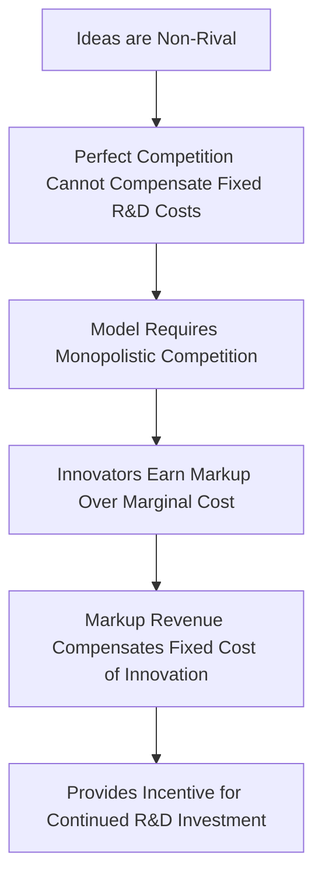
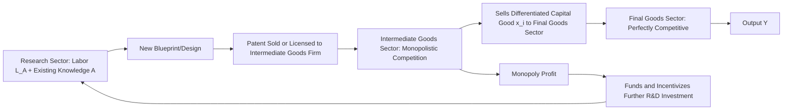
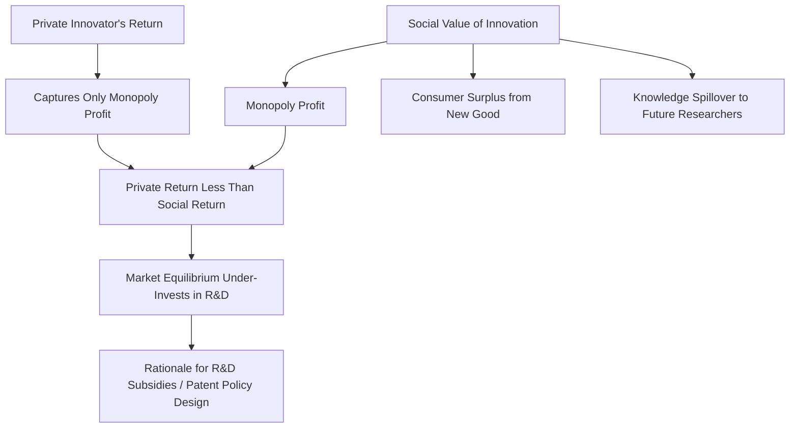
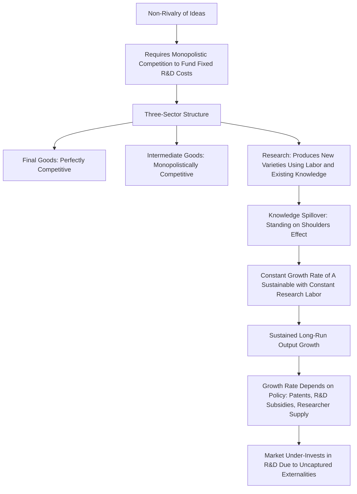

## Romer's Model of Technological Innovation

### Overview

Paul Romer's (1990) model, "Endogenous Technological Change," is the foundational framework for modern endogenous growth theory built on purposeful innovation. Unlike the AK model, which achieves sustained growth by assuming away diminishing returns to a broadly defined capital stock, Romer's model explicitly derives sustained technological progress from the deliberate profit-seeking activity of a dedicated research and development sector. Its central theoretical innovation is treating **ideas as a distinct, non-rival input to production**, fundamentally different in its economic properties from physical capital and labor. This model earned Romer a share of the 2018 Nobel Memorial Prize in Economic Sciences.

**Key Points**

- The model explains technological progress as the outcome of intentional, profit-motivated investment in research, rather than as an unexplained exogenous process.
- The key economic property driving the model is the **non-rivalry** of ideas—a single blueprint or design can be used simultaneously by unlimited firms without being depleted, unlike a physical unit of capital.
- Non-rivalry combined with partial excludability (via patents or trade secrets) generates increasing returns at the aggregate level even though individual firms face constant returns, requiring a departure from the perfectly competitive market structure assumed in the Solow model.

### The Economics of Ideas: Rivalry and Excludability

Romer's model rests on a fundamental distinction in the economic properties of different types of goods, organized along two dimensions:

**Rivalry**: A good is rival if one person's use of it prevents another's simultaneous use (e.g., a machine, a worker's labor hour, a unit of raw material). A good is non-rival if its use by one party does not diminish its availability to others (e.g., a mathematical formula, a software design, a blueprint for a production process).

**Excludability**: A good is excludable if its owner can prevent others from using it without permission (e.g., through patents, trade secrets, or physical control). A good is non-excludable if others cannot readily be prevented from using it once it exists (e.g., basic scientific knowledge published openly).

|  | Excludable | Non-Excludable |
| --- | --- | --- |
| **Rival** | Private goods (machines, raw materials, labor) | Common resources (unpatented natural resources) |
| **Non-Rival** | Ideas protected by patents, trade secrets (partially excludable) | Public goods (basic scientific knowledge, pure public research) |

**Key Points**

- Physical capital and labor are **rival** goods: a machine used by one firm cannot simultaneously be used by another, and a worker's hour of labor is likewise exclusively allocated.
- Ideas—the designs, blueprints, formulas, and technical knowledge that constitute technology—are fundamentally **non-rival**: once a design for a new product or production process exists, it can in principle be used by an unlimited number of firms simultaneously without any reduction in its usefulness to any individual user.
- This non-rivalry is the single most important economic property that Romer's model builds upon, and it is what ultimately generates the model's central result: increasing returns to scale in the reproducible inputs taken together (physical capital and the stock of ideas), even though the underlying production technology for any individual final good exhibits constant returns to its own rival inputs.

### Why Non-Rivalry Requires Departing from Perfect Competition

A well-known problem in growth theory prior to Romer's work was that if ideas are treated as an ordinary input to an aggregate production function under perfect competition, the model runs into a fundamental inconsistency: constant returns to scale in **all** rival inputs (capital and labor) combined with a non-rival input (ideas) that is also paid its marginal product implies aggregate increasing returns to scale, but under perfect competition, each factor earning its marginal product exhausts total output only under constant returns to scale (Euler's theorem)—paying the non-rival factor (ideas) its true marginal product would over-exhaust the available output, since that marginal product is spread across an ever-growing use of the idea.

Romer's key modeling innovation was to break with the assumption of perfectly competitive markets for final goods, instead introducing **monopolistic competition** in an intermediate goods sector, which allows innovators to earn a markup over marginal cost, providing exactly the revenue stream needed to compensate the fixed cost of generating a new idea in the first place.

### The Three-Sector Structure of Romer's Model

Romer's model divides the economy into three interconnected sectors:

**1. Final goods sector**: Perfectly competitive firms produce a single final consumption/output good using labor and a range of differentiated intermediate capital goods:

$$Y = L_Y^{1-\alpha} \int_0^A x_i^{\alpha}\, di$$

Where $L_Y$ is labor employed in final goods production, $x_i$ is the quantity of intermediate good variety $i$ used, and $A$ represents the **total number of intermediate good varieties currently available**, which serves as the model's measure of the technology/knowledge stock.

**2. Intermediate goods sector**: Monopolistically competitive firms, each holding a patent (perpetual, in the simplest version) on one variety of intermediate good, produce and sell that variety using capital, and set a **markup price** over marginal cost to earn monopoly profits, which compensate for the fixed cost incurred in initially developing the design/blueprint.

**3. Research (R&D) sector**: Uses labor (specifically, human-capital-intensive researcher labor, $L_A$) combined with the **existing stock of knowledge** $A$ to produce new blueprints/designs, according to a research production function:

$$\dot{A} = \delta L_A A$$

Where $\delta$ is a research productivity parameter.

### The Critical Feature: Knowledge Spillovers in the Research Production Function

The research production function $\dot{A} = \delta L_A A$ embeds a crucial assumption: the productivity of current researchers depends positively on the **existing stock of accumulated knowledge**, $A$. This reflects the idea that researchers today "stand on the shoulders" of previous innovations—each new idea makes it easier (not harder) to discover subsequent ideas, since researchers can build upon, recombine, and extend existing knowledge.

**Key Points**

- This "standing on shoulders" externality is what allows the research sector to sustain a **constant proportional growth rate of $A$** even with a constant (or in the base model, exogenously growing at rate $n$) research labor force $L_A$: since $\dot{A}/A = \delta L_A$, and this fraction can remain constant over time as long as $L_A$ is constant, $A$ grows at a constant exponential rate indefinitely, without requiring an ever-expanding number of researchers.
- This differs importantly from a specification without the knowledge spillover (e.g., $\dot{A} = \delta L_A$ without the $A$ term), which would instead generate a linearly growing, rather than exponentially growing, stock of knowledge for a constant research labor force—the multiplicative role of existing $A$ is essential to the model's growth dynamics.

### Deriving the Balanced Growth Path

In the model's balanced growth path equilibrium, the growth rate of the knowledge stock (and hence of output per capita, since output depends positively on the variety of intermediate goods $A$) is determined by:

$$g_A = \frac{\dot{A}}{A} = \delta L_A$$

Where $L_A$, the number of researchers devoted to R&D, is determined in equilibrium by balancing the return to research investment (discounted monopoly profits from a successful innovation) against its opportunity cost (the wage researchers could earn in the final goods sector instead). Output growth in the balanced growth path is proportional to knowledge growth:

$$g_Y = \frac{1}{1-\alpha} g_A$$

(the exact relationship depends on the specific functional form parameters, but the key qualitative point is that sustained output growth is directly tied to the sustained growth of the knowledge/variety stock $A$, which in turn is driven by ongoing purposeful research investment).

### Policy Implications: Growth Rate Depends on Policy, Not Just Preferences

**Key Points**

- Because the equilibrium allocation of labor to research, $L_A$, depends on the profitability of innovation (determined by factors including the size of the market, the strength and duration of patent protection, the degree of monopoly markup, and the productivity of the research technology), **policy variables that affect the incentive to innovate can have permanent effects on the long-run growth rate**, similar in spirit to the AK model's implication for the savings rate, but operating through the innovation channel specifically.
- Relevant policy levers highlighted by this framework include: intellectual property protection (patent length and strength), R&D subsidies and tax credits, education and immigration policy affecting the supply of researchers, and antitrust policy affecting the markups innovators can earn.
- A key normative implication is that **decentralized market equilibrium generally under-invests in R&D relative to the social optimum**, because private innovators do not capture the full social value of their innovations—they capture only the private monopoly profit, while ignoring both the **consumer surplus** their innovation generates for final goods buyers and the **knowledge spillover** benefit their idea confers on future researchers (the "standing on shoulders" externality benefits later innovators, but current innovators are not compensated for this future benefit). This provides an economic rationale for public R&D subsidies as a corrective policy [Inference: while this underinvestment result is a robust theoretical implication of the model's externality structure, the appropriate magnitude of optimal R&D subsidies in practice is a separate empirical and policy question].

### Comparison with the AK Model

| Feature | AK Model | Romer (1990) Model |
| --- | --- | --- |
| Source of sustained growth | Constant returns to broad capital | Purposeful R&D generating new ideas |
| Market structure | Typically perfectly competitive (or unspecified) | Explicitly monopolistically competitive intermediate sector |
| Role of ideas/technology | Implicit within broadly defined "capital" | Explicit, separate non-rival input with its own production sector |
| Policy relevance | Savings rate affects growth rate | R&D incentives, patents, and research labor supply affect growth rate |
| Microfoundation of innovation process | Absent (technology is folded into K) | Explicit: modeled research sector with its own production function |
| Externality structure | Not typically modeled explicitly | Two distinct externalities: consumer surplus and knowledge spillovers |

### The Scale Effects Problem

As with other first-generation endogenous growth models, Romer's original formulation implies a **scale effect**: since $g_A = \delta L_A$, a larger economy (with more researchers $L_A$, which would naturally scale with a larger population) should exhibit a permanently higher growth rate of knowledge and output.

**Key Points**

- This prediction has proven difficult to reconcile with the empirical observation that the number of researchers engaged in R&D has grown substantially in many advanced economies over the 20th century without a correspondingly sustained acceleration in per capita growth rates, a critique developed prominently by Charles Jones (1995).
- This led to the development of **semi-endogenous growth models**, which modify the research production function (e.g., introducing a parameter $\phi < 1$ such that $\dot{A} = \delta L_A A^{\phi}$, capturing the idea that research may become progressively harder as the "easy" ideas are discovered first, sometimes called a "fishing out" effect) so that sustained long-run growth depends on the **growth rate** of the research labor force (ultimately tied to population growth) rather than its absolute **level**, removing the scale effect while preserving a meaningful role for economic incentives in determining research effort.
- Romer's own subsequent work and that of others has continued to refine and debate the appropriate treatment of scale effects, and this remains a live area of theoretical and empirical growth research [Unverified—the relative empirical support for scale-effects models versus semi-endogenous alternatives is not fully settled and continues to be examined using various data sources, including patent counts and R&D expenditure data].

### Empirical Relevance and Applications

Romer's framework has substantially shaped subsequent applied growth research and policy analysis, including:

- Studies estimating the returns to public R&D subsidies and tax credits
- Analysis of optimal patent length and breadth, balancing innovation incentives against the deadweight loss of monopoly pricing
- Models of international technology diffusion, extending the basic closed-economy framework to consider how ideas developed in one country can be non-rivally adopted (subject to some frictions) by others
- The broader "new growth theory" research program in macroeconomics, which treats the rate and direction of innovation as an object of economic analysis rather than an exogenous given

### Summary Diagram: Romer Model Overview

**Next Steps**

- Formal derivation of the monopolistic competition equilibrium in the intermediate goods sector
- The scale effects critique and semi-endogenous growth models (Charles Jones, 1995)
- Optimal patent design: balancing innovation incentives and static monopoly deadweight loss
- Aghion and Howitt's Schumpeterian "creative destruction" alternative to variety-expansion growth
- Empirical estimation of R&D externalities and the social versus private returns to innovation
- International technology diffusion models building on the non-rivalry property of ideas
- Directed technical change: endogenizing the type, not just the rate, of innovation