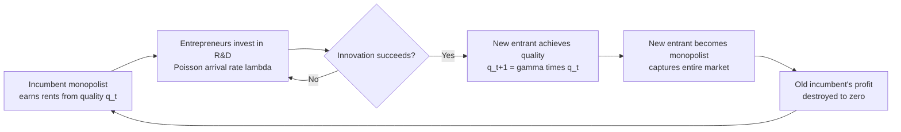

## Schumpeterian Growth and Creative Destruction

### Overview

Schumpeterian growth theory explains long-run economic growth as the outcome of deliberate, profit-motivated innovation that replaces old products, technologies, and firms with new ones. The theory originates in Joseph Schumpeter's early-twentieth-century work on business cycles and entrepreneurship and was formalized into modern endogenous growth models by Philippe Aghion and Peter Howitt in their 1992 quality-ladder model. Unlike growth theories that treat technology as an exogenous input (Solow) or as a byproduct of capital/knowledge accumulation without explicit market structure (early AK or Romer variety-expansion models), Schumpeterian models place **industrial organization, monopoly rents, and firm turnover** at the center of the growth process.

The central mechanism is **creative destruction**: innovators earn temporary monopoly profits by inventing a better version of a good or process, but this act simultaneously destroys the value of the previous innovator's monopoly. Growth is therefore inherently linked to churn — the continuous obsolescence of old capital, skills, firms, and jobs.

---

### Historical and Intellectual Origins

- Schumpeter introduced the term "creative destruction" in *Capitalism, Socialism and Democracy* (1942), though the underlying entrepreneurial-disruption idea appears as early as *The Theory of Economic Development* (1911).
- Schumpeter argued that capitalism's defining feature is not price competition but competition from **new commodities, new technologies, new sources of supply, and new types of organization** — competition that strikes at the foundations of existing firms' profits and survival.
- Modern formalization: Aghion & Howitt (1992), "A Model of Growth Through Creative Destruction," *Econometrica*, built the first tractable general-equilibrium model embedding this idea, later extended in Aghion, Akcigit, and Howitt's survey work and the broader "Schumpeterian growth paradigm" (Aghion, Antonin, and Bunel's *The Power of Creative Destruction*, 2021, is a widely cited modern synthesis).

---

### Core Mechanism: Quality Ladders

The canonical Aghion–Howitt setup models each industry (or product line) as a **quality ladder**: successive innovations increase product quality by a fixed step size.

$$q_{t} = \gamma \cdot q_{t-1}$$

where $q_t$ is the quality of the leading-edge product after $t$ innovations and $\gamma > 1$ is the size of each quality improvement.

**Key structural features:**

- **Monopoly rents as innovation incentive.** The firm that makes the latest innovation becomes the sole producer of the current top-quality good, earning monopoly profits until displaced.
- **Stochastic arrival of innovation.** R&D investment by rival entrepreneurs generates a Poisson arrival process for the next innovation; higher R&D intensity raises the hazard rate of displacement.
- **Business stealing.** A successful innovator captures the entire market for that product line, driving the previous incumbent's profit to zero. This is the "destruction" half of the mechanism — a private benefit to the innovator that is not fully a social benefit, since it displaces the incumbent's rents rather than adding to them.
- **Growth as sequence of temporary monopolies.** Aggregate growth is the sum, across many industries, of successive quality improvements, each conferring a temporary monopoly later destroyed by the next entrant.

---

### Formal Model Sketch

**Production side.** A final good is produced using a continuum of intermediate inputs indexed by quality:

$$Y_t = \int_0^1 A_{it}^{1-\alpha} x_{it}^{\alpha} \, di$$

where $A_{it}$ is the technology (quality) level in sector $i$ and $x_{it}$ is the quantity of the intermediate input used.

**Innovation (R&D) side.** Entrepreneurs invest resources $R_i$ in sector $i$; the Poisson arrival rate of a new innovation is:

$$\lambda_i = \phi(R_i)$$

with $\phi' > 0$, $\phi'' < 0$ (diminishing returns to R&D effort in a given instant).

**Value of innovating.** The expected present value of becoming the new monopolist, $V_i$, must satisfy a no-arbitrage (Bellman) condition:

$$r V_i = \pi_i - \lambda_i V_i$$

Here $\pi_i$ is instantaneous monopoly profit and $\lambda_i V_i$ is the expected capital loss from being displaced by the *next* innovator — this term is the formal representation of creative destruction eroding the value of holding a technological lead.

**Free-entry / R&D condition.** Entrepreneurs invest in R&D until the marginal cost of research equals the expected marginal benefit:

$$c'(R_i) = \phi'(R_i) \cdot V_i$$

**Balanced growth rate.** In steady state, aggregate TFP growth is proportional to the average innovation step size and average arrival rate:

$$g = \lambda \cdot \ln(\gamma)$$

This single equation captures the model's macro implication: growth depends jointly on **how big** innovations are ($\gamma$) and **how often** they occur ($\lambda$), both of which respond endogenously to profit incentives, market structure, and policy.

---

### Creative Destruction: Private vs. Social Returns

A defining feature (and policy-relevant tension) of Schumpeterian models is that the **private return to innovation diverges from the social return**, in two offsetting directions:

1. **Business-stealing effect (private return > social return).** Part of an innovator's private gain comes from destroying the incumbent's rents, not from creating new social surplus. This can lead to *excessive* entry/R&D relative to the social optimum, because innovators do not internalize the loss imposed on the displaced incumbent.
2. **Appropriability/spillover effect (private return < social return).** Innovators cannot capture the full social value of their invention: future innovators build on it "for free" (knowledge spillovers), and consumers capture surplus through eventual price competition or product improvement. This tends to cause *underinvestment* in R&D relative to the social optimum.

Because these two distortions push in opposite directions, the model does not generically predict that decentralized R&D investment is too high or too low — it depends on parameters (step size, discount rate, patent breadth, degree of competition). This ambiguity is a central result distinguishing Schumpeterian models from simpler "innovation is always underprovided" narratives.

---

### The Schumpeterian "Trade-off": Growth vs. Rent Destruction

- **Growth-promoting force:** temporary monopoly power is *necessary* to induce risky R&D investment. Without the prospect of rents, no one would innovate (this echoes Schumpeter's rejection of perfect competition as the growth-optimal market structure).
- **Growth-retarding force:** the same monopoly, once established, exists as a target — incumbents may either accelerate their own follow-up innovation ("escape competition") or lobby to entrench their position ("escape entry" via barriers), and existing capital/labor tied to the old technology is rendered obsolete, generating adjustment costs, unemployment spells, and skill mismatch.

**Depreciation of old capital and human capital:** Aghion–Howitt models formally treat each innovation as instantaneously destroying the value of the specific physical capital, organizational capital, and worker skills tied to the displaced technology. This is the theoretical basis for empirical findings on job destruction/creation churn, plant closures, and "creative destruction" costs in labor markets (cf. Davis–Haltiwanger job-flows literature, though that literature is empirical/labor-economics rather than strictly Schumpeterian in derivation).

---

### Extensions in the Schumpeterian Paradigm

**1. Step-by-step innovation and the inverted-U (Aghion, Bloom, Blundell, Griffith, Howitt, 2005, *QJE*)**

- Relaxes the assumption that innovation always leaps far ahead of rivals; instead, firms innovate incrementally, sometimes only catching up to a "neck-and-neck" competitor.
- Produces an **inverted-U relationship between product-market competition and innovation**: moderate competition maximizes R&D effort because firms in neck-and-neck industries innovate to "escape competition," while in already-unequal industries, more competition can discourage the laggard from investing (discouragement effect) even as it may still spur the leader.
- This result reconciled a long-standing empirical puzzle where some studies found competition helps innovation and others found it hurts.

**2. Schumpeterian growth and firm heterogeneity / misallocation**

- Models incorporating heterogeneous firm productivity (in the spirit of Hopenhayn/Melitz-type frameworks combined with Schumpeterian entry-exit) show how policies protecting incumbents (entry barriers, subsidies to failing firms, weak bankruptcy law) can reduce the pace of creative destruction and thus slow aggregate TFP growth — this is used to explain cross-country and cross-time productivity slowdowns.

**3. Schumpeterian growth and technology frontier / convergence (Acemoglu, Aghion, Zilibotti, 2006, *JEEA*)**

- Distinguishes an "investment-based" strategy (accumulation, imitation) suited to economies far from the technology frontier from an "innovation-based" strategy suited to economies near the frontier.
- Institutions that favor experienced, large incumbents may help catch-up growth but become a drag once an economy approaches the global frontier and needs entry by innovative newcomers instead — a widely cited explanation for middle-income growth slowdowns ("middle-income trap").

**4. Directed technical change and Schumpeterian models (Acemoglu 2002 and later climate-economy extensions)**

- Combines the quality-ladder framework with a choice of *which* sector or *which type* of technology (e.g., clean vs. dirty energy) to direct R&D toward, used extensively in modern environmental/growth policy analysis (carbon taxes, green subsidies redirecting the destructive-creative cycle toward clean technology).

**5. Schumpeterian growth and market concentration / "superstar firms"**

- Recent literature (motivated by rising markups and concentration in advanced economies since the 1980s–2000s) uses Schumpeterian frameworks to ask whether declining "business dynamism" (falling firm entry rates, falling job reallocation) reflects a slowdown in creative destruction itself, with implications for secular stagnation debates.

---

### Comparison with Other Endogenous Growth Frameworks

| Feature | Solow-Swan (exogenous) | Romer Variety-Expansion (1990) | Schumpeterian (Aghion-Howitt) |
| --- | --- | --- | --- |
| Source of growth | Exogenous technological progress | Expanding range of differentiated inputs/varieties | Vertical quality improvements replacing prior versions |
| Market structure | Perfect competition (final good) | Monopolistic competition, permanent variety-specific rents | Sequential monopoly, rents destroyed by next entrant |
| Obsolescence | Not modeled | Old varieties remain useful (no displacement) | Old products/firms become obsolete (business stealing) |
| Policy lever emphasis | Savings rate, population growth | Subsidize R&D, protect IP broadly | Competition policy, patent breadth/duration, entry/exit regulation, bankruptcy law |
| Growth driver at firm level | N/A (representative firm) | New firms add to the stock without destroying old firms' value | New firms/innovations actively destroy incumbent value |

---

### Diagram: The Creative Destruction Cycle

---

### Illustration: Value of Innovating Under Threat of Displacement (svg_diagram)

<svg xmlns="http://www.w3.org/2000/svg" viewBox="0 0 720 340">
<text x="360" y="28" text-anchor="middle" font-size="18" font-weight="bold" fill="#1a1a1a">Monopoly Rent Erosion Under Creative Destruction (svg_diagram)</text>
<line x1="60" y1="290" x2="680" y2="290" stroke="#333" stroke-width="2" />
<line x1="60" y1="290" x2="60" y2="50" stroke="#333" stroke-width="2" />
<text x="370" y="320" text-anchor="middle" font-size="13" fill="#333">Time</text>
<text x="25" y="170" text-anchor="middle" font-size="13" fill="#333" transform="rotate(-90 25 170)">Monopoly Profit (pi)</text>

<rect x="60" y="150" width="180" height="140" fill="#8ecae6" opacity="0.7" />
<text x="150" y="145" text-anchor="middle" font-size="12" fill="#1a1a1a">Firm 1 monopoly </text>
<text x="150" y="220" text-anchor="middle" font-size="12" fill="#1a1a1a">pi_1</text>

<line x1="240" y1="290" x2="240" y2="50" stroke="#e63946" stroke-width="2" stroke-dasharray="6,4" />
<text x="240" y="45" text-anchor="middle" font-size="11" fill="#e63946">Innovation 2 arrives</text>

<rect x="240" y="100" width="150" height="190" fill="#219ebc" opacity="0.7" />
<text x="315" y="95" text-anchor="middle" font-size="12" fill="#1a1a1a">Firm 2 monopoly</text>
<text x="315" y="200" text-anchor="middle" font-size="12" fill="#1a1a1a">pi_2 &gt; pi_1</text>
<line x1="390" y1="290" x2="390" y2="50" stroke="#e63946" stroke-width="2" stroke-dasharray="6,4" />
<text x="390" y="45" text-anchor="middle" font-size="11" fill="#e63946">Innovation 3 arrives</text>

<rect x="390" y="60" width="140" height="230" fill="#023047" opacity="0.7" />
<text x="460" y="55" text-anchor="middle" font-size="12" fill="#1a1a1a">Firm 3 monopoly</text>
<text x="460" y="170" text-anchor="middle" font-size="12" fill="#f1faee">pi_3 &gt; pi_2</text>
<line x1="530" y1="290" x2="530" y2="50" stroke="#e63946" stroke-width="2" stroke-dasharray="6,4" />
<text x="530" y="45" text-anchor="middle" font-size="11" fill="#e63946">Innovation 4 arrives</text>
<rect x="530" y="40" width="130" height="250" fill="#001219" opacity="0.75" />
<text x="595" y="35" text-anchor="middle" font-size="12" fill="#1a1a1a">Firm 4 monopoly</text>
<text x="595" y="150" text-anchor="middle" font-size="12" fill="#f1faee">pi_4 &gt; pi_3</text>

<text x="370" y="330" text-anchor="middle" font-size="11" fill="#555">Each vertical dashed line: an incumbent's rent is destroyed to zero as the next innovator captures the market</text>

</svg>

---

### Worked Numerical Example

Suppose an industry has quality step size $\gamma = 1.05$ (each innovation raises quality by 5%) and the equilibrium Poisson arrival rate of innovation is $\lambda = 0.4$ per year (an innovation occurs on average every 2.5 years).

Using $g = \lambda \cdot \ln(\gamma)$:

$$g = 0.4 \times \ln(1.05) \approx 0.4 \times 0.0488 \approx 0.0195$$

This industry's technology (and, in a symmetric one-sector aggregation, the economy's TFP) grows at approximately **1.95% per year**.

**Policy comparative statics implied by this formula:**

- A policy that lengthens effective patent protection may raise $V_i$ (value of innovating), raising $\lambda$ (more R&D), but if it also allows larger $\gamma$ jumps before rivals can catch up, effects on $g$ compound.
- A policy that intensifies product-market competition (e.g., antitrust enforcement, lower entry costs) has an ambiguous a priori sign on $\lambda$: per the step-by-step extension, it can raise $\lambda$ in neck-and-neck sectors (escape-competition effect) or lower it in already-unequal sectors (discouragement effect). [Inference: the net aggregate effect depends on the model's assumed distribution of industries across "neck-and-neck" vs. "unlevel" states, which is a calibration/empirical question rather than a theoretical certainty.]

---

### Empirical Applications and Evidence

- **Patent citations and quality-ladder step size:** Empirical Schumpeterian growth accounting often proxies $\gamma$ using patent citation counts or estimated quality improvements from hedonic pricing.
- **Firm entry/exit and TFP growth correlation:** Cross-country panel studies (widely cited in Aghion & Howitt's later work, e.g., *The Economics of Growth*, 2009) find a positive correlation between firm turnover/reallocation rates and aggregate productivity growth, consistent with the creative-destruction mechanism. [Unverified: specific coefficient magnitudes vary substantially by country sample, time period, and econometric specification, so this should be treated as a qualitative regularity rather than a precise, universal estimate.]
- **Competition and innovation (Aghion et al. 2005):** Using UK firm-level panel data, the authors document the inverted-U pattern between an industry competition measure and patenting activity, matching the step-by-step model's prediction.
- **Business dynamism decline:** U.S. Census Bureau Business Dynamics Statistics show declining firm entry rates and job reallocation since roughly the 1980s; Schumpeterian models are used as one candidate explanation for the parallel slowdown in measured TFP growth, though this remains an active empirical debate with competing explanations (measurement issues, market power stories unrelated to innovation, demographic factors). [Inference: attributing the productivity slowdown primarily to reduced creative destruction is one hypothesis among several in the literature, not a settled consensus.]

---

### Policy Implications

- **Patent breadth and duration:** Should be calibrated to balance the incentive to innovate (requires some rent protection) against prolonging monopoly distortion and blocking follow-on innovation (a broad patent may also deter step-by-step improvements by rivals).
- **Competition policy:** Antitrust enforcement that prevents incumbents from erecting entry barriers preserves the "threat of displacement," which is the disciplining force behind creative destruction; conversely, protecting incumbents (e.g., bailouts, favorable regulation) can freeze technology structure and slow $\lambda$.
- **Bankruptcy and labor-market institutions:** Because creative destruction requires resources (capital, labor) to exit obsolete uses and reallocate to new uses, efficient bankruptcy procedures and active labor-market policies (retraining, mobility support) reduce the social cost of destruction without blunting the incentive to create.
- **R&D subsidies vs. targeted competition policy:** Because private and social returns to innovation diverge in offsetting directions (business stealing vs. spillovers), optimal policy design in Schumpeterian models is more nuanced than "subsidize all R&D" — it may call for combining R&D subsidies (to counter spillover under-investment) with competition policy (to counter business-stealing over-investment in already-crowded margins).

---

### Common Misconceptions

- **Misconception:** Schumpeterian growth implies that more competition is always better for innovation.

  **Correction:** The step-by-step extension shows an inverted-U; the relationship is non-monotonic and depends on how "neck-and-neck" competitors are relative to each other.
- **Misconception:** Creative destruction is purely socially beneficial because it drives growth.

  **Correction:** The model explicitly identifies a private business-stealing incentive that can generate *excessive* R&D relative to the social optimum in some parameter regions — the private and social returns are not the same.
- **Misconception:** Schumpeterian and Romer (variety-expansion) growth models are interchangeable "endogenous growth" models with the same policy implications.

  **Correction:** Romer's model has no displacement of old varieties (rents last forever, growth arises from horizontal expansion), while Schumpeterian models are defined by vertical replacement and finite-duration monopoly — this difference changes which policy levers (patent breadth vs. competition/entry policy) matter most.

---

### Key Points

- Schumpeterian growth models growth as a sequence of temporary monopolies created and destroyed by successive innovations (quality ladders).
- The core trade-off: monopoly rents are necessary to incentivize R&D, but the same rents are the target of the next innovator's "creative destruction."
- Growth rate formula: $g = \lambda \cdot \ln(\gamma)$ — depends on both innovation frequency and step size.
- Private and social returns to R&D diverge in two offsetting directions: business-stealing (over-investment incentive) and spillovers (under-investment incentive).
- The step-by-step extension (Aghion et al. 2005) produces an inverted-U relationship between competition and innovation, resolving conflicting earlier empirical findings.
- Policy design in this framework centers on competition policy, patent breadth, entry/exit regulation, and bankruptcy/labor-reallocation institutions — not merely R&D subsidy levels.

---

**Related Topics**

- Endogenous growth theory (Romer variety-expansion vs. Lucas human-capital models)
- Solow-Swan exogenous growth model and the Solow residual
- Patent design theory (optimal breadth vs. duration)
- Business dynamism and firm entry/exit statistics
- Directed technical change and clean/dirty technology transitions
- Middle-income trap and technology-frontier convergence models
- Job creation and destruction flows (Davis–Haltiwanger empirical labor literature)
- Market concentration, markups, and the "superstar firm" hypothesis
- General-purpose technologies and their role in growth waves