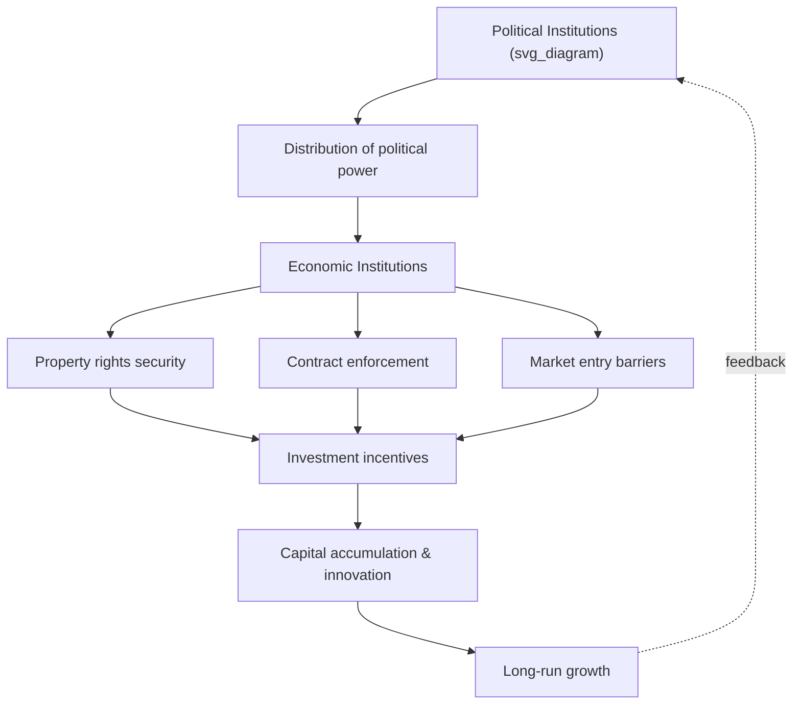
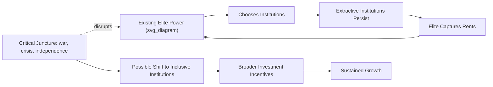

## Institutions, Property Rights, and Growth

### Overview

**Key Points**

- Institutional economics argues that the deep determinant of long-run growth is not capital accumulation or technology per se, but the rules, enforcement mechanisms, and social arrangements — institutions — that shape incentives to invest, innovate, and trade.
- Institutions determine whether the returns to productive effort are captured by the effort-maker (encouraging investment) or expropriated by others (discouraging it).
- This view reframes proximate causes of growth (physical capital, human capital, technology) as outcomes of deeper institutional causes.

### Defining Institutions

Douglass North defined institutions as the humanly devised constraints that structure political, economic, and social interaction. They consist of:

- **Formal rules**: constitutions, laws, property statutes, contracts, regulations
- **Informal constraints**: norms, conventions, codes of conduct, trust
- **Enforcement characteristics**: courts, police, reputation mechanisms, social sanctions

Institutions reduce uncertainty by establishing a stable (though not necessarily efficient) structure for exchange. They differ from organizations (firms, unions, governments), which are the players operating within the rules institutions set.

### Property Rights: Core Mechanism

Property rights are the bundle of rights an individual or entity holds over an asset: the right to use it, to derive income from it, and to transfer or sell it.

**Key Points**

- Secure property rights raise the private return to investment toward the social return, reducing the wedge that causes underinvestment.
- Insecure property rights create expropriation risk, which acts like a tax on the future — agents discount expected returns and invest less today.
- Property rights must be credible over a long horizon; a right that can be revoked at a ruler's or majority's discretion has weak protective value even if it exists on paper.

Formally, if $\pi$ is the probability that returns to investment $I$ are expropriated, the expected private return is:

$$E[R] = (1-\pi)R - c(I)$$

where $R$ is the gross return and $c(I)$ is the cost of investment. As $\pi \to 1$, expected return collapses toward zero regardless of the technological productivity of $I$, so investment falls even in a technologically capable economy.

### Extractive vs. Inclusive Institutions

Acemoglu and Robinson's framework (*Why Nations Fail*) distinguishes two ideal types:

**Inclusive institutions**

- Broad-based political participation and pluralism
- Secure, broadly distributed property rights
- Open entry into markets and occupations
- Independent courts enforcing contracts impartially

**Extractive institutions**

- Political power concentrated in a narrow elite
- Property rights insecure for the majority, secure only for the elite
- Entry barriers protecting incumbents
- Legal enforcement biased toward those in power

**Example**

A classic illustrative pair is North and South Korea: near-identical culture, geography, and initial human capital in 1950, but divergent institutional paths (market-oriented, inclusive-leaning in the South; centrally planned, extractive in the North) produced an enormous income gap by the 21st century. [Inference: the causal weight attributed entirely to institutions versus other post-war factors, such as differential aid and alliance structures, is debated in the literature.]

Extractive institutions can still generate short-run growth (e.g., Soviet industrialization) by reallocating resources into a narrow set of prioritized sectors, but this growth is not sustained because it lacks incentives for decentralized innovation and is vulnerable to elite capture and reversal.

### The Reversal of Fortune

Acemoglu, Johnson, and Robinson (2002) documented that regions that were relatively prosperous and densely populated in 1500 (e.g., Mexico, Peru, India) are often relatively poor today, while sparsely populated regions (e.g., North America, Australia) are now rich — a "reversal of fortune."

**Key Points**

- Their explanation: in densely populated, already-prosperous regions, European colonizers established **extractive institutions** to appropriate existing resources and labor (e.g., encomienda systems, forced labor in mines).
- In sparsely populated regions with fewer existing riches to extract, settlers established **inclusive institutions** resembling those of the colonizing country (secure property rights, representative government) because they intended to settle permanently.
- The reversal is difficult to explain with geography-based theories (which would predict persistence, not reversal) but fits an institutions-based theory, since colonial institutions persisted after independence through path dependence.

### Settler Mortality and Instrumental Variables

A central empirical challenge is reverse causality and omitted variables: does growth cause good institutions, or do institutions cause growth? Wealthy, high-human-capital societies might simply be more able to afford good institutions.

Acemoglu, Johnson, and Robinson (2001) addressed this using **settler mortality** in European colonies as an instrumental variable for institutional quality:

**Key Points**

- Where European settlers faced high mortality (malaria, yellow fever), they could not settle in large numbers and instead built extractive institutions to extract resources with minimal exposure.
- Where mortality was low, Europeans settled permanently and replicated inclusive institutions ("Neo-Europes").
- Colonial-era institutions strongly persisted post-independence.
- Using settler mortality as an instrument, they estimated a large, statistically significant causal effect of institutional quality (proxied by protection against expropriation risk) on current GDP per capita.

The identification strategy requires the exclusion restriction: settler mortality affects current income *only* through institutions, not through any other channel (e.g., disease environment directly harming current productivity). This assumption has been challenged. [Unverified: subsequent work, e.g., Albouy (2012), has disputed the accuracy and coding of the historical settler mortality data itself, raising concerns about the instrument's validity.]

### Institutions vs. Geography vs. Culture: Competing Explanations

**Key Points**

- **Geography hypothesis** (Sachs and others): climate, disease burden (e.g., malaria), and access to coastlines/navigable rivers directly constrain productivity and trade costs.
- **Culture hypothesis** (Weber-influenced): values, trust, work ethic, and social capital shape economic behavior independent of formal rules.
- **Institutions hypothesis** (North, Acemoglu, Robinson): rules and enforcement dominate once you control for reverse causality; geography and culture matter mainly insofar as they historically shaped institutional choices.

Rodrik, Subramanian, and Trebbi (2004) tested these against each other empirically and found that measures of institutional quality "trump" both geography and trade integration once endogeneity is addressed — geography and trade retain at most an indirect effect operating through institutions. [Inference: this ranking is influential but not a settled consensus; integration and geography proponents continue to argue for direct channels, e.g., disease burden's effect on human capital accumulation.]

### Channels: How Institutions Affect Growth

**Key Points**

1. **Investment incentives**: secure property rights raise expected after-expropriation returns, increasing physical and human capital accumulation.
2. **Contract enforcement**: independent courts and enforceable contracts lower transaction costs, enabling specialization, financial intermediation, and long-horizon agreements.
3. **Allocation of talent**: inclusive institutions allow talented individuals broad access to entrepreneurship and occupations; extractive institutions channel talent toward rent-seeking or political connections instead of productive activity.
4. **Innovation and creative destruction**: Schumpeterian growth requires that new entrants can challenge incumbents. Extractive institutions protect incumbents (who fear losing political power to new economic elites), suppressing the creative destruction needed for sustained TFP growth.
5. **Financial development**: institutions supporting creditor rights and information disclosure (e.g., credit registries, bankruptcy law) deepen credit markets, easing financing constraints on firms.

### Formal Growth Modeling with Institutions

Institutions can be incorporated into growth models as a wedge on the return to capital. Consider a simple neoclassical setup where the effective return to private investment is:

$$r_{private} = (1 - \tau_{institutional}) \cdot MPK$$

where $\tau_{institutional}$ represents an implicit tax from expropriation risk, weak contract enforcement, or corruption, and $MPK$ is the marginal product of capital. Lower institutional quality (higher $\tau_{institutional}$) shifts the steady-state capital stock per worker downward in a Solow-type framework, and in endogenous growth frameworks (e.g., AK or Romer-style models) can reduce the steady-state *growth rate* itself, not just the level of output, since it reduces the incentive to invest in the capital-accumulating or R&D sector on an ongoing basis.

**Key Points**

- In Solow-type models, institutions primarily affect the **level** of steady-state output per worker (via the capital-labor ratio and TFP level).
- In endogenous growth models, weak institutions can permanently affect the **growth rate**, because R&D and innovation investment depend continuously on appropriability of future rents.

### Measuring Institutional Quality

Common empirical proxies used in the growth literature:

| Measure | Source | What it Captures |
| --- | --- | --- |
| Protection Against Expropriation Risk | Political Risk Services (PRS) Group | Risk of government seizure of private assets |
| Rule of Law Index | World Bank Worldwide Governance Indicators | Contract enforcement, courts, crime |
| Polity IV/V Score | Center for Systemic Peace | Degree of democratic vs. autocratic political institutions |
| Economic Freedom Index | Fraser Institute / Heritage Foundation | Property rights, regulation, trade freedom |
| Control of Corruption | World Bank WGI | Extent public power is used for private gain |

**Key Points**

- All these indices face measurement challenges: they often rely on subjective expert perception rather than direct observation, are correlated with income (raising endogeneity concerns), and can vary substantially by methodology and year. [Unverified/Inference: cross-index correlations are generally reported as high, but exact figures vary by study and time period, so specific correlation coefficients should be verified against the current release of each dataset before citing.]

### Institutional Persistence and Path Dependence

**Key Points**

- Institutions tend to be "sticky": political elites who benefit from extractive arrangements resist reforms that would erode their power, even when reform would raise aggregate output (the elite's *share* of a bigger pie might be smaller than their *share* of a smaller, extractive pie).
- This creates a political economy trade-off: economically efficient institutional reform can be politically infeasible if it threatens incumbent power — a core insight of Acemoglu and Robinson's later work on the "political Coase theorem" failing in practice.
- Critical junctures (wars, independence, major crises) can dislodge persistent institutional equilibria, but the direction of change is not guaranteed to be toward inclusiveness.

### Rule of Law and Contract Enforcement

**Key Points**

- Rule of law requires that laws apply predictably and equally, including to those holding political power — distinguishing it from mere "rule by law" (law as a tool of the ruling elite).
- Weak contract enforcement raises transaction costs disproportionately for complex, long-horizon, or arm's-length transactions (e.g., external finance, supply chains with unrelated parties), pushing economic activity toward informal, relationship-based, and often smaller-scale enterprise.
- This helps explain why firms in weak-institution environments tend to remain small, family-owned, and reliant on informal enforcement (reputation, kinship networks) rather than scaling via formal capital markets.

### Corruption as an Institutional Failure

Corruption — the use of public office for private gain — is both a symptom and a cause of weak institutions.

**Key Points**

- "Grand corruption" (high-level state capture) versus "petty corruption" (low-level bribery for routine services) have different growth effects: grand corruption distorts large-scale investment and policy; petty corruption acts as a regressive tax on ordinary transactions and can deter small business formation.
- The "grease the wheels" hypothesis argues corruption may reduce inefficiency in over-regulated environments by allowing transactions to occur despite bad rules, but the dominant view in the empirical literature is "sand the wheels": corruption raises uncertainty, deters foreign direct investment, and misallocates public spending toward projects amenable to bribery (e.g., large infrastructure over targeted social spending) rather than economically optimal projects. [Inference: the balance of evidence favors the sand-the-wheels view, but context-dependent findings exist, particularly regarding whether regulation itself is the root distortion.]

### Institutions and Foreign Direct Investment / Trade

**Key Points**

- Secure property rights and enforceable contracts are consistently associated with higher inbound FDI, since foreign investors face additional expropriation risk (political risk of nationalization or discriminatory regulation against outsiders).
- Institutional quality affects gains from trade openness: countries with strong institutions are typically better able to reallocate resources into their comparative advantage sectors following trade liberalization, while weak institutions can allow liberalization gains to be captured by connected incumbents rather than broadly diffused.

### Criticisms and Open Debates

**Key Points**

- **Endogeneity remains contested**: even sophisticated instruments (like settler mortality) rely on strong and sometimes disputed identifying assumptions.
- **Institutions are multidimensional**: collapsing "institutions" into a single index (e.g., one expropriation-risk score) may obscure which specific institutional feature (courts, property law, political competition) is actually doing the causal work.
- **Reverse causality at the margin**: some scholars argue that a degree of economic development is a prerequisite for demand for better institutions (a "modernization" view), implying institutions and growth may be jointly determined rather than institutions being strictly prior.
- **China's growth path**: rapid growth despite relatively weak formal property rights protection and rule-of-law scores is often raised as an anomaly. [Speculation: explanations offered include informal/local institutional substitutes, such as reputation-based enforcement between firms and local officials, and a degree of implicit property security via Communist Party-linked structures, but there is no settled consensus on the precise mechanism, and predictions about the sustainability of this model going forward remain speculative and behavior may vary as policy evolves.]

### Policy Implications

**Key Points**

- Institutional reform is frequently proposed as a precondition for effective aid and investment programs (e.g., World Bank governance-conditionality frameworks), on the premise that capital and technology transfers underperform without secure property rights and enforcement.
- "Best practice" institutional transplants (importing legal codes or regulatory frameworks from developed countries) have a mixed empirical record, since formal rules imported without matching informal enforcement norms or political will often fail to bind in practice — a phenomenon sometimes termed "isomorphic mimicry."
- Gradualist, locally adapted institutional reforms (cited in analyses of China's township-village enterprises or Vietnam's land reform) are sometimes argued to outperform wholesale transplantation, though generalizability across contexts is debated. [Inference]

### Next Steps

**Related Topics**

- Endogenous growth theory (Romer, Aghion-Howitt Schumpeterian models)
- Solow-Swan growth model and convergence
- Total factor productivity and growth accounting
- Political economy of reform and the "political Coase theorem"
- Colonialism and comparative development
- Rent-seeking and Directly Unproductive Profit-seeking (DUP) activities
- Financial development and economic growth
- Human capital accumulation and growth
- Democracy, political regimes, and economic performance
- Natural resource curse and institutional quality
- Legal origins theory (La Porta, Lopez-de-Silanes, Shleifer, Vishny)
- State capacity and fiscal institutions