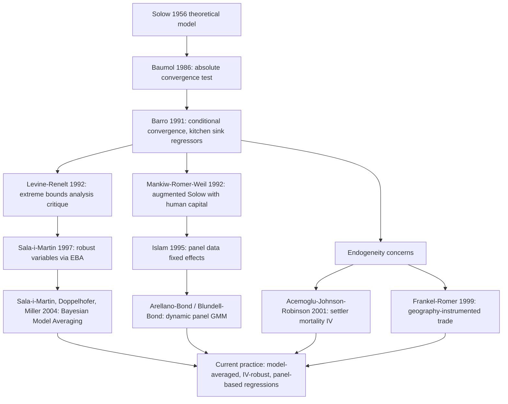

## Growth Empirics and Cross-Country Regressions

### Overview

Growth empirics is the branch of macroeconomics that uses statistical and econometric methods to test the predictions of growth theory (Solow, Ramsey, endogenous growth models) against observed cross-country and panel data. The central empirical vehicle is the **cross-country growth regression**, which relates a country's growth rate of income per capita to a set of initial conditions and structural variables, most famously initial income itself (to test convergence).

**Key Points**

- Growth empirics bridges theoretical growth models and real-world data
- The workhorse specification is the Barro-style cross-country growth regression
- Central debates concern convergence, conditioning variables, causality, and parameter heterogeneity
- Methodological toolkit spans OLS, panel data methods, instrumental variables, and growth accounting

### The Solow Framework as a Testable Model

The Solow model implies that economies converge to a steady state determined by the savings rate $s$, population growth $n$, depreciation $\delta$, and technology growth $g$. Near the steady state, the model predicts a log-linear approximation to the dynamics of income per effective worker:

$$\dot{y}(t) = \lambda \left[ \ln y^{*} - \ln y(t) \right]$$

where $\lambda$ is the speed of convergence, given approximately by:

$$\lambda = (n + g + \delta)(1 - \alpha)$$

with $\alpha$ as capital's share of income. This yields the **conditional convergence** equation that underlies most empirical growth regressions.

### The Baseline Cross-Country Growth Regression

The canonical specification, following Barro (1991) and Mankiw-Romer-Weil (1992), regresses the average growth rate of GDP per capita over a period on initial income and a set of controls:

$$\frac{1}{T}\left[\ln y_{i,t+T} - \ln y_{i,t}\right] = \beta_0 + \beta_1 \ln y_{i,t} + \beta_2' X_{i,t} + \varepsilon_{i,t}$$

- $y_{i,t}$: initial real GDP per capita for country $i$
- $X_{i,t}$: vector of conditioning variables (investment rate, human capital, population growth, institutional quality, trade openness, etc.)
- $\beta_1$: coefficient of interest — a negative and significant $\beta_1$ indicates **conditional convergence**
- $T$: length of the period (commonly 10, 20, or 30+ years, using Penn World Table or World Bank data)

**Example**

A typical Mankiw-Romer-Weil-style regression using data on ~100 non-oil countries from 1960–1985:

$$\ln(GDP_{85}/GDP_{60}) = \beta_0 + \beta_1 \ln(GDP_{60}) + \beta_2 \ln(I/GDP) + \beta_3 \ln(n+g+\delta) + \beta_4 \ln(SCHOOL) + \varepsilon$$

Findings from this class of regressions typically show that once investment, population growth, and human capital (school enrollment as a proxy) are controlled for, the coefficient on initial income turns significantly negative — supporting conditional, not absolute, convergence. [Inference: exact coefficient magnitudes are study- and sample-dependent and should not be treated as universal constants.]

### Absolute vs. Conditional Convergence

- **Absolute (unconditional) convergence**: poorer countries grow faster than rich countries regardless of other characteristics, implying all economies converge to the *same* steady state. Empirically, this fails when tested on a broad, heterogeneous sample of countries (the $\beta_1$ coefficient in a bivariate regression of growth on initial income is often insignificant or even positive).
- **Conditional convergence**: poorer countries grow faster than rich countries *only after* controlling for determinants of the steady state (savings, education, institutions). This is the more robust empirical finding and is consistent with the Solow model once heterogeneity in steady states is allowed.
- **Club convergence**: subgroups of countries with similar structural characteristics (e.g., OECD economies) converge to a common steady state; convergence is absolute within the club but not across all countries.

### Diagram: Convergence Regression Logic (svg_diagram)

<svg xmlns="http://www.w3.org/2000/svg" viewBox="0 0 820 380">
<text x="410" y="30" text-anchor="middle" font-size="18" font-weight="bold" fill="#1a1a1a">Convergence Regression Logic (svg_diagram)</text>
<rect x="40" y="70" width="220" height="90" rx="8" fill="#eef4fb" stroke="#3366aa" stroke-width="1.5" />
<text x="150" y="100" text-anchor="middle" font-size="13" font-weight="bold" fill="#1a1a1a">Absolute Convergence Test</text>
<text x="150" y="120" text-anchor="middle" font-size="11" fill="#333">Regress growth on</text>
<text x="150" y="136" text-anchor="middle" font-size="11" fill="#333">initial income only</text>
<rect x="300" y="70" width="220" height="90" rx="8" fill="#fbeeee" stroke="#aa3333" stroke-width="1.5" />
<text x="410" y="100" text-anchor="middle" font-size="13" font-weight="bold" fill="#1a1a1a">Result: Weak/No Fit</text>
<text x="410" y="120" text-anchor="middle" font-size="11" fill="#333">Heterogeneous steady</text>
<text x="410" y="136" text-anchor="middle" font-size="11" fill="#333">states confound test</text>
<rect x="560" y="70" width="220" height="90" rx="8" fill="#eef9ef" stroke="#339944" stroke-width="1.5" />
<text x="670" y="100" text-anchor="middle" font-size="13" font-weight="bold" fill="#1a1a1a">Add Conditioning Vars</text>
<text x="670" y="120" text-anchor="middle" font-size="11" fill="#333">Investment, schooling,</text>
<text x="670" y="136" text-anchor="middle" font-size="11" fill="#333">population growth</text>
<path d="M260,115 L300,115" stroke="#555" stroke-width="2" marker-end="url(#arrow)" />
<path d="M520,115 L560,115" stroke="#555" stroke-width="2" marker-end="url(#arrow)" />
<rect x="300" y="220" width="220" height="90" rx="8" fill="#fef7e6" stroke="#cc8800" stroke-width="1.5" />
<text x="410" y="250" text-anchor="middle" font-size="13" font-weight="bold" fill="#1a1a1a">Conditional Convergence</text>
<text x="410" y="270" text-anchor="middle" font-size="11" fill="#333">Negative, significant</text>
<text x="410" y="286" text-anchor="middle" font-size="11" fill="#333">coefficient on ln(y₀)</text>
<path d="M670,160 L670,190 L410,190 L410,220" stroke="#555" stroke-width="2" fill="none" marker-end="url(#arrow)" />
<rect x="40" y="220" width="220" height="90" rx="8" fill="#f3eefb" stroke="#7733aa" stroke-width="1.5" />
<text x="150" y="250" text-anchor="middle" font-size="13" font-weight="bold" fill="#1a1a1a">Interpretation</text>
<text x="150" y="270" text-anchor="middle" font-size="11" fill="#333">Consistent with Solow:</text>
<text x="150" y="286" text-anchor="middle" font-size="11" fill="#333">diminishing returns to capital</text>
<path d="M300,265 L260,265" stroke="#555" stroke-width="2" marker-end="url(#arrow)" />
</svg>

### The Mankiw-Romer-Weil (1992) Augmented Solow Model

MRW extended Solow by adding human capital as a third factor of production:

$$Y = K^{\alpha} H^{\beta} (AL)^{1-\alpha-\beta}$$

This generates a steady-state income equation:

$$\ln\left(\frac{Y}{L}\right) = \ln A(0) + gt - \frac{\alpha+\beta}{1-\alpha-\beta}\ln(n+g+\delta) + \frac{\alpha}{1-\alpha-\beta}\ln(s_k) + \frac{\beta}{1-\alpha-\beta}\ln(s_h)$$

**Key Points**

- Adding human capital substantially improved the explanatory power of Solow-based regressions (MRW report large increases in $R^2$ relative to the unaugmented model)
- The implied capital shares from regression coefficients become more consistent with national accounts data once human capital is included
- This paper is widely treated as the benchmark reconciling Solow-type theory with cross-country data [Inference: reception and robustness have been debated extensively in subsequent literature, discussed below]

### Barro-Style Growth Regressions and the "Kitchen Sink" Problem

Barro (1991, 1997) popularized regressions including a wide array of right-hand-side variables:

$$g_i = \beta_0 + \beta_1 \ln y_{i,0} + \beta_2 \text{Educ}_i + \beta_3 \text{Fertility}_i + \beta_4 \text{GovConsumption}_i + \beta_5 \text{RuleOfLaw}_i + \beta_6 \text{Inflation}_i + \dots + \varepsilon_i$$

This approach generated the so-called **"kitchen sink" regression problem**:

- Over 140 variables have been proposed in the literature as significant growth determinants (Sala-i-Martin, 1997)
- With finite degrees of freedom and many candidate regressors, results are highly sensitive to which controls are included ("model uncertainty")
- Levine and Renelt (1992) showed via extreme-bounds analysis (EBA) that almost no variable besides the investment share was "robust" across specifications

### Addressing Model Uncertainty

**Extreme Bounds Analysis (EBA)**

Tests whether a variable's coefficient remains significant and of consistent sign across all combinations of a fixed set of "doubtful" control variables. A variable is "robust" only if its coefficient bound never changes sign or loses significance.

**Bayesian Model Averaging (BMA)**

Sala-i-Martin, Doppelhofer, and Miller (2004) applied BMA across millions of possible regression specifications, computing a posterior inclusion probability for each candidate variable. Variables like initial income, investment price, and certain regional dummies (e.g., Sub-Saharan Africa) showed consistently high inclusion probabilities.

$$P(\theta \mid \mathbf{y}) = \sum_{j} P(\theta \mid M_j, \mathbf{y}) P(M_j \mid \mathbf{y})$$

where the posterior distribution of a parameter $\theta$ is averaged across all models $M_j$ weighted by each model's posterior probability.

### Growth Accounting: Complementary Methodology

Distinct from regression-based empirics, **growth accounting** decomposes observed output growth into factor contributions using the Solow residual:

$$\frac{\dot{Y}}{Y} = \frac{\dot{A}}{A} + \alpha\frac{\dot{K}}{K} + (1-\alpha)\frac{\dot{L}}{L}$$

The residual $\dot{A}/A$ (total factor productivity growth) captures technological progress and efficiency gains not explained by input accumulation. This method underlies studies of the East Asian growth "miracle," where Young (1995) and Krugman (1994) argued that much of the growth in countries like Singapore was attributable to factor accumulation rather than TFP growth — a claim with major implications for growth sustainability. [Unverified: precise TFP decomposition estimates vary substantially depending on capital share assumptions and data vintage.]

### Panel Data Approaches

Cross-sectional regressions cannot control for unobserved, time-invariant country heterogeneity (e.g., culture, geography, baseline institutions), which biases $\beta_1$. Panel methods address this:

- **Fixed effects (within estimator)**: removes country-specific time-invariant heterogeneity, but Solow-implied convergence speeds estimated from fixed-effects panels are typically much faster (~10% per year) than cross-sectional estimates (~2% per year) — the "convergence speed puzzle" (Islam, 1995)
- **Difference and System GMM (Arellano-Bond, Blundell-Bond)**: handles the dynamic panel bias arising from a lagged dependent variable correlated with fixed effects, using lagged levels/differences as instruments

$$y_{i,t} - y_{i,t-1} = \beta_1 y_{i,t-1} + \beta_2' X_{i,t} + \eta_i + \varepsilon_{i,t}$$

**Key Points**

- Panel methods increase precision by using within-country variation but discard cross-country long-run information
- GMM estimators are sensitive to instrument proliferation and weak-instrument problems in short panels

### The Causality and Endogeneity Problem

Most conditioning variables (investment, institutions, human capital, trade openness) are plausibly endogenous to growth itself, biasing OLS coefficients. Major identification strategies developed in response:

- **Institutions and settler mortality (Acemoglu, Johnson, Robinson, 2001)**: uses historical settler mortality rates as an instrument for current institutional quality, arguing colonizers established extractive vs. inclusive institutions based on disease environment
- **Geography and instrumented trade (Frankel and Romer, 1999)**: uses a gravity-model-predicted trade share (based on distance, population, and land area) as an instrument for actual trade openness to test its effect on income
- **Legal origin (La Porta et al.)**: uses whether a country's legal system derives from English common law or French/German/Scandinavian civil law as an instrument for financial development and investor protection

$$\ln y_i = \beta_0 + \beta_1 \widehat{\text{Institutions}}_i + \varepsilon_i, \quad \widehat{\text{Institutions}}_i = \gamma_0 + \gamma_1 \text{SettlerMortality}_i + u_i$$

These instrumental variables approaches remain contested on exclusion-restriction grounds — critics argue settler mortality or geography may affect income through channels other than the proposed variable. [Speculation: the debate over instrument validity in this literature is unlikely to be fully resolved, as exclusion restrictions are fundamentally untestable.]

### Parameter Heterogeneity and Threshold Effects

A key critique of pooled cross-country regressions is the assumption of a common $\beta_1$ and common $\beta_2$ vector across all countries, which is theoretically implausible given structural differences.

- **Durlauf and Johnson (1995)**: use regression tree methods to identify multiple growth regimes rather than a single linear specification, finding evidence of multiple convergence "clubs" split by initial income and literacy thresholds
- **Threshold regression models**: allow coefficients to differ above/below an estimated threshold value of a conditioning variable (e.g., financial development, human capital)
- **Quantile regressions**: estimate how the effect of a regressor varies across the conditional growth distribution rather than only at the mean

### Data Sources

| Dataset | Coverage | Common Use |
| --- | --- | --- |
| Penn World Table (PWT) | 180+ countries, PPP-adjusted GDP, capital stocks | Standard cross-country income/growth series |
| World Bank WDI | Broad macro/social indicators | Investment, trade, education controls |
| Barro-Lee Educational Attainment | Schooling years by country/age/gender | Human capital proxy |
| Polity IV / V-Dem | Institutional and democracy indices | Institutional quality controls |
| Maddison Project Database | Historical GDP estimates, some series to 1 CE | Long-run growth and convergence studies |

### Mermaid Diagram: Methodological Evolution of Growth Empirics

### Common Methodological Pitfalls

- **Galton's fallacy**: regression to the mean can mechanically generate apparent convergence even absent any structural convergence process; must be distinguished from genuine catch-up growth
- **Survivorship and sample selection bias**: many historical growth datasets disproportionately include countries that persisted as sovereign states or maintained data collection, potentially skewing convergence estimates
- **Measurement error in GDP and capital stock**: particularly severe for developing countries, biasing coefficients (often toward zero for the mismeasured regressor, unpredictably for others via correlated measurement error)
- **Omitted variable bias**: any excluded but growth-relevant variable correlated with included regressors biases those coefficients
- **Reverse causality**: e.g., growth may cause institutional improvement or higher investment rates, rather than solely the reverse

### Worked Example: Interpreting a Convergence Coefficient

Suppose a regression yields $\beta_1 = -0.02$ on $\ln y_{i,0}$ with annual growth as the dependent variable. Using the Solow approximation $\beta_1 \approx -(1-e^{-\lambda T})/T$, and solving for $\lambda$ with $T=1$:

$$\lambda = -\ln(1+\beta_1) \approx 0.0202$$

This implies a conditional convergence speed of about 2% per year, meaning that roughly $1-e^{-0.02\times 35} \approx 50\%$ of the initial income gap relative to steady state closes over roughly 35 years — a figure widely cited as the "stylized" convergence rate found in early cross-country studies. [Inference: this 2% figure is a commonly cited empirical regularity, not a structural constant, and panel-data studies often find materially different speeds.]

**Conclusion**

Growth empirics evolved from simple bivariate convergence tests into a mature econometric field addressing model uncertainty, dynamic panel bias, and endogeneity of institutions and policy variables. While conditional convergence and the explanatory power of investment, human capital, and institutional quality are relatively well-established findings, the field continues to grapple with parameter heterogeneity across countries, the validity of instruments used for causal identification, and reconciling growth-accounting decompositions with regression-based estimates of TFP's role in long-run growth.

**Related Topics**

- Growth accounting and total factor productivity decomposition
- Endogenous growth models (Romer, Lucas, Aghion-Howitt)
- Institutions and economic development (Acemoglu-Robinson framework)
- Panel data econometrics: fixed effects vs. dynamic GMM estimators
- Bayesian Model Averaging in applied economics
- The middle-income trap and club convergence
- Human capital measurement and the Mincer/Barro-Lee datasets
- Total factor productivity divergence and the East Asian growth debate