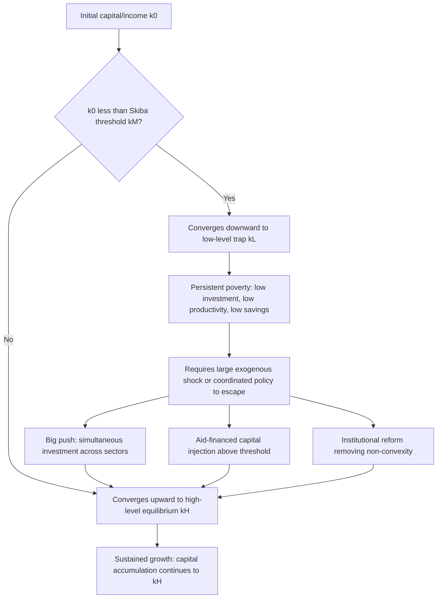

## Poverty Traps and Multiple Equilibria

### Overview

A poverty trap is a self-reinforcing mechanism that causes poverty, once it exists, to persist unless some large, discontinuous intervention disrupts it. Formally, this is modeled as a dynamic system exhibiting **multiple equilibria**, where an economy's long-run outcome depends on its initial conditions rather than converging to a single, unique steady state as in the basic Solow model. This topic represents a major departure from neoclassical convergence predictions and underlies much of the modern theory of underdevelopment.

**Key Points**

- Poverty traps arise from non-convexities, threshold effects, or coordination failures
- Multiple equilibria imply history-dependence ("hysteresis"): initial conditions determine which steady state an economy reaches
- Policy implications differ sharply from the Solow model: a "big push" may be needed rather than marginal reform
- Empirical identification of poverty traps is econometrically difficult and contested

### Why Multiple Equilibria Depart from Solow

In the standard Solow model, the law of motion for capital per effective worker is:

$$\dot{k} = s f(k) - (n+g+\delta)k$$

With diminishing returns to capital ($f''(k) < 0$), the savings curve $sf(k)$ and the effective depreciation line $(n+g+\delta)k$ intersect exactly once for $k>0$, guaranteeing a **unique, globally stable steady state** $k^*$. Poverty trap models modify this structure — typically via increasing returns, externalities, or S-shaped production/savings functions — so that the two curves intersect **more than once**, producing multiple steady states with different stability properties.

### The Canonical S-Shaped Savings/Investment Function

A common mechanism assumes $sf(k)$ is S-shaped (sigmoidal) rather than concave everywhere — reflecting increasing returns at low capital levels (e.g., from a fixed cost of adopting a productive technology) followed by diminishing returns at higher levels.

$$\dot{k} = s f(k) - (n+\delta)k$$

This yields three intersection points:

- $k_L$: a **low-level stable equilibrium** (the poverty trap)
- $k_M$: an **unstable equilibrium** (the threshold or "Skiba point")
- $k_H$: a **high-level stable equilibrium** (the developed steady state)

An economy starting below $k_M$ converges down to $k_L$; one starting above $k_M$ converges up to $k_H$.

### Diagram: S-Shaped Growth Path and Multiple Equilibria (svg_diagram)

<svg xmlns="http://www.w3.org/2000/svg" viewBox="0 0 820 460">
<text x="410" y="30" text-anchor="middle" font-size="18" font-weight="bold" fill="#1a1a1a">S-Shaped Growth Path and Multiple Equilibria (svg_diagram)</text>
<line x1="80" y1="400" x2="760" y2="400" stroke="#333" stroke-width="2" />
<line x1="80" y1="400" x2="80" y2="60" stroke="#333" stroke-width="2" />
<text x="770" y="405" font-size="13" fill="#333">k</text>
<text x="60" y="60" font-size="13" fill="#333">y</text>

<path d="M80,395 C 200,390 280,340 340,260 C 400,190 460,110 560,90 C 640,75 700,68 750,64" fill="none" stroke="`#2266aa`" stroke-width="3" />

<text x="600" y="60" font-size="12" fill="`#2266aa`" font-weight="bold">sf(k)</text>

<line x1="80" y1="400" x2="750" y2="90" stroke="#aa3333" stroke-width="2.5" />
<text x="700" y="100" font-size="12" fill="#aa3333" font-weight="bold">(n+δ)k</text>
<circle cx="205" cy="374" r="6" fill="#228833" />
<text x="205" y="425" text-anchor="middle" font-size="12" fill="#228833" font-weight="bold">k_L</text>
<text x="205" y="440" text-anchor="middle" font-size="10" fill="#555">stable (trap)</text>
<circle cx="405" cy="235" r="6" fill="#cc8800" />
<text x="405" y="425" text-anchor="middle" font-size="12" fill="#cc8800" font-weight="bold">k_M</text>
<text x="405" y="440" text-anchor="middle" font-size="10" fill="#555">unstable (Skiba point)</text>
<circle cx="635" cy="128" r="6" fill="#228833" />
<text x="635" y="425" text-anchor="middle" font-size="12" fill="#228833" font-weight="bold">k_H</text>
<text x="635" y="440" text-anchor="middle" font-size="10" fill="#555">stable (developed)</text>
<path d="M300,380 L340,380" stroke="#666" stroke-width="1.5" marker-end="url(#arrow2)" />
<path d="M500,180 L540,180" stroke="#666" stroke-width="1.5" marker-end="url(#arrow2)" />
<path d="M340,380 L320,380" stroke="#666" stroke-width="1.5" marker-end="url(#arrow2)" transform="translate(0,0)" />
</svg>

### Sources of Non-Convexity: Core Mechanisms

**1. Nutrition-Based Efficiency Wage Traps**

Low income → inadequate nutrition → low labor productivity → low wages → low income. This is formalized in efficiency-wage models where worker productivity $e(w)$ is an increasing, convex-then-concave function of the wage at low income levels (Dasgupta and Ray, 1986; Leibenstein, 1957).

$$\text{Firm's problem: } \min_w \frac{w}{e(w)}$$

At very low wages, $e(w)$ rises so steeply with $w$ (due to nutritional thresholds) that the cost-minimizing wage exceeds subsistence — but if an economy starts too poor to pay this wage, workers remain underfed and unproductive.

**2. Coordination Failure and the Big Push (Rosenstein-Rodan, 1943; Murphy, Shleifer, Vishny, 1989)**

Industrialization requires simultaneous investment across many sectors because each firm's profitability depends on demand generated by other firms' wage payments. No single firm has an incentive to industrialize alone, even though *all* firms industrializing together would be profitable. This is a **coordination game with multiple Nash equilibria**: a low-level equilibrium (no one industrializes) and a high-level equilibrium (everyone industrializes), both self-sustaining.

$$\pi_i = f(\text{Demand from sectors } j \neq i)$$

**3. Human Capital / Fertility Traps (Becker, Murphy, Tamura, 1990; Galor and Zeira, 1993)**

Under credit constraints, poor households cannot finance education for their children (due to indivisibilities in human capital investment and imperfect capital markets), so poverty is transmitted across generations even when the potential return to education is high.

$$h_{t+1} = \begin{cases} \phi(h_t) & \text{if } h_t \geq \bar{h} \text{ (borrowing constraint binds below threshold)} \\ \psi(h_t) & \text{if } h_t < \bar{h} \end{cases}$$

with $\phi(\cdot)$ generating convergence to a high human-capital steady state and $\psi(\cdot)$ generating convergence to a low one.

**4. Institutional and Geographic Traps**

Weak institutions, disease burden (e.g., malaria), and poor geography (landlocked status, adverse agro-climatic conditions) can generate self-reinforcing low-investment, low-growth outcomes independent of pure capital accumulation dynamics (Sachs, 2001; Bloom and Sachs, 1998).

**5. Increasing Returns from Infrastructure/Networks**

Public infrastructure (roads, electricity grids) exhibits network externalities: an individual firm's return to using infrastructure rises with the number of other users, generating an S-shaped aggregate return curve analogous to the S-shaped savings function above.

### Formal Multiple-Equilibria Structure: A General Difference Equation

Multiple equilibria can be represented generally via a nonlinear transition function $k_{t+1} = g(k_t)$ that crosses the 45-degree line more than once:

$$k_{t+1} = g(k_t), \quad g'(k^*) < 1 \text{ (stable)}, \quad g'(k^*) > 1 \text{ (unstable)}$$

### Diagram: Basin of Attraction Dynamics

### Empirical Evidence and Identification Challenges

Testing for poverty traps empirically is difficult because it requires detecting **non-linearity** and **multimodality** in the distribution of cross-country income or in individual/household panel data, rather than simply testing convergence coefficients.

- **Cross-country income distribution studies (Quah, 1996, 1997)**: examine whether the world income distribution is bimodal ("twin peaks") — evidence of clustering around a rich and a poor mode is interpreted as consistent with multiple equilibria, though later work has questioned the robustness and mechanism behind this pattern
- **Household-level asset threshold studies (Lybbert et al., 2004; Barrett and Carter, 2013)**: use panel data on household assets (particularly livestock in pastoralist economies) to estimate nonparametric asset dynamics and test for a threshold below which asset accumulation stalls or reverses
- **Micro RCT evidence**: "Graduation" program evaluations (e.g., BRAC's ultra-poor graduation model, studied by Banerjee, Duflo, et al., 2015 across multiple countries) test whether a one-time large asset transfer pushes households durably above a poverty threshold — findings generally show persistent gains years after the transfer, offering some support for threshold dynamics at the household level [Inference: interpreted by proponents as evidence for poverty traps, though alternative explanations such as simple diminishing-returns wealth effects without multiple equilibria are also consistent with persistent gains]

**Example**

In the BRAC graduation model, a household starting with assets below a critical threshold $\bar{A}$ is given a lump-sum transfer of livestock/assets plus training and temporary consumption support, intended to push $A_0 > \bar{A}$ so that subsequent asset dynamics $A_{t+1} = h(A_t)$ carry the household to the high-asset equilibrium rather than reverting to $A_L$.

### Critiques and Alternative Interpretations

- **Kraay and McKenzie (2014)** argue that convincing empirical evidence for poverty traps at the macro (cross-country) level is scarce; documented cases of clear multiple-equilibria dynamics are more robust at micro/household levels (e.g., specific asset thresholds in pastoralist livestock economies) than at the national level
- Persistent poverty can alternatively be explained by a **single, low, but unique steady state** (e.g., driven by weak institutions or geography) without any threshold dynamics — observationally, slow convergence toward a low steady state can resemble a trap without technically being one
- Distinguishing a "low unique equilibrium" from a "one of several equilibria" requires identifying the *counterfactual* alternative equilibrium reachable from different initial conditions, which is rarely directly observable

### Policy Implications

| Model Type | Policy Implication |
| --- | --- |
| Unique steady state (Solow-type) | Marginal policy improvements (raise $s$, lower $n$) shift the steady state gradually |
| Poverty trap (multiple equilibria) | Marginal aid is ineffective if it doesn't cross the threshold; large, coordinated "big push" investment is required |
| Coordination failure | Requires solving a collective action problem — may need government-coordinated industrial policy or credible commitment mechanisms |
| Credit-constrained human capital trap | Microfinance, conditional cash transfers, or public schooling investment can substitute for missing credit markets |

**Key Points**

- The policy relevance of poverty-trap theory is central to debates over foreign aid effectiveness (Sachs's "big push" advocacy vs. Easterly's skepticism about aid-driven escapes from poverty)
- If traps are real, small aid flows are wasted below the threshold but transformative above it — implying aid effectiveness is highly nonlinear
- If no trap exists, aid effectiveness should scale roughly linearly (or according to diminishing returns) with amount disbursed

### Related Formal Model: Big Push with Strategic Complementarities

Consider two sectors with payoffs to industrializing depending on whether the other sector industrializes:

$$\pi_i(\text{Industrialize}) = \begin{cases} \pi^{H} & \text{if sector } j \text{ industrializes} \\ \pi^{L} & \text{if sector } j \text{ does not} \end{cases}$$

with $\pi^H > 0 > \pi^L$ for at least one sector acting alone, but $\pi^H > 0$ for both acting together. This is a coordination game with two pure-strategy Nash equilibria: (Industrialize, Industrialize) and (Traditional, Traditional), with the former Pareto-dominant but not reachable through uncoordinated individual decisions — precisely the rationale for public coordination or subsidized simultaneous investment.

**Conclusion**

Poverty trap theory provides a rigorous account of why some economies fail to converge toward high-income steady states even over long horizons, grounded in non-convexities from nutrition, coordination failures, credit constraints, or institutional/geographic factors. While the theoretical mechanisms are well-established and mathematically tractable, robust macro-level empirical confirmation remains contested; the strongest evidence for genuine multiple-equilibria dynamics currently comes from micro-level (household/asset) studies rather than cross-country income data. The policy stakes are high: if poverty traps are pervasive, the case for large, coordinated interventions (a "big push") is much stronger than the case for marginal, incremental reform.

**Related Topics**

- The big push model (Rosenstein-Rodan, Murphy-Shleifer-Vishny)
- Credit constraints and human capital accumulation (Galor-Zeira model)
- Nutrition-based efficiency wage models
- Twin peaks and the evolution of the world income distribution (Quah)
- Aid effectiveness debates (Sachs vs. Easterly)
- Coordination games and multiple Nash equilibria in economic development
- Graduation programs and randomized evaluations of poverty interventions
- Geography, disease burden, and institutions as growth determinants