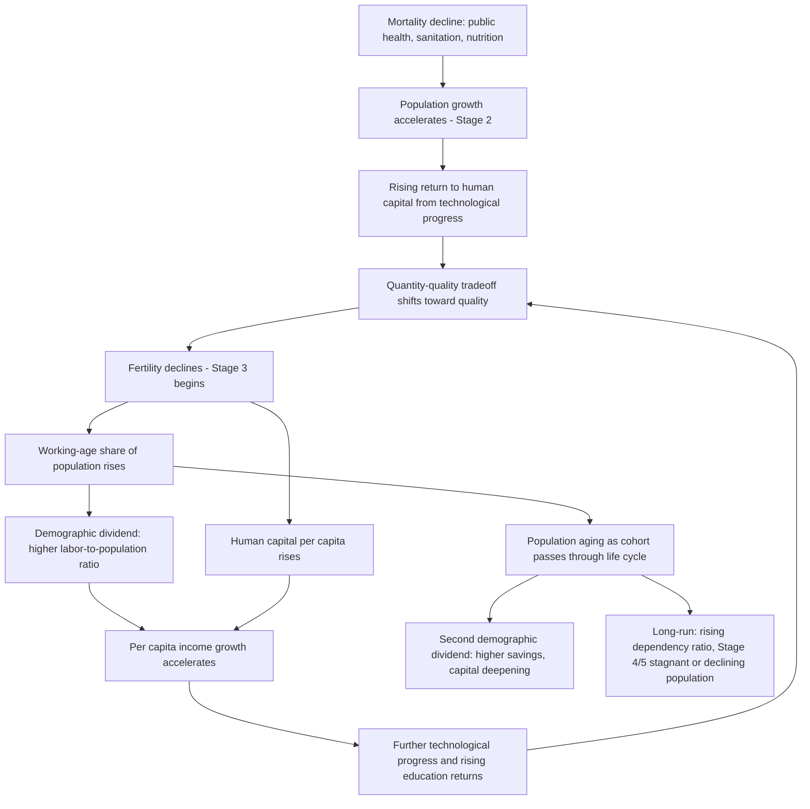

## Demographic Transition and Growth

### Overview

The demographic transition describes the historical shift of a society from a regime of high fertility and high mortality to one of low fertility and low mortality, typically passing through an intermediate phase of rapid population growth as mortality falls before fertility adjusts downward. This transition interacts fundamentally with economic growth: it both responds to and drives changes in income, human capital investment, and the age structure of the population, generating the phenomenon known as the **demographic dividend**.

**Key Points**

- The demographic transition typically unfolds in four (sometimes five) stages defined by fertility and mortality patterns
- Unified growth theory integrates the transition endogenously into long-run growth models, explaining the historical escape from Malthusian stagnation
- The transition generates a temporary "demographic dividend" through a rising working-age share of the population
- The quantity-quality tradeoff in fertility is the central microeconomic mechanism linking demographic change to human capital accumulation

### The Four (or Five) Stages of Demographic Transition

| Stage | Fertility | Mortality | Population Growth | Historical Example |
| --- | --- | --- | --- | --- |
| Stage 1 | High | High | Low/stable | Pre-industrial societies |
| Stage 2 | High | Falling rapidly | Rapid (acceleration) | 19th century Europe; 20th century developing world |
| Stage 3 | Falling | Low | Decelerating but still positive | Mid-to-late transition economies |
| Stage 4 | Low | Low | Low/stable | Most high-income countries today |
| Stage 5 (proposed) | Below replacement | Low | Negative/declining | Japan, South Korea, much of Europe |

### Diagram: Demographic Transition Model

<svg xmlns="http://www.w3.org/2000/svg" viewBox="0 0 820 440">
<text x="410" y="30" text-anchor="middle" font-size="18" font-weight="bold" fill="#1a1a1a">Demographic Transition Model (svg_diagram)</text>
<line x1="90" y1="380" x2="770" y2="380" stroke="#333" stroke-width="2" />
<line x1="90" y1="380" x2="90" y2="60" stroke="#333" stroke-width="2" />
<text x="780" y="385" font-size="13" fill="#333">Time</text>
<text x="70" y="55" font-size="13" fill="#333">Rate</text>
<line x1="260" y1="60" x2="260" y2="380" stroke="#ccc" stroke-dasharray="4,4" />
<line x1="430" y1="60" x2="430" y2="380" stroke="#ccc" stroke-dasharray="4,4" />
<line x1="600" y1="60" x2="600" y2="380" stroke="#ccc" stroke-dasharray="4,4" />

<text x="175" y="400" text-anchor="middle" font-size="12" fill="#555">Stage 1</text>

<text x="345" y="400" text-anchor="middle" font-size="12" fill="#555">Stage 2</text>

<text x="515" y="400" text-anchor="middle" font-size="12" fill="#555">Stage 3</text>

<text x="685" y="400" text-anchor="middle" font-size="12" fill="#555">Stage 4</text>

<path d="M90,110 L260,105 C 340,140 380,290 430,320 C 500,340 560,345 600,348 C 680,350 740,350 770,350" fill="none" stroke="`#aa3333`" stroke-width="3" />

<text x="710" y="335" font-size="12" fill="`#aa3333`" font-weight="bold">Birth Rate</text>

<path d="M90,140 C 160,160 220,200 260,240 C 320,300 380,340 430,355 C 500,362 560,364 600,365 C 680,366 740,366 770,366" fill="none" stroke="`#2266aa`" stroke-width="3" />

<text x="710" y="378" font-size="12" fill="`#2266aa`" font-weight="bold">Death Rate</text>

<path d="M90,375 L260,372 C 320,300 380,180 430,120 C 500,90 560,80 600,75 C 680,73 740,373 770,372" fill="none" stroke="`#228833`" stroke-width="2" stroke-dasharray="6,3" opacity="0.7" />

<text x="480" y="95" font-size="12" fill="`#228833`" font-weight="bold">Population Growth</text>

</svg>

### The Malthusian Regime and the Escape

Prior to the transition, economies were characterized by the **Malthusian trap**: technological improvements raised income temporarily, but higher income induced higher fertility and/or lower mortality, expanding population until per capita income was driven back to subsistence.

$$n(y) \text{ increasing in } y, \quad \dot{y} \approx 0 \text{ in steady state due to population pressure on fixed land}$$

Unified growth theory (Galor and Weil, 2000; Galor, 2005, 2011) models the historical transition out of this regime as an endogenous consequence of technological progress interacting with human capital demand:

$$g_A(t) \uparrow \Rightarrow \text{return to human capital} \uparrow \Rightarrow \text{quantity-quality tradeoff shifts toward quality} \Rightarrow n \downarrow, \, h \uparrow$$

As technological growth accelerates, the return to child *quality* (education) rises relative to child *quantity*, inducing parents to have fewer, more educated children — simultaneously reducing fertility and raising human capital, reinforcing further technological progress in a virtuous cycle.

### The Quantity-Quality Tradeoff (Becker-Lewis Model)

Formally, parents maximize utility over the number of children $n$, human capital investment per child (quality) $q$, and other consumption $c$, subject to a budget constraint in which the cost of quality and quantity interact multiplicatively:

$$\max_{n,q,c} U(n, q, c) \quad \text{s.t.} \quad p_n n + p_q q n + c \leq I$$

Because the price of quantity $p_n$ effectively rises with the level of quality chosen ($p_q q n$ term), an increase in the shadow price of quality (e.g., from higher returns to schooling) induces substitution away from quantity toward quality — generating the empirically observed negative correlation between family size and per-child educational investment.

$$\frac{\partial n^*}{\partial (\text{return to education})} < 0, \quad \frac{\partial q^*}{\partial (\text{return to education})} > 0$$

**Example**

Historically, as returns to industrial-era skilled labor rose in 19th-century Europe, households shifted from the traditional pattern of many children with minimal schooling toward fewer children with substantial primary and secondary education — a pattern documented extensively in the economic history literature on the fertility decline preceding sustained income growth. [Inference: causal magnitudes and timing vary by country/region and remain subject to ongoing empirical debate in economic history.]

### The Demographic Dividend

As fertility falls following a mortality decline, the age structure of the population temporarily shifts toward a higher **working-age share** (population aged roughly 15–64 relative to dependents), creating a window of opportunity for accelerated per capita income growth — the "first demographic dividend."

$$\text{Dependency Ratio} = \frac{\text{Population}_{<15} + \text{Population}_{65+}}{\text{Population}_{15-64}}$$

$$\text{Growth in } \frac{Y}{N} = \text{Growth in } \frac{Y}{L} + \text{Growth in } \frac{L}{N}$$

where $Y/L$ is output per worker and $L/N$ is the labor-force-to-total-population ratio. A rising $L/N$ mechanically boosts $Y/N$ growth even absent any change in productivity.

**Key Points**

- Bloom and Williamson (1998) estimate that the demographic dividend accounted for a substantial share of the East Asian "economic miracle" growth in per capita income from the 1960s–1990s [Inference: precise attributed share varies across studies and specifications]
- The dividend is a *level-shifting, temporary* growth effect — it raises the growth rate during the transition window but does not persist indefinitely
- Realizing the dividend requires complementary policies: education, labor market flexibility, and health systems to productively employ the expanded working-age cohort; absent these, a large youth cohort can instead generate unemployment and social instability
- A **second demographic dividend** can follow if the same population responds to longer life expectancy by accumulating more savings/assets for retirement, boosting capital accumulation (Mason and Lee, 2006)

### Mermaid Diagram: Mechanism Linking Demographic Transition to Growth

### Aging and the Reversal: Stage 4/5 Growth Challenges

Once fertility falls below replacement level (approximately 2.1 births per woman in low-mortality settings) and life expectancy continues rising, countries eventually experience a **reversal of the dividend**: the working-age share declines and the old-age dependency ratio rises, creating fiscal and growth headwinds.

$$\text{Old-age dependency ratio} = \frac{\text{Population}_{65+}}{\text{Population}_{15-64}}$$

**Key Points**

- Aging societies (Japan, South Korea, much of Western/Southern Europe, and increasingly China) face slower potential GDP growth from a shrinking or stagnant labor force, absent offsetting productivity gains or immigration
- Pension and healthcare systems designed for growing working-age populations face solvency pressure as dependency ratios rise
- Policy responses include raising retirement ages, encouraging labor force participation (especially female and older-worker participation), immigration policy, and productivity-enhancing automation investment
- [Speculation: the long-run growth consequences of sustained sub-replacement fertility combined with automation-driven labor substitution are an active and unresolved area of research]

### Fertility Determinants: Beyond the Basic Model

Additional mechanisms refine the basic quantity-quality framework:

- **Female labor force participation and opportunity cost of time (Becker, 1960; Galor and Weil, 1996)**: as wages for women rise, the opportunity cost of childrearing increases, reducing fertility — the "price of time" effect
- **Old-age security motive**: in the absence of formal pension systems, children serve as an old-age insurance mechanism; as formal financial markets and social security develop, this motive for high fertility weakens
- **Child mortality and precautionary fertility**: households facing high child mortality risk may have "extra" births as insurance against child loss; declining infant mortality (often preceding the fertility decline with a lag) reduces this precautionary motive
- **Urbanization**: the shift from agrarian household production (where children are productive farm labor from a young age) to urban wage labor reduces the economic value of child labor and raises the relative cost of large families

### Empirical Evidence on Growth Effects

- **Cross-country panel estimates (Bloom, Canning, Sevilla, 2003; Kelley and Schmidt, 2005)**: find a robust positive association between the growth rate of the working-age share and per capita GDP growth across post-WWII data, controlling for other growth determinants
- **China's one-child policy and the dividend debate**: China's rapid fertility decline (beginning with the one-child policy in 1980, though fertility had already been falling under earlier "later, longer, fewer" campaigns) is frequently cited as accelerating its demographic dividend period, though most demographers and economists attribute a meaningful share of China's growth to other factors (investment rates, trade liberalization, institutional reform) rather than demography alone [Inference: the relative contribution of demographic versus non-demographic factors to China's growth remains actively debated in the literature]
- **Sub-Saharan Africa's pending dividend**: several African countries are in earlier stages of the transition, generating substantial economic interest in whether they can replicate the East Asian dividend experience, contingent on human capital investment and job creation keeping pace with labor force growth

### Policy Levers Affecting the Transition and Its Growth Payoff

| Lever | Channel |
| --- | --- |
| Female education | Raises opportunity cost of childbearing, accelerates fertility decline, raises human capital of next generation |
| Family planning access | Enables fertility preferences to be realized, can accelerate transition timing |
| Child health investment | Reduces child mortality, reduces precautionary fertility motive |
| Labor market and education policy | Determines whether an expanded working-age cohort is productively absorbed (dividend realized) or underemployed (dividend squandered) |
| Pension system design | Affects old-age security motive for fertility and fiscal sustainability as population ages |

**Conclusion**

The demographic transition is both a consequence and a cause of long-run economic growth: falling mortality initiates population growth, rising returns to human capital induce the quantity-quality tradeoff that lowers fertility, and the resulting shift in age structure generates a temporary demographic dividend that can substantially boost per capita income growth if complementary human capital and labor market policies are in place. Unified growth theory situates this transition as the central mechanism explaining humanity's historical escape from Malthusian stagnation into an era of sustained per capita growth, while the eventual reversal of the dividend through population aging poses a distinct and increasingly salient growth challenge for advanced and rapidly transitioning economies alike.

**Related Topics**

- Unified growth theory and the Malthusian-to-modern growth transition (Galor)
- The Becker-Lewis quantity-quality model of fertility
- Human capital accumulation and endogenous growth
- Population aging, pension sustainability, and fiscal policy
- Female labor force participation and economic development
- Sub-Saharan Africa's demographic dividend prospects
- Immigration policy as a labor force growth substitute in aging economies
- Second demographic dividend and life-cycle savings behavior