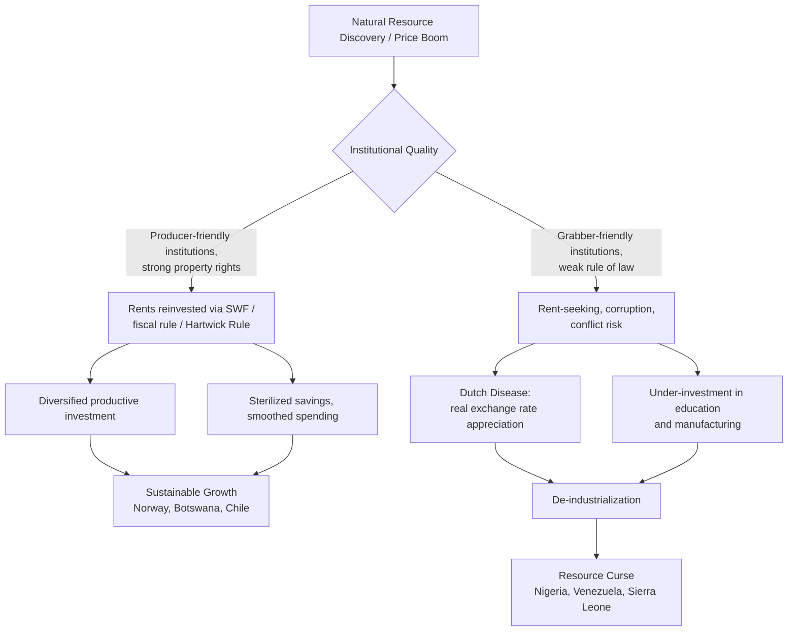

## Natural Resources, the Resource Curse, and Sustainable Growth

### Overview

Natural resource endowments occupy a paradoxical position in growth theory: standard models predict that resource wealth should raise output and welfare, yet empirical evidence since the 1990s has repeatedly found that resource-abundant countries often grow *more slowly* than resource-poor countries. This phenomenon, termed the **resource curse** (or the "paradox of plenty"), has generated a substantial body of theoretical and empirical macroeconomics examining the channels through which natural capital can depress rather than promote long-run growth, and the institutional and policy conditions under which resource wealth is instead converted into sustained prosperity.

---

### Natural Resources in the Production Function

**Augmenting the standard growth model**

The Solow-Swan and neoclassical growth frameworks can incorporate natural resources $R$ as a third factor of production alongside capital $K$ and labor $L$:

$$Y = F(K, L, R) = AK^{\alpha}L^{\beta}R^{\gamma}$$

where $\alpha + \beta + \gamma \leq 1$ depending on returns-to-scale assumptions, and $A$ is total factor productivity.

Two conceptual categories matter for growth dynamics:

- **Renewable resources** (fisheries, forests, arable land, fresh water) — can regenerate if extraction stays below the natural replenishment rate.
- **Exhaustible (non-renewable) resources** (oil, natural gas, coal, minerals, metals) — fixed or slowly formed stocks; extraction today reduces the stock available for future extraction.

**The Hartwick Rule**

For exhaustible resources, the **Hartwick Rule** (Hartwick, 1977) provides a sustainability benchmark: consumption can remain constant over time (i.e., growth is sustainable despite resource depletion) if the economy reinvests all resource rents into reproducible capital:

$$\dot{K} = F(K, R) - C - q\dot{R}$$

Sustainability requires the rents from resource extraction, $q\dot{R}$ (price times the rate of depletion), to be fully reinvested rather than consumed. This is the theoretical foundation for **sovereign wealth funds** and resource-revenue-management rules discussed below.

---

### The Resource Curse: Empirical Regularity

**Key Points**

- The empirical resource curse literature originates with **Sachs and Warner** (1995, 1997, 2001), who found a robust negative correlation between natural resource exports (as a share of GDP) and subsequent GDP growth across countries, 1970–1990.
- The relationship holds after controlling for initial income, trade policy, investment rates, and institutional quality in many (though not all) specifications.
- The curse is not universal: Botswana (diamonds), Norway, Australia, and Canada are frequently cited as resource-abundant economies that grew successfully, motivating the shift in the literature from asking "does the curse exist?" toward "under what conditions does it exist?"

[Unverified] The precise magnitude and even the existence of the resource curse remain contested in the empirical literature; later work (e.g., Brunnschweiler and Bulte, 2008) has questioned Sachs-Warner's measure of "resource dependence" (exports/GDP) as endogenous to poor growth itself, versus "resource abundance" (stocks per capita), which shows a weaker or even positive relationship with growth.

---

### Transmission Channels: Why Resources Can Hurt Growth

#### 1. Dutch Disease

**Dutch Disease** describes the mechanism by which a resource boom appreciates the real exchange rate and crowds out other tradable sectors (particularly manufacturing), named after the decline of Dutch manufacturing following North Sea gas discoveries in the 1960s.

**Mechanism (Corden-Neary model, 1982):** The economy is divided into three sectors:

- The **booming sector** (resource extraction)
- **Lagging tradables** (manufacturing, agriculture)
- **Non-tradables** (services, construction)

A resource boom operates through two effects:

- **Resource movement effect**: Higher wages/returns in the booming sector draw labor and capital away from lagging tradables.
- **Spending effect**: Resource revenue raises national income, increasing demand for non-tradables (whose prices are domestically determined) relative to tradables (whose prices are fixed internationally). This bids up the price of non-tradables relative to tradables, i.e., a **real exchange rate appreciation**, which erodes the competitiveness of the lagging tradable sector.

$$\text{Real Exchange Rate} = \frac{P_{NT}}{P_T}$$

An appreciation ($P_{NT}/P_T \uparrow$) makes non-resource exports less competitive internationally, causing **de-industrialization** — a shrinking manufacturing base that, per endogenous growth theory (learning-by-doing, technology spillovers concentrated in tradable manufacturing), was where most productivity growth occurred. The economy loses the long-run growth engine even as short-run income rises.

**(svg_diagram)**

<svg xmlns="http://www.w3.org/2000/svg" viewBox="0 0 760 430" font-family="Helvetica, Arial, sans-serif">
<text x="380" y="28" text-anchor="middle" font-size="18" font-weight="bold" fill="#1a1a1a">Dutch Disease Transmission Mechanism (svg_diagram)</text>
<rect x="30" y="60" width="180" height="60" rx="8" fill="#fde68a" stroke="#b45309" stroke-width="2" />
<text x="120" y="85" text-anchor="middle" font-size="13" font-weight="bold" fill="#1a1a1a">Resource Boom</text>
<text x="120" y="103" text-anchor="middle" font-size="11" fill="#1a1a1a">(price ↑ or discovery)</text>
<line x1="120" y1="120" x2="120" y2="160" stroke="#333" stroke-width="2" marker-end="url(#arrow)" />
<rect x="30" y="160" width="180" height="60" rx="8" fill="#bfdbfe" stroke="#1d4ed8" stroke-width="2" />
<text x="120" y="185" text-anchor="middle" font-size="12" font-weight="bold" fill="#1a1a1a">Resource Movement</text>
<text x="120" y="203" text-anchor="middle" font-size="11" fill="#1a1a1a">Effect</text>
<rect x="550" y="160" width="180" height="60" rx="8" fill="#bbf7d0" stroke="#15803d" stroke-width="2" />
<text x="640" y="185" text-anchor="middle" font-size="12" font-weight="bold" fill="#1a1a1a">Spending Effect</text>
<text x="640" y="203" text-anchor="middle" font-size="11" fill="#1a1a1a">(national income ↑)</text>
<line x1="210" y1="90" x2="550" y2="190" stroke="#333" stroke-width="2" marker-end="url(#arrow)" />
<line x1="120" y1="220" x2="120" y2="260" stroke="#333" stroke-width="2" marker-end="url(#arrow)" />
<line x1="640" y1="220" x2="640" y2="260" stroke="#333" stroke-width="2" marker-end="url(#arrow)" />
<rect x="30" y="260" width="280" height="55" rx="8" fill="#fecaca" stroke="#b91c1c" stroke-width="2" />
<text x="170" y="284" text-anchor="middle" font-size="12" font-weight="bold" fill="#1a1a1a">Labor/Capital shift out of</text>
<text x="170" y="302" text-anchor="middle" font-size="11" fill="#1a1a1a">lagging tradables sector</text>
<rect x="450" y="260" width="280" height="55" rx="8" fill="#fecaca" stroke="#b91c1c" stroke-width="2" />
<text x="590" y="284" text-anchor="middle" font-size="12" font-weight="bold" fill="#1a1a1a">Demand ↑ for non-tradables</text>
<text x="590" y="302" text-anchor="middle" font-size="11" fill="#1a1a1a">→ P(non-tradable) ↑</text>
<line x1="170" y1="315" x2="380" y2="355" stroke="#333" stroke-width="2" marker-end="url(#arrow)" />
<line x1="590" y1="315" x2="400" y2="355" stroke="#333" stroke-width="2" marker-end="url(#arrow)" />
<rect x="230" y="360" width="300" height="55" rx="8" fill="#e9d5ff" stroke="#7e22ce" stroke-width="2" />
<text x="380" y="384" text-anchor="middle" font-size="12" font-weight="bold" fill="#1a1a1a">Real Exchange Rate Appreciation</text>
<text x="380" y="402" text-anchor="middle" font-size="11" fill="#1a1a1a">→ De-industrialization → Lower long-run growth</text>
</svg>

#### 2. Volatility and Terms-of-Trade Shocks

Commodity prices are highly volatile relative to manufactured goods prices. This generates:

- **Boom-bust investment cycles**: Pro-cyclical fiscal spending during price upswings followed by painful contractions.
- **Terms-of-trade uncertainty** that raises the risk premium on investment and depresses private capital formation (Van der Ploeg and Poelhekke, 2009 argue *volatility*, not resource abundance per se, is the primary growth-reducing channel).

#### 3. Institutional and Political Economy Channels

- **Rent-seeking and corruption**: Point-source resources (oil, minerals concentrated in specific locations, extracted by a few large firms) are easier for elites to capture than diffuse resources (agriculture), per **Isham et al. (2005)**'s distinction between "point-source" and "diffuse" resources.
- **Weakening of institutional quality**: Resource revenues can substitute for broad-based taxation, weakening the "no taxation without representation" accountability link between rulers and citizens (the **fiscal social contract** argument — Ross, 2001, 2012).
- **Rentier state effects**: Governments reliant on resource rents rather than tax revenue face less pressure toward transparent, accountable institutions.
- **Conflict risk**: Resource rents, especially "lootable" resources (alluvial diamonds, narrow-corridor pipelines), are associated with higher civil conflict risk (Collier and Hoeffler, 2004), which directly destroys physical and human capital.

#### 4. Crowding Out of Human Capital and Diversification

- Resource-rich economies may under-invest in education, since immediate returns to schooling are lower relative to resource-sector employment (Gylfason, 2001 empirically links resource dependence to lower education spending and enrollment).
- **Dutch-disease-induced de-industrialization** removes the manufacturing sector where technology absorption and human-capital-intensive learning-by-doing traditionally concentrate, per endogenous growth channels (Romer, Lucas-type models).

---

### Conditional Resource Curse: Institutions as the Moderating Variable

The modern consensus, following **Mehlum, Moene, and Torvik (2006)**, is that the curse is **conditional on institutional quality**:

$$\text{Growth} = \beta_0 + \beta_1 \text{Resources} + \beta_2 (\text{Resources} \times \text{Institutions}) + \beta_3 \text{Institutions} + \epsilon$$

Their model distinguishes:

- **"Grabber-friendly" institutions**: weak property rights and rule of law induce entrepreneurs to compete for resource rents through unproductive rent-seeking rather than production, so resource windfalls fuel rent-seeking activity that displaces productive entrepreneurship.
- **"Producer-friendly" institutions**: strong property rights and rule of law channel resource windfalls into complementary productive investment.

This explains the divergence between Nigeria/Venezuela/Sierra Leone (weak institutions, pronounced curse) and Norway/Botswana/Chile (strong institutions, resource blessing).

---

### Case Studies

**Example: Norway (resource blessing)**

- Established the **Government Pension Fund Global** (1990, operational 1996) to save oil revenues rather than spend them domestically.
- Applies a **fiscal rule** (the "handlingsregel" or action rule, from 2001): non-oil structural fiscal deficit spending is capped at the expected real return on the fund (originally 4%, revised to 3% in 2017), insulating the domestic economy from oil-price volatility and Dutch Disease.
- Sterilizes oil revenue offshore, avoiding excess domestic currency appreciation.

**Example: Botswana (resource blessing)**

- Diamond wealth managed through strong pre-existing property-rights institutions and a broadly inclusive Tswana political tradition (Acemoglu, Johnson, Robinson, 2003 case study).
- Revenue channeled into infrastructure, education, and a **Pula Fund** sovereign wealth vehicle.

**Example: Nigeria and Venezuela (resource curse)**

- Oil rents associated with weak institutional accountability, high corruption indices, exchange-rate overvaluation, and neglect of agriculture/manufacturing.
- Venezuela's post-2014 collapse illustrates extreme vulnerability to oil price volatility combined with weak fiscal buffers and institutional erosion.

[Inference] The Norway–Nigeria contrast is widely used pedagogically to isolate the institutional-quality variable, but real-world divergence also reflects colonial history, initial income levels, and geopolitical factors that are difficult to fully separate from institutional quality alone.

---

### Sustainable Growth: Policy Frameworks

#### Sovereign Wealth Funds (SWFs) and Fiscal Rules

Designed to operationalize the **Hartwick Rule** in practice:

- **Stabilization funds**: smooth government spending against commodity price volatility (e.g., Chile's Economic and Social Stabilization Fund, copper-linked).
- **Savings/intergenerational funds**: convert non-renewable resource wealth into a permanent financial-asset endowment for future generations (Norway's GPFG; Kuwait's General Reserve Fund).
- **Fiscal rules** typically cap the non-resource structural deficit or link spending to a smoothed reference commodity price (e.g., a moving average of copper prices in Chile's structural balance rule).

#### Genuine (Adjusted Net) Savings

The **World Bank's Adjusted Net Savings (ANS)** metric operationalizes weak sustainability by correcting gross national savings for natural capital depletion:

$$\text{ANS} = \text{GNS} - \delta_K - \delta_N + \text{Education Expenditure} - \text{Pollution Damage}$$

where $\delta_K$ is fixed capital depreciation and $\delta_N$ is the value of natural resource depletion (net resource rents extracted, not reinvested). Persistently negative ANS signals that a country is running down its total capital base (Hamilton and Clemens, 1999), even if conventional GDP or gross savings figures look healthy.

#### Extractive Industries Transparency Initiative (EITI)

An international standard (est. 2003) requiring disclosure of payments from extractive companies to governments and government revenue receipts, intended to reduce corruption and rent capture by making resource-revenue flows auditable and publicly verifiable.

#### Resource Revenue Management Institutional Design

**Next Steps** (institutional design checklist commonly covered in this literature):

- Direct resource revenues into a segregated fund rather than the general budget.
- Establish binding, rules-based (not discretionary) withdrawal/spending rules.
- Mandate transparency and independent auditing of fund flows.
- Diversify fund investments away from domestic non-tradables to avoid re-creating Dutch Disease domestically.
- Pair fiscal rules with structural policies (education, infrastructure, SME credit access) that build tradable-sector competitiveness independent of the resource sector.

---

### Formal Summary Model: The "Big Push" Alternative

An augmented Solow model with a resource-financed capital-accumulation channel can be summarized as:

$$\dot{k} = s_K \cdot y + \theta \cdot R \cdot p_R - (n + \delta)k$$

where $s_K y$ is domestic saving invested in capital, $\theta$ is the share of resource rents ($R \cdot p_R$, quantity times price) reinvested domestically or abroad via a SWF, and $(n+\delta)k$ is capital dilution from population growth and depreciation. When $\theta$ is high and channeled into productive capital (human or physical) rather than consumption, resource wealth raises the steady-state capital stock and consumption path; when $\theta$ is low (rents consumed or captured by rent-seeking elites), the resource curse dynamic dominates.

---

### Conceptual Map

---

### Related Topics

- Dutch Disease and the Corden-Neary tradable/non-tradable model in open-economy macroeconomics
- Endogenous growth theory: learning-by-doing and sectoral technology spillovers (Romer, Lucas)
- Institutional economics: Acemoglu-Johnson-Robinson extractive vs. inclusive institutions framework
- Political economy of rentier states and the fiscal social contract (Ross)
- Terms-of-trade volatility and precautionary saving in small open economies
- Sovereign wealth fund governance and the Santiago Principles
- Environmental Kuznets Curve and its relationship to resource-driven growth
- Genuine savings, weak vs. strong sustainability, and green national accounting
- Commodity super-cycles and their macroeconomic transmission
- Conflict economics: lootable resources and civil war onset (Collier-Hoeffler model)