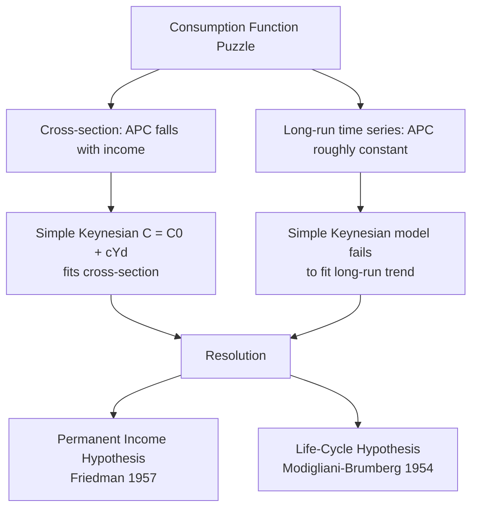

## Consumption Function and the Marginal Propensity to Consume

### Overview

The **consumption function** describes the relationship between aggregate household consumption spending and its determinants, most centrally disposable income. Since consumption is typically the largest single component of aggregate demand (often 55–70% of GDP in advanced economies), the specification of the consumption function is foundational to the Keynesian-cross model, the IS curve, and the size of the fiscal multiplier. This topic covers the basic Keynesian consumption function, the marginal and average propensities to consume and save, and the major theoretical refinements (Permanent Income and Life-Cycle Hypotheses) that address empirical anomalies in the simple model.

---

### The Basic Keynesian Consumption Function

Keynes (*The General Theory*, 1936) proposed a simple linear relationship between current consumption and current disposable income:

$$C = C_0 + c \cdot Y_d$$

where:

- $C$ = aggregate consumption spending
- $C_0$ = **autonomous consumption** — the level of consumption when disposable income is zero, financed by borrowing, running down savings, or transfers
- $Y_d = Y - T$ = **disposable income** (income after net taxes)
- $c$ = **marginal propensity to consume (MPC)**

**Key Points**

- $C_0 > 0$: even with zero income, households must consume some minimum (subsistence) bundle, financed by dissaving.
- $0 < c < 1$: Keynes's **"fundamental psychological law"** — people increase consumption when income rises, but by *less* than the full increase in income, because some of the increase is saved.

---

### Marginal Propensity to Consume (MPC)

The **MPC** measures the change in consumption resulting from a one-unit change in disposable income:

$$c = \text{MPC} = \frac{\Delta C}{\Delta Y_d} = \frac{dC}{dY_d}$$

In the linear specification, $c$ is the slope of the consumption function and is assumed constant. Empirically and in richer models, the MPC may vary with the income level, the nature of the income change (permanent vs. transitory), and household characteristics (e.g., liquidity-constrained households tend to have a higher MPC out of any given income change since they cannot borrow to smooth consumption).

**Example**: If a household receives an additional $1,000 in disposable income and increases consumption spending by $750, the MPC = 0.75. The remaining $250 is saved, giving a marginal propensity to save of 0.25.

---

### Marginal Propensity to Save (MPS)

Since disposable income is, by definition, either consumed or saved:

$$Y_d = C + S$$

Differentiating with respect to $Y_d$:

$$1 = \frac{dC}{dY_d} + \frac{dS}{dY_d} = \text{MPC} + \text{MPS}$$

$$\text{MPS} = 1 - \text{MPC} = 1 - c = s$$

The **MPS** is the fraction of an additional unit of disposable income that is saved rather than spent.

---

### Average Propensity to Consume (APC)

Distinct from the *marginal* propensity, the **average propensity to consume** is the *ratio* of total consumption to total disposable income:

$$\text{APC} = \frac{C}{Y_d} = \frac{C_0 + cY_d}{Y_d} = \frac{C_0}{Y_d} + c$$

**Key Points**

- Because $C_0 > 0$, the APC is **greater than the MPC** at any positive income level (APC $>$ $c$), and **APC falls as $Y_d$ rises** — since the fixed autonomous term $C_0$ becomes a smaller share of a larger income.
- This implies the **average propensity to save (APS) rises with income**: $\text{APS} = 1 - \text{APC}$, increasing in $Y_d$.
- This "declining APC with income" prediction was consistent with Keynes's cross-sectional observation that richer households save a larger fraction of their income than poorer households — but became the central point of empirical tension addressed by later theories (see below).

---

### The Consumption Function Puzzle

**Key Points — the empirical tension**

Simon Kuznets's long-run US data (1869–1940s) presented an apparent contradiction to the simple Keynesian model:

- **Cross-sectional data** (comparing households at a point in time) showed APC falling with income, exactly as the simple Keynesian model predicts (richer households save more of their income).
- **Long-run time-series data** showed APC roughly **constant** over decades (~0.85–0.90), even as aggregate real income grew substantially — implying $C_0/Y_d$ should have shrunk toward zero and APC toward $c$, which it did not.

This divergence between cross-sectional and long-run time-series behavior of the APC — the **consumption function puzzle** — motivated the two major theoretical refinements below, both of which imply that consumption depends on a longer-horizon income concept than *current* disposable income alone.

---

### Permanent Income Hypothesis (PIH)

Milton Friedman (1957) proposed that consumption depends not on *current measured* income, but on **permanent income** — the long-run, expected average income a household anticipates over its lifetime.

**Decomposition of measured income:**

$$Y_d = Y^P + Y^T$$

where $Y^P$ is **permanent income** (the sustainable, expected long-run component) and $Y^T$ is **transitory income** (temporary deviations — bonuses, one-off windfalls, temporary layoffs).

**Consumption function under PIH:**

$$C = k \cdot Y^P$$

where $k$ is a constant reflecting preferences (roughly analogous to the average/marginal propensity to consume out of permanent income, which PIH treats as equal and stable). Critically, PIH predicts:

$$\frac{\partial C}{\partial Y^T} \approx 0$$

Households **do not significantly adjust consumption in response to transitory income changes** — they save (or borrow against) transitory windfalls/shortfalls to smooth consumption relative to their permanent income, consistent with a desire for a stable consumption path over time.

**Resolving the puzzle**: In cross-sectional data at a point in time, high-measured-income households are disproportionately those experiencing *positive transitory* shocks (temporarily above their permanent income), so their *measured* APC looks low (their consumption reflects permanent income, which is lower than their unusually high current income). In long-run time-series data, since transitory fluctuations average out over time and permanent income grows roughly in line with measured income, APC out of permanent income remains stable — consistent with Kuznets's constant long-run APC.

**Example**: A worker who wins a one-time $10,000 lottery prize (pure transitory income) is predicted by PIH to consume only a small fraction of it immediately, spreading the increased consumption over their remaining lifetime (or saving/investing most of it), rather than consuming the full $10,000 within the year.

---

### Life-Cycle Hypothesis (LCH)

Franco Modigliani and Richard Brumberg (1954), and later Modigliani and Albert Ando (1963), proposed that individuals plan consumption to **smooth spending over their entire lifetime**, given expected lifetime resources, rather than tying consumption to current income period-by-period.

**Simplified life-cycle consumption function:**

$$C = \frac{W + RY_L}{T}$$

where:

- $W$ = current non-human wealth (financial and real assets)
- $Y_L$ = annual labor income during working years
- $R$ = number of remaining working years
- $T$ = total remaining expected lifetime (years)

This implies individuals **borrow while young** (education, home purchase, low current income relative to lifetime average), **save during peak-earning middle age** (building assets, including for retirement), and **dissave in retirement** (drawing down accumulated wealth as labor income falls to zero).

**(svg_diagram)**

<svg xmlns="http://www.w3.org/2000/svg" viewBox="0 0 700 420" font-family="Helvetica, Arial, sans-serif">
<text x="350" y="26" text-anchor="middle" font-size="17" font-weight="bold" fill="#1a1a1a">Life-Cycle Hypothesis: Income, Consumption, and Wealth (svg_diagram)</text>
<line x1="70" y1="360" x2="650" y2="360" stroke="#1a1a1a" stroke-width="2" />
<line x1="70" y1="360" x2="70" y2="50" stroke="#1a1a1a" stroke-width="2" />
<text x="660" y="365" font-size="13" fill="#1a1a1a">Age</text>
<text x="20" y="45" font-size="13" fill="#1a1a1a">Income /</text>
<text x="20" y="60" font-size="13" fill="#1a1a1a">Consumption</text>
<path d="M 90 340 Q 250 100 400 130 Q 500 150 620 360" stroke="#1d4ed8" stroke-width="2.5" fill="none" />
<text x="420" y="110" font-size="12" fill="#1d4ed8" font-weight="bold">Labor Income Y_L(age)</text>
<line x1="90" y1="230" x2="620" y2="230" stroke="#15803d" stroke-width="2.5" />
<text x="500" y="220" font-size="12" fill="#15803d" font-weight="bold">Consumption C (smoothed)</text>
<line x1="230" y1="230" x2="230" y2="360" stroke="#999" stroke-dasharray="3,3" />
<text x="180" y="378" font-size="11" fill="#1a1a1a">Enter workforce</text>
<line x1="470" y1="230" x2="470" y2="360" stroke="#999" stroke-dasharray="3,3" />
<text x="440" y="378" font-size="11" fill="#1a1a1a">Retirement</text>

<text x="100" y="255" font-size="11" fill="`#b91c1c`">Borrowing</text>

<text x="320" y="140" font-size="11" fill="`#15803d`">Saving</text>

<text x="530" y="280" font-size="11" fill="`#b91c1c`">Dissaving</text>

</svg>

**Resolving the puzzle**: Aggregate APC appears stable over time in LCH because, in a growing economy with a roughly stable age distribution, the proportion of "savers" (working-age) to "dissavers" (retirees) remains roughly constant, keeping the aggregate saving rate—and hence APC—steady even as per-capita income grows. Cross-sectionally, APC can still appear to fall with income if income is correlated with life-cycle stage (peak earners mid-career look "high income, high saving" relative to young or retired households at a point in time).

---

### Comparison of Consumption Theories

| Theory | Key driver of consumption | MPC out of transitory income | Explains long-run stable APC? |
| --- | --- | --- | --- |
| Simple Keynesian | Current disposable income | High (= $c$) | No |
| Permanent Income Hypothesis (Friedman) | Permanent (expected long-run) income | ≈ 0 | Yes |
| Life-Cycle Hypothesis (Modigliani) | Lifetime resources (wealth + expected lifetime income) | ≈ 0 (smoothed via saving/borrowing) | Yes |

---

### Modern Extensions and Frictions

- **Liquidity constraints / hand-to-mouth consumers**: PIH and LCH assume households can freely borrow against future income to smooth consumption. In practice, a substantial share of households are credit-constrained ("hand-to-mouth"), consuming close to their current income regardless of permanent income — empirically raising the aggregate MPC out of transitory shocks (relevant for evaluating the effectiveness of fiscal stimulus such as one-time tax rebates).
- **Precautionary saving**: Under income uncertainty, risk-averse households save more than the certainty-equivalent LCH/PIH models predict, as a buffer against future negative income shocks (buffer-stock saving models, e.g., Carroll, 1997).
- **Wealth effects**: Consumption responds to changes in the market value of household wealth (housing, equities), a channel emphasized in analyses of asset-price-driven consumption booms and busts (e.g., the 2000s US housing boom).
- **Behavioral consumption models**: Departures from full rationality (hyperbolic discounting, mental accounting) can generate excess sensitivity of consumption to predictable income changes, contrary to the pure PIH/LCH prediction.

[Unverified] The empirical magnitude of the aggregate MPC out of transitory tax rebates and stimulus payments varies considerably across studies and episodes (e.g., estimates from the 2001 and 2008 US tax rebate programs), reflecting the mix of liquidity-constrained and unconstrained households in the population and is not a single fixed parameter.

---

### Implications for Fiscal Policy and the Multiplier

The size of the MPC directly determines the **fiscal multiplier**:

$$\text{Multiplier (closed economy)} = \frac{1}{1 - c}$$

**Key Points**

- A **higher MPC** implies a **larger multiplier** — each round of income generates more induced spending.
- If PIH/LCH hold strictly, temporary tax cuts/rebates (transitory income changes) should have a small effect on consumption and hence a small multiplier — an argument frequently raised against the efficacy of one-time stimulus payments.
- If a significant share of the population is liquidity-constrained, temporary income changes are consumed more fully (high effective MPC), strengthening the case for temporary fiscal stimulus even under otherwise PIH/LCH-consistent behavior for unconstrained households.

**Example**: A government issuing a one-time $1,200 stimulus check to households: PIH would predict most of it is saved (smoothing over the household's full lifetime), yielding a weak demand effect; empirical studies on such rebates typically find a mix of responses, with liquidity-constrained households spending a substantially larger share than unconstrained households — the actual aggregate effect depends on the composition of recipients.

---

### Related Topics

- Deriving the Keynesian cross and the expenditure multiplier from the consumption function
- Ricardian equivalence and the debate over whether deficit-financed tax cuts affect consumption
- Precautionary saving and buffer-stock models under income uncertainty (Carroll)
- Liquidity constraints, hand-to-mouth households, and heterogeneous-agent New Keynesian (HANK) models
- Wealth effects and the transmission of asset price changes to consumption
- Empirical evidence on MPC from natural experiments (tax rebates, lottery winnings)
- Household saving rates and demographic structure in the Life-Cycle Hypothesis
- Behavioral economics critiques of the rational lifetime-smoothing consumer