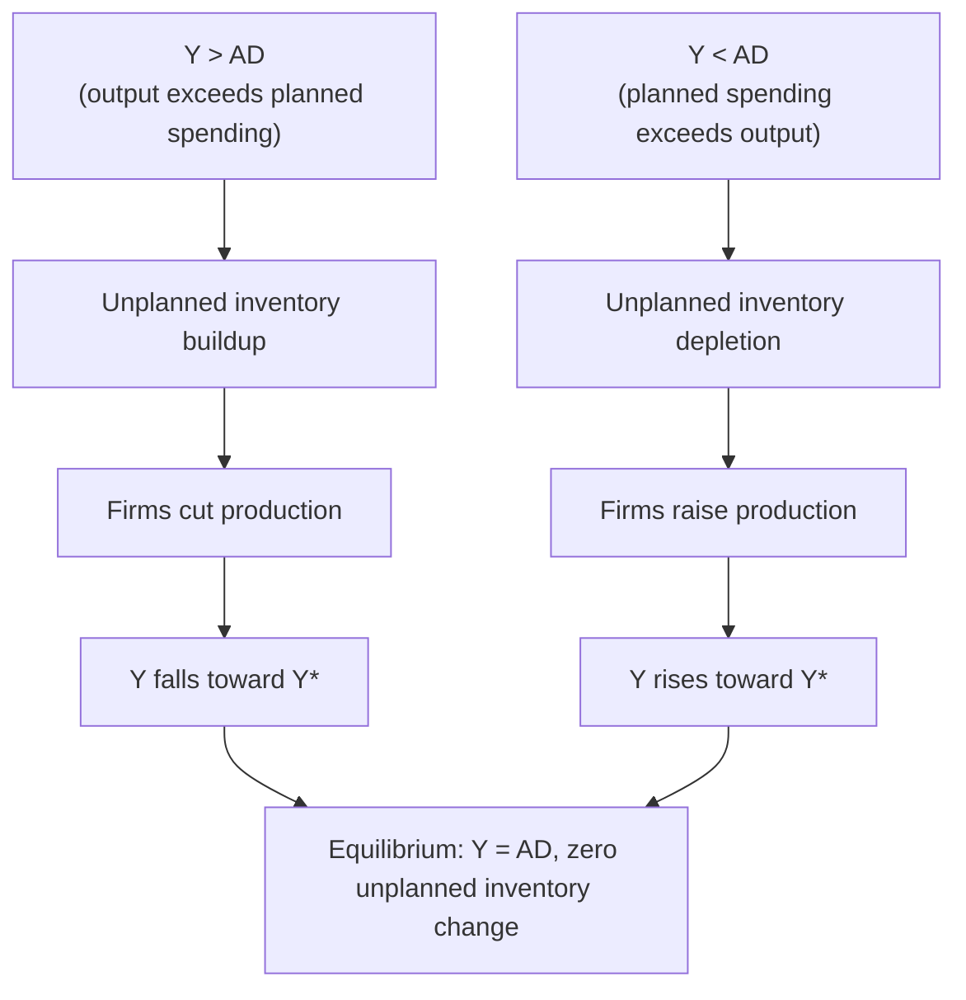

## Keynesian Cross Model and Equilibrium Output

### Overview

The **Keynesian cross** (also called the "45-degree line diagram") is the simplest formal model of short-run income determination in the goods market, developed from Keynes's *General Theory* (1936) and formalized by Paul Samuelson. It shows how equilibrium output is determined by the intersection of **planned aggregate expenditure** and **actual output**, holding prices fixed — making it the foundational building block for the IS curve, the multiplier, and short-run fiscal policy analysis.

---

### Core Assumptions

**Key Points**

- The **price level is fixed** (short-run analysis; supply is perfectly elastic at the prevailing price level, so any level of demand can be met without price changes).
- The interest rate is treated as **exogenously fixed** in the basic version (relaxed later when deriving the IS curve).
- Firms produce exactly what is demanded **in equilibrium**; disequilibrium is resolved through **unplanned changes in inventories**, which signal firms to adjust output.
- Attention is restricted to the **demand side**; aggregate supply constraints (potential output, capacity) are not explicitly modeled at this stage.

---

### Planned Aggregate Expenditure

**Planned aggregate expenditure** ($AD$ or $PAE$) is the sum of desired spending by all sectors:

$$AD = C + I + G + NX$$

with the standard behavioral components:

$$C = C_0 + c(Y - T)$$

$$I = I_0 \quad \text{(exogenous in the basic closed-economy version)}$$

$$G = \bar{G}, \quad T = \bar{T} \quad \text{(exogenous fiscal policy)}$$

$$NX = X_0 - mY \quad \text{(open-economy extension; } NX=0 \text{ in closed economy)}$$

Substituting into the AD identity for the closed-economy case:

$$AD = C_0 + c(Y-\bar{T}) + I_0 + \bar{G}$$

$$AD = \underbrace{(C_0 - c\bar{T} + I_0 + \bar{G})}_{\text{autonomous expenditure } A} + cY$$

This is a linear function of $Y$ with **intercept** $A$ (autonomous expenditure) and **slope** $c$ (the MPC) — flatter than the 45° line since $0 < c < 1$.

---

### The Equilibrium Condition

Equilibrium in the goods market requires that **planned expenditure equals actual output**:

$$Y = AD$$

Graphically, this is any point on the **45° line**, where the vertical axis (planned expenditure) equals the horizontal axis (actual income/output). The **Keynesian cross diagram** plots the $AD$ line against this 45° line; their intersection identifies the unique equilibrium level of output.

**(svg_diagram)**

<svg xmlns="http://www.w3.org/2000/svg" viewBox="0 0 700 470" font-family="Helvetica, Arial, sans-serif">
<text x="350" y="26" text-anchor="middle" font-size="17" font-weight="bold" fill="#1a1a1a">The Keynesian Cross (svg_diagram)</text>
<line x1="70" y1="420" x2="650" y2="420" stroke="#1a1a1a" stroke-width="2" />
<line x1="70" y1="420" x2="70" y2="50" stroke="#1a1a1a" stroke-width="2" />
<text x="655" y="425" font-size="13" fill="#1a1a1a">Output, Income (Y)</text>
<text x="10" y="45" font-size="13" fill="#1a1a1a">Planned Expenditure (AD)</text>
<line x1="70" y1="420" x2="590" y2="80" stroke="#666" stroke-width="1.5" stroke-dasharray="5,3" />
<text x="595" y="80" font-size="12" fill="#666">45° line (AD = Y)</text>
<line x1="70" y1="330" x2="590" y2="130" stroke="#1d4ed8" stroke-width="2.5" />
<text x="450" y="140" font-size="12" fill="#1d4ed8" font-weight="bold">AD = A + cY</text>
<line x1="70" y1="330" x2="70" y2="420" stroke="#15803d" stroke-width="2" stroke-dasharray="2,2" />
<text x="80" y="400" font-size="11" fill="#15803d" font-weight="bold">A (autonomous exp.)</text>
<line x1="330" y1="420" x2="330" y2="230" stroke="#b91c1c" stroke-dasharray="3,3" stroke-width="1.5" />
<line x1="70" y1="230" x2="330" y2="230" stroke="#b91c1c" stroke-dasharray="3,3" stroke-width="1.5" />
<circle cx="330" cy="230" r="6" fill="#b91c1c" />
<text x="335" y="215" font-size="12" fill="#b91c1c" font-weight="bold">Equilibrium E</text>
<text x="320" y="440" font-size="12" fill="#1a1a1a">Y*</text>

<text x="150" y="460" font-size="11" fill="`#1a1a1a`" font-style="italic">At Y*: AD = Y — no unplanned inventory change</text>

</svg>

---

### Solving for Equilibrium Output

Setting $Y = AD$:

$$Y = A + cY$$

$$Y - cY = A$$

$$Y(1-c) = A$$

$$Y^* = \frac{1}{1-c} \cdot A$$

$$Y^* = \frac{1}{1-c}\left(C_0 - c\bar{T} + I_0 + \bar{G}\right)$$

**Example**: Suppose $C_0 = 200$, $c = 0.75$, $I_0 = 300$, $\bar{G} = 400$, $\bar{T} = 200$ (all in billions of currency units).

$$A = 200 - 0.75(200) + 300 + 400 = 200 - 150 + 300 + 400 = 750$$

$$Y^* = \frac{1}{1-0.75}(750) = \frac{750}{0.25} = 3{,}000$$

Equilibrium output is 3,000. Verification: $AD = 750 + 0.75(3000) = 750 + 2250 = 3000 = Y^*$. ✓

---

### The Role of Inventories in Reaching Equilibrium

**Key Points — the adjustment mechanism**

Away from equilibrium, firms experience **unplanned inventory changes** that signal the need to adjust production:

- **If $Y > AD$** (actual output exceeds planned spending): unsold goods accumulate as **unplanned inventory investment** ($\Delta I_{unplanned} > 0$). Firms respond by **cutting production**, pushing $Y$ down toward $Y^*$.
- **If $Y < AD$** (planned spending exceeds actual output): inventories are **unexpectedly depleted** ($\Delta I_{unplanned} < 0$) as demand outstrips supply. Firms respond by **increasing production**, pushing $Y$ up toward $Y^*$.
- **Only at $Y = Y^*$** does actual output exactly match planned expenditure, with **zero unplanned inventory change** — the equilibrium is stable because deviations trigger production adjustments that restore it.

This inventory-adjustment story is what gives the model dynamic content beyond a static equating of two lines — it explains *why* the economy converges to the intersection point rather than remaining at an arbitrary output level.

---

### The Expenditure Multiplier

The coefficient $\dfrac{1}{1-c}$ linking a change in autonomous spending to the resulting change in equilibrium output is the **simple (closed-economy) expenditure multiplier**:

$$\text{Multiplier} = \frac{\Delta Y^*}{\Delta A} = \frac{1}{1-c}$$

**Why the multiplier exceeds 1**: An initial increase in autonomous spending (e.g., $\Delta I_0$) directly raises output and hence income by that amount. That additional income is partly spent (by MPC $c$), generating a **second round** of spending and income, part of which is again spent, generating a **third round**, and so on — an infinite geometric series:

$$\Delta Y^* = \Delta A (1 + c + c^2 + c^3 + \dots) = \Delta A \cdot \frac{1}{1-c}$$

**Example**: With $c = 0.75$, the multiplier is $\frac{1}{1-0.75} = 4$. A $50 billion increase in government spending ($\Delta \bar{G} = 50$) raises equilibrium output by $50 \times 4 = 200$ billion.

**Government spending multiplier vs. tax multiplier**:

$$\frac{\Delta Y^*}{\Delta \bar{G}} = \frac{1}{1-c} \qquad \frac{\Delta Y^*}{\Delta \bar{T}} = \frac{-c}{1-c}$$

The **tax multiplier is smaller in absolute value** than the spending multiplier because a tax cut is only *partially* spent (fraction $c$) in the first round — the remainder is saved — whereas a government spending increase enters demand **directly and fully** in the first round. This asymmetry underlies the **balanced-budget multiplier** result: an equal increase in $\bar{G}$ and $\bar{T}$ (financed with no deficit) still raises output, by exactly the amount of the spending increase:

$$\frac{\Delta Y^*}{\Delta \bar{G}} + \frac{\Delta Y^*}{\Delta \bar{T}}\bigg|_{\Delta \bar{G}=\Delta \bar{T}} = \frac{1}{1-c} - \frac{c}{1-c} = \frac{1-c}{1-c} = 1$$

The **balanced-budget multiplier equals exactly 1**.

---

### Open-Economy Extension

Including net exports with induced imports, $NX = X_0 - mY$:

$$AD = (C_0 - c\bar{T} + I_0 + \bar{G} + X_0) + (c-m)Y$$

$$Y^* = \frac{1}{1-(c-m)}\left(C_0 - c\bar{T} + I_0 + \bar{G} + X_0\right)$$

**Key Points**

- The open-economy multiplier $\dfrac{1}{1-(c-m)}$ is **smaller** than the closed-economy multiplier $\dfrac{1}{1-c}$, since a fraction $m$ of each round's induced spending "leaks" abroad via imports rather than recirculating domestically.
- This leakage is one of three standard leakages from the circular flow of income addressed in richer versions of the model: **saving** ($1-c$), **taxes** (via $\bar{T}$ reducing disposable income), and **imports** ($m$).

---

### Shifting the AD Line: Comparative Statics

| Change | Effect on $A$ (intercept) | Effect on $Y^*$ |
| --- | --- | --- |
| $\bar{G} \uparrow$ | Rises | Rises by $\Delta \bar{G} \times \frac{1}{1-c}$ |
| $\bar{T} \uparrow$ | Falls (by $c \Delta \bar{T}$) | Falls by $\Delta \bar{T} \times \frac{c}{1-c}$ |
| $I_0 \uparrow$ (business confidence) | Rises | Rises by multiplier |
| $C_0 \uparrow$ (consumer confidence) | Rises | Rises by multiplier |
| $c \uparrow$ (higher MPC) | No change to intercept | Multiplier itself rises (steeper AD line) |

Note that a change in $c$ (the slope of the AD line) changes the **multiplier itself**, not just the level of autonomous spending — a steeper AD line (higher MPC) makes the economy more sensitive to any given autonomous spending shock.

---

### The Output (Recessionary/Inflationary) Gap

If $Y^*$ (equilibrium output from the Keynesian cross) differs from **potential/full-employment output** $Y_F$:

- **Recessionary gap**: $Y^* < Y_F$ — equilibrium output falls short of potential; the economy is in a demand-deficient slump.
- **Inflationary gap**: $Y^* > Y_F$ — equilibrium (demand-determined) output exceeds sustainable potential, a signature of an overheating economy (in the fixed-price Keynesian-cross framework, this is interpreted as a gap that would translate into inflationary pressure once the fixed-price assumption is relaxed).

The multiplier formula allows computing the **exact fiscal policy change** needed to close a given output gap:

$$\Delta \bar{G}_{required} = (1-c) \times (Y_F - Y^*)$$

**Example**: If potential output $Y_F = 3{,}400$ but equilibrium output $Y^* = 3{,}000$ (a recessionary gap of 400) and $c = 0.75$, the required increase in government spending to close the gap is $\Delta \bar{G} = (1-0.75)(400) = 100$.

---

### Limitations of the Keynesian Cross

**Key Points**

- **Fixed interest rate**: the model does not allow $I$ to respond to interest-rate changes triggered by the income change itself — this is relaxed in the **IS-LM model**, where a rising $Y$ raises money demand and interest rates, partially crowding out investment (a smaller multiplier than the pure Keynesian-cross value).
- **Fixed price level**: the model says nothing about inflation or supply constraints — extending to variable prices requires the full **AD-AS framework**.
- **No explicit role for expectations or intertemporal optimization**: consumption and investment are mechanically linked to current income, abstracting from the forward-looking behavior emphasized in Permanent Income/Life-Cycle and modern investment theories.

[Unverified] The specific numerical value of the MPC (and hence the multiplier) used in any applied fiscal policy analysis is an empirical estimate that varies by country, time period, and the composition of the population (e.g., share of liquidity-constrained households), not a fixed structural constant.

---

### Related Topics

- Deriving the IS curve from the Keynesian cross by allowing investment to depend on the interest rate
- The government spending multiplier, tax multiplier, and balanced-budget multiplier
- IS-LM model: joint goods-market and money-market equilibrium
- Automatic stabilizers and how a proportional (income-dependent) tax reduces the multiplier
- Output gaps, potential output, and the transition from the Keynesian cross to AD-AS analysis
- Paradox of thrift: how attempts to raise autonomous saving can reduce equilibrium output
- Open-economy multiplier and import leakage in small open economies
- Empirical estimation of the marginal propensity to consume and fiscal multipliers