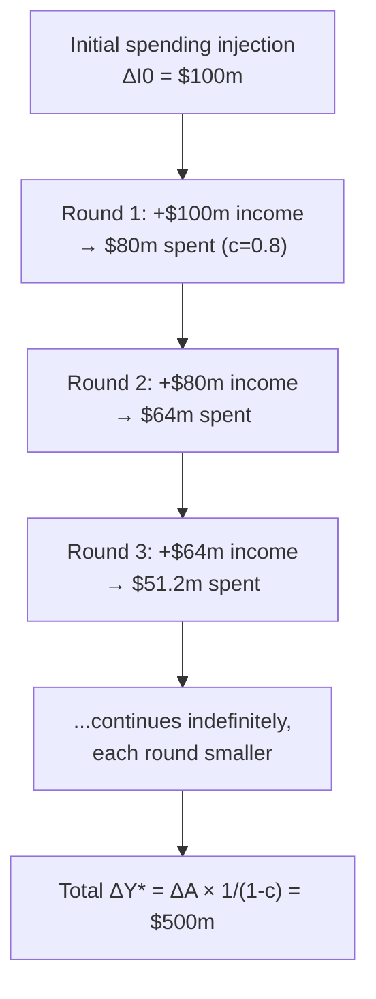

## Autonomous Expenditure and the Simple Multiplier

### Overview

**Autonomous expenditure** is the portion of aggregate demand that does not depend on the current level of income, while the **simple multiplier** quantifies how a change in autonomous spending translates into a (typically larger) change in equilibrium output. Together they form the analytical engine behind the Keynesian cross and the basic case for countercyclical fiscal policy — a small initial injection of spending can generate a substantially larger change in national income through successive rounds of induced spending.

---

### Defining Autonomous Expenditure

Total planned aggregate expenditure can always be decomposed into an **autonomous component** (independent of $Y$) and an **induced component** (dependent on $Y$):

$$AD = \underbrace{A}_{\text{autonomous}} + \underbrace{cY}_{\text{induced}}$$

In the standard closed-economy specification:

$$A = C_0 - c\bar{T} + I_0 + \bar{G}$$

where each term is a component that shifts the AD line **vertically** but does not depend on the current level of output:

| Term | Source | Interpretation |
| --- | --- | --- |
| $C_0$ | Consumption function intercept | Consumption at zero disposable income |
| $-c\bar{T}$ | Net taxes | Reduces disposable income, hence consumption, at any $Y$ |
| $I_0$ | Investment | Business investment, treated as exogenous in the basic model |
| $\bar{G}$ | Government spending | Fiscal policy variable, set exogenously |
| $X_0$ (open economy) | Exports | Depends on foreign income/competitiveness, not domestic $Y$ |

**Key Points**

- Autonomous expenditure is not "spending that never changes" — it changes in response to policy decisions, confidence shocks, or foreign demand shifts. It is autonomous specifically *with respect to current domestic income $Y$*.
- Graphically, $A$ is the **vertical intercept** of the AD line in the Keynesian-cross diagram; a change in any autonomous component shifts the entire line up or down without changing its slope.

---

### Induced Expenditure

The **induced component**, $cY$ (or $(c-m)Y$ in the open economy), captures spending that mechanically responds to the current level of income — chiefly through the consumption function's dependence on disposable income. This term determines the **slope** of the AD line and is the source of the multiplier's amplification effect: as income rises for any reason, induced consumption rises too, adding further to demand.

---

### Deriving the Simple Multiplier

Equilibrium requires $Y = AD$:

$$Y = A + cY \implies Y^*(1-c) = A \implies Y^* = \frac{1}{1-c}A$$

The **simple (closed-economy) multiplier** is:

$$k = \frac{\Delta Y^*}{\Delta A} = \frac{1}{1-c} = \frac{1}{\text{MPS}}$$

Since $0 < c < 1$, it follows that $k > 1$: **any change in autonomous spending produces a larger change in equilibrium output.**

---

### The Multiplier as a Geometric Series: Round-by-Round Intuition

The multiplier's mechanics are most transparent when unpacked round-by-round, tracing how an initial spending injection ripples through the economy via the circular flow of income.

**Example**: Suppose $\Delta I_0 = \$100$ million (a one-time increase in autonomous investment) and $c = \text{MPC} = 0.8$.

| Round | Source of spending | Amount |
| --- | --- | --- |
| 1 | Initial investment spending | $100.00m |
| 2 | Recipients of Round 1 income spend $c \times 100$ | $80.00m |
| 3 | Recipients of Round 2 income spend $c \times 80$ | $64.00m |
| 4 | Recipients of Round 3 income spend $c \times 64$ | $51.20m |
| $\vdots$ | $\vdots$ | $\vdots$ |
| Total | Sum of infinite geometric series | $500.00m |

Each round, a fraction $(1-c)$ "leaks" into saving and does not recirculate. The total effect is the sum of the infinite geometric series:

$$\Delta Y^* = \Delta A(1 + c + c^2 + c^3 + \dots) = \Delta A \sum_{n=0}^{\infty} c^n = \Delta A \cdot \frac{1}{1-c}$$

With $c=0.8$: $k = \frac{1}{1-0.8} = \frac{1}{0.2} = 5$, so $\Delta Y^* = 100 \times 5 = 500$ million — matching the sum of the round-by-round series.

---

### Multiplier Formulas by Policy Instrument

Different autonomous variables generate different-sized multipliers because they enter the circular flow at different "strengths" in the first round.

**Government spending multiplier:**

$$k_G = \frac{\Delta Y^*}{\Delta \bar{G}} = \frac{1}{1-c}$$

A dollar of government spending enters aggregate demand **directly and fully** in the first round.

**Tax multiplier:**

$$k_T = \frac{\Delta Y^*}{\Delta \bar{T}} = \frac{-c}{1-c}$$

**Key Points**

- The tax multiplier is **negative** (a tax increase reduces output) and **smaller in absolute magnitude** than the spending multiplier, because a tax change first affects disposable income, and only the fraction $c$ of that (the MPC) is spent in round one — the rest is saved. A dollar of tax cut therefore generates a smaller first-round demand impulse than a dollar of direct government purchases.

**Balanced-budget multiplier:**

If government spending and taxes rise by the same amount ($\Delta \bar{G} = \Delta \bar{T}$), financed with no change in the deficit:

$$k_{BB} = \frac{\Delta Y^*}{\Delta \bar{G}} + \frac{\Delta Y^*}{\Delta \bar{T}} = \frac{1}{1-c} - \frac{c}{1-c} = \frac{1-c}{1-c} = 1$$

**The balanced-budget multiplier equals exactly 1** — output rises by precisely the amount of the (equal) increase in spending and taxes, regardless of the value of $c$. This is a classic and somewhat surprising result: even a "fiscally neutral" (deficit-neutral) policy change has real effects on output, because government spending's full first-round impact outweighs the partial (MPC-scaled) contractionary effect of the accompanying tax increase.

---

### Open-Economy Multiplier: The Import Leakage

When net exports are added with induced imports, $NX = X_0 - mY$:

$$Y^* = \frac{1}{1-(c-m)}A$$

$$k_{open} = \frac{1}{1-c+m}$$

**Key Points**

- Because $m > 0$, the denominator $1-c+m$ is **larger** than the closed-economy denominator $1-c$, so $k_{open} < k_{closed}$.
- Each round of induced spending now leaks in **two** ways — saving ($1-c$ share) and imports ($m$ share) — rather than one, dampening the amplification.

**Example**: With $c = 0.8$ and $m = 0.1$: $k_{open} = \frac{1}{1-0.8+0.1} = \frac{1}{0.3} \approx 3.33$, compared to the closed-economy value of 5 — a substantially weaker multiplier due to import leakage.

---

### Adding the Tax Leakage Explicitly (Proportional Income Tax)

If taxes are modeled as **proportional to income** rather than lump-sum, $T = tY$ (where $t$ is the tax rate), disposable income becomes $Y_d = (1-t)Y$, and the consumption function is $C = C_0 + c(1-t)Y$. The multiplier becomes:

$$k_{proportional\ tax} = \frac{1}{1-c(1-t)}$$

**Key Points**

- A proportional income tax **reduces the multiplier** relative to the lump-sum-tax case, because rising income now also raises tax collections, which reduces the disposable-income (and hence consumption) response to any given change in $Y$.
- This is the theoretical basis for describing progressive/proportional income taxes as **automatic stabilizers**: they dampen the amplification of shocks (both positive and negative) without requiring discretionary policy action.

**Example**: With $c=0.8$ and a 20% proportional tax rate ($t=0.2$): $k = \frac{1}{1-0.8(0.8)} = \frac{1}{1-0.64} = \frac{1}{0.36} \approx 2.78$, meaningfully smaller than the lump-sum-tax multiplier of 5, illustrating the stabilizing effect of income-dependent taxation.

---

### Comprehensive Multiplier Comparison

| Model specification | Multiplier formula | Effect of leakage terms |
| --- | --- | --- |
| Basic closed economy, lump-sum tax | $\dfrac{1}{1-c}$ | Saving leakage only |
| Open economy, lump-sum tax | $\dfrac{1}{1-c+m}$ | Saving + import leakage |
| Closed economy, proportional tax | $\dfrac{1}{1-c(1-t)}$ | Saving + tax leakage |
| Open economy, proportional tax | $\dfrac{1}{1-c(1-t)+m}$ | Saving + tax + import leakage |

Every additional leakage channel (saving, taxation, imports) **shrinks the multiplier** by removing a larger share of each round's income from further recirculation within the domestic economy.

---

### The Paradox of Thrift: An Application

An important and counterintuitive corollary of the multiplier framework: if households collectively attempt to raise their saving rate (reduce $c$, i.e., raise MPS) during a downturn, the *attempt* to save more can, in the aggregate, **reduce** total income and thus **not** raise (or even reduce) total saving, because falling income (via the smaller multiplier and reduced $A$-driven output) offsets the higher saving *rate*. This is the **paradox of thrift** — a fallacy-of-composition result where an individually rational action (saving more) produces a collectively self-defeating outcome in a demand-constrained economy, since one household's spending is another household's income.

[Inference] The paradox of thrift is typically presented as a demand-side, short-run phenomenon specific to periods when output is demand-constrained (e.g., near the zero lower bound or in a liquidity trap); it is generally not treated as applying to long-run growth, where higher saving rates are conventionally associated with higher capital accumulation in models like Solow.

---

### Related Topics

- The Keynesian cross model and graphical derivation of equilibrium output
- Automatic stabilizers: how proportional taxes and unemployment insurance dampen the multiplier
- The paradox of thrift and its resolution across short-run vs. long-run growth models
- Deriving the IS curve by allowing investment to respond to the interest rate
- Empirical estimates of fiscal multipliers across countries and business-cycle conditions
- Balanced-budget multiplier theorem and its policy implications
- Open-economy leakages: the interaction of import propensities with domestic multipliers
- Crowding-out effects and how the IS-LM extension modifies the simple multiplier's predictions