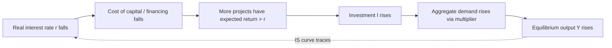

## Investment Demand and Its Determinants

### Overview

**Investment demand** refers to planned spending by firms on capital goods — plant, equipment, structures, software, and inventories — that add to or replace the economy's productive capital stock. Although typically the smallest of the four aggregate demand components by GDP share (roughly 15–20% in most advanced economies), investment is the **most volatile**, and its fluctuations are the primary driver of business-cycle swings in output. Understanding investment demand and its determinants is essential to the IS curve, the transmission of monetary policy, and theories of the business cycle.

---

### Categories of Investment in National Accounts

**Key Points**

- **Business fixed investment**: spending by firms on machinery, equipment, structures, and (in modern accounting) software and intellectual property products.
- **Residential investment**: construction of new housing units — classified as investment because housing is a durable asset yielding a stream of housing services over time, even though the purchaser is typically a household.
- **Inventory investment**: the change in firms' stocks of unsold finished goods, work-in-progress, and raw materials. Notably, inventory investment can be **negative** (destocking) and is often the most volatile subcomponent, frequently used as a leading indicator of turning points in the business cycle.

$$I = I_{fixed,business} + I_{residential} + \Delta(\text{Inventories})$$

---

### The Basic Investment Function

The simplest macroeconomic specification treats investment as a **decreasing function of the real interest rate**:

$$I = I_0 - b \cdot r$$

where:

- $I_0$ = autonomous investment (reflecting business confidence, "animal spirits," and expected future profitability, independent of the current interest rate)
- $r$ = the real interest rate
- $b > 0$ = the sensitivity (interest elasticity) of investment to the real interest rate

$$\frac{\partial I}{\partial r} = -b < 0$$

**Key Points**

- Firms undertake an investment project if its expected rate of return exceeds the cost of financing it. A higher real interest rate raises the cost of borrowed funds and raises the opportunity cost of using retained earnings (which could otherwise earn $r$ in financial markets), so **fewer projects remain profitable** as $r$ rises — generating a downward-sloping investment demand curve in $(I, r)$ space.
- This negative $I$–$r$ relationship is the **primary transmission channel of monetary policy** to aggregate demand: a central bank raising policy rates raises $r$, reduces $I$, and via the multiplier reduces equilibrium output — the microfoundation of the downward-sloping **IS curve**.

---

### The Marginal Efficiency of Investment (MEI) / Marginal Efficiency of Capital

Keynes's original formulation frames the investment decision through the **marginal efficiency of capital (MEC)** — the discount rate that equates the present value of a capital asset's expected future returns to its current cost:

$$\text{Cost of capital good} = \sum_{t=1}^{n} \frac{R_t}{(1+\rho)^t}$$

where $R_t$ is the expected net revenue (return) in period $t$ and $\rho$ (the MEC) is the internal rate of return implied by this equality. Firms invest in a project as long as $\rho >$ the real interest rate $r$ (the cost of financing).

**(svg_diagram)**

<svg xmlns="http://www.w3.org/2000/svg" viewBox="0 0 700 420" font-family="Helvetica, Arial, sans-serif">
<text x="350" y="26" text-anchor="middle" font-size="17" font-weight="bold" fill="#1a1a1a">Investment Demand Curve (svg_diagram)</text>
<line x1="80" y1="370" x2="640" y2="370" stroke="#1a1a1a" stroke-width="2" />
<line x1="80" y1="370" x2="80" y2="50" stroke="#1a1a1a" stroke-width="2" />
<text x="650" y="375" font-size="13" fill="#1a1a1a">Investment (I)</text>
<text x="30" y="45" font-size="13" fill="#1a1a1a">Real interest</text>
<text x="30" y="60" font-size="13" fill="#1a1a1a">rate (r)</text>
<path d="M 120 90 Q 300 200 580 340" stroke="#1d4ed8" stroke-width="2.5" fill="none" />
<text x="420" y="230" font-size="12" fill="#1d4ed8" font-weight="bold">I = I0 − br</text>
<line x1="80" y1="180" x2="330" y2="180" stroke="#666" stroke-dasharray="3,3" />
<line x1="330" y1="180" x2="330" y2="370" stroke="#666" stroke-dasharray="3,3" />
<circle cx="330" cy="180" r="5" fill="#b91c1c" />
<text x="35" y="184" font-size="11" fill="#1a1a1a">r₀</text>
<text x="320" y="390" font-size="11" fill="#1a1a1a">I₀'</text>
<path d="M 160 60 Q 340 170 620 310" stroke="#15803d" stroke-width="2.5" stroke-dasharray="6,3" fill="none" />
<text x="450" y="120" font-size="12" fill="#15803d" font-weight="bold">I' (shift: business confidence ↑)</text>
<line x1="80" y1="180" x2="480" y2="180" stroke="#999" stroke-dasharray="2,2" />
<line x1="480" y1="180" x2="480" y2="370" stroke="#999" stroke-dasharray="2,2" />
<circle cx="480" cy="180" r="5" fill="#7e22ce" />
<text x="470" y="390" font-size="11" fill="#1a1a1a">I₁'</text>

<text x="130" y="410" font-size="11" fill="`#1a1a1a`" font-style="italic">Movement along curve: Δr. Shift of curve: Δ(confidence, taxes, technology)</text>

</svg>

---

### Determinants of Investment Beyond the Interest Rate

**Key Points**

Determinants that shift the **entire investment demand curve** (change $I_0$) rather than causing movement along it:

- **Business confidence / expectations ("animal spirits")**: Keynes emphasized that investment decisions depend heavily on volatile, difficult-to-quantify expectations about future demand and profitability, which can shift abruptly and independently of current fundamentals — a key source of investment volatility and business-cycle amplification.
- **Expected future output/demand growth**: firms invest to expand capacity when they anticipate rising demand for their output (the basis of the accelerator model, below).
- **Corporate tax policy**: investment tax credits, accelerated depreciation allowances, and changes in the corporate tax rate directly affect the after-tax return on capital projects.
- **Cost of capital goods**: prices of machinery, equipment, and construction inputs affect the initial outlay required.
- **Technological change**: new technologies can raise the expected marginal product of new capital, increasing the incentive to invest (embodied technological progress).
- **Credit conditions / financial frictions**: availability of bank credit, corporate bond market conditions, and firms' balance-sheet health (net worth, collateral value) affect the *effective* cost of external finance beyond the risk-free real interest rate (the **external finance premium** in financial-accelerator models).
- **Capacity utilization**: firms operating near full capacity are more likely to invest in expansion; firms with substantial excess capacity have little incentive to add capital even at low interest rates.
- **Uncertainty**: heightened uncertainty about future demand, policy, or financial conditions can cause firms to delay irreversible investment decisions (the "option value of waiting" in real-options models of investment).

---

### The Accelerator Model of Investment

The **accelerator theory** links investment not to the *level* of output or the interest rate, but to the **rate of change of output**, reflecting the idea that firms invest to expand capital stock in proportion to expected changes in demand.

**Simple accelerator model:**

$$K_t^* = v \cdot Y_t$$

where $K_t^*$ is the desired capital stock and $v$ is the (fixed) capital-output ratio. Net investment equals the change in the desired capital stock:

$$I_t^{net} = K_t^* - K_{t-1}^* = v(Y_t - Y_{t-1}) = v \Delta Y_t$$

**Key Points**

- This implies investment is proportional to the **change in output**, not its level — meaning even a *deceleration* in the *growth rate* of output (output still rising, but more slowly) can cause net investment to fall, a mechanism often cited in explaining sharp investment swings around business-cycle turning points.
- **Flexible accelerator models** relax the assumption of instantaneous capital-stock adjustment, allowing firms to close only a fraction of the gap between desired and actual capital stock each period (partial adjustment), which smooths the resulting investment path and better matches observed data.

**Example**: If the capital-output ratio $v = 3$ and output growth accelerates from $\Delta Y = \$10$ billion to $\Delta Y = \$15$ billion between two periods, net investment rises from $3 \times 10 = \$30$ billion to $3 \times 15 = \$45$ billion — a 50% jump in investment driven by only a moderate acceleration in output growth, illustrating why the accelerator model is often invoked to explain investment's outsized cyclical volatility relative to output itself.

---

### Tobin's Q Theory of Investment

James Tobin (1969) proposed that investment depends on the ratio of the **market value of installed capital** to its **replacement cost**:

$$q = \frac{\text{Market value of existing capital (equity value of the firm)}}{\text{Replacement cost of that capital}}$$

**Key Points**

- If $q > 1$: the market values a firm's capital more than it costs to replace/build new — an incentive to invest, since new capital can be created for less than the market is willing to pay for it (embodied in a higher stock price).
- If $q < 1$: existing capital is valued below its replacement cost — no incentive to add new capital (the market signals excess capacity or poor expected returns); firms may instead disinvest or acquire capital secondhand rather than build new.
- $q$ theory has the appeal of grounding investment decisions in **observable financial market data** (stock prices) and forward-looking expectations embedded in equity valuations, connecting the investment decision explicitly to asset pricing rather than solely to current interest rates or output.

$$I = f(q), \quad f'(q) > 0$$

[Unverified] Empirical implementations of $q$-theory (using "average $q$," the ratio of total firm market value to total capital replacement cost, as a proxy for the theoretically relevant "marginal $q$") have found mixed explanatory power for actual investment behavior, motivating extensions incorporating financial frictions and adjustment costs.

---

### Financial Frictions and the Investment Decision

Modern macro-finance models emphasize that firms often face an **external finance premium** — a wedge between the cost of internal funds (retained earnings) and external funds (borrowing, equity issuance) arising from asymmetric information and agency costs between borrowers and lenders (the **financial accelerator**, Bernanke, Gertler, and Gilchrist, 1999).

**Key Points**

- Firms with weaker balance sheets (lower net worth, less collateral) face a **higher external finance premium**, reducing investment even holding the risk-free interest rate constant.
- This mechanism amplifies business cycles: a negative shock that reduces asset prices and firm net worth raises the external finance premium, further depressing investment — a **financial accelerator** that magnifies the initial shock.
- This channel is central to understanding investment collapses during financial crises (e.g., 2008–09), where investment fell far more than could be explained by changes in the risk-free interest rate alone.

---

### Irreversibility and Real Options

Much investment is **partially or fully irreversible** (sunk costs in specialized equipment or structures cannot be fully recovered if conditions change). Under uncertainty, this creates an **option value of waiting** (Dixit and Pindyck, 1994): a firm holding the "option" to invest later, once more information arrives, may rationally delay even positive-NPV projects if uncertainty is high, since investing forecloses the option to wait and learn.

$$\text{Investment threshold} > \text{Standard NPV} = 0 \text{ threshold}$$

**Key Points**

- This implies investment demand can be **more sensitive to uncertainty** than to the expected level of returns or interest rates alone — periods of elevated policy or macroeconomic uncertainty can depress investment even when expected returns and financing costs are favorable.

---

### Summary Table: Comparative Investment Theories

| Theory | Core determinant | Distinctive prediction |
| --- | --- | --- |
| Neoclassical / interest-rate model | Real interest rate $r$ | $I$ inversely related to $r$; basis of IS curve |
| Accelerator model | Change in output $\Delta Y$ | Investment proportional to output growth rate, not level |
| Tobin's $q$ | Ratio of market value to replacement cost of capital | Links investment to stock market valuations |
| Financial accelerator | Firm net worth / external finance premium | Amplifies shocks via balance-sheet effects |
| Real options / irreversibility | Uncertainty | Investment delayed even when expected NPV is positive, under high uncertainty |

---

### Investment Demand in the IS Curve

The negative relationship between $I$ and $r$ is what gives the **IS curve** its downward slope in $(Y, r)$ space: a lower $r$ raises $I$, which (via the multiplier) raises equilibrium $Y$ in the goods market. The **interest sensitivity of investment**, $b$, determines the **steepness of the IS curve**:

- **High $b$** (investment very sensitive to $r$): a small interest-rate change produces a large output response — a **flatter IS curve**, and correspondingly a more powerful monetary policy transmission channel.
- **Low $b$** (investment insensitive to $r$): the IS curve is **steeper**, and monetary policy has a weaker effect on output through the investment channel, though other channels (housing, exchange rate, credit) may still operate.

---

### Related Topics

- Deriving the IS curve from goods-market equilibrium with interest-sensitive investment
- Monetary policy transmission channels: interest rate, credit, and asset-price channels
- The financial accelerator and balance-sheet effects in business-cycle amplification
- Tobin's $q$ and the relationship between stock markets and real investment
- The accelerator-multiplier interaction and endogenous business-cycle models
- Real business cycle theory and technology-driven investment fluctuations
- Corporate tax policy, depreciation schedules, and the user cost of capital
- Uncertainty shocks and irreversible investment under real-options theory