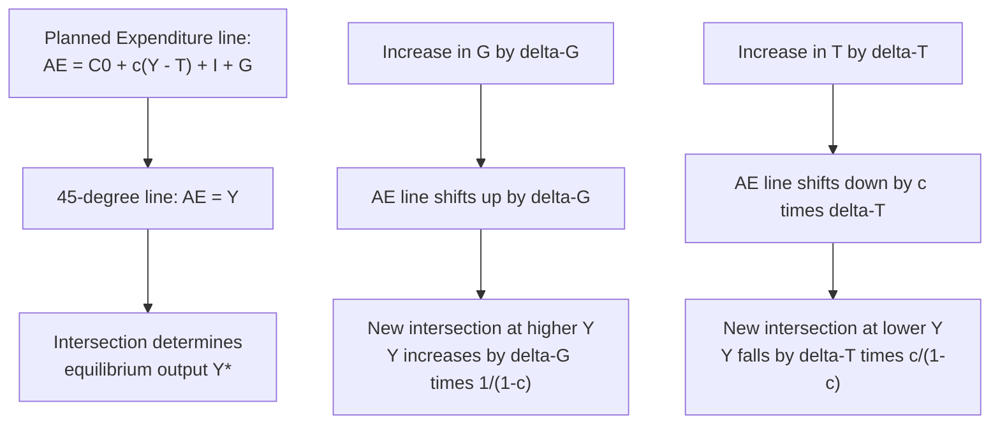

## Government Spending and Taxation in the Goods Market

### Overview

Government spending ($G$) and taxation ($T$) are the fiscal policy components of aggregate demand in the goods market. In the standard Keynesian/IS framework, government purchases enter aggregate expenditure directly, while taxes affect aggregate demand indirectly by altering disposable income and hence consumption. Together, $G$ and $T$ determine the government budget balance and, through the multiplier process, influence equilibrium output independently of monetary policy or private investment decisions.

This topic sits within the broader goods-market equilibrium (IS curve) analysis, where planned aggregate expenditure equals output:

$$Y = C + I + G + NX$$

Fiscal policy operates on this identity through two channels: direct injection ($G$) and indirect leakage/re-injection through disposable income ($Y - T$).

---

### The Government in the Circular Flow

**Government purchases ($G$):** Spending on goods and services (infrastructure, defense, public salaries, public services). $G$ is treated as **exogenous** (policy-determined) in the basic Keynesian model — it does not depend on current income.

**Transfers ($TR$):** Payments to households (unemployment benefits, social security, subsidies) that are *not* purchases of goods and services and therefore do not enter $Y = C + I + G + NX$ directly, but do affect disposable income and thus consumption.

**Taxes ($T$):** Often modeled net of transfers, i.e., $T$ represents **net taxes** $= \text{Taxes} - \text{Transfers}$. Two common specifications:

- **Lump-sum taxes:** $T = \bar{T}$, independent of income.
- **Income-dependent (proportional) taxes:** $T = tY$, where $t$ is the marginal tax rate, or more generally $T = \bar{T} + tY$ (autonomous plus proportional component).

**Disposable income:**

$$Y_d = Y - T$$

Consumption is a function of disposable income:

$$C = C_0 + c \cdot Y_d = C_0 + c(Y - T)$$

where $C_0$ is autonomous consumption and $c$ is the marginal propensity to consume (MPC), $0 < c < 1$.

---

### Goods Market Equilibrium with Government

Combining the expenditure components (closed economy, no net exports, for clarity):

$$Y = C_0 + c(Y - T) + I + G$$

Solving for equilibrium $Y$:

$$Y = \frac{1}{1-c}\left[C_0 + I + G - cT\right]$$

This is the basic **Keynesian cross** solution. The term $\frac{1}{1-c}$ is the simple expenditure multiplier.

**With proportional taxes** ($T = tY$, ignoring autonomous $\bar T$ for simplicity):

$$Y = C_0 + c(Y - tY) + I + G = C_0 + c(1-t)Y + I + G$$

$$Y = \frac{1}{1-c(1-t)}\left[C_0 + I + G\right]$$

Here the multiplier becomes $\dfrac{1}{1-c(1-t)}$, which is **smaller** than $\dfrac{1}{1-c}$ whenever $t > 0$. This is a central result: proportional income taxation acts as an **automatic stabilizer**, dampening the multiplier and reducing output volatility from shocks to $C_0$, $I$, or exogenous $G$.

---

### The Government Spending Multiplier

**Balanced-budget case aside, consider a pure increase in $G$** holding $T$ fixed (lump-sum tax case):

$$\Delta Y = \frac{1}{1-c} \Delta G$$

**Derivation intuition:** An increase in $G$ directly raises output by $\Delta G$ (round 1). This raises income, which raises consumption by $c \cdot \Delta G$ (round 2), which raises income further, raising consumption by $c^2 \Delta G$ (round 3), and so on:

$$\Delta Y = \Delta G(1 + c + c^2 + c^3 + \dots) = \Delta G \cdot \frac{1}{1-c}$$

This is a geometric series with common ratio $c < 1$, converging to $\frac{1}{1-c}$.

**Numerical example:** If $c = 0.8$ and $\Delta G = \$100\text{B}$:

$$\Delta Y = \frac{1}{1-0.8} \times 100 = 5 \times 100 = \$500\text{B}$$

A $100 billion increase in government spending raises equilibrium output by $500 billion — a multiplier of 5.

---

### The Tax Multiplier

A change in lump-sum taxes affects output only indirectly, through its effect on consumption, and its first-round impact is scaled down by $c$:

$$\Delta Y = \frac{-c}{1-c} \Delta T$$

**Key distinctions from the spending multiplier:**

1. **Sign is negative:** a tax increase reduces output (or equivalently, a tax cut raises output).
2. **Magnitude is smaller in absolute value** than the spending multiplier: $\left|\dfrac{-c}{1-c}\right| < \dfrac{1}{1-c}$, because the first round of a tax change only affects consumption by $c \cdot \Delta T$, not the full $\Delta T$ (households save part of any tax cut, $(1-c)\Delta T$, per the initial round).

**Numerical example:** With $c = 0.8$ and $\Delta T = \$100\text{B}$ (tax increase):

$$\Delta Y = \frac{-0.8}{1-0.8} \times 100 = -4 \times 100 = -\$400\text{B}$$

Compare to the $\$500\text{B}$ effect of an equivalent-sized spending change — taxation is a "weaker" fiscal lever per dollar than direct spending.

---

### The Balanced-Budget Multiplier

A classic result: if government spending and lump-sum taxes rise by the **same amount** ($\Delta G = \Delta T$), output still rises — by exactly that amount. This is the **balanced-budget multiplier theorem**.

**Derivation:**

$$\Delta Y = \frac{1}{1-c}\Delta G + \frac{-c}{1-c}\Delta T$$

Setting $\Delta G = \Delta T = \Delta X$:

$$\Delta Y = \frac{1}{1-c}\Delta X - \frac{c}{1-c}\Delta X = \frac{1-c}{1-c}\Delta X = \Delta X$$

$$\boxed{\Delta Y = \Delta G = \Delta T}$$

**Intuition:** The spending increase has a full, undiluted first-round effect ($\Delta G$ enters output one-for-one), while the tax increase's first-round effect on consumption is only $c \cdot \Delta T$ (households absorb the tax by cutting consumption by less than the full tax, saving the rest). The net first-round stimulus is $\Delta G - c\Delta T = \Delta X(1-c)$, which the multiplier $\frac{1}{1-c}$ scales up to exactly $\Delta X$.

[Inference: The balanced-budget multiplier of exactly 1 is a special-case result of the simple linear Keynesian-cross model with a constant MPC and no crowding-out channels (interest rates, prices fixed). It does not hold in IS-LM, AS-AD, or DSGE settings where interest-rate or price responses offset part of the fiscal impulse — the value can differ substantially, including falling below 1 or even turning negative under strong crowding-out or Ricardian-equivalence effects.]

---

### Automatic Stabilizers

Automatic stabilizers are fiscal features that **countercyclically adjust net taxes without discretionary legislative action**, dampening output fluctuations.

**Mechanisms:**

- **Progressive/proportional income tax:** As income falls in a recession, tax revenue falls proportionally more (or, for progressive schedules, effective average rates fall), cushioning the drop in disposable income and consumption.
- **Unemployment insurance and welfare transfers:** These rise automatically as unemployment increases, propping up disposable income of affected households (transfers act like negative taxes, so they raise $Y_d$ precisely when $Y$ falls).
- **Corporate tax revenue:** Highly procyclical — corporate profits swing more than GDP over the cycle, so corporate tax revenue amplifies revenue swings, reinforcing automatic stabilization on the way down and restraint on the way up.

**Formal link to the multiplier:** As shown above, replacing lump-sum $T$ with $T = tY$ shrinks the multiplier from $\frac{1}{1-c}$ to $\frac{1}{1-c(1-t)}$. A higher $t$ means smaller output swings for a given shock to autonomous spending — this is the textbook justification for progressive taxation's stabilizing macro role, separate from its distributive rationale.

---

### Cyclically Adjusted (Structural) Budget Balance

Because tax revenue and some transfer spending move automatically with the cycle, the **actual budget balance** is a poor measure of discretionary fiscal stance. Economists instead use the **cyclically adjusted budget balance (CAB)**, also called the **structural balance**: the budget balance that would prevail if output were at its potential/natural level $Y^*$.

$$CAB = T(Y^*) - G$$

- If actual output $Y < Y^*$ (recession), the actual deficit will exceed the structural deficit, because automatic stabilizers are depressing tax revenue and raising transfer spending — this **does not** indicate a loosening of discretionary policy.
- Changes in the CAB, not the raw budget balance, are the appropriate metric for assessing whether fiscal policy is being actively tightened or loosened by policymakers.

---

### Crowding Out

**Basic Keynesian-cross model (fixed interest rate/price level):** No crowding out — the full multiplier effect operates because investment $I$ is treated as autonomous and interest rates are fixed.

**IS-LM extension:** Once the interest rate is endogenous, an increase in $G$ raises output and money demand, pushing up the interest rate (given a fixed money supply), which **crowds out** part of private investment ($I$ falls as $r$ rises). The net effect on $Y$ is smaller than the simple multiplier would suggest — the **IS-LM government spending multiplier is smaller than the simple Keynesian multiplier** because the interest-rate channel offsets part of the fiscal expansion.

**Open-economy extension (Mundell-Fleming):** Under flexible exchange rates and high capital mobility, fiscal expansion raises domestic interest rates, attracts capital inflows, appreciates the currency, and reduces net exports — a channel sometimes called "external crowding out," which can substantially blunt fiscal multipliers.

[Inference: The degree of crowding out is model- and regime-dependent (fixed vs. flexible exchange rates, degree of capital mobility, monetary policy reaction function) and is a matter of ongoing empirical estimation rather than a fixed theoretical constant.]

---

### Ricardian Equivalence

The **Ricardian equivalence proposition** (associated with Robert Barro, building on David Ricardo's original discussion) argues that under certain conditions, the method of financing government spending — taxes today vs. debt (implying taxes later) — is irrelevant to aggregate demand.

**Logic:** If the government cuts taxes today and finances the resulting deficit with debt, forward-looking, rational households understand that debt must eventually be repaid via future taxes. They anticipate this future tax liability and **save the tax cut** rather than consume it, leaving current consumption — and thus aggregate demand — unchanged.

**Required assumptions for full Ricardian equivalence:**

- Rational, forward-looking households with long (effectively infinite, via bequest motives) planning horizons.
- No borrowing constraints (households can freely borrow against future income).
- No distortionary effects of the taxes themselves (lump-sum taxes, not income taxes that affect labor-supply incentives).
- No intergenerational transfer failure (households care about descendants' tax burdens as if their own).

**Why it is usually treated as a limiting/benchmark case rather than literal description:** Empirically, many households are liquidity-constrained (cannot borrow to smooth consumption against expected future taxes), have finite planning horizons, or do not fully internalize future generations' tax burdens. As a result, tax cuts financed by debt typically do produce **some** positive effect on current consumption and output in most empirical estimates, but usually a smaller effect than a pure "textbook" fixed-tax multiplier would predict if Ricardian offsetting were entirely absent. [Inference: the quantitative degree to which real-world tax-cut multipliers are dampened by Ricardian-type behavior is empirically contested and varies by country, time period, and the perceived credibility/permanence of the tax change.]

---

### Fiscal Policy: Discretionary vs. Automatic, and Implementation Lags

| Type | Definition | Example | Key Limitation |
| --- | --- | --- | --- |
| Automatic stabilizers | Built into tax/transfer system, act without new legislation | Progressive income tax, unemployment insurance | Cannot be finely targeted; magnitude fixed by existing tax/transfer parameters |
| Discretionary fiscal policy | Requires new legislative/executive action | Stimulus packages, infrastructure bills, temporary tax rebates | Subject to recognition lag, legislative lag, and implementation lag |

**Recognition lag:** Time to identify that the economy needs stimulus/restraint.

**Decision/legislative lag:** Time for the political process to pass a fiscal measure.

**Implementation lag:** Time between legislation and actual disbursement/spending (often longest for public investment projects).

These lags are a standard argument (associated with Milton Friedman and later New Classical economists) for favoring automatic stabilizers and monetary policy (faster to adjust) over discretionary fiscal fine-tuning, though this remains a debated area of macroeconomic policy design. [Inference: the relative merits of discretionary fiscal policy versus automatic stabilizers depend on the state of the business cycle, the size of the multiplier during the specific episode, and the effectiveness of monetary policy at the time — e.g., near the zero lower bound, many economists argue discretionary fiscal policy becomes relatively more important, but this is a debated, context-dependent position rather than a settled fact.]

---

### Graphical Representation: The Keynesian Cross

---

### Illustration: Shift in the Aggregate Expenditure Line from Fiscal Policy (svg_diagram)

<svg xmlns="http://www.w3.org/2000/svg" viewBox="0 0 640 460">
<text x="320" y="26" text-anchor="middle" font-size="17" font-weight="bold" fill="#1a1a1a">Keynesian Cross: Effect of Government Spending Increase (svg_diagram)</text>
<line x1="70" y1="410" x2="600" y2="410" stroke="#333" stroke-width="2" />
<line x1="70" y1="410" x2="70" y2="50" stroke="#333" stroke-width="2" />
<text x="330" y="440" text-anchor="middle" font-size="13" fill="#333">Output / Income (Y)</text>
<text x="30" y="230" text-anchor="middle" font-size="13" fill="#333" transform="rotate(-90 30 230)">Planned Expenditure (AE)</text>

<line x1="70" y1="410" x2="560" y2="60" stroke="#555" stroke-width="1.5" stroke-dasharray="4,3" />
<text x="565" y="58" font-size="11" fill="#555">AE = Y (45°)</text>

<line x1="70" y1="330" x2="560" y2="130" stroke="#219ebc" stroke-width="2.5" />
<text x="570" y="128" font-size="11" fill="#219ebc">AE0 = C0+c(Y-T)+I+G</text>

<line x1="70" y1="270" x2="560" y2="70" stroke="#e63946" stroke-width="2.5" />
<text x="570" y="68" font-size="11" fill="#e63946">AE1 = AE0 + ΔG</text>

<circle cx="290" cy="230" r="5" fill="#219ebc" />
<line x1="290" y1="230" x2="290" y2="410" stroke="#219ebc" stroke-width="1" stroke-dasharray="3,2" />
<text x="290" y="425" text-anchor="middle" font-size="11" fill="#219ebc">Y0</text>
<circle cx="380" cy="167" r="5" fill="#e63946" />
<line x1="380" y1="167" x2="380" y2="410" stroke="#e63946" stroke-width="1" stroke-dasharray="3,2" />
<text x="380" y="425" text-anchor="middle" font-size="11" fill="#e63946">Y1</text>

<line x1="150" y1="309" x2="150" y2="289" stroke="#023047" stroke-width="2" marker-end="url(#arrow)" />
<text x="160" y="300" font-size="11" fill="#023047">ΔG (vertical shift)</text>

<text x="335" y="450" text-anchor="middle" font-size="11" fill="`#023047`">ΔY = ΔG × 1/(1-c) (Y1 - Y0 &gt; ΔG)</text>

</svg>

---

### Extension to the IS Curve

In moving from the Keynesian cross (fixed price level, fixed $I$) to the full IS-LM/AS-AD framework, government spending and taxes shift the **IS curve** in $(r, Y)$ space:

- $\Delta G > 0$ or $\Delta T < 0$ (expansionary fiscal policy): IS curve shifts **rightward**, raising equilibrium output for any given interest rate (before accounting for LM-curve interest-rate feedback/crowding out).
- $\Delta G < 0$ or $\Delta T > 0$ (contractionary fiscal policy): IS curve shifts **leftward**.

The horizontal magnitude of the IS shift at any given $r$ equals the Keynesian-cross multiplier effect derived above; the *final* equilibrium change in $Y$ (after the LM curve determines the resulting interest rate change) is smaller due to crowding out, as discussed.

---

### Common Pitfalls and Clarifications

- **Confusing $G$ with total government budget:** Only *purchases of goods and services* enter $Y = C+I+G+NX$ directly. Transfer payments (Social Security, unemployment benefits) are **not** part of $G$; they affect $Y$ only indirectly via their impact on disposable income and hence $C$.
- **Treating average and marginal tax rates as the same:** The multiplier formulas above use the **marginal** propensity to consume out of disposable income and the **marginal** tax rate $t$, not average rates — critical for correctly computing stabilizer strength under progressive tax schedules.
- **Assuming the balanced-budget multiplier is always exactly 1:** This is a clean result of the simplest linear model only; it changes once you introduce proportional taxes, variable $I$ (interest-sensitive investment), open-economy leakages (imports), or price-level/interest-rate feedback.
- **Ignoring the difference between short-run and long-run fiscal multipliers:** Empirical multiplier estimates vary considerably by the state of the economy (multipliers tend to be estimated as larger during recessions/liquidity-trap conditions and smaller during expansions), by the type of spending, and by monetary policy's reaction (whether the central bank offsets fiscal expansion by raising rates). [Unverified: precise multiplier magnitudes cited in different empirical studies vary widely — from below 0.5 to above 2 — depending on methodology, country, and time period, so any single point estimate should not be treated as a universal constant.]

---

### Key Points

- Government purchases $G$ enter aggregate expenditure directly; net taxes $T$ affect it indirectly via disposable income and consumption.
- Spending multiplier: $\frac{1}{1-c}$; tax multiplier: $\frac{-c}{1-c}$ — spending has a larger absolute impact per dollar than taxation.
- The balanced-budget multiplier equals exactly 1 in the simple linear model: $\Delta Y = \Delta G = \Delta T$.
- Proportional/progressive taxation reduces the multiplier and functions as an automatic stabilizer, dampening business-cycle fluctuations without discretionary action.
- The cyclically adjusted (structural) budget balance, not the raw balance, is the correct gauge of discretionary fiscal stance.
- Crowding out (via interest rates in IS-LM, or via exchange rates in open-economy models) reduces the effective fiscal multiplier relative to the simple Keynesian-cross prediction.
- Ricardian equivalence is a theoretical benchmark suggesting debt-financed tax cuts may not stimulate demand if households are fully forward-looking and unconstrained; real-world deviations from its assumptions are the norm, not the exception.

---

**Related Topics**

- The Keynesian cross and derivation of the simple expenditure multiplier
- IS-LM model and interest-rate-driven crowding out
- Mundell-Fleming model and open-economy fiscal policy
- Ricardian equivalence and its empirical tests
- Automatic stabilizers vs. discretionary fiscal policy
- Fiscal policy lags (recognition, legislative, implementation)
- Government budget constraint and public debt dynamics
- Fiscal multipliers at the zero lower bound
- Structural vs. cyclical budget deficits
- Aggregate demand-aggregate supply (AS-AD) framework and fiscal policy transmission