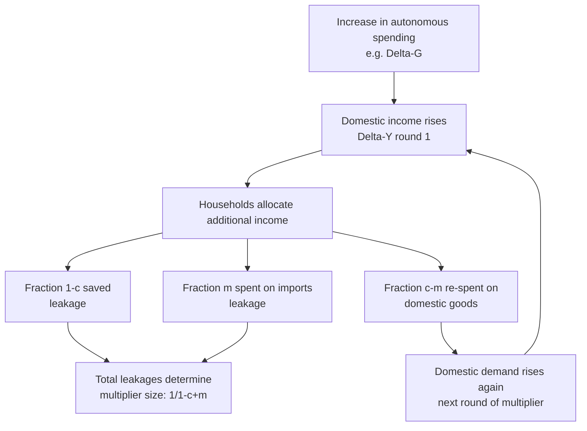

## Net Exports and the Open Economy Multiplier

### Overview

Opening an economy to international trade adds a fourth component to aggregate expenditure — net exports ($NX = X - IM$) — and introduces a new leakage from the domestic spending stream: imports. This changes the goods-market equilibrium condition and, critically, **reduces the size of the fiscal and autonomous-spending multiplier** relative to the closed-economy case, because part of any additional income is spent on foreign rather than domestic goods. This topic extends the closed-economy Keynesian cross to the open-economy IS relationship, a foundation for later work on the Mundell-Fleming model and exchange-rate determination.

---

### Goods Market Equilibrium in an Open Economy

The expenditure identity becomes:

$$Y = C + I + G + NX$$

where

$$NX = X - IM$$

- $X$ (exports): demand from foreign residents for domestic goods, treated as **exogenous** with respect to domestic income (it depends on foreign income $Y^f$ and the real exchange rate, not on domestic $Y$).
- $IM$ (imports): domestic residents' demand for foreign goods, modeled as an **increasing function of domestic income**:

$$IM = m \cdot Y, \quad 0 < m < 1$$

where $m$ is the **marginal propensity to import (MPM)** — the fraction of each additional dollar of domestic income spent on imported goods.

**Net export function:**

$$NX = X - mY$$

Since $X$ does not depend on $Y$ but $IM$ rises with $Y$, $NX$ is a **decreasing function of domestic income**: as an economy grows, it draws in more imports, worsening (reducing) its net export balance, all else equal.

---

### Full Open-Economy Expenditure Equation

Combining the standard closed-economy components with the trade sector (using lump-sum taxes $T$ for simplicity):

$$Y = C_0 + c(Y - T) + I + G + X - mY$$

Collecting terms in $Y$:

$$Y - cY + mY = C_0 - cT + I + G + X$$

$$Y(1 - c + m) = C_0 - cT + I + G + X$$

$$Y = \frac{1}{1 - c + m}\left[C_0 - cT + I + G + X\right]$$

---

### The Open-Economy Multiplier

The autonomous-spending multiplier in the open economy is:

$$k_{open} = \frac{1}{1 - c + m}$$

Compare this to the closed-economy multiplier:

$$k_{closed} = \frac{1}{1-c}$$

Since $m > 0$, the denominator is larger in the open-economy case ($1 - c + m > 1 - c$), so:

$$k_{open} < k_{closed}$$

**Interpretation:** Imports act as a **second leakage** from the domestic circular flow, alongside saving (via $1-c$). Just as households save part of each additional dollar of income rather than spending it (reducing the multiplier from infinity to $\frac{1}{1-c}$), they also spend part of it on imports rather than domestic goods, shrinking the multiplier further to $\frac{1}{1-c+m}$.

**Numerical example:** Let $c = 0.8$ (MPC) and $m = 0.2$ (MPM).

Closed economy:

$$k_{closed} = \frac{1}{1-0.8} = 5$$

Open economy:

$$k_{open} = \frac{1}{1-0.8+0.2} = \frac{1}{0.4} = 2.5$$

A given increase in government spending or autonomous investment produces **half** the output effect in this open economy compared to the closed-economy benchmark. A $100B increase in $G$ raises output by $500B in the closed case but only $250B in the open case.

---

### Derivation via the Multiplier (Geometric Series) Intuition

An initial increase in autonomous spending $\Delta A$ (e.g., $\Delta G$) raises income by $\Delta A$ in round 1. In round 2, this raises consumption spending, but only a fraction $(c - m)$ of the round-1 income increase circulates back into **domestic** demand — because out of each additional dollar of income, $c$ is consumed but a portion $m$ of the increase in output/income itself leaks out as import demand before even reaching the next round...

More precisely, the correct way to see this: of each round's addition to income, $(1-c)$ is saved and $m$ (of that same round's income) is spent on imports, leaving $(c - m)$ effectively re-spent on domestic goods in the next round. Summing the geometric series:

$$\Delta Y = \Delta A \left[1 + (c-m) + (c-m)^2 + \dots\right] = \frac{\Delta A}{1-(c-m)} = \frac{\Delta A}{1-c+m}$$

This confirms the multiplier formula derived algebraically above.

---

### Fiscal Multipliers in the Open Economy

**Government spending multiplier:**

$$\Delta Y = \frac{1}{1-c+m}\Delta G$$

**Tax multiplier (lump-sum taxes):**

$$\Delta Y = \frac{-c}{1-c+m}\Delta T$$

**Balanced-budget multiplier** ($\Delta G = \Delta T$):

$$\Delta Y = \frac{1-c}{1-c+m}\Delta G$$

Note this is **less than 1** whenever $m > 0$ — unlike the closed-economy case where the balanced-budget multiplier equals exactly 1. The extra import leakage means a balanced-budget fiscal expansion no longer perfectly self-finances its output effect; some of the stimulus "leaks abroad."

---

### Foreign Income and Export Shocks

Since exports depend on foreign income and relative prices/exchange rates rather than domestic $Y$, a rise in foreign demand acts exactly like an increase in autonomous domestic spending:

$$\Delta Y = \frac{1}{1-c+m}\Delta X$$

**Trade interdependence:** If Country A's exports depend on Country B's income, then Country B's fiscal expansion (or business-cycle upswing) raises Country B's imports, which are Country A's exports — transmitting demand shocks across borders. This is the basis for cross-country business cycle **spillovers** and cross-country multiplier feedback (the "locomotive effect" in international policy coordination discussions), where a large economy's fiscal stimulus partially "leaks" into stimulating trade partners.

[Inference: Full modeling of these cross-border feedback loops (Country A's growth boosting Country B's exports, which boosts Country B's income and imports, further stimulating Country A) yields a foreign-trade multiplier system solvable via simultaneous equations; the simple formulas above treat foreign income and hence $X$ as exogenous, which is a simplification standard at the introductory level but omitted in this static two-country feedback sense.]

---

### The Real Exchange Rate and Net Exports

While the basic multiplier analysis above holds the real exchange rate fixed, the fuller net export function typically includes it explicitly:

$$NX = NX(Y, Y^f, \varepsilon)$$

where $\varepsilon$ is the real exchange rate (domestic currency value of foreign currency, defined so that a **rise in $\varepsilon$** = **real depreciation**, making domestic goods cheaper for foreigners and foreign goods more expensive for domestic residents).

- $\frac{\partial NX}{\partial Y} < 0$ (higher domestic income → more imports → lower $NX$)
- $\frac{\partial NX}{\partial Y^f} > 0$ (higher foreign income → more exports → higher $NX$)
- $\frac{\partial NX}{\partial \varepsilon} > 0$ under the standard assumption that the **Marshall-Lerner condition** holds (the sum of the absolute values of export and import price elasticities exceeds 1), meaning a real depreciation improves the trade balance.

This exchange-rate channel becomes central once the model is extended to Mundell-Fleming (open-economy IS-LM), where fiscal and monetary policy interact with capital mobility and exchange-rate regimes to determine the *ultimate* effectiveness of fiscal multipliers — but within the goods-market (IS) analysis alone, $\varepsilon$ is typically held fixed while focusing on the income-driven import leakage.

---

### The J-Curve (Brief Note on Dynamics)

[Inference/Standard extension, not derivable from the static multiplier model alone] Empirically and theoretically, a real depreciation may initially **worsen** the trade balance before improving it, because existing trade contracts and consumption patterns adjust with a lag (volumes are slow to respond even though the price of imports in domestic currency rises immediately). This is known as the **J-curve effect** and is a dynamic complement to the static Marshall-Lerner analysis; it does not alter the sign of the long-run comparative static result but explains observed short-run reversals in trade-balance data following exchange-rate movements.

---

### Comparison: Closed vs. Open Economy Multiplier Effects

| Feature | Closed Economy | Open Economy |
| --- | --- | --- |
| Expenditure identity | $Y = C+I+G$ | $Y = C+I+G+NX$ |
| Leakages from spending stream | Saving only: $(1-c)$ | Saving + imports: $(1-c+m)$ |
| Multiplier | $\frac{1}{1-c}$ | $\frac{1}{1-c+m}$ |
| Balanced-budget multiplier | Exactly 1 | $\frac{1-c}{1-c+m} < 1$ |
| Effect of foreign income shocks | None (no foreign sector) | Transmitted via $X$, scaled by domestic multiplier |
| Fiscal policy effectiveness | Higher (larger multiplier) | Lower (partly "leaks abroad" via import demand) |

---

### Diagram: Import Leakage in the Circular Flow

---

### Illustration: Multiplier Size vs. Marginal Propensity to Import (svg_diagram)

<svg xmlns="http://www.w3.org/2000/svg" viewBox="0 0 640 400">
<text x="320" y="26" text-anchor="middle" font-size="17" font-weight="bold" fill="#1a1a1a">Open-Economy Multiplier as MPM Rises (svg_diagram)</text>
<line x1="70" y1="350" x2="600" y2="350" stroke="#333" stroke-width="2" />
<line x1="70" y1="350" x2="70" y2="50" stroke="#333" stroke-width="2" />
<text x="330" y="380" text-anchor="middle" font-size="13" fill="#333">Marginal Propensity to Import (m)</text>
<text x="30" y="200" text-anchor="middle" font-size="13" fill="#333" transform="rotate(-90 30 200)">Multiplier value k</text>

<polyline points="90,90 190,168 290,210 390,240 490,262 590,278" fill="none" stroke="#e63946" stroke-width="3" />
<circle cx="90" cy="90" r="4" fill="#e63946" />
<text x="90" y="80" text-anchor="middle" font-size="10" fill="#333">m=0, k=5.0</text>
<circle cx="290" cy="210" r="4" fill="#e63946" />
<text x="290" y="200" text-anchor="middle" font-size="10" fill="#333">m=0.2, k=2.5</text>
<circle cx="590" cy="278" r="4" fill="#e63946" />
<text x="590" y="268" text-anchor="middle" font-size="10" fill="#333">m=0.5, k=1.43</text>

<text x="90" y="365" text-anchor="middle" font-size="10" fill="#555">0</text>

<text x="290" y="365" text-anchor="middle" font-size="10" fill="#555">0.2</text>

<text x="490" y="365" text-anchor="middle" font-size="10" fill="#555">0.4</text>

<text x="330" y="395" text-anchor="middle" font-size="11" fill="#555">Holding c = 0.8 fixed: greater trade openness (higher m) monotonically shrinks the multiplier</text>

</svg>

---

### Worked Comparative Example: Two Economies with Different Openness

Consider two economies, both with $c = 0.75$, facing an identical $\Delta G = \$50\text{B}$ fiscal stimulus.

**Economy A (relatively closed):** $m_A = 0.05$

$$k_A = \frac{1}{1-0.75+0.05} = \frac{1}{0.30} = 3.33$$

$$\Delta Y_A = 3.33 \times 50 = \$166.7\text{B}$$

**Economy B (highly open, e.g., small trading economy):** $m_B = 0.35$

$$k_B = \frac{1}{1-0.75+0.35} = \frac{1}{0.60} = 1.67$$

$$\Delta Y_B = 1.67 \times 50 = \$83.3\text{B}$$

**Implication:** Small, trade-dependent open economies typically experience substantially weaker domestic multiplier effects from fiscal stimulus than larger, relatively closed economies, because a greater share of the stimulus "leaks" into demand for imported goods rather than recirculating domestically. This is a standard stylized explanation (among several contributing factors) for why small open economies often observe smaller empirical fiscal multipliers than large economies such as the United States. [Unverified: actual cross-country empirical multiplier estimates depend on many additional factors beyond MPM alone — exchange-rate regime, monetary policy reaction, fiscal credibility, and the composition of spending — so the MPM channel described here should be understood as one structural factor among several, not the sole determinant of observed multiplier differences.]

---

### Link to the IS Curve and Later Extensions

In the transition to the open-economy IS-LM (Mundell-Fleming) model, the $NX$ term additionally becomes a function of the interest rate through the exchange-rate channel (higher domestic interest rates → capital inflow → currency appreciation → lower $NX$). This means the open-economy IS curve is generally **flatter** than the closed-economy IS curve at a given multiplier size, because interest-rate changes now affect output through both the standard investment channel and the additional net-export/exchange-rate channel. This linkage is developed fully under the Mundell-Fleming framework, where the responsiveness of net exports to the exchange rate, combined with the degree of international capital mobility, determines whether fiscal or monetary policy is relatively more effective at influencing output under fixed versus flexible exchange-rate regimes.

---

### Common Pitfalls and Clarifications

- **Treating $m$ as the average propensity to import rather than the marginal one:** The multiplier formula requires the *marginal* propensity to import — the change in imports per unit change in income — not the ratio of total imports to total income (average propensity), which can differ substantially, especially in economies with large non-cyclical import components (e.g., commodity imports).
- **Confusing "improving the trade balance" with "increasing output":** A policy that boosts $NX$ (e.g., a real depreciation) raises equilibrium output through the same multiplier mechanism as an increase in $G$, but it does so via a different channel (external demand rather than direct government purchases or private consumption), and it changes the *composition* of GDP, not just its level.
- **Assuming the open-economy multiplier is always smaller than 1:** It is smaller than the *closed-economy* multiplier for the same economy, but it is not necessarily below 1 in absolute terms — with $c = 0.8, m = 0.2$, the multiplier was still $2.5 > 1$.
- **Overlooking that $X$ is exogenous only in the small open-economy, partial-equilibrium sense:** For very large economies (or in two-country models), a country's own income changes can feed back into foreign income and thus into its own exports — this reciprocal effect is set aside in the standard single-country treatment.

---

### Key Points

- Net exports add a third leakage-generating channel (imports) to the goods market, alongside saving.
- The open-economy multiplier is $\frac{1}{1-c+m}$, strictly smaller than the closed-economy multiplier $\frac{1}{1-c}$ whenever the marginal propensity to import $m>0$.
- Exports are treated as exogenous to domestic income (driven by foreign income and relative prices); imports are modeled as increasing in domestic income.
- The balanced-budget multiplier in an open economy is less than 1 (unlike the closed-economy value of exactly 1), because part of any balanced fiscal expansion leaks into import demand.
- Foreign income shocks transmit to the domestic economy through the export channel, scaled by the domestic multiplier — the basis for international business-cycle spillovers.
- More trade-open economies (higher $m$) systematically experience smaller domestic multiplier effects from a given fiscal or autonomous spending shock.

---

**Related Topics**

- The Keynesian cross and closed-economy multiplier
- Government spending and taxation in the goods market
- Marshall-Lerner condition and the J-curve
- Mundell-Fleming model (open-economy IS-LM)
- Fixed vs. flexible exchange-rate regimes and fiscal/monetary policy effectiveness
- Real exchange rate determination
- International business cycle transmission and trade spillovers
- Twin deficits hypothesis (fiscal deficit and trade deficit linkage)
- Capital mobility and the trilemma of international finance