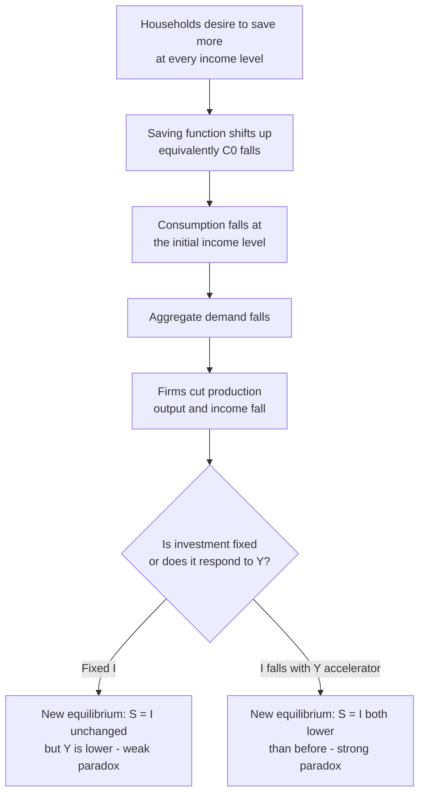

## Paradox of Thrift

### Overview

The paradox of thrift (also called the paradox of saving) is a Keynesian proposition stating that an increase in the desired (planned) saving rate by households — while individually rational and beneficial for a single saver — can, if adopted economy-wide, **reduce aggregate output and, under certain conditions, even reduce the total amount actually saved**. The paradox highlights a fallacy of composition in macroeconomics: what is prudent for an individual household is not necessarily beneficial, and can be self-defeating, when generalized to the whole economy. The concept was popularized by John Maynard Keynes in *The General Theory of Employment, Interest and Money* (1936), though the underlying idea has earlier roots (including discussions by Bernard Mandeville and William Petty, and it appears in Keynes's own earlier *A Treatise on Money*).

---

### The Fallacy of Composition

**Individual level:** If one household increases its saving rate (reduces consumption out of a given income), its wealth accumulates faster — a straightforward, uncontroversial result, holding its own income constant.

**Aggregate level:** If *all* households simultaneously attempt to save more, aggregate consumption spending falls. Because one household's spending is another's income, a fall in aggregate consumption reduces aggregate income — and since each household's saving is a fraction of *its own* income, and that income has now fallen, aggregate saving may not rise, and can even fall, despite the higher *desired* saving rate.

This distinguishes:

- **Desired (ex ante) saving:** the fraction of income households *intend* to save at a given level of income, embedded in the saving function.
- **Realized (ex post) saving:** the fraction actually saved once the income-adjustment process has worked through the economy.

---

### Formal Derivation in the Keynesian Cross

**Setup:** Closed economy, no government sector, for the simplest exposition. Consumption function:

$$C = C_0 + c \cdot Y$$

Saving function (since $S = Y - C$):

$$S = -C_0 + (1-c)Y = -C_0 + sY$$

where $s = 1-c$ is the marginal propensity to save (MPS).

Goods market equilibrium (with autonomous investment $I$, fixed):

$$Y = C + I \quad \Leftrightarrow \quad S = I$$

**A shift in the saving function:** Suppose households become more thrifty — for a given level of income, they now wish to save more at every level of $Y$. This can be modeled as a *decrease in autonomous consumption* $C_0$ (equivalently, an *upward shift* in the saving function, holding the marginal propensity to save $s$ unchanged):

$$C_0 \to C_0 - \Delta C_0, \quad \Delta C_0 > 0$$

**Effect on equilibrium output:** Using the standard multiplier result,

$$\Delta Y = \frac{1}{1-c}(-\Delta C_0) = \frac{-\Delta C_0}{s}$$

Output *falls* by a multiple of the autonomous consumption cut.

**Effect on equilibrium saving:** In equilibrium, $S = I$. If investment $I$ is held fixed (autonomous, not responsive to income or interest rates in this simplified setup), then in the **new equilibrium**, saving must still equal $I$:

$$S_{new} = I = S_{old}$$

**This is the crux of the paradox:** despite households wanting to save more at every level of income (the saving function has shifted up), **aggregate equilibrium saving in the new steady state is unchanged** — it is pinned down by $I$, which has not changed. All that has changed is that **income has fallen** to a lower level at which the (higher) desired saving rate applied to the (now lower) income yields the same absolute saving as before.

**Graphically:** the saving function shifts up (or, equivalently, the consumption function shifts down), but because $I$ is fixed, the new equilibrium occurs at the point where the new $S$ line crosses the same horizontal $I$ line — necessarily at a **lower $Y$**.

---

### The "Strong" vs. "Weak" Version of the Paradox

**Weak version (always true in this simple model):** An attempt to save more reduces equilibrium *income*, while equilibrium *saving* stays the same (because it must equal fixed $I$). This is the standard textbook Keynesian-cross result and holds unambiguously given the model's assumptions (fixed $I$, no government/foreign sector, stable consumption function).

**Strong version (saving actually falls, not just stays constant):** This requires either:

- **Investment responding negatively to the fall in income/output** (e.g., via an accelerator mechanism, where lower current or expected output reduces firms' desired investment) — then $S = I$ falls further, since $I$ itself has fallen, so realized aggregate saving is *lower* than before the thrift shock, not merely unchanged.
- **A liquidity-trap or debt-deflation dynamic** where falling income and prices raise the real burden of debt, further depressing spending (Fisher's debt-deflation channel), amplifying the output and income contraction well beyond the basic multiplier effect.

[Inference: Whether the "strong" version (saving falls in absolute terms) holds depends on auxiliary assumptions about the investment function's sensitivity to income — this is a standard extension found in intermediate macro treatments but is not a universal, parameter-free implication of the basic paradox.]

---

### Numerical Example

Assume $c = 0.75$ (so $s = 0.25$), $I = \$200\text{B}$ (fixed, autonomous), and initially $C_0 = \$100\text{B}$.

**Initial equilibrium:**

$$Y = \frac{C_0 + I}{1-c} = \frac{100+200}{0.25} = \$1200\text{B}$$

Check: $S = -C_0 + sY = -100 + 0.25(1200) = -100+300 = \$200\text{B} = I$ ✓.

**Households become more thrifty:** $C_0$ falls to $80B (a $20B increase in desired saving at each income level).

**New equilibrium:**

$$Y_{new} = \frac{80+200}{0.25} = \$1120\text{B}$$

Change in output: $\Delta Y = 1120 - 1200 = -\$80\text{B}$ (consistent with the multiplier: $\Delta Y = \frac{-20}{0.25} = -80$).

**New saving:** $S_{new} = -80 + 0.25(1120) = -80+280 = \$200\text{B}$

**Result:** Saving is **still exactly $200B** — unchanged from before — while output has fallen by $80B. Households wanted to save more at any given income, but in equilibrium they end up saving the same absolute amount, at a lower income (and hence a lower absolute level of consumption).

**With investment responding to income (accelerator, illustrative):** Suppose $I = 200 - 0.1(1200-Y)$, so that a fall in output below the original $1200B level itself depresses investment. Re-solving the equilibrium with this feedback would produce a further fall in both $Y$ and $I$ (and hence realized $S$), illustrating the "strong" version.

---

### Diagram: Saving Function Shift and the Paradox

---

### Illustration: Saving Equals Investment Before and After the Thrift Shock (svg_diagram)

<svg xmlns="http://www.w3.org/2000/svg" viewBox="0 0 640 440">
<text x="320" y="26" text-anchor="middle" font-size="17" font-weight="bold" fill="#1a1a1a">Paradox of Thrift: S = I Equilibrium Shift (svg_diagram)</text>
<line x1="70" y1="390" x2="600" y2="390" stroke="#333" stroke-width="2" />
<line x1="70" y1="390" x2="70" y2="50" stroke="#333" stroke-width="2" />
<text x="330" y="420" text-anchor="middle" font-size="13" fill="#333">Output / Income (Y)</text>
<text x="30" y="220" text-anchor="middle" font-size="13" fill="#333" transform="rotate(-90 30 220)">Saving (S), Investment (I)</text>

<line x1="70" y1="220" x2="600" y2="220" stroke="#023047" stroke-width="2.5" />
<text x="605" y="224" font-size="11" fill="#023047">I (fixed)</text>

<line x1="70" y1="350" x2="520" y2="70" stroke="#219ebc" stroke-width="2.5" />
<text x="525" y="66" font-size="11" fill="#219ebc">S0 = -C0 + sY</text>

<line x1="70" y1="310" x2="480" y2="70" stroke="#e63946" stroke-width="2.5" />
<text x="485" y="66" font-size="11" fill="#e63946">S1 (shifted up, higher desired saving)</text>

<circle cx="410" cy="220" r="5" fill="#219ebc" />
<line x1="410" y1="220" x2="410" y2="390" stroke="#219ebc" stroke-width="1" stroke-dasharray="3,2" />
<text x="410" y="405" text-anchor="middle" font-size="11" fill="#219ebc">Y0 (original)</text>
<circle cx="335" cy="220" r="5" fill="#e63946" />
<line x1="335" y1="220" x2="335" y2="390" stroke="#e63946" stroke-width="1" stroke-dasharray="3,2" />
<text x="335" y="405" text-anchor="middle" font-size="11" fill="#e63946">Y1 (new, lower)</text>

<text x="330" y="435" text-anchor="middle" font-size="11" fill="#555">Both equilibria lie on the same I line: saving is unchanged, but income has fallen</text>

</svg>

---

### Conditions Under Which the Paradox Applies

The paradox of thrift is not a universal law of economics; it depends on specific structural conditions:

1. **Demand-constrained economy (output below potential/full employment).** If the economy is operating at or near full employment/potential output, an increase in saving frees up resources (loanable funds) for investment without needing a fall in output — the "classical" or "loanable funds" view, where saving finances investment through interest-rate adjustment rather than reducing demand.
2. **Sticky prices/wages in the short run.** The Keynesian mechanism relies on quantities (output, employment) adjusting to demand shortfalls rather than prices adjusting instantly to clear markets.
3. **Investment not fully interest-elastic, or interest rates constrained (e.g., zero lower bound).** In a classical or loanable-funds framework, higher desired saving would lower the interest rate, stimulating investment enough to fully offset the fall in consumption (crowding *in* investment), leaving output unchanged. The paradox is strongest precisely when this interest-rate adjustment mechanism is muted or absent — for instance, at the zero lower bound, where nominal rates cannot fall further to stimulate investment.
4. **Closed economy or economy-wide (not individual/small-open) saving increase.** In a small open economy, the paradox is weaker or may not apply at all in isolation, because saving does not have to remain domestic — it can flow abroad and finance foreign investment or accumulate as net foreign assets/current account surplus, meaning higher domestic saving need not depress domestic output nearly as much (part of the "leakage" is absorbed by the rest of the world rather than purely reducing domestic demand). [Inference: the qualitative direction of this open-economy dampening effect is a standard implication of extending the closed-economy model, though the quantitative degree depends on the specifics of capital mobility and exchange-rate regime, which are developed more fully in open-economy IS-LM/Mundell-Fleming frameworks.]

---

### Relation to the Loanable Funds (Classical) View

The **classical/loanable-funds view** treats saving and investment as coordinated through the interest rate in the market for loanable funds:

- Higher desired saving shifts the loanable funds supply curve rightward.
- This **lowers the equilibrium interest rate**.
- The lower interest rate **stimulates investment demand** (since investment is downward-sloping in the interest rate).
- In this view, higher saving is unambiguously good for long-run capital accumulation and growth, with no output-reducing effect, because the interest-rate channel automatically re-equilibrates $S = I$ at the *same* output level (full employment is assumed, so output cannot fall — only its composition shifts from consumption toward investment).

**Contrast with the Keynesian view:** Keynes's critique was that this classical adjustment mechanism can fail (or work too slowly, or be blocked, e.g., by a liquidity trap where the interest rate cannot fall enough, or is already near zero), particularly when the economy is demand-constrained rather than supply-constrained. In that setting, the *quantity* adjustment (falling output and income) does the equilibrating work instead of the *price* adjustment (falling interest rate), producing the paradox.

This tension is a central point of debate between Keynesian and classical/neoclassical macroeconomic traditions and remains reflected in modern New Keynesian vs. Real Business Cycle modeling approaches to saving and investment dynamics. [Inference: the relative empirical importance of the interest-rate adjustment channel versus the quantity/multiplier channel is a long-standing, unresolved area of debate in macroeconomics rather than a settled matter, and likely depends on the state of the business cycle, financial conditions, and monetary policy stance at any given time.]

---

### Historical and Policy Context

- **The Great Depression:** The paradox of thrift is frequently invoked to explain part of the severity of the Great Depression — falling incomes and pervasive uncertainty led households to cut spending and increase precautionary saving simultaneously across the economy, which (per the mechanism above) contributed to further declines in aggregate demand, output, and employment, reinforcing the downturn.
- **Post-2008 Global Financial Crisis:** The concept resurfaced prominently in policy debates about household deleveraging (paying down debt, effectively a form of increased net saving) during and after the crisis, with concerns that widespread simultaneous deleveraging could deepen or prolong a demand-driven recession — an argument frequently made in support of countercyclical fiscal stimulus to offset the private-sector demand shortfall.
- **Policy implication commonly drawn:** During a demand-deficient recession, if the private sector (households and/or firms) sharply raises its net saving rate, government can offset the resulting shortfall in aggregate demand via fiscal expansion (higher $G$ or lower $T$) or via monetary policy (if the zero lower bound is not binding) to prevent the paradox from causing an output contraction. This is a widely cited application of the theory but represents a policy recommendation, not a value-free technical implication of the model. [Inference: This policy conclusion follows from applying the standard Keynesian model logic, but its practical validity and desirability in any specific historical episode is a matter of ongoing macroeconomic and political debate, not a directly testable, uncontroversial fact.]

---

### Common Objections and Caveats

- **Not a claim that saving is "bad" in general.** The paradox describes a *short-run, demand-side* effect under specific conditions (below full employment, sticky prices, constrained interest-rate adjustment). Over the long run, higher national saving is generally associated in growth models (e.g., Solow-Swan) with a higher capital stock and higher steady-state output per capita — the paradox does not contradict this long-run growth relationship; it applies to short-run demand-determined output fluctuations.
- **Distinguishing macro from micro prudence.** The paradox does not imply that individual households should avoid saving — an individual household's saving decision has a negligible effect on aggregate demand and remains prudent for that household's own financial security. The paradox is specifically about simultaneous, economy-wide shifts in saving behavior.
- **Not universally accepted as quantitatively large or always binding.** Critics (particularly from classical/supply-side traditions) argue that in economies with flexible interest rates and open capital markets, the loanable-funds adjustment described above substantially mitigates or eliminates the paradox outside of unusual circumstances like the zero lower bound. [Inference: the magnitude and even the existence of a paradox-of-thrift effect in any specific real-world episode is empirically difficult to isolate from other simultaneous macroeconomic shocks, and reasonable economists disagree on how large or policy-relevant the effect typically is outside of severe demand-constrained downturns.]

---

### Key Points

- The paradox of thrift: an economy-wide increase in desired saving can reduce equilibrium output and, under some conditions, leave aggregate realized saving unchanged or even reduce it — a fallacy of composition between individual and aggregate rationality.
- In the basic Keynesian-cross model with fixed investment, equilibrium saving must equal fixed $I$; a rightward/upward shift in desired saving therefore only reduces equilibrium income, not equilibrium saving ("weak" version).
- If investment itself responds negatively to falling income (accelerator effect), realized saving can fall in absolute terms too ("strong" version).
- The paradox depends on demand-constrained conditions, sticky prices, and limited interest-rate adjustment (loanable funds channel) — it is not a universal law independent of these assumptions.
- The classical/loanable-funds view predicts no paradox: higher saving lowers interest rates, crowding in investment and leaving output unaffected at full employment.
- Commonly invoked to explain deepening of demand-driven downturns (Great Depression, post-2008 deleveraging) and used to justify countercyclical fiscal or monetary offsetting policy.

---

**Related Topics**

- The Keynesian cross and the multiplier
- Government spending and taxation in the goods market
- Loanable funds theory and classical saving-investment equilibrium
- Zero lower bound and liquidity trap dynamics
- Fisher's debt-deflation theory
- Accelerator theory of investment
- Solow-Swan growth model and the long-run role of saving
- Precautionary saving and household balance-sheet deleveraging
- Aggregate demand-aggregate supply (AS-AD) framework