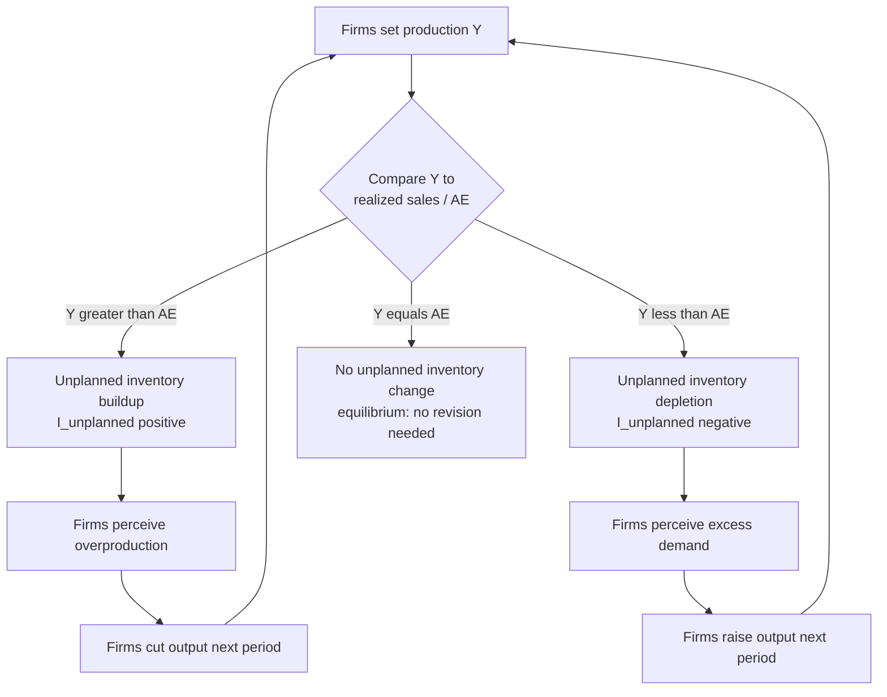

## Inventory Adjustment and Short-Run Output Dynamics

### Overview

Inventory adjustment is the mechanism by which the goods market moves toward equilibrium in the short run when actual output does not equal planned aggregate expenditure. Because firms cannot instantaneously observe demand and adjust production, unsold or oversold goods accumulate in or deplete from inventories, and these **unplanned inventory changes** serve as the signal that triggers firms to revise production. This topic provides the microfoundation for *why* the Keynesian-cross equilibrium condition ($Y = AE$) is a meaningful attracting point rather than an arbitrary accounting identity, and explains the dynamic, period-by-period adjustment path of output toward that equilibrium.

---

### Actual vs. Planned Expenditure: The Role of Inventories

**National income accounting identity (always true, by construction):**

$$Y \equiv C + I^{actual} + G + NX$$

Here $I^{actual}$ includes **actual (realized) investment**, which itself decomposes into:

$$I^{actual} = I^{planned} + I^{unplanned}$$

where $I^{unplanned}$ is the **unplanned (unintended) change in inventories** — inventory investment that firms did not intend, arising purely from the gap between what was produced and what was actually sold.

**Planned aggregate expenditure:**

$$AE = C + I^{planned} + G + NX$$

**The key distinction:** The accounting identity $Y = C + I^{actual} + G + NX$ holds *always*, by definition, whether or not the economy is in equilibrium. But **goods-market equilibrium** requires the *behavioral* condition:

$$Y = AE \quad \Leftrightarrow \quad I^{unplanned} = 0$$

Equilibrium output is the level of production at which firms have **no incentive to change their production plans**, because nothing unexpected happened to their inventories.

---

### Disequilibrium States and Adjustment

**Case 1: $Y > AE$ (output exceeds planned expenditure)**

- Firms have produced more than households, government, and foreigners planned to purchase.
- The unsold surplus accumulates as **unplanned inventory investment**: $I^{unplanned} > 0$.
- Firms observe rising, unwanted inventory stocks and interpret this as a signal that they are overproducing relative to demand.
- **Response:** Firms cut production in the next period, reducing output toward $AE$.

**Case 2: $Y < AE$ (output falls short of planned expenditure)**

- Buyers demand more than firms produced.
- Firms meet part of this excess demand by running down existing inventory stocks: **unplanned inventory investment is negative**, $I^{unplanned} < 0$ (inventory *decumulation*).
- Firms observe unexpectedly depleted inventories (and/or unfilled orders/backlogs) and interpret this as a signal of excess demand.
- **Response:** Firms raise production in the next period, increasing output toward $AE$.

**Case 3: $Y = AE$ (equilibrium)**

- Production exactly matches planned spending.
- $I^{unplanned} = 0$: firms sell exactly what they intended to produce (net of any planned inventory changes), and inventories move only as *planned* (e.g., firms may still plan to build up inventory ahead of an anticipated seasonal demand increase — that is *planned* $I$, not a disequilibrium signal).
- Firms have no incentive to revise production plans; output remains stable absent a new shock.

---

### Dynamic Adjustment Process (Period-by-Period)

The equilibration mechanism operates over successive short periods (e.g., production cycles, quarters):

$$Y_{t+1} = Y_t + \lambda \left(AE_t - Y_t\right), \quad 0 < \lambda \le 1$$

where $\lambda$ is an adjustment speed parameter reflecting how aggressively firms revise output in response to the observed expenditure gap in the previous period. This is a standard **partial-adjustment** or **stock-adjustment** formulation applied to the goods market.

**Interpretation of $\lambda$:**

- $\lambda = 1$: firms fully adjust output to match the *previous* period's planned expenditure in a single period (an extreme, instantaneous-adjustment case).
- $0 < \lambda < 1$: firms only partially close the output-expenditure gap each period, reflecting costs of rapid production changes (adjustment costs, labor hoarding, production smoothing) — a more empirically realistic assumption.
- As $t \to \infty$, if $AE$ is stable (not itself shifting), $Y_t \to AE$: the system converges to the Keynesian-cross equilibrium.

---

### Convergence Condition and Stability

Substituting $AE_t = C_0 + cY_t + I + G$ (simple closed-economy case, lump-sum taxes ignored) into the adjustment equation:

$$Y_{t+1} = Y_t + \lambda\left[(C_0 + cY_t + I + G) - Y_t\right] = Y_t\left[1 - \lambda(1-c)\right] + \lambda(C_0+I+G)$$

This is a first-order linear difference equation in $Y_t$. Its **stability** (convergence to a finite equilibrium rather than explosive divergence) requires the coefficient on $Y_t$ to satisfy:

$$\left|1-\lambda(1-c)\right| < 1$$

Since $0 < c < 1$ (so $0 < 1-c < 1$) and $0 < \lambda \le 1$, this condition **is generally satisfied** for standard parameter values, confirming that the Keynesian-cross equilibrium is a **stable** attractor under this adjustment process — output converges to $Y^* = \frac{C_0+I+G}{1-c}$ over time following any disturbance, provided $\lambda(1-c) < 2$ (a mild condition almost always met given $c<1$).

[Inference: this specific linear partial-adjustment specification is a standard, pedagogically common way to formalize inventory-driven convergence dynamics; more elaborate dynamic models (e.g., with expectations, order backlogs, or nonlinear adjustment costs) can produce richer dynamics including oscillatory (cyclical) convergence or, under extreme parameter values, instability, but these extensions go beyond the basic textbook treatment.]

---

### Numerical Illustration of the Adjustment Path

Let $C_0 = 100$, $c = 0.75$, $I=150$, $G=100$ (so $AE = 100+0.75Y+150+100 = 350+0.75Y$), giving equilibrium:

$$Y^* = \frac{350}{1-0.75} = \frac{350}{0.25} = 1400$$

Suppose the economy starts at $Y_0 = 1000$ (below equilibrium) and $\lambda = 0.5$.

| Period $t$ | $Y_t$ | $AE_t = 350+0.75Y_t$ | Gap ($AE_t - Y_t$) | $I^{unplanned}_t$ | $Y_{t+1}=Y_t+0.5(\text{Gap})$ |
| --- | --- | --- | --- | --- | --- |
| 0 | 1000 | 1100 | +100 | $-100$ (destocking) | 1050 |
| 1 | 1050 | 1137.5 | +87.5 | $-87.5$ | 1093.75 |
| 2 | 1093.75 | 1170.3 | +76.6 | $-76.6$ | 1131.9 |
| 3 | 1131.9 | 1198.9 | +67.0 | $-67.0$ | 1165.4 |
| ... | ... | ... | ... | ... | → 1400 |

At each step, output is below planned expenditure, so firms are **unintentionally depleting inventories** ($I^{unplanned} < 0$); observing this depletion, they raise output in the next period. The gap shrinks geometrically each period (by a factor of $1-\lambda(1-c) = 1-0.5(0.25) = 0.875$ per period in this example) and output asymptotically approaches $Y^*=1400$.

---

### Diagram: The Inventory-Signal Feedback Loop

---

### Illustration: Convergence Path Toward Equilibrium Output (svg_diagram)

<svg xmlns="http://www.w3.org/2000/svg" viewBox="0 0 640 400">
<text x="320" y="26" text-anchor="middle" font-size="17" font-weight="bold" fill="#1a1a1a">Output Adjustment Toward Equilibrium via Inventory Signals (svg_diagram)</text>
<line x1="70" y1="350" x2="600" y2="350" stroke="#333" stroke-width="2" />
<line x1="70" y1="350" x2="70" y2="50" stroke="#333" stroke-width="2" />
<text x="330" y="380" text-anchor="middle" font-size="13" fill="#333">Time period (t)</text>
<text x="30" y="200" text-anchor="middle" font-size="13" fill="#333" transform="rotate(-90 30 200)">Output level Y</text>

<line x1="70" y1="100" x2="600" y2="100" stroke="#023047" stroke-width="2" stroke-dasharray="6,4" />
<text x="605" y="104" font-size="11" fill="#023047">Y* (equilibrium)</text>

<polyline points="90,300 160,250 230,210 300,180 370,155 440,135 510,120 580,108" fill="none" stroke="`#e63946`" stroke-width="2.5" />

<circle cx="90" cy="300" r="4" fill="`#e63946`" />

<circle cx="160" cy="250" r="4" fill="`#e63946`" />

<circle cx="230" cy="210" r="4" fill="`#e63946`" />

<circle cx="300" cy="180" r="4" fill="`#e63946`" />

<circle cx="370" cy="155" r="4" fill="`#e63946`" />

<circle cx="440" cy="135" r="4" fill="`#e63946`" />

<circle cx="510" cy="120" r="4" fill="`#e63946`" />

<circle cx="580" cy="108" r="4" fill="`#e63946`" />

<text x="90" y="315" text-anchor="middle" font-size="10" fill="#333">Y0</text>

<text x="330" y="425" text-anchor="middle" font-size="11" fill="#555">Each step: negative I_unplanned (destocking) signals firms to raise output; gap shrinks each period</text>

<line x1="160" y1="250" x2="160" y2="100" stroke="#8ecae6" stroke-width="1" stroke-dasharray="2,2" />
<text x="175" y="180" font-size="10" fill="#219ebc">unplanned destocking</text>
</svg>

---

### The Accelerator Link: Inventory Investment as a Component of $I$

Inventory investment is itself a subcomponent of total investment $I$ in the national accounts, distinct from fixed investment (structures, equipment). This connects inventory dynamics to broader **inventory-accelerator models** of the business cycle:

- Firms often target a **desired inventory-to-sales ratio**. When sales rise unexpectedly, actual inventories fall below the desired ratio (even without any unplanned depletion in absolute terms, if the ratio target is what matters), inducing firms to raise both current production *and* planned inventory investment to restore the target ratio — amplifying the initial demand shock.
- This mechanism is a leading explanation for why **inventory investment is highly volatile relative to its small average share of GDP**, and why inventory swings are a disproportionately large contributor to short-run fluctuations in measured GDP growth, particularly around business cycle turning points (recessions often begin with a sharp *unplanned* inventory buildup as demand unexpectedly falls, followed by a period of inventory liquidation/destocking as firms cut production faster than sales fall, before eventually restocking drives a recovery).

[Inference: the specific quantitative role of the inventory cycle in generating business cycle turning points is a well-established qualitative feature of the data (inventory investment volatility greatly exceeding its GDP share), but precise attribution of any single historical recession/recovery episode to inventory dynamics versus other simultaneous shocks (final demand, credit conditions, etc.) requires careful empirical decomposition and is not always uncontroversial.]

---

### Relation to the Keynesian Cross and Multiplier Analysis

The Keynesian-cross diagram's equilibrium point (where the $AE$ line intersects the 45° line) is often presented as a static, timeless equilibrium condition. Inventory adjustment supplies the **missing dynamic story**: it explains the economic mechanism — firms responding to inventory signals — by which the economy actually *gets to* that equilibrium, and it explains why deviations from equilibrium are inherently *temporary* rather than a viable, self-sustaining state, as long as firms rationally respond to inventory signals.

This also clarifies a common student confusion: **the equality $S=I$ (or $Y=AE$) is not something firms directly observe and target — it's an *outcome* of firms responding to the more directly observable signal of unplanned inventory changes.** Firms do not know $AE$ directly in real time; they infer demand conditions from the gap between production and realized sales, which manifests as unplanned inventory changes.

---

### Empirical and Data Considerations

- **National accounts measurement:** In official GDP accounts (e.g., NIPA in the U.S., or equivalent systems elsewhere), "change in private inventories" is reported as a distinct line item precisely because it captures this actual-vs-planned gap, and is one of the most volatile, frequently-revised components of quarterly GDP estimates.
- **Just-in-time (JIT) inventory management:** Modern supply-chain practices (JIT systems, sophisticated demand forecasting, e-commerce real-time sales data) have plausibly reduced the *size* of unplanned inventory swings relative to earlier eras by allowing firms to observe and react to demand signals faster and hold leaner buffer stocks — a topic of ongoing empirical macroeconomic research into whether the amplitude of the "inventory cycle" component of business cycles has diminished. [Unverified: while it is a widely discussed hypothesis that improved inventory management has moderated the inventory-cycle contribution to output volatility, definitively quantifying this effect versus other structural changes in the economy (services-sector growth, better monetary policy, etc.) remains empirically contested in the business-cycle literature.]
- **Supply-chain disruption episodes:** Events causing abrupt, unanticipated shifts in either supply availability or demand composition (e.g., pandemic-related demand shifts, shipping bottlenecks) can generate unusually large unplanned inventory swings, offering a real-world illustration of the mechanism described here operating at unusually large magnitude.

---

### Common Pitfalls and Clarifications

- **Confusing planned and unplanned inventory investment:** Only the *unplanned* component functions as the equilibrium-adjustment signal. Firms can rationally plan to build inventories ahead of an anticipated seasonal sales surge (e.g., retailers before a holiday season) — this planned buildup is part of $I^{planned}$ and does *not* indicate disequilibrium.
- **Treating the accounting identity as an equilibrium condition:** $Y \equiv C+I^{actual}+G+NX$ holds by definition at every instant, in or out of equilibrium — it is a tautology from GDP accounting, not evidence that the goods market is in equilibrium. The behavioral equilibrium condition, $Y = AE$ (equivalently, $I^{unplanned}=0$), is a substantive economic claim, not an accounting identity.
- **Assuming inventory adjustment implies instantaneous equilibrium:** The entire point of the inventory-adjustment framework is that convergence to equilibrium takes **time** — potentially multiple periods — governed by the adjustment-speed parameter $\lambda$, in contrast to static Keynesian-cross diagrams which show the destination but not the path or speed of adjustment.
- **Ignoring backlogs/order books as an alternative adjustment margin:** In some industries (especially those producing durable/capital goods with long production times), firms may respond to excess demand by allowing order backlogs to grow rather than immediately drawing down finished-goods inventory — a related but distinct adjustment margin from the finished-goods inventory story emphasized in the basic model.

---

### Key Points

- Unplanned inventory changes are the operational signal that drives firms to adjust production toward the Keynesian-cross equilibrium ($Y=AE$).
- $Y > AE$ → unplanned inventory buildup → firms cut output; $Y < AE$ → unplanned inventory depletion → firms raise output; $Y=AE$ → no unplanned inventory change → stable equilibrium.
- The accounting identity $Y \equiv C+I^{actual}+G+NX$ always holds; the behavioral equilibrium condition $I^{unplanned}=0$ is a separate, substantive claim about the economy being at rest.
- A simple partial-adjustment dynamic equation shows output converging geometrically to the Keynesian-cross equilibrium over successive periods, given standard parameter values ($0<c<1$, $0<\lambda\le1$).
- Inventory investment, though a small average share of GDP, is highly volatile and plays an outsized role in short-run GDP fluctuations and business-cycle turning points (the "inventory cycle").
- This framework supplies the missing dynamic, disequilibrium-adjustment story behind the static Keynesian-cross diagram.

---

**Related Topics**

- The Keynesian cross and goods-market equilibrium
- Government spending and taxation in the goods market
- The accelerator theory of investment
- Business cycle dating and inventory cycles
- National income and product accounts (NIPA) measurement of investment
- Stock-adjustment / partial-adjustment models in macroeconomics
- Just-in-time inventory management and supply-chain dynamics
- Difference equations and dynamic stability in economic models