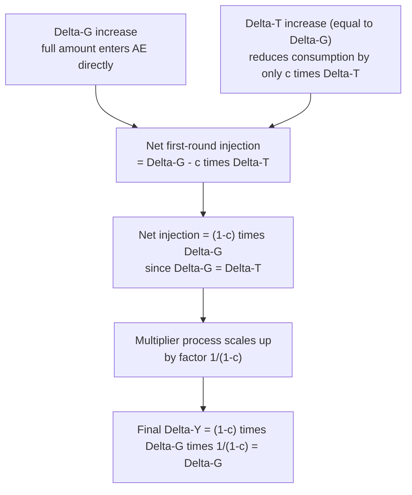

## Balanced Budget Multiplier

### Overview

The balanced budget multiplier theorem states that an equal, simultaneous increase in government spending and lump-sum taxes ($\Delta G = \Delta T$) raises equilibrium output by **exactly the same amount** as the increase in spending — that is, the balanced-budget multiplier equals **1** in the simplest closed-economy Keynesian-cross model. This is a striking result: even though the government's budget balance is unchanged (spending and revenue rise together, leaving the deficit/surplus fixed), output still rises, because the two policy instruments have asymmetric effects on aggregate demand.

---

### Setup and Underlying Multipliers

In the basic Keynesian-cross model (closed economy, lump-sum taxes, fixed price level and interest rate):

**Government spending multiplier:**

$$\Delta Y = \frac{1}{1-c}\Delta G$$

**Tax multiplier (lump-sum tax):**

$$\Delta Y = \frac{-c}{1-c}\Delta T$$

where $c$ is the marginal propensity to consume (MPC), $0<c<1$.

Both multipliers share the same denominator, $(1-c)$, but differ in numerator: the spending multiplier's numerator is $1$; the tax multiplier's numerator is $-c$.

---

### Derivation of the Balanced Budget Multiplier

**Combine the two policy changes**, imposing the balanced-budget condition $\Delta G = \Delta T \equiv \Delta X$:

$$\Delta Y = \frac{1}{1-c}\Delta G + \frac{-c}{1-c}\Delta T$$

Substituting $\Delta G = \Delta T = \Delta X$:

$$\Delta Y = \frac{1}{1-c}\Delta X - \frac{c}{1-c}\Delta X = \frac{(1-c)}{1-c}\Delta X$$

$$\boxed{\Delta Y = \Delta X = \Delta G = \Delta T}$$

**The balanced-budget multiplier is therefore:**

$$k_{BB} = \frac{\Delta Y}{\Delta G}\bigg|_{\Delta G = \Delta T} = 1$$

Notice that the MPC, $c$, and the standard multiplier $\frac{1}{1-c}$ have **completely dropped out** of the final result — the balanced-budget multiplier is exactly 1 regardless of the specific value of $c$ (as long as $0 < c < 1$ and the model's other simplifying assumptions hold).

---

### Intuition: Why Output Rises Despite No Change in the Deficit

The asymmetry arises because **government spending enters aggregate demand directly and in full**, while a **tax change affects demand only indirectly and partially**, through its effect on consumption.

**Step-by-step first-round effects:**

1. **The $\Delta G$ increase** adds the *entire* amount, $\Delta G$, to aggregate demand in the very first round — government purchases are, by definition, actual spending on goods and services.
2. **The $\Delta T$ increase** (equal in size to $\Delta G$) reduces households' disposable income by $\Delta T$. But households do not cut consumption by the full amount of the tax increase — they reduce consumption by only $c \cdot \Delta T$ (the marginal propensity to consume applied to the lost income), while the remaining $(1-c)\Delta T$ would have been *saved* anyway and so is not withdrawn from spending.

**Net first-round injection into aggregate demand:**

$$\Delta G - c\Delta T = \Delta X - c\Delta X = (1-c)\Delta X$$

**This net first-round injection is then scaled up by the standard multiplier** $\frac{1}{1-c}$:

$$\Delta Y = \frac{1}{1-c} \times (1-c)\Delta X = \Delta X$$

The multiplier process exactly "undoes" the $(1-c)$ factor from the net first-round injection, leaving a clean multiplier of 1. This cancellation is the mathematical heart of the theorem.

---

### Numerical Example

Let $c = 0.8$ (so the standard multiplier is $\frac{1}{1-0.8}=5$), and suppose $\Delta G = \Delta T = \$100\text{B}$.

**Using the spending and tax multipliers separately:**

$$\Delta Y_{from\ G} = 5 \times 100 = \$500\text{B}$$

$$\Delta Y_{from\ T} = -4 \times 100 = -\$400\text{B}$$

**Combined effect:**

$$\Delta Y = 500 - 400 = \$100\text{B}$$

This confirms $\Delta Y = \Delta G = \Delta T = \$100\text{B}$ — the balanced-budget multiplier of exactly 1, regardless of $c=0.8$ producing large individual multipliers (5 and −4) that happen to net out perfectly.

**Try a different MPC to confirm invariance:** let $c=0.5$ instead.

$$k_G = \frac{1}{1-0.5}=2, \qquad k_T = \frac{-0.5}{1-0.5}=-1$$

$$\Delta Y = 2(100) - 1(100) = 200-100 = \$100\text{B} = \Delta G$$

The result $\Delta Y = \Delta G$ holds again, confirming that $c$ does not affect the balanced-budget multiplier's value of 1 — only the *individual* spending and tax multipliers depend on $c$.

---

### Algebraic Proof (General MPC)

For any $c \in (0,1)$:

$$\Delta Y = \frac{1}{1-c}\Delta G + \frac{-c}{1-c}\Delta G = \frac{1-c}{1-c}\Delta G = 1 \cdot \Delta G$$

(using $\Delta T=\Delta G$ throughout). The result holds identically for all valid $c$ — it is not a coincidence tied to a particular parameter value but a structural property of the linear Keynesian-cross model with lump-sum taxation.

---

### Diagram: Decomposition of the Balanced-Budget Effect

---

### Illustration: Spending Multiplier vs. Tax Multiplier Cancellation (svg_diagram)

<svg xmlns="http://www.w3.org/2000/svg" viewBox="0 0 640 420">
<text x="320" y="26" text-anchor="middle" font-size="17" font-weight="bold" fill="#1a1a1a">Balanced Budget Multiplier: Effects Combine to Exactly ΔG (svg_diagram)</text>
<line x1="80" y1="370" x2="580" y2="370" stroke="#333" stroke-width="2" />
<line x1="80" y1="370" x2="80" y2="50" stroke="#333" stroke-width="2" />
<text x="330" y="400" text-anchor="middle" font-size="13" fill="#333">Policy Component</text>
<text x="35" y="220" text-anchor="middle" font-size="13" fill="#333" transform="rotate(-90 35 220)">Change in Output (ΔY, $B)</text>

<line x1="80" y1="220" x2="580" y2="220" stroke="#888" stroke-width="1" />
<text x="585" y="224" font-size="10" fill="#888">0</text>

<rect x="140" y="70" width="90" height="150" fill="#219ebc" />
<text x="185" y="60" text-anchor="middle" font-size="12" fill="#219ebc">+500</text>
<text x="185" y="390" text-anchor="middle" font-size="11" fill="#333">ΔG effect (k=5)</text>

<rect x="280" y="220" width="90" height="120" fill="#e63946" />
<text x="325" y="358" text-anchor="middle" font-size="12" fill="#e63946">-400</text>
<text x="325" y="390" text-anchor="middle" font-size="11" fill="#333">ΔT effect (k=-4)</text>

<rect x="420" y="190" width="90" height="30" fill="#023047" />
<text x="465" y="180" text-anchor="middle" font-size="12" fill="#023047">+100</text>
<text x="465" y="390" text-anchor="middle" font-size="11" fill="#333">Net ΔY = ΔG = ΔT</text>
</svg>

---

### Extensions and Departures from the Baseline Result

The clean result of exactly 1 is specific to the simplest model; it changes under several natural extensions:

**1. Proportional (income-dependent) taxes.** If $T = tY$ rather than lump-sum, the derivation changes because a tax *rate* increase interacts with the endogenous $Y$ itself, and the resulting balanced-budget multiplier is generally **not** exactly 1 (its exact value depends on how the "balanced budget" condition is specified — e.g., holding the tax rate change consistent with the resulting revenue change at the new equilibrium income — and requires solving the model simultaneously rather than using the simple linear formulas above).

**2. Open economy (import leakage).** With a marginal propensity to import $m>0$, the open-economy spending and tax multipliers become $\frac{1}{1-c+m}$ and $\frac{-c}{1-c+m}$ respectively. The balanced-budget multiplier becomes:

$$k_{BB,open} = \frac{1-c}{1-c+m}$$

This is **strictly less than 1** whenever $m>0$, because part of the net first-round injection leaks into import demand rather than recirculating domestically.

**3. Interest-rate feedback (IS-LM).** Once the interest rate is allowed to respond to the fiscal expansion (given a fixed money supply), crowding out of private investment reduces the overall output effect of *both* the spending and tax components, and the balanced-budget multiplier in a full IS-LM equilibrium is generally smaller than 1, though still typically positive under standard conditions.

**4. Ricardian equivalence considerations.** If households are highly forward-looking (per Ricardian equivalence logic), a tax increase used to finance spending might be perceived as reducing future tax liabilities (if the alternative was debt financed by even larger future tax increases) or otherwise interacting with expectations about future disposable income in ways not captured by the static lump-sum-tax multiplier — in the extreme Ricardian case, some economists argue the effective tax multiplier itself might differ from the simple $\frac{-c}{1-c}$ formula, altering the net balanced-budget effect. [Inference: this is a theoretical extension/critique found in more advanced treatments rather than a settled quantitative adjustment; the exact deviation from the standard multiplier depends on the specific assumptions about household foresight and the perceived permanence of the tax-financed spending program.]

**5. Progressive vs. lump-sum tax structure at the margin.** The theorem as derived here specifically requires the tax change to be lump-sum (not distortionary and not proportional to income) for the algebra to yield exactly 1; different tax instruments (payroll tax changes, corporate tax changes) would require separately derived multipliers with potentially different numerators, and the "balanced" combination with $G$ would not generally still equal exactly 1.

[Inference: The exact numeric value of "1" for the balanced-budget multiplier should be understood as a clean, illustrative result of the simplest possible textbook model — it is a pedagogically important qualitative insight (that balanced fiscal expansions are expansionary, not neutral) rather than a precise, universally applicable empirical prediction.]

---

### Comparison Table: Multiplier Values Across Model Variants

| Model Setting | Spending Multiplier | Tax Multiplier | Balanced-Budget Multiplier |
| --- | --- | --- | --- |
| Basic closed economy, lump-sum tax | $\frac{1}{1-c}$ | $\frac{-c}{1-c}$ | $1$ |
| Open economy, lump-sum tax, MPM $=m$ | $\frac{1}{1-c+m}$ | $\frac{-c}{1-c+m}$ | $\frac{1-c}{1-c+m} < 1$ |
| Closed economy, proportional tax $T=tY$ | $\frac{1}{1-c(1-t)}$ | N/A (rate change, not lump sum) | Generally not exactly 1; requires simultaneous solution |
| IS-LM with interest-rate feedback | Smaller than $\frac{1}{1-c}$ (crowding out) | Smaller in magnitude than $\frac{-c}{1-c}$ | Generally $<1$, sign typically still positive |

---

### Policy Relevance

The balanced-budget multiplier theorem is often cited as a rationale for **"tax-and-spend" fiscal expansions that do not increase the deficit** — a government wishing to stimulate output without adding to public debt can, in principle, do so by raising both spending and (lump-sum) taxes by equal amounts, achieving a positive output effect while leaving the budget balance unchanged. This has been invoked in discussions of deficit-neutral stimulus proposals and in analyzing the output effects of revenue-neutral fiscal reforms.

**Important caveat for policy application:** Because the theorem's clean result of exactly 1 depends heavily on the lump-sum tax and closed-economy, fixed-price/interest-rate assumptions, real-world applications of "balanced-budget stimulus" should expect a multiplier smaller than 1 once realistic features (progressive taxation, import leakage, interest-rate responses, and household forward-looking behavior) are incorporated. [Inference: the theorem remains a valid qualitative benchmark — balanced-budget fiscal expansions are not simply "wash" policies with zero output effect — but the precise magnitude in any real economy is an empirical question requiring a fuller macroeconomic model than the simple Keynesian cross.]

---

### Common Pitfalls and Clarifications

- **Assuming a balanced budget means fiscal policy is "neutral" on output.** This is precisely the misconception the theorem corrects: even with an unchanged deficit, a balanced increase in $G$ and $T$ is expansionary, not neutral, in the basic model.
- **Forgetting the lump-sum tax assumption.** The exact value of 1 relies on taxes being lump-sum. Applying the "multiplier equals 1" result uncritically to a proportional or progressive tax change is a common error — the correct derivation for those cases requires re-solving the model with the appropriate tax specification.
- **Misapplying the theorem to open economies without adjustment.** As shown above, the open-economy balanced-budget multiplier is below 1; using the closed-economy value of exactly 1 for an open, trade-dependent economy will overstate the expected output effect.
- **Confusing the balanced-budget multiplier with the individual spending or tax multiplier.** The balanced-budget multiplier is the *net* effect of the *combined*, equal-sized change in both $G$ and $T$ — it is not simply the spending multiplier alone (which would overstate the effect if a tax increase is used to finance the spending) or the tax multiplier alone.

---

### Key Points

- The balanced-budget multiplier theorem: $\Delta G = \Delta T \Rightarrow \Delta Y = \Delta G$, giving a multiplier of exactly 1 in the basic closed-economy, lump-sum-tax Keynesian-cross model.
- This result is independent of the specific value of the MPC $c$ — it holds for any $c \in (0,1)$.
- The asymmetry driving the result: $G$ enters aggregate demand in full immediately, while a tax change of the same size only reduces consumption by $c$ times the tax change in the first round, since part of any income change would have been saved.
- The net first-round injection, $(1-c)\Delta G$, is exactly offset by the multiplier scaling factor $\frac{1}{1-c}$, yielding $\Delta Y = \Delta G$.
- The exact value of 1 is a special-case result; it falls below 1 in open economies (import leakage), under interest-rate crowding out (IS-LM), and generally changes under proportional/progressive taxation.
- Policy implication: balanced-budget fiscal expansions are not output-neutral, providing a rationale for deficit-neutral stimulus, though real-world multipliers are typically smaller than the textbook value of 1 once realistic frictions are included.

---

**Related Topics**

- The Keynesian cross and the simple expenditure multiplier
- Government spending and taxation in the goods market
- Net exports and the open economy multiplier
- IS-LM model and interest-rate crowding out
- Ricardian equivalence
- Automatic stabilizers and cyclically adjusted budget balance
- Fiscal policy multipliers at the zero lower bound
- Progressive taxation and its effect on multiplier size