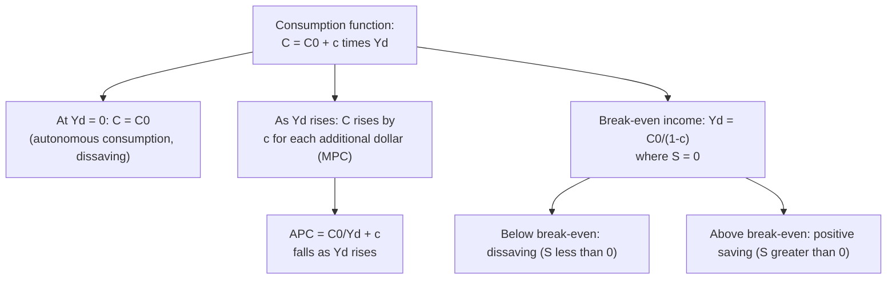

## Keynesian Absolute Income Hypothesis

### Overview

The absolute income hypothesis (AIH) is John Maynard Keynes's theory of consumption behavior, originally set out in *The General Theory of Employment, Interest and Money* (1936). It proposes that current consumption spending depends primarily on **current absolute (disposable) income**, following a stable, well-defined functional relationship — the **consumption function**. The hypothesis introduced the concept of the **marginal propensity to consume (MPC)** and the **average propensity to consume (APC)**, and it underlies the simple consumption function used throughout basic Keynesian-cross and IS-LM analysis. While later theories (permanent income, life-cycle, relative income) revised or extended it in response to empirical anomalies, the AIH remains the foundational starting point for consumption theory in macroeconomics.

---

### The Basic Consumption Function

Keynes proposed a linear relationship between current consumption $C$ and current disposable income $Y_d = Y - T$:

$$C = C_0 + c \cdot Y_d$$

where:

- $C_0 > 0$ is **autonomous consumption** — the level of consumption that would occur even at zero disposable income (financed by dissaving, borrowing, or drawing down existing wealth).
- $c$ is the **marginal propensity to consume (MPC)**, $0 < c < 1$, representing the fraction of each *additional* dollar of disposable income spent on consumption rather than saved.

**Three fundamental psychological/behavioral postulates Keynes advanced (from *The General Theory*, Book III):**

1. **The MPC lies strictly between 0 and 1.** Households consume some, but not all, of any additional income; the remainder is saved. Keynes described this as a "fundamental psychological law."
2. **The MPC is less than the average propensity to consume (APC) at higher income levels** — implying the APC *falls* as income rises (see below).
3. **Higher absolute income leads to higher absolute consumption**, but by a smaller proportion than the increase in income — i.e., consumption rises with income, but saving rises as a *proportion* of income too.

---

### Marginal Propensity to Consume (MPC)

$$MPC = \frac{\Delta C}{\Delta Y_d} = c$$

Under the AIH, $c$ is treated as a **constant parameter** of the consumption function (though its numeric value is an empirical question, commonly estimated in the range of roughly 0.6–0.9 in various empirical studies, depending on time period, country, and estimation method).

**Marginal propensity to save (MPS):** Since income is either consumed or saved,

$$MPC + MPS = 1 \quad \Rightarrow \quad MPS = 1-c$$

---

### Average Propensity to Consume (APC)

$$APC = \frac{C}{Y_d} = \frac{C_0 + cY_d}{Y_d} = \frac{C_0}{Y_d} + c$$

**Key implication — the declining APC:** Because $C_0 > 0$ and $Y_d$ appears in the denominator of the first term, $APC$ **falls as $Y_d$ rises** (asymptotically approaching $c$ as $Y_d \to \infty$), even though $C_0$ itself is a constant. This formalizes Keynes's third postulate: as income grows, the *proportion* of income consumed falls (equivalently, the saving rate rises with income) — implying that **saving is a "luxury"** more available to higher-income households.

**Distinguishing MPC and APC:**

$$APC > MPC \quad \text{whenever } C_0 > 0 \text{ and } Y_d > 0$$

This inequality is a direct algebraic consequence of a positive vertical intercept in the linear consumption function and is central to the AIH's key testable predictions.

---

### Numerical Example

Let $C_0 = \$200\text{B}$ and $c = 0.75$.

**At $Y_d = \$1000\text{B}$:**

$$C = 200 + 0.75(1000) = 200+750 = \$950\text{B}$$

$$APC = \frac{950}{1000} = 0.95$$

**At $Y_d = \$2000\text{B}$:**

$$C = 200+0.75(2000) = 200+1500 = \$1700\text{B}$$

$$APC = \frac{1700}{2000} = 0.85$$

**Observation:** As disposable income doubled from $1000B to $2000B, consumption rose from $950B to $1700B (a rise of $750B, matching $c \times \Delta Y_d = 0.75 \times 1000$), but the APC fell from 0.95 to 0.85 — confirming that consumption grows less than proportionally with income, exactly as Keynes's postulates predict.

---

### The Saving Function Implied by the AIH

Since $S = Y_d - C$:

$$S = Y_d - (C_0+cY_d) = -C_0 + (1-c)Y_d$$

- At low income, $S$ can be **negative** (dissaving) if $Y_d$ is small enough that $(1-c)Y_d < C_0$.
- The **break-even level of income**, where $S=0$ (equivalently, $C=Y_d$), occurs at:

$$Y_d^{break-even} = \frac{C_0}{1-c}$$

Below this income level, households dissave (consume more than their income, financed by borrowing or drawing down assets); above it, households are net savers.

---

### Diagram: The Keynesian Consumption Function

---

### Illustration: Consumption Function and the Declining APC (svg_diagram)

<svg viewBox="0 0 660 460" xmlns="http://www.w3.org/2000/svg">
<text x="330" y="26" text-anchor="middle" font-size="17" font-weight="bold" fill="#1a1a1a">Keynesian Consumption Function and Declining APC (svg_diagram)</text>
<line x1="80" y1="400" x2="600" y2="400" stroke="#333" stroke-width="2"/>
<line x1="80" y1="400" x2="80" y2="50" stroke="#333" stroke-width="2"/>
<text x="340" y="430" text-anchor="middle" font-size="13" fill="#333">Disposable Income (Yd)</text>
<text x="35" y="220" text-anchor="middle" font-size="13" fill="#333" transform="rotate(-90 35 220)">Consumption (C)</text>
<!-- 45-degree line (C = Yd) -->
<line x1="80" y1="400" x2="560" y2="80" stroke="#888" stroke-width="1.5" stroke-dasharray="5,4"/>
<text x="565" y="78" font-size="11" fill="#888">C = Yd (45°)</text>
<!-- Consumption function line, intercept C0 -->
<line x1="80" y1="340" x2="560" y2="110" stroke="#219ebc" stroke-width="2.5"/>
<text x="565" y="108" font-size="11" fill="#219ebc">C = C0 + c·Yd</text>
<!-- C0 intercept marker -->
<circle cx="80" cy="340" r="4" fill="#219ebc"/>
<text x="95" y="335" font-size="11" fill="#219ebc">C0 (autonomous)</text>
<!-- Break-even point -->
<circle cx="220" cy="290" r="5" fill="#e63946"/>
<line x1="220" y1="290" x2="220" y2="400" stroke="#e63946" stroke-width="1" stroke-dasharray="3,2"/>
<text x="220" y="415" text-anchor="middle" font-size="10" fill="#e63946">Break-even Yd</text>
<!-- Dissaving region shading label -->

<text x="140" y="380" font-size="10" fill="`#e63946`">Dissaving (C > Yd)</text>

<text x="420" y="200" font-size="10" fill="`#023047`">Positive saving (C < Yd)</text>

<!-- APC ray from origin to a point on C curve -->
<line x1="80" y1="400" x2="400" y2="200" stroke="#8ecae6" stroke-width="1.5" stroke-dasharray="2,2"/>
<text x="405" y="198" font-size="10" fill="#219ebc">slope = APC at that Yd</text>
</svg>

---

### Role in the Keynesian Cross and Multiplier

The AIH's linear consumption function is precisely the building block used in the Keynesian-cross model: substituting $C = C_0 + c(Y-T)$ into the equilibrium condition $Y = C+I+G$ generates the multiplier relationship,

$$Y = \frac{1}{1-c}\left[C_0 - cT + I + G\right]$$

The constancy of $c$ (the MPC) is what makes the multiplier $\frac{1}{1-c}$ a fixed, well-defined number in the basic model — this is the direct link between the AIH and the entire apparatus of fiscal multiplier analysis covered elsewhere in this chapter and the previous one.

---

### Empirical Testing: Cross-Sectional vs. Time-Series Findings

The AIH generated a substantial body of empirical consumption research in the 1940s–1950s, revealing a puzzle that motivated later theories.

**Cross-sectional (budget) studies — broadly consistent with the AIH:**

Household surveys at a point in time typically found that higher-income households have a **lower APC** (they save a larger fraction of income) than lower-income households, consistent with a positive $C_0$ intercept and Keynes's postulates.

**Short-run time-series studies — also broadly consistent:**

Studies using annual data over relatively short periods likewise tended to find the APC falling during periods of rising income, consistent with the theory.

**The "consumption puzzle" — long-run time-series data contradicted the theory:**

Simon Kuznets's long-run U.S. data (covering several decades) found the APC to be **remarkably stable** over long periods, even as aggregate real income grew substantially over time — directly at odds with the AIH's prediction that the APC should fall persistently as income (in this case, aggregate/per-capita income over time) rises. This discrepancy between cross-sectional/short-run results and Kuznets's long-run findings became known as the **"consumption puzzle"** and was the central empirical anomaly that later theories (Duesenberry's relative income hypothesis, Friedman's permanent income hypothesis, and Modigliani's life-cycle hypothesis) were developed specifically to resolve.

[Inference: The precise magnitude and universality of the "stable long-run APC" finding is itself a matter of ongoing empirical refinement across different countries and time periods, but the basic Kuznets finding that motivated the shift away from the simple AIH toward permanent-income/life-cycle theories is well documented in the history of macroeconomic thought and widely covered in standard textbooks.]

---

### Comparison with Successor Theories

| Feature | Absolute Income Hypothesis (Keynes) | Relative Income Hypothesis (Duesenberry) | Permanent Income Hypothesis (Friedman) | Life-Cycle Hypothesis (Modigliani) |
| --- | --- | --- | --- | --- |
| Key determinant of consumption | Current absolute disposable income | Relative income position / past peak income | Long-run expected ("permanent") income | Lifetime resources, smoothed over the life span |
| APC behavior over time | Falls as income rises (cross-section and short-run) | Explains stable long-run APC via habit persistence and demonstration effects | Explains stable long-run APC: only permanent-income changes shift consumption proportionally | Explains stable long-run APC: consumption smoothed relative to lifetime wealth, not current income |
| Response to temporary income change | Large — consumption moves closely with any income change | Depends on relation to past peak/relative position | Small — largely saved, since transitory income doesn't affect permanent income | Small relative to lifetime consumption path — spread across remaining lifetime |
| Explains Kuznets long-run stable APC? | No — key empirical failure of the simple theory | Partially, via habit and social comparison effects | Yes | Yes |

---

### Common Pitfalls and Clarifications

- **Confusing MPC with APC.** MPC is the *marginal* response of consumption to a *change* in income; APC is the *ratio* of total consumption to total income at a given point. Under the AIH they are related but distinct ($APC > MPC$ whenever $C_0>0$), and this distinction is frequently tested and frequently confused.
- **Treating the AIH as still the state-of-the-art empirical consumption theory.** The AIH is foundational and remains useful for short-run macro modeling (e.g., the basic Keynesian cross), but it is empirically superseded for explaining long-run consumption-income patterns by permanent-income and life-cycle theories, which better fit the Kuznets stylized fact of a stable long-run APC.
- **Assuming $c$ is a universal constant across contexts.** The AIH treats $c$ as fixed within a given model application, but empirically the MPC can differ by income group, by the type of income change (temporary vs. permanent — a distinction the AIH itself does not make, unlike the permanent income hypothesis), and by broader macroeconomic conditions. [Inference: This limitation — the AIH's failure to distinguish transitory from permanent income changes — is precisely the theoretical gap that Friedman's permanent income hypothesis was designed to address, and is a standard critique found in the history of consumption theory rather than a contested claim.]
- **Assuming autonomous consumption $C_0$ implies the model requires households to literally hold no assets.** $C_0>0$ simply reflects that consumption does not fall to zero even at zero current income, financed via dissaving/borrowing — it is a reduced-form feature of the linear function, not a claim about the absence of wealth effects (which are treated more explicitly in life-cycle-style theories).

---

### Key Points

- The absolute income hypothesis models consumption as a stable linear function of current disposable income: $C = C_0 + cY_d$, with MPC $c \in (0,1)$ constant.
- APC $= \frac{C_0}{Y_d}+c$ falls as income rises whenever $C_0>0$, and always exceeds MPC — the central testable implication of Keynes's postulates.
- The break-even income level, $Y_d = \frac{C_0}{1-c}$, separates dissaving from positive-saving income ranges.
- The AIH's linear consumption function is the direct building block of the Keynesian-cross multiplier model.
- Cross-sectional and short-run time-series data broadly supported the AIH, but Kuznets's long-run data showing a stable APC over time contradicted its core prediction — the "consumption puzzle."
- This empirical anomaly directly motivated the development of the relative income, permanent income, and life-cycle hypotheses as successor theories.

---

**Related Topics**

- The Keynesian cross and the simple expenditure multiplier
- Duesenberry's relative income hypothesis
- Friedman's permanent income hypothesis
- Modigliani's life-cycle hypothesis
- Marginal propensity to consume and save
- The Kuznets consumption puzzle
- Autonomous consumption and dissaving
- Government spending and taxation in the goods market