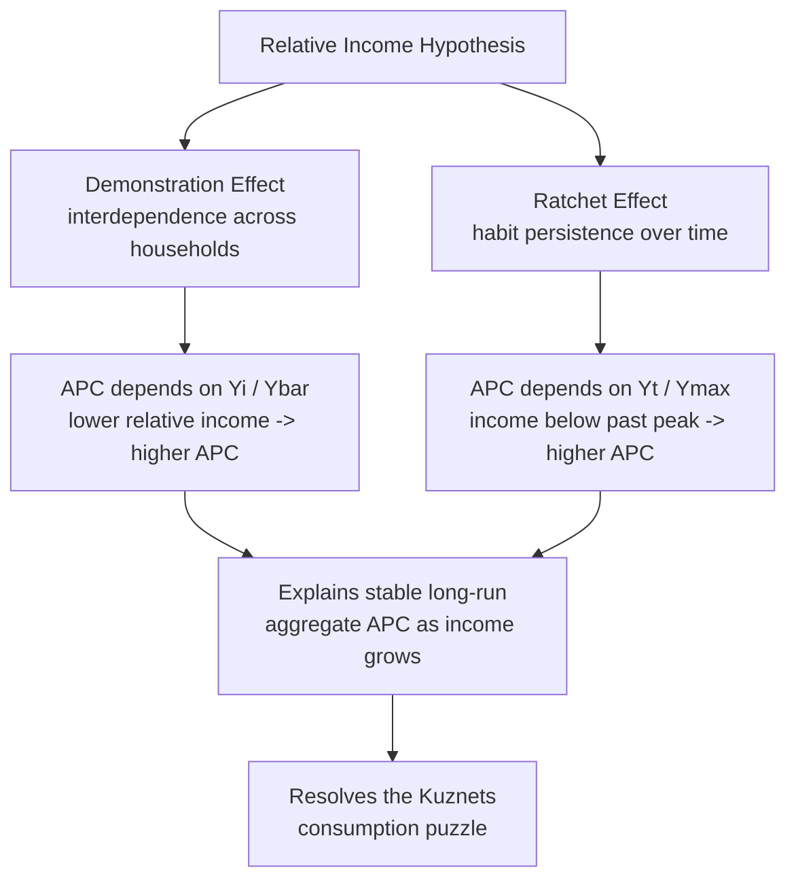

## Relative Income Hypothesis

### Overview

The relative income hypothesis (RIH) is a theory of consumption behavior developed by James Duesenberry in his 1949 book *Income, Saving and the Theory of Consumer Behavior*. It was proposed as a direct response to the "consumption puzzle" left unresolved by Keynes's absolute income hypothesis: cross-sectional and short-run data showed the average propensity to consume (APC) falling with income, but Kuznets's long-run time-series data showed a remarkably stable APC despite substantial income growth. Duesenberry resolved this by arguing that consumption depends not on the *absolute* level of a household's income alone, but on that household's income **relative to** (1) the incomes of others in its social reference group, and (2) its own previously attained (peak) level of income and consumption. The two central mechanisms are often called the **demonstration effect** (interdependence across households) and the **ratchet effect** (habit persistence across time for a given household).

---

### Motivation: The Consumption Puzzle

Recall the empirical tension the RIH was built to resolve:

- **Cross-sectional data:** at a point in time, high-income households have a lower APC than low-income households (broadly consistent with the simple absolute income hypothesis).
- **Long-run time-series data (Kuznets):** the aggregate APC is roughly stable over long historical periods, even as aggregate real income has grown substantially.

If consumption depended only on *absolute* current income (as in the simple Keynesian consumption function $C = C_0+cY_d$), sustained income growth over time should have produced a persistently falling APC in the long-run aggregate data as well — but it did not. Duesenberry's proposed resolution: what matters is not the absolute income level in isolation, but income *relative to* a shifting reference standard, and that reference standard itself moves up with the general rise in incomes, preventing the systematic APC decline the simple theory would otherwise predict.

---

### The Demonstration Effect (Interdependence of Preferences)

**Core idea:** An individual household's consumption/saving decision is not made in isolation; it is influenced by the consumption patterns of *other households in its reference group* (neighbors, peers, socially comparable households) — a violation of the standard economic assumption that individual utility (and consumption choice) depends only on one's own income and prices, independent of others' behavior.

**Mechanism:** If a household's relative income position **falls** (e.g., its neighbors' incomes rise faster than its own, even if its own absolute income is unchanged or rising modestly), the household feels pressure to maintain consumption standards comparable to its reference group — it will tend to consume a **larger share** of its own income (a higher APC) than the simple absolute-income theory would predict, in order to "keep up" with social consumption norms.

**Formal representation (illustrative):** A household's consumption can be modeled as depending on its own income $Y_i$ relative to the average income of its reference group $\bar{Y}$:

$$\frac{C_i}{Y_i} = f\left(\frac{Y_i}{\bar{Y}}\right), \quad f' < 0$$

A household with $Y_i < \bar{Y}$ (below-average relative position) has a **higher** APC than a household with $Y_i > \bar{Y}$, even holding *absolute* income constant across comparisons at different points in time or across different economies, because what matters is the ratio $Y_i/\bar{Y}$, not $Y_i$ alone.

**Aggregate implication:** As the *whole* income distribution grows over time (everyone's income rising together, so relative positions in the distribution are largely preserved), each household's *relative* income position remains roughly unchanged even though *absolute* income has risen — so aggregate consumption grows roughly proportionally with aggregate income, and the **aggregate APC remains stable**, resolving the Kuznets puzzle. This is fundamentally different from the cross-sectional snapshot, where relative income positions genuinely *do* differ across households at a point in time, correctly producing the falling-APC-with-income pattern that cross-sectional studies find.

---

### The Ratchet Effect (Habit Persistence Over Time)

**Core idea:** Consumption habits, once established at a certain standard, are **difficult to reduce** even when a household's income falls. Households develop consumption habits based on their **previously highest attained income level** and resist cutting spending proportionally when income declines.

**Formal representation:** Duesenberry proposed that current consumption depends not only on current income $Y_t$ but on the **previous peak income** $Y_{max}$ (the highest income level ever attained by the household or economy up to that point):

$$\frac{C_t}{Y_t} = a - b\frac{Y_t}{Y_{max}}$$

where $a$ and $b$ are positive parameters. As $Y_t$ falls relative to the historical peak $Y_{max}$, the ratio $Y_t/Y_{max}$ falls, which — given the negative sign on $b$ — causes $C_t/Y_t$ (the APC) to **rise**: households maintain consumption habits formed during the higher-income period, resulting in a **lower saving rate during income downturns** than the simple absolute income theory would predict.

**Key asymmetric implication — consumption is more resistant to falling than to rising:**

- **During an income upswing** (income exceeds all previous levels, so $Y_t = Y_{max}$): the ratio $Y_t/Y_{max}=1$, and the APC settles at its "normal" long-run value, $a-b$.
- **During an income downswing** (income falls below the previous peak, so $Y_t < Y_{max}$): households cut consumption by *less* than the simple proportional/absolute-income theory predicts, because they attempt to preserve habits formed at $Y_{max}$ — implying **temporarily elevated APC (reduced saving)** during recessions, and a slower-than-proportional adjustment of consumption downward.

This produces a prediction later widely used to explain the empirical observation that **consumption is smoother than income over the business cycle** — a stylized fact also emphasized (via different mechanisms) by the later permanent income and life-cycle hypotheses.

---

### Diagram: The Two Mechanisms of the Relative Income Hypothesis

---

### Illustration: The Ratchet Effect on Consumption During a Downturn (svg_diagram)

<svg xmlns="http://www.w3.org/2000/svg" viewBox="0 0 660 420">
<text x="330" y="26" text-anchor="middle" font-size="17" font-weight="bold" fill="#1a1a1a">Ratchet Effect: Consumption Resists Falling with Income (svg_diagram)</text>
<line x1="80" y1="370" x2="600" y2="370" stroke="#333" stroke-width="2" />
<line x1="80" y1="370" x2="80" y2="50" stroke="#333" stroke-width="2" />
<text x="340" y="400" text-anchor="middle" font-size="13" fill="#333">Time</text>
<text x="35" y="200" text-anchor="middle" font-size="13" fill="#333" transform="rotate(-90 35 200)">Income / Consumption</text>

<polyline points="90,300 160,240 230,150 290,120 340,220 400,260 460,180 520,130 580,100" fill="none" stroke="`#219ebc`" stroke-width="2.5" />

<text x="585" y="98" font-size="11" fill="`#219ebc`">Income Yt</text>

<circle cx="290" cy="120" r="4" fill="#023047" />
<text x="290" y="108" text-anchor="middle" font-size="10" fill="#023047">Ymax (peak)</text>

<polyline points="90,320 160,270 230,190 290,150 340,165 400,185 460,175 520,150 580,120" fill="none" stroke="`#e63946`" stroke-width="2.5" stroke-dasharray="6,3" />

<text x="585" y="118" font-size="11" fill="`#e63946`">Consumption Ct</text>

<line x1="340" y1="220" x2="340" y2="165" stroke="#8ecae6" stroke-width="1.5" stroke-dasharray="2,2" />
<text x="345" y="195" font-size="10" fill="#333">C falls less than proportionally: ratchet</text>
</svg>

---

### Numerical Illustration of the Ratchet Effect

Let $a=0.95$, $b=0.15$ (illustrative parameters for $\frac{C_t}{Y_t}=a-b\frac{Y_t}{Y_{max}}$), and suppose $Y_{max}=\$1000\text{B}$.

**Income at its peak, $Y_t=1000$:**

$$\frac{C_t}{Y_t} = 0.95-0.15(1) = 0.80 \quad \Rightarrow \quad C_t = 0.80\times1000=\$800\text{B}$$

**Income falls to $Y_t=800$ (a recession, 20% below peak):**

$$\frac{C_t}{Y_t} = 0.95-0.15\left(\frac{800}{1000}\right) = 0.95-0.12=0.83$$

$$C_t = 0.83\times800=\$664\text{B}$$

**Comparison with a simple absolute-income prediction** (assuming the same APC of 0.80 applied regardless of history): $C_t = 0.80\times800=\$640\text{B}$.

**Result:** The ratchet-effect model predicts consumption of $664B during the downturn — **higher** than the $640B the simple proportional/absolute-income model would predict — because the APC *rose* (from 0.80 to 0.83) as income fell below its historical peak, consistent with habit persistence dampening the fall in consumption (and correspondingly reducing the saving rate) during the downturn.

---

### Testable Implications and Empirical Support

**1. Cross-sectional consumption/saving and relative income position.** Studies examining household consumption within a given income distribution have found evidence consistent with relative income effects — e.g., saving rates that depend on a household's income rank or position relative to local/regional peers, not just its absolute income level, in various empirical consumption studies. [Unverified: the size and robustness of these relative-income effects vary across studies, datasets, and time periods, and isolating "relative income" effects cleanly from other explanations (e.g., differing preferences, life-cycle stage, borrowing constraints) remains empirically challenging.]

**2. Asymmetric consumption response to income declines vs. increases (ratchet effect).** Aggregate consumption data across business cycles has often shown that consumption falls by less (in percentage terms) than income during recessions, and that saving rates decline during downturns — a pattern consistent with (though not uniquely explained by) the ratchet mechanism; competing explanations from permanent income/life-cycle theory (consumption smoothing based on expected future income) can generate similar aggregate patterns through a different mechanism (forward-looking smoothing rather than backward-looking habit formation).

**3. Explains the Kuznets long-run stability of the aggregate APC.** As discussed above, if relative income positions are preserved as the whole distribution grows, the demonstration effect directly predicts a stable long-run aggregate APC, matching the key empirical fact the theory was designed to explain.

[Inference: Because permanent income hypothesis, life-cycle hypothesis, and relative income hypothesis can all generate a stable long-run APC and a smoother consumption path than income, distinguishing empirically *which* mechanism is doing the work in any specific dataset is a genuinely difficult identification problem in applied consumption research, and the professional consensus has generally shifted toward permanent-income/life-cycle-style models as the dominant modern framework, with relative-income/habit-formation elements sometimes incorporated as a complementary feature (e.g., habit-formation utility functions in modern DSGE models) rather than as a wholly separate, competing theory.]

---

### Modern Legacy: Habit Formation in Contemporary Macroeconomics

Duesenberry's ratchet-effect insight — that current consumption depends on a reference point shaped by past consumption/income — survives directly in modern macroeconomic modeling through **habit-formation utility functions**, widely used in New Keynesian DSGE models:

$$U_t = u(C_t - hC_{t-1})$$

where $h \in (0,1)$ is a habit-persistence parameter. This formulation captures the same core idea as Duesenberry's ratchet effect (current utility from consumption depends on consumption relative to a reference level shaped by recent history) but embeds it in a fully specified, forward-looking dynamic optimization framework rather than the reduced-form, non-optimizing specification Duesenberry originally proposed. This is one of the clearest examples of an older, more descriptive Keynesian-era consumption theory being absorbed into modern microfounded macroeconomic modeling, rather than being wholly discarded in favor of purely forward-looking permanent-income-style models.

Similarly, the **demonstration effect**'s core insight — that utility/consumption depends on relative position, not just absolute consumption — persists in modern behavioral and macro-development economics literature on "keeping up with the Joneses" preferences, status-seeking consumption, and relative consumption externalities in growth and inequality research.

---

### Comparison with Other Consumption Theories

| Feature | Absolute Income Hypothesis (Keynes) | Relative Income Hypothesis (Duesenberry) | Permanent Income Hypothesis (Friedman) | Life-Cycle Hypothesis (Modigliani) |
| --- | --- | --- | --- | --- |
| Reference point for consumption | Current absolute income only | Income relative to peer group (demonstration effect) and past peak (ratchet effect) | Expected long-run ("permanent") income | Lifetime resources smoothed across the life span |
| Explains stable long-run APC | No | Yes — relative positions preserved as whole distribution grows | Yes — transitory income changes don't affect permanent income | Yes — consumption smoothed relative to lifetime wealth |
| Explains asymmetric response to income declines | No — symmetric MPC response assumed | Yes — ratchet effect dampens consumption cuts during downturns | Partially, via revisions to permanent income expectations | Partially, via borrowing against expected future income |
| Microfoundation basis | Reduced-form, largely descriptive | Reduced-form, largely descriptive (interdependent preferences, habit) | Forward-looking optimization under income uncertainty | Forward-looking lifetime utility maximization |
| Modern legacy | Direct ancestor of basic Keynesian-cross consumption function | Habit-formation utility functions in DSGE models; status/relative-consumption literature | Rational expectations consumption models; random walk of consumption (Hall 1978) | Standard framework for retirement saving, wealth-income ratios |

---

### Common Pitfalls and Clarifications

- **Conflating the demonstration effect and the ratchet effect.** These are two *distinct* mechanisms within the RIH: the demonstration effect concerns **interpersonal** comparison (a household's income relative to *others*, at a point in time); the ratchet effect concerns **intertemporal** comparison (a household's income relative to *its own past peak*, over time). Both predict a similar qualitative resolution to the consumption puzzle but operate through different channels and have different testable implications (cross-sectional peer comparisons vs. individual-household time-series responses to income declines).
- **Assuming the RIH implies consumption is purely socially/habit-determined with no role for absolute income.** The RIH modifies, rather than eliminates, the role of income: absolute income still matters (a household with a higher absolute income generally consumes more in absolute terms), but the *proportion* consumed (APC) is argued to depend on relative position and past peaks rather than being a simple, universal declining function of absolute income alone.
- **Treating the ratchet effect as implying consumption never falls.** The ratchet effect predicts consumption falls **by less** than a proportional response to falling income would suggest, and typically with a lag as habits slowly adjust — it does not predict complete consumption rigidity in the face of a sustained, severe income decline.
- **Overstating current professional consensus on the RIH as the primary consumption theory.** While influential historically and importantly foundational for the "consumption puzzle" resolution, the RIH in its original Duesenberry form is less commonly used as a standalone framework in contemporary macroeconomic research than permanent-income/life-cycle-based models with habit formation, though its core insights (relative comparison, habit persistence) remain embedded within modern approaches. [Inference: this represents a general characterization of how the field's mainstream modeling emphasis has evolved, based on the theory's incorporation into DSGE habit-formation frameworks rather than being used as a standalone competing model; the exact relative weight given to relative-income vs. permanent-income mechanisms in any given research context can vary by subfield and application.]

---

### Key Points

- The relative income hypothesis (Duesenberry, 1949) proposes that consumption depends on income *relative to* a reference group (demonstration effect) and relative to one's own past peak income (ratchet effect), not on absolute current income alone.
- The demonstration effect explains why cross-sectional data shows falling APC with income (relative positions genuinely differ across households) while long-run aggregate time-series data shows a stable APC (relative positions are preserved as the whole distribution grows).
- The ratchet effect predicts that consumption falls by less than income during a downturn (habits persist from the prior income peak), implying a temporarily elevated APC/lower saving rate during recessions.
- The RIH was developed specifically to resolve the Kuznets consumption puzzle left unexplained by the simple Keynesian absolute income hypothesis.
- Its core insights persist in modern macroeconomics through habit-formation utility functions in DSGE models and in behavioral/status-consumption literature, even though it is less often used as a standalone competing framework relative to permanent-income/life-cycle theory today.

---

**Related Topics**

- Keynesian absolute income hypothesis
- Friedman's permanent income hypothesis
- Modigliani's life-cycle hypothesis
- The Kuznets consumption puzzle
- Habit-formation utility functions in DSGE models
- Consumption smoothing over the business cycle
- "Keeping up with the Joneses" and relative consumption preferences
- Household saving rate determinants