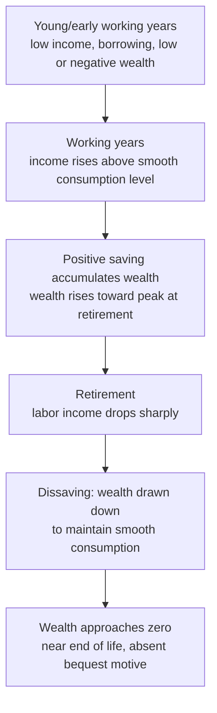

## Life-Cycle Hypothesis of Consumption and Saving

### Overview

The life-cycle hypothesis (LCH) is a theory of consumption and saving behavior developed by Franco Modigliani and Richard Brumberg (1954), and extended with Albert Ando (Ando-Modigliani, 1963). It proposes that individuals plan their consumption and saving over their **entire expected lifetime**, seeking to **smooth consumption** relative to their fluctuating income across life stages, rather than tying current consumption tightly to current income (as in the simple Keynesian absolute income hypothesis). Working-age individuals save to accumulate assets for retirement, and dissave (draw down accumulated wealth) after retiring, producing a hump-shaped wealth profile over the life span and predictable, systematic patterns in aggregate saving linked to demographic structure. The theory was foundational for modern consumption economics and remains central to analysis of retirement saving, social security, national saving rates, and demographic transitions. Modigliani was awarded the 1985 Nobel Memorial Prize in Economic Sciences in significant part for this work.

---

### Motivation: Resolving the Consumption Puzzle

Like Duesenberry's relative income hypothesis and Friedman's permanent income hypothesis, the LCH was developed to resolve the empirical tension between:

- **Cross-sectional data:** APC falls as income rises across households at a point in time.
- **Kuznets's long-run time-series data:** the aggregate APC is roughly stable despite substantial income growth over decades.

The LCH resolves this by arguing that current income is a poor proxy for the resource base relevant to consumption decisions. What matters is a household's **total lifetime resources** (current wealth, current income, and the present value of expected future income), smoothed over the remaining expected lifetime — not the level of income in any single year.

---

### Core Assumptions

1. **Individuals maximize lifetime utility** from a consumption stream over their planning horizon, subject to a lifetime budget constraint.
2. **Income follows a predictable hump shape over the life cycle:** low or zero during youth/education, rising through the working years, and dropping sharply (often to a pension/retirement income level well below peak working income) after retirement.
3. **Consumption is planned to be relatively smooth (constant, in the simplest version) over the lifetime**, in contrast to the highly variable income path — reflecting **diminishing marginal utility of consumption** (households prefer a stable consumption path to one that fluctuates sharply, given standard concave utility functions) and enabled by borrowing and saving.
4. **No (or limited) bequest motive** in the simplest version: households aim to spend down accumulated wealth by the end of life, so that wealth is roughly zero at death (later extensions relax this to allow for intentional bequests).

---

### Formal Lifetime Budget Constraint

Consider a stylized individual with a planning horizon of $NL$ years remaining, of which $WL$ years remain in the workforce (until retirement) and $NL - WL$ years are spent in retirement. Current non-human wealth is $WR$ (real assets held at the start of the planning period), and annual labor income during working years is $YL$ (assumed constant for simplicity).

**Total lifetime resources:**

$$\text{Lifetime resources} = WR + (YL \times WL)$$

**If the individual wishes to spend this total evenly across all $NL$ remaining years of life** (perfect consumption smoothing, no bequest, and abstracting from interest rates for simplicity):

$$C = \frac{WR + YL\cdot WL}{NL}$$

**This can be rewritten as:**

$$C = \frac{1}{NL}WR + \frac{WL}{NL}YL$$

$$C = \alpha \cdot WR + \beta \cdot YL$$

where $\alpha = \frac{1}{NL}$ is the marginal propensity to consume out of wealth, and $\beta = \frac{WL}{NL}$ is the marginal propensity to consume out of (current) labor income.

**Key implication:** Consumption depends on **both wealth and income**, not on current income alone — a foundational departure from the simple Keynesian consumption function.

---

### Numerical Example

Suppose an individual is 40 years old, expects to work until age 65 (so $WL = 25$ years remaining), and expects to live until age 85 (so $NL = 45$ years remaining, including the 20 retirement years). Current wealth $WR = \$50{,}000$; annual labor income $YL = \$60{,}000$.

**Planned annual consumption:**

$$C = \frac{50{,}000 + (60{,}000\times25)}{45} = \frac{50{,}000+1{,}500{,}000}{45} = \frac{1{,}550{,}000}{45} \approx \$34{,}444$$

**Implied annual saving during working years:**

$$S = YL - C = 60{,}000 - 34{,}444 = \$25{,}556 \text{ per year (while working)}$$

**During retirement (income drops to zero in this simplified example, ignoring pensions/Social Security):**

$$S_{retirement} = 0 - 34{,}444 = -\$34{,}444 \text{ per year (dissaving)}$$

This illustrates the theory's central mechanical prediction: substantial **positive saving during working years**, financing **substantial dissaving (wealth drawdown) during retirement**, while consumption itself remains constant ($34,444/year) throughout.

---

### The Hump-Shaped Wealth Profile

A direct implication of the LCH is that an individual's asset holdings should trace out a **hump shape** over the life cycle:

- **Youth/early working years:** wealth may be low or negative (student debt, borrowing against future income).
- **Middle-to-late working years:** wealth accumulates steadily as saving occurs to fund retirement.
- **Peak wealth:** typically reached at or near retirement age.
- **Retirement years:** wealth is drawn down (dissaved) to finance consumption after labor income ceases, falling toward zero (in the no-bequest version) by the end of life.

---

### Diagram: The Life-Cycle Pattern of Income, Consumption, and Wealth

---

### Illustration: Hump-Shaped Wealth and Smooth Consumption Over the Life Cycle (svg_diagram)

<svg xmlns="http://www.w3.org/2000/svg" viewBox="0 0 680 460">
<text x="340" y="26" text-anchor="middle" font-size="17" font-weight="bold" fill="#1a1a1a">Life-Cycle Hypothesis: Income, Consumption, and Wealth Paths (svg_diagram)</text>
<line x1="80" y1="400" x2="620" y2="400" stroke="#333" stroke-width="2" />
<line x1="80" y1="400" x2="80" y2="50" stroke="#333" stroke-width="2" />
<text x="350" y="430" text-anchor="middle" font-size="13" fill="#333">Age</text>
<text x="35" y="220" text-anchor="middle" font-size="13" fill="#333" transform="rotate(-90 35 220)">Level ($)</text>

<text x="100" y="415" text-anchor="middle" font-size="10" fill="#555">20</text>

<text x="340" y="415" text-anchor="middle" font-size="10" fill="#555">65 (retire)</text>

<text x="580" y="415" text-anchor="middle" font-size="10" fill="#555">85</text>

<line x1="340" y1="400" x2="340" y2="60" stroke="#aaa" stroke-width="1" stroke-dasharray="3,3" />

<polyline points="100,340 200,270 340,150 341,320 580,330" fill="none" stroke="`#219ebc`" stroke-width="2.5" />

<text x="585" y="328" font-size="10" fill="`#219ebc`">Income</text>

<line x1="100" y1="255" x2="580" y2="255" stroke="#e63946" stroke-width="2.5" stroke-dasharray="7,3" />
<text x="585" y="258" font-size="10" fill="#e63946">Consumption (smooth)</text>

<polyline points="100,395 200,360 340,90 460,220 580,395" fill="none" stroke="`#023047`" stroke-width="2.5" />

<text x="345" y="82" text-anchor="middle" font-size="10" fill="`#023047`">Peak wealth (at retirement)</text>

<text x="585" y="393" font-size="10" fill="`#023047`">Wealth</text>

<text x="350" y="450" text-anchor="middle" font-size="11" fill="#555">Saving = Income − Consumption during working years; dissaving during retirement</text>

</svg>

---

### Aggregate Implications: Demographics and the National Saving Rate

A distinctive and empirically important implication of the LCH, developed extensively by Ando and Modigliani, concerns the **aggregate** saving rate of an economy, which depends on its **demographic (age) structure** — not merely on individual behavior in isolation:

- **A population with a large share of working-age individuals** (relative to retirees and dependents) tends to generate a **higher aggregate saving rate**, since the working population is net saving while a relatively small retiree population is net dissaving.
- **A rapidly growing population or income (in a growing economy)** implies that each successive generation of workers is larger and/or richer than the previous retired generation, so the aggregate stock of "young saver" wealth accumulation outweighs the "old dissaver" wealth drawdown — the LCH predicts this generates a **persistently positive aggregate saving rate** even though *each individual's* lifetime saving nets to roughly zero (spending down to zero wealth by death, absent bequests).
- **This resolves the Kuznets long-run APC stability puzzle at the aggregate level too:** as aggregate income grows steadily over time (with a correspondingly growing/expanding cohort of savers), the aggregate saving rate (and hence aggregate APC) can remain **stable** in the long run even though the theory implies a definite hump-shaped, non-constant saving pattern for *any given individual* over their own life cycle. The apparent contradiction (stable aggregate APC vs. an individual-level pattern implying large saving/dissaving swings) is resolved once population growth and cross-cohort aggregation are properly accounted for.
- **Demographic transition implications:** an economy undergoing **population aging** (a rising ratio of retirees to workers, as in many advanced economies with declining fertility and rising life expectancy) is predicted by the LCH to experience a **declining aggregate saving rate** over time, as a larger dissaving retiree cohort is supported by a relatively smaller working, saving cohort. This is a widely cited application of the theory to real-world demographic and pension-policy debates. [Inference: while the qualitative direction of this demographic effect is a standard, well-established implication of the theory, the precise quantitative magnitude of the aggregate saving-rate decline associated with any specific country's demographic transition depends on many additional factors (pension system design, bequest behavior, labor-force participation of older workers, health-care cost trends) and is empirically studied rather than deduced from the pure theory alone.]

---

### Extensions and Refinements

**1. Incorporating a bequest motive.** The simplest LCH assumes zero wealth at death. Empirically, many households leave substantial bequests, motivating extensions where utility depends not only on the individual's own consumption but also on wealth left to heirs — this modifies (but does not overturn) the basic hump-shaped wealth-accumulation logic, since bequest-motivated households save more throughout life and draw down wealth less aggressively in retirement than the pure LCH would predict.

**2. Uncertain lifetime and precautionary/buffer-stock saving.** The basic model assumes a known lifespan ($NL$ fixed and certain). Incorporating **uncertain longevity** (not knowing how many years of retirement one must finance) provides a rationale for **precautionary saving** — households save more than the certainty-equivalent LCH would predict, to avoid the risk of outliving their resources, and this has motivated extensive research into annuities markets and the "annuity puzzle" (the empirical finding that relatively few retirees voluntarily purchase actuarially fair annuities that would, in principle, optimally insure against longevity risk under the basic LCH framework).

**3. Liquidity constraints.** The basic LCH assumes households can freely borrow against expected future income (e.g., a young worker can borrow to smooth consumption before income rises). In practice, many households — particularly younger ones without established credit histories or collateral — face **borrowing constraints**, meaning current consumption tracks current income more closely than the frictionless LCH predicts, especially early in the life cycle. This "excess sensitivity" of consumption to current income for constrained households is a widely studied empirical departure from the pure theory's predictions and connects to similar critiques leveled against the permanent income hypothesis.

**4. Integration with the permanent income hypothesis.** The LCH and Friedman's permanent income hypothesis (PIH) share the core insight that consumption should depend on a broader, forward-looking measure of resources rather than current income alone, and the two theories are often treated as complementary or even merged in modern textbook treatments (sometimes referred to jointly as the "life-cycle/permanent-income hypothesis," LC-PIH). The LCH emphasizes the deterministic, predictable hump shape of income and wealth over a finite lifespan and its demographic aggregation implications; the PIH emphasizes the distinction between transitory and permanent income shocks under uncertainty, without a specific finite-horizon life-cycle structure. Modern consumption theory (e.g., Hall's 1978 random-walk consumption model, and subsequent buffer-stock saving models by Carroll and others) generally builds on both traditions simultaneously.

---

### Comparison with Other Consumption Theories

| Feature | Absolute Income Hypothesis (Keynes) | Relative Income Hypothesis (Duesenberry) | Permanent Income Hypothesis (Friedman) | Life-Cycle Hypothesis (Modigliani-Brumberg-Ando) |
| --- | --- | --- | --- | --- |
| Consumption depends on | Current absolute income | Income relative to peers and past peak | Expected long-run ("permanent") income under uncertainty | Total lifetime resources (wealth + PV of future labor income), smoothed over remaining life |
| Time horizon | Single period (current income) | Current + reference to past peak | Infinite/long horizon, no explicit life-span structure | Finite, explicit remaining-lifetime horizon (working + retirement years) |
| Role of wealth | Not explicit | Not explicit | Present value of expected future income included implicitly | Explicit: current non-human wealth is a direct argument in the consumption function |
| Key aggregate implication | Falling APC with rising income (fails to match long-run data) | Stable long-run APC via preserved relative positions | Stable long-run APC via permanent/transitory income distinction | Stable long-run APC via demographic/population-growth aggregation across saving/dissaving cohorts |
| Retirement/demographic focus | None | None | Limited | Central — explicit modeling of retirement dissaving and demographic effects on national saving |

---

### Common Pitfalls and Clarifications

- **Assuming every individual's consumption is perfectly flat over their lifetime.** The simplest exposition (as in the numerical example above) assumes a constant consumption level for tractability; more general versions allow consumption to gently rise or fall over the life cycle to reflect factors like changing family size, health-care needs, or a positive/negative subjective discount rate relative to the market interest rate — the *core* claim is smoothing *relative to* the much more variable income path, not literal constancy.
- **Confusing the individual life-cycle wealth hump with a claim that aggregate saving must eventually be zero.** At the level of a single individual with no bequest motive, lifetime saving nets to roughly zero (spend down to zero wealth by death). But at the *aggregate, economy-wide* level, with population and/or income growth, the aggregate saving rate can be **persistently positive** because younger (saving) cohorts are larger and/or richer than older (dissaving) cohorts — the individual-level and aggregate-level implications are distinct and must not be conflated.
- **Treating the LCH as predicting retirees hold no assets.** Empirically, many retirees hold onto assets longer than the simplest LCH predicts (the "retirement-savings puzzle" or the empirical under-decumulation of wealth in old age) — commonly attributed to bequest motives, precautionary saving against uncertain medical/long-term-care expenses, or annuity-market imperfections, all of which are active areas of extension to the basic theory rather than outright contradictions of its core smoothing logic.
- **Overlooking the role of pension systems and Social Security.** Public and private pension systems substitute, to varying degrees, for private life-cycle saving — a well-known implication (and subject of extensive empirical/theoretical debate) is that generous pay-as-you-go public pension systems may reduce private saving rates by reducing the need for households to self-finance retirement consumption, a hypothesis with mixed and contested empirical support. [Inference: the magnitude of this "Social Security displacement" effect on private saving is a long-standing empirically disputed question in the public finance and macroeconomics literature, not a settled, uncontroversial quantitative result.]

---

### Key Points

- The life-cycle hypothesis (Modigliani-Brumberg, 1954; Ando-Modigliani, 1963) models consumption as smoothed over an individual's entire expected lifetime, based on total lifetime resources (current wealth plus present value of expected future labor income), rather than tied to current income alone.
- The basic model implies a hump-shaped wealth-accumulation profile: low/negative wealth in youth, rising wealth through working years, peak wealth at retirement, and dissaving (wealth drawdown) during retirement.
- The consumption function includes both a marginal propensity to consume out of wealth and out of labor income: $C = \alpha WR + \beta YL$.
- At the aggregate level, a growing population and/or growing income can generate a persistently positive national saving rate even though each individual's lifetime saving nets to roughly zero absent a bequest motive — resolving the Kuznets long-run stable-APC puzzle through demographic aggregation.
- Population aging (rising retiree-to-worker ratios) is predicted to reduce the aggregate saving rate, a widely cited application to demographic and pension-policy analysis.
- Key extensions address bequest motives, longevity uncertainty (precautionary/buffer-stock saving), and liquidity constraints, all of which modify but do not overturn the theory's core lifetime-smoothing logic.

---

**Related Topics**

- Keynesian absolute income hypothesis
- Relative income hypothesis (Duesenberry)
- Friedman's permanent income hypothesis
- Hall's random-walk hypothesis of consumption
- Buffer-stock saving models (Carroll)
- Demographic transition and national saving rates
- Social Security, pension design, and private saving displacement
- The retirement-savings/annuity puzzle
- Solow-Swan growth model and the role of the saving rate