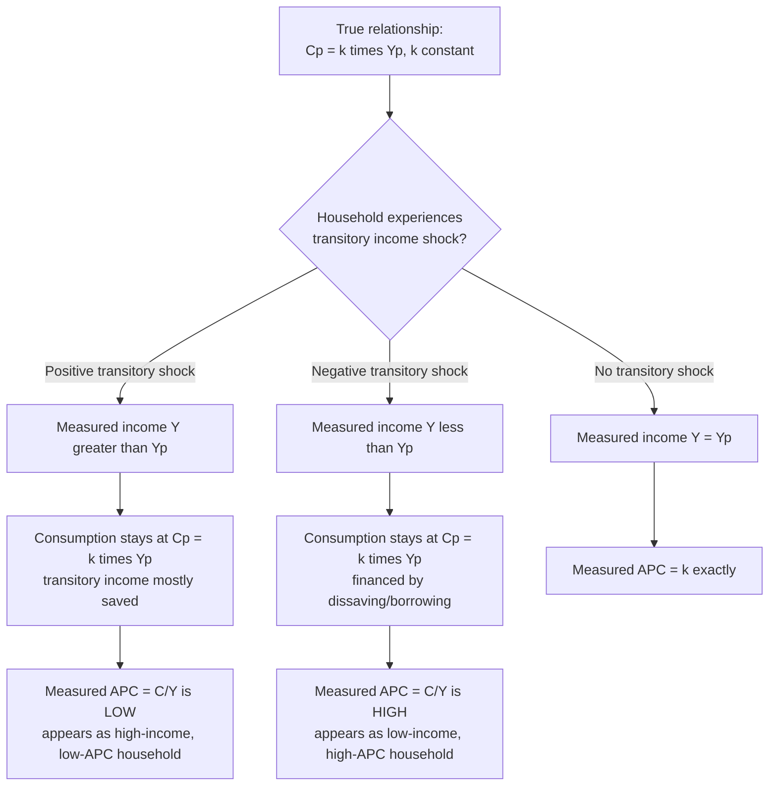

## Permanent Income Hypothesis

### Overview

The permanent income hypothesis (PIH) is a theory of consumption behavior developed by Milton Friedman in *A Theory of the Consumption Function* (1957). It proposes that households base their consumption decisions not on current measured income, but on their estimate of **permanent income** — the long-run, sustainable average level of income they expect to earn over an extended horizon. Friedman decomposed observed (measured) income into a **permanent component** and a **transitory component**, arguing that consumption responds strongly to the former and only weakly (if at all) to the latter. The theory was, alongside Modigliani's life-cycle hypothesis, one of the two dominant successor frameworks developed to resolve the "consumption puzzle" left unexplained by Keynes's absolute income hypothesis, and it remains foundational to modern consumption theory, including rational-expectations extensions such as Hall's random-walk hypothesis.

---

### Decomposition of Income: Permanent vs. Transitory

Friedman decomposed measured (current) income $Y_t$ into two additively separable components:

$$Y_t = Y_t^P + Y_t^T$$

- $Y_t^P$: **Permanent income** — the long-run average income a household expects to receive, reflecting its underlying, sustained earning capacity (education, skills, assets, career trajectory). Conceptually, it can be thought of as the constant annuity value of the household's expected lifetime wealth.
- $Y_t^T$: **Transitory income** — unanticipated, temporary deviations from permanent income (a one-time bonus, an unexpected windfall, a temporary layoff, a bumper harvest for a farmer, an unusually large medical expense reducing effective income). Transitory income has an expected value of zero over time and is assumed to be uncorrelated with permanent income and with transitory consumption.

**A parallel decomposition applies to consumption:**

$$C_t = C_t^P + C_t^T$$

where $C_t^P$ is planned, permanent consumption (determined by permanent income) and $C_t^T$ is transitory (unplanned, e.g., an emergency purchase, or measurement error), also assumed to average zero and to be uncorrelated with $Y_t^P$, $Y_t^T$, and $C_t^P$.

---

### The Core Consumption Function

Friedman's central hypothesis: **permanent consumption is proportional to permanent income:**

$$C_t^P = k \cdot Y_t^P$$

where $k$ is a constant (or a function of the interest rate, household preferences, and demographic factors, but importantly **not** a function of current measured income itself). Because permanent consumption is *proportional* to permanent income (no separate additive intercept term), the **average propensity to consume out of permanent income is constant**:

$$\frac{C_t^P}{Y_t^P} = k \quad (\text{constant, independent of the level of } Y^P)$$

This is the crucial structural difference from the Keynesian absolute income hypothesis's $C = C_0+cY_d$, which has a positive autonomous intercept $C_0$ that causes the *measured* APC to fall as income rises. Under the PIH, there is no such intercept in the *permanent*-income relationship — the APC out of permanent income is constant by construction.

**Estimating permanent income:** Friedman proposed that permanent income could be approximated empirically as a weighted average of current and past income (an adaptive-expectations-style formulation), e.g.:

$$Y_t^P = \theta Y_t + (1-\theta)Y_{t-1}^P, \quad 0<\theta<1$$

This is a form of exponentially weighted moving average of past realized incomes, giving more weight to recent income but incorporating a longer history to smooth out transitory fluctuations.

---

### Reconciling the Consumption Puzzle

**Cross-sectional data:** At any point in time, households with unusually **high measured (current) income** are disproportionately likely to be experiencing a **positive transitory income** shock (e.g., temporarily high bonuses, a good year for a farmer or business owner) — their permanent income is, on average, lower than their current measured income. Since consumption tracks *permanent* income (not the inflated current measured income), these households will show a **lower APC when measured against their current income** $\left(\frac{C_t}{Y_t}\right)$ than households whose current income roughly equals their permanent income. Symmetrically, households with unusually **low measured current income** (negative transitory shocks) will show a **higher measured APC**, because their consumption (tied to permanent income) remains relatively high compared to their temporarily depressed current income. This mechanically generates the empirically observed **cross-sectional pattern of falling APC with rising current income** — without requiring any change in the *true* underlying $k$ (the permanent APC).

**Long-run (Kuznets) time-series data:** Over long periods, transitory fluctuations average out, and *measured* income growth largely **reflects growth in permanent income** (sustained productivity and wage growth, not one-off transitory shocks). Since $C^P = kY^P$ with constant $k$, and measured income growth in the long run is predominantly permanent-income growth, the **long-run APC out of measured income remains stable at approximately $k$** — exactly matching Kuznets's finding of a stable long-run aggregate APC, resolving the puzzle.

**This is the theory's central achievement:** a *single*, unified structural parameter $k$ (constant proportionality between permanent consumption and permanent income) simultaneously explains both the falling cross-sectional/short-run APC pattern *and* the stable long-run aggregate APC pattern — phenomena that appeared contradictory under the simple absolute income hypothesis.

---

### Numerical Illustration

Suppose the true structural relationship is $C^P = 0.9 \times Y^P$ (so $k=0.9$).

**Household A** (positive transitory shock): true permanent income $Y^P=\$50{,}000$, but this year receives a $10,000 bonus, so measured income $Y=\$60{,}000$.

$$C = C^P = 0.9\times50{,}000=\$45{,}000 \quad (\text{transitory income is saved, not consumed})$$

$$\text{Measured APC} = \frac{45{,}000}{60{,}000}=0.75$$

**Household B** (no transitory shock, income equals permanent income): $Y^P=Y=\$50{,}000$.

$$C = 0.9\times50{,}000=\$45{,}000$$

$$\text{Measured APC} = \frac{45{,}000}{50{,}000}=0.90$$

**Household C** (negative transitory shock): true permanent income $Y^P=\$50{,}000$, but a temporary layoff reduces measured income to $Y=\$40{,}000$.

$$C = 0.9\times50{,}000=\$45{,}000 \quad (\text{household draws down savings/borrows to maintain planned consumption})$$

$$\text{Measured APC} = \frac{45{,}000}{40{,}000}=1.125$$

**Observation:** All three households share the *identical* underlying permanent-income relationship ($k=0.9$), yet their *measured* APCs differ substantially (0.75, 0.90, 1.125) purely as a function of their transitory income deviation — precisely replicating the empirical cross-sectional pattern (higher measured income associated with lower measured APC) without any change in the true structural consumption parameter.

---

### Diagram: How Transitory Income Generates the Cross-Sectional APC Pattern

---

### Illustration: True Permanent-Income Relationship vs. Observed Cross-Sectional Scatter (svg_diagram)

<svg xmlns="http://www.w3.org/2000/svg" viewBox="0 0 660 440">
<text x="330" y="26" text-anchor="middle" font-size="17" font-weight="bold" fill="#1a1a1a">Permanent Income Line vs. Measured Cross-Sectional Data (svg_diagram)</text>
<line x1="80" y1="390" x2="600" y2="390" stroke="#333" stroke-width="2" />
<line x1="80" y1="390" x2="80" y2="50" stroke="#333" stroke-width="2" />
<text x="340" y="420" text-anchor="middle" font-size="13" fill="#333">Measured Income (Y)</text>
<text x="35" y="220" text-anchor="middle" font-size="13" fill="#333" transform="rotate(-90 35 220)">Consumption (C)</text>

<line x1="80" y1="360" x2="580" y2="110" stroke="#023047" stroke-width="2.5" />
<text x="585" y="108" font-size="11" fill="#023047">True: Cp = k·Yp</text>

<circle cx="180" cy="290" r="5" fill="#e63946" />
<text x="185" y="280" font-size="9" fill="#e63946">Neg. transitory (high measured APC)</text>
<circle cx="330" cy="235" r="5" fill="#219ebc" />
<text x="335" y="228" font-size="9" fill="#219ebc">No shock (APC = k)</text>
<circle cx="460" cy="235" r="5" fill="#8ecae6" />
<text x="380" y="255" font-size="9" fill="#8ecae6">Pos. transitory (low measured APC)</text>

<line x1="80" y1="340" x2="580" y2="180" stroke="#e63946" stroke-width="2" stroke-dasharray="6,4" />
<text x="585" y="178" font-size="11" fill="#e63946">Apparent cross-sectional fit (looks like AIH, positive intercept)</text>

<text x="330" y="435" text-anchor="middle" font-size="11" fill="#555">Transitory shocks around the true line create an apparent "Keynesian" pattern in cross-sectional data</text>

</svg>

---

### Implications for Fiscal Policy: Temporary vs. Permanent Tax Changes

One of the PIH's most policy-relevant implications concerns the effectiveness of **temporary versus permanent tax changes**:

- **A temporary tax cut/rebate** is treated by rational households as primarily a **transitory income** increase. According to the PIH, households should save most of it (or use it to pay down debt) rather than substantially increasing consumption, since it does not raise their assessment of permanent income.
- **A permanent tax cut** (perceived as durable, altering long-run expected after-tax income) raises permanent income and should generate a much larger proportional increase in consumption, since $C^P=kY^P$ responds directly to permanent income changes.

**Implication for fiscal multiplier size:** This directly implies that **temporary fiscal stimulus (e.g., one-time tax rebates) should be substantially less effective at boosting aggregate consumption and output than a permanent, sustained tax change of the same initial size** — a proposition that has been extensively tested (with mixed results) in empirical studies of actual stimulus episodes (e.g., research examining household spending responses to U.S. tax rebate programs in various years). [Unverified: while the qualitative PIH prediction — smaller consumption response to temporary versus permanent income changes — is broadly supported in many empirical studies, the *precise magnitude* of the consumption response to specific historical temporary tax rebates varies considerably across studies and episodes, and some research finds a larger-than-PIH-predicted response, often attributed to the presence of liquidity-constrained households who cannot smooth consumption via borrowing/saving as the frictionless theory assumes.]

---

### Hall's Random-Walk Extension (Rational Expectations)

Robert Hall (1978) extended the PIH by combining it with the **rational expectations hypothesis**, deriving a striking and highly influential result: under quadratic utility, rational expectations, and a constant real interest rate, **consumption should follow a random walk** — meaning the best predictor of next period's consumption is simply *this period's* consumption, and consumption changes should be **unpredictable** using any information available in the current period (including current income, past income, or any other publicly available economic variable known at time $t$).

$$E_t[C_{t+1}] = C_t$$

**Rationale:** Because rational, forward-looking households have already incorporated all currently available information (including anticipated future income changes) into their current permanent-income estimate and hence current consumption plan, only genuinely **new, unanticipated information (news)** arriving between period $t$ and $t+1$ should cause consumption to change. If a future income change was already anticipated at time $t$, it would already be reflected in $C_t$ — waiting to adjust consumption only when the anticipated change actually arrives would violate optimal smoothing.

**Empirical implications and the "excess sensitivity" puzzle:** Hall's random-walk hypothesis generated substantial subsequent empirical testing. A widely replicated finding is that consumption changes show **"excess sensitivity"** to *predictable* changes in current income (e.g., consumption tends to rise around predictable events like the receipt of a regularly scheduled paycheck, tax refund, or known seasonal income pattern) more than the pure rational-expectations random-walk theory would predict. The leading explanation for this excess sensitivity is the presence of **liquidity-constrained households** who cannot borrow against anticipated future income to smooth consumption in advance, so their consumption necessarily moves with the *timing* of income receipt rather than purely with news about permanent income. [Inference: the "excess sensitivity" finding is one of the most robust and widely cited empirical results in the consumption literature, and the liquidity-constraint explanation is the dominant interpretation, though the precise share of households that are meaningfully liquidity-constrained, and how this varies across countries/time periods, remains an active empirical research question.]

---

### Comparison with Other Consumption Theories

| Feature | Absolute Income Hypothesis (Keynes) | Relative Income Hypothesis (Duesenberry) | Permanent Income Hypothesis (Friedman) | Life-Cycle Hypothesis (Modigliani) |
| --- | --- | --- | --- | --- |
| Key income concept | Current measured income | Income relative to peers/past peak | Permanent (long-run expected) income; transitory income separated out | Total lifetime resources over a finite horizon |
| APC out of the relevant income measure | Falls as income rises (due to positive intercept $C_0$) | Depends on relative position; roughly constant over time in aggregate | Constant $k$ (no intercept in the permanent relationship) | Depends on remaining lifetime and wealth; roughly stable in aggregate given demographic growth |
| Response to temporary/transitory income change | Same MPC applied regardless of income type (theory does not distinguish) | Not explicitly distinguished | Small — mostly saved, since it doesn't raise permanent income | Small relative to a permanent change — spread thinly across remaining lifetime |
| Explains stable long-run APC | No | Yes (via demonstration effect) | Yes (via permanent/transitory decomposition) | Yes (via demographic/cohort aggregation) |
| Underlying microfoundation | Largely descriptive/reduced-form | Largely descriptive/reduced-form (interdependent preferences, habit) | Forward-looking optimization under income uncertainty | Forward-looking lifetime utility maximization over finite horizon |
| Key modern extension | Basic building block of Keynesian-cross model | Habit-formation utility (DSGE) | Hall's random-walk hypothesis; rational expectations consumption models | Buffer-stock saving; demographic/pension policy analysis |

---

### Common Pitfalls and Clarifications

- **Confusing "permanent income" with "average past income."** While Friedman's adaptive-expectations estimation approach uses a weighted average of past income as a *proxy*, the theoretical concept of permanent income is fundamentally **forward-looking** (the household's expectation of its long-run sustainable income), not merely a backward-looking historical average — the backward-looking formula is an empirical approximation technique, not the definition itself.
- **Assuming the PIH implies transitory income is never spent at all.** The theory does not claim transitory income has *zero* effect on consumption; rather, its effect is much *smaller* than an equivalent change in permanent income, and in the simplest version, transitory income is assumed to be entirely saved (or used to pay down debt) — a simplifying assumption relaxed in models incorporating liquidity constraints, where even transitory income can have a meaningfully larger consumption effect for constrained households.
- **Treating Hall's random-walk result as a claim that consumption is unrelated to income.** The random-walk hypothesis is about the **unpredictability of consumption *changes*** using currently available information, not a claim that the *level* of consumption is disconnected from income — consumption still depends on permanent income; the point is that rational agents have already priced in anticipated future income changes.
- **Overgeneralizing the "temporary tax cuts are less effective" policy conclusion.** While a robust qualitative implication of the theory, real-world empirical estimates of the actual consumption response to specific temporary tax rebate programs vary, particularly once liquidity constraints, precautionary saving motives, and household heterogeneity are taken into account — the theory provides an important benchmark and qualitative prediction, not a precise, universally applicable quantitative multiplier for any given temporary fiscal measure.

---

### Key Points

- The permanent income hypothesis (Friedman, 1957) decomposes measured income into permanent and transitory components, arguing that consumption responds proportionally to permanent income ($C^P=kY^P$, constant $k$) and only weakly to transitory income.
- This single mechanism simultaneously explains the falling cross-sectional APC-income relationship (driven by transitory shocks) and the stable long-run aggregate APC (driven by permanent-income growth dominating in the long run), resolving the Kuznets consumption puzzle.
- A key policy implication: temporary tax changes are predicted to have a smaller effect on consumption than equivalent permanent tax changes, since only the latter substantially raises permanent income.
- Hall's (1978) rational-expectations extension predicts consumption should follow a random walk — changes in consumption should be unpredictable from currently available information — though empirical "excess sensitivity" to predictable income changes (attributed to liquidity constraints) is a well-documented departure from this pure prediction.
- The PIH remains foundational to modern consumption theory, forming the basis for subsequent rational-expectations and buffer-stock saving models.

---

**Related Topics**

- Keynesian absolute income hypothesis
- Relative income hypothesis (Duesenberry)
- Life-cycle hypothesis of consumption and saving
- Hall's random-walk hypothesis and rational expectations
- Excess sensitivity of consumption and liquidity constraints
- Buffer-stock saving models (Carroll)
- Ricardian equivalence
- Fiscal policy multipliers: temporary vs. permanent tax changes
- The Kuznets consumption puzzle