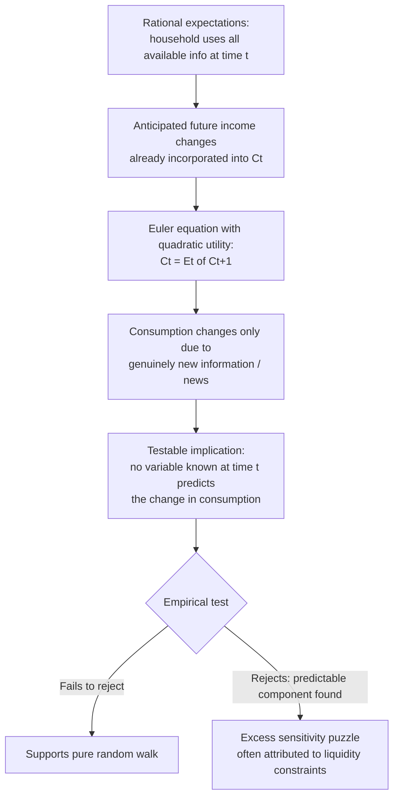

## Random Walk Hypothesis of Consumption

### Overview

The random walk hypothesis of consumption, developed by Robert Hall in his seminal 1978 paper "Stochastic Implications of the Life Cycle-Permanent Income Hypothesis: Theory and Evidence" (*Journal of Political Economy*), combines Friedman's permanent income hypothesis and Modigliani's life-cycle hypothesis with **rational expectations**. Hall's central result is that, under specific but standard assumptions, **consumption should follow a random walk**: the best predictor of next period's consumption is simply the current period's consumption, and consumption *changes* should be **unpredictable** using any information available in the current period. This was a landmark and highly influential result — it converted consumption theory from a largely descriptive/backward-looking framework into one amenable to rigorous testing using the tools of modern time-series econometrics and rational expectations, and it generated an extensive subsequent empirical literature testing (and often rejecting or qualifying) its precise predictions.

---

### Theoretical Setup

**Assumptions underlying Hall's derivation:**

1. **Rational expectations:** Households form expectations of future income and other relevant variables using all available information efficiently — they do not make systematic forecasting errors.
2. **Life-cycle/permanent-income framework:** Households maximize expected lifetime utility subject to an intertemporal budget constraint, smoothing consumption relative to fluctuating income (as in the LCH/PIH tradition).
3. **Quadratic utility function** (a key simplifying assumption): $U(C_t) = -\frac{1}{2}(C_t - \bar{C})^2$ for some bliss point $\bar{C}$, or more generally a utility function that is quadratic in consumption. This assumption is critical because it makes marginal utility a **linear** function of consumption, which is what generates the clean random-walk result via a certainty-equivalence argument.
4. **Constant real interest rate**, assumed equal to the household's subjective rate of time preference (so there is no systematic reason for planned consumption to trend up or down over time even in a deterministic setting).
5. **No binding liquidity/borrowing constraints:** households can freely borrow and lend at the given interest rate to smooth consumption according to their intertemporal plan.

---

### The Euler Equation and Certainty Equivalence

**Intertemporal optimization (Euler equation):** A standard result from dynamic consumption optimization is that households equate the marginal utility of consumption today to the discounted expected marginal utility of consumption tomorrow:

$$U'(C_t) = \beta(1+r)E_t\left[U'(C_{t+1})\right]$$

where $\beta$ is the subjective discount factor and $r$ is the real interest rate.

**Under the assumption $\beta(1+r)=1$** (time preference exactly offsets the interest rate — a standard simplifying assumption), this reduces to:

$$U'(C_t) = E_t[U'(C_{t+1})]$$

**With quadratic utility**, $U'(C_t)$ is a *linear* function of $C_t$ (specifically, $U'(C_t) = \bar{C}-C_t$ for the bliss-point form above), so:

$$E_t[U'(C_{t+1})] = U'(E_t[C_{t+1}])$$

(This equivalence — that the expectation of a linear function equals the linear function of the expectation — is the certainty-equivalence property that only holds because utility is quadratic; it would not generally hold for other, more realistic curvature specifications like CRRA utility.)

**Combining these results:**

$$U'(C_t) = U'(E_t[C_{t+1})]) \quad \Rightarrow \quad C_t = E_t[C_{t+1}]$$

**This is the random walk result:**

$$\boxed{E_t[C_{t+1}] = C_t}$$

Equivalently, writing $C_{t+1} = C_t + \varepsilon_{t+1}$, the innovation $\varepsilon_{t+1}$ must satisfy $E_t[\varepsilon_{t+1}]=0$ — it is **unforecastable** using any information available at time $t$.

---

### Interpretation: Consumption Changes Are "News"

**The core intuition:** A rational, forward-looking household has already incorporated *all currently available information* — including any anticipated future income changes, anticipated interest rate movements, and known future events — into its current optimal consumption plan $C_t$. If a future income increase was already known/expected at time $t$, the household would have already adjusted $C_t$ upward *today* (smoothing that anticipated gain over the remaining lifetime), rather than waiting to raise consumption only when the anticipated income arrives.

**Therefore, consumption should change between periods $t$ and $t+1$ only in response to $genuinely\ new,\ unanticipated\ information$ ("news") that arrives between those two periods** — a surprise change in income, an unexpected change in wealth (e.g., an unanticipated stock market move), a surprise interest rate change, or any other shock not foreseeable at time $t$.

$$\Delta C_{t+1} = C_{t+1}-C_t = \varepsilon_{t+1}, \quad E_t[\varepsilon_{t+1}]=0$$

This has a very strong and testable empirical implication: **no variable known at time $t$ — including past consumption, past income, current income, stock prices, interest rates, or any other macroeconomic indicator dated $t$ or earlier — should have any predictive power for the *change* in consumption between $t$ and $t+1$**, once $C_t$ itself is accounted for.

---

### Diagram: The Logic of the Random Walk Result

---

### Illustration: Random Walk Path of Consumption vs. Predictable Deviations (svg_diagram)

<svg xmlns="http://www.w3.org/2000/svg" viewBox="0 0 660 420">
<text x="330" y="26" text-anchor="middle" font-size="17" font-weight="bold" fill="#1a1a1a">Random Walk Consumption Path: Theory vs. Excess Sensitivity (svg_diagram)</text>
<line x1="80" y1="370" x2="600" y2="370" stroke="#333" stroke-width="2" />
<line x1="80" y1="370" x2="80" y2="50" stroke="#333" stroke-width="2" />
<text x="340" y="400" text-anchor="middle" font-size="13" fill="#333">Time period (t)</text>
<text x="35" y="200" text-anchor="middle" font-size="13" fill="#333" transform="rotate(-90 35 200)">Consumption</text>

<polyline points="90,280 160,260 230,275 300,240 370,250 440,220 510,235 580,210" fill="none" stroke="`#023047`" stroke-width="2.5" />

<text x="585" y="208" font-size="10" fill="`#023047`">Theoretical random walk: only responds to news</text>

<polyline points="90,300 160,300 165,255 230,255 235,270 300,270 305,225 370,225 375,240 440,240 445,200 510,200 515,215 580,215" fill="none" stroke="`#e63946`" stroke-width="2" stroke-dasharray="5,3" />

<text x="585" y="255" font-size="10" fill="`#e63946`">Observed: excess sensitivity jumps at predictable paycheck dates</text>

<line x1="165" y1="370" x2="165" y2="255" stroke="#8ecae6" stroke-width="1" stroke-dasharray="2,2" />
<line x1="305" y1="370" x2="305" y2="225" stroke="#8ecae6" stroke-width="1" stroke-dasharray="2,2" />
<line x1="445" y1="370" x2="445" y2="200" stroke="#8ecae6" stroke-width="1" stroke-dasharray="2,2" />
<text x="165" y="385" text-anchor="middle" font-size="9" fill="#8ecae6">predictable income</text>
</svg>

---

### Empirical Testing Strategy

Hall's paper proposed a direct, simple test: regress the change in consumption on lagged (time $t$ or earlier) variables that should have **no** predictive power under the null hypothesis of the pure random walk model:

$$\Delta C_{t+1} = \gamma_0 + \gamma_1 X_t + u_{t+1}$$

where $X_t$ is any variable dated $t$ or earlier (lagged income, lagged consumption growth, stock prices, interest rates, etc.). **Under the null hypothesis**, $\gamma_1 = 0$ for any such $X_t$ — no lagged variable should have statistically significant predictive power for future consumption changes.

**Hall's original findings (1978):** Using aggregate U.S. consumption data, Hall found broad support for the hypothesis — lagged income and other lagged variables generally did *not* have significant predictive power for consumption changes, though he did find some evidence that lagged stock market prices had modest predictive power (an anomaly he noted but did not fully resolve).

---

### The "Excess Sensitivity" Puzzle

**Subsequent empirical literature** (following Hall's initial paper) tested the random-walk hypothesis extensively and produced a widely replicated finding known as **"excess sensitivity"**: consumption changes are found to be significantly correlated with **predictable (anticipated) changes in current income** — more than the pure theory predicts.

**Classic examples cited in this literature:**

- Consumption/spending tends to rise around **regularly scheduled, predictable income receipt dates** (e.g., paycheck timing, predictable tax refund receipt) more than a pure forward-looking smoothing model would predict.
- Studies of predictable Social Security payment timing, predictable seasonal income patterns (e.g., in agricultural or holiday-bonus-heavy occupations), and pre-announced tax changes have found consumption responding to the *timing* of these predictable income events, rather than being smoothed in advance as the pure theory implies.

**Dominant explanation: liquidity constraints.** The leading interpretation of excess sensitivity is that a meaningful fraction of households are **liquidity-constrained** — unable to borrow freely against anticipated future income to front-load consumption smoothing, as the frictionless theory assumes. For these households, consumption necessarily tracks the *actual timing* of income receipt (a "hand-to-mouth" pattern) rather than the smooth, forward-looking path predicted by the unconstrained model. [Inference: while the liquidity-constraint explanation is the dominant and most widely accepted interpretation of excess sensitivity in the literature, some researchers have also proposed alternative or complementary explanations — including precautionary saving motives, myopia/present bias in household decision-making, and mental-accounting behavioral effects — and the relative empirical importance of each explanation remains a topic of ongoing research rather than fully settled.]

---

### The "Excess Smoothness" Puzzle (A Related but Distinct Anomaly)

A separate, related empirical anomaly identified by subsequent research (notably Campbell and Deaton, 1989) is **"excess smoothness"**: aggregate consumption appears to respond *less* to permanent income *shocks* than the pure random-walk/permanent-income theory would predict, given the actual persistence properties of income shocks found in the data (if income shocks are highly persistent — closer to a random walk themselves — the theory predicts a *larger* consumption response than is often empirically observed).

**Note the apparent tension between these two anomalies:** excess sensitivity says consumption reacts *too much* to certain (predictable/transitory) income changes; excess smoothness says consumption reacts *too little* to other (persistent/permanent) income changes. Reconciling both findings within a single coherent model has been a significant focus of subsequent consumption research, generally pointing toward more sophisticated models incorporating heterogeneous households (some constrained, some not), precautionary saving under income uncertainty, and more realistic income-process assumptions than Hall's original simple framework. [Inference: this reconciliation is an active area of the consumption literature rather than a fully closed question, and different structural models calibrated to different datasets can produce varying quantitative assessments of how much of each anomaly is explained by liquidity constraints versus alternative mechanisms.]

---

### Buffer-Stock Saving Models: A Modern Synthesis

Christopher Carroll's **buffer-stock saving models** (1990s onward) represent an influential modern extension that addresses several empirical shortcomings of Hall's original quadratic-utility framework by replacing quadratic utility with more realistic **constant relative risk aversion (CRRA) utility** and explicitly incorporating **income uncertainty** and **precautionary saving**:

- Under CRRA utility (unlike quadratic utility), marginal utility is **convex**, which generates a precautionary saving motive: households facing greater income uncertainty save more as a buffer against potential future income shortfalls, rather than simply setting consumption equal to the certainty-equivalent expected path.
- This produces a target "buffer stock" of wealth relative to income that households aim to maintain, with **consumption growth positively related to income growth** in a way that can help explain some of the "excess sensitivity" findings without requiring binding liquidity constraints for all consumers — impatient-but-prudent households voluntarily keep a buffer of assets and adjust consumption partly in response to income realizations even without being formally constrained.
- Buffer-stock models are now widely regarded as a more empirically realistic successor to Hall's original quadratic-utility random-walk framework, though Hall's core insight — that rational expectations imply consumption changes should reflect genuinely new information — remains foundational to the broader research program.

---

### Comparison: Hall's Random Walk vs. Predecessor Consumption Theories

| Feature | Permanent Income Hypothesis (Friedman) | Life-Cycle Hypothesis (Modigliani) | Hall's Random Walk Hypothesis |
| --- | --- | --- | --- |
| Expectations formation | Adaptive (backward-looking weighted average of past income) in Friedman's original formulation | Deterministic lifetime planning, not explicitly stochastic | Rational expectations under uncertainty |
| Key testable implication | Consumption responds more to permanent than transitory income | Hump-shaped wealth profile; demographic aggregation effects | Consumption changes are unpredictable using any information dated $t$ or earlier |
| Utility function assumption | Not explicitly specified | Not explicitly specified (general lifetime utility maximization) | Quadratic utility (for exact analytical tractability of certainty equivalence) |
| Treatment of uncertainty | Implicit, not formally modeled with rational expectations | Implicit; some extensions add uncertain lifespan | Explicit and central — the entire result depends on rational expectations under uncertainty |
| Empirical anomaly generated | Cross-sectional/short-run vs. long-run APC patterns (resolved by the theory itself) | Retirement under-decumulation ("retirement-savings puzzle") | Excess sensitivity and excess smoothness puzzles |

---

### Common Pitfalls and Clarifications

- **Interpreting the random walk hypothesis as "consumption is unrelated to income."** The hypothesis concerns the *unpredictability of changes* in consumption using currently available information — it does not claim the *level* of consumption is disconnected from income or wealth. Consumption still depends on permanent income/lifetime resources; the theory's novel claim is about the dynamics of how consumption *evolves* over time given rational updating.
- **Treating the quadratic utility assumption as innocuous.** The exact random-walk result depends critically on quadratic utility's certainty-equivalence property. Under more standard and empirically preferred utility specifications (e.g., CRRA), precautionary saving motives arise, and the *exact* random-walk prediction ($E_t[C_{t+1}]=C_t$) generally fails to hold precisely — consumption growth can be systematically related to the variance of future income risk, a feature entirely absent from Hall's original quadratic-utility model but central to buffer-stock extensions.
- **Assuming "excess sensitivity" definitively falsifies rational expectations.** While excess sensitivity is a real and robust empirical departure from Hall's *specific* quadratic-utility random-walk prediction, most researchers interpret it as evidence for liquidity constraints or alternative utility specifications *within* a broadly rational-expectations framework, rather than as a wholesale rejection of rational expectations or forward-looking consumer behavior in general.
- **Conflating excess sensitivity and excess smoothness as the same phenomenon.** These are distinct anomalies concerning different types of income changes (predictable/transitory events vs. persistent/permanent shocks) and are not simply two names for the same empirical failure of the model.

---

### Key Points

- Hall's (1978) random walk hypothesis combines the permanent income/life-cycle framework with rational expectations, predicting that consumption changes should be unpredictable using any information available in the prior period: $E_t[C_{t+1}]=C_t$.
- The result relies critically on quadratic utility (for certainty equivalence), rational expectations, no binding liquidity constraints, and a real interest rate equal to the discount rate.
- The core testable implication: no lagged variable (income, consumption, asset prices) should predict future consumption *changes* — Hall's original tests found broad, though not complete, empirical support.
- Subsequent research identified two major anomalies: **excess sensitivity** (consumption responds too much to predictable income changes, largely attributed to liquidity constraints) and **excess smoothness** (consumption responds too little to persistent income shocks).
- Carroll's buffer-stock saving models, using CRRA utility and explicit income uncertainty, represent a more empirically realistic modern successor that incorporates precautionary saving, addressing some shortcomings of Hall's original quadratic-utility framework.

---

**Related Topics**

- Friedman's permanent income hypothesis
- Modigliani's life-cycle hypothesis
- Buffer-stock saving models (Carroll)
- Excess sensitivity and liquidity constraints
- Excess smoothness (Campbell-Deaton puzzle)
- Rational expectations in macroeconomics
- Euler equations and intertemporal optimization
- Precautionary saving under income uncertainty
- Fiscal policy multipliers: temporary vs. permanent tax changes