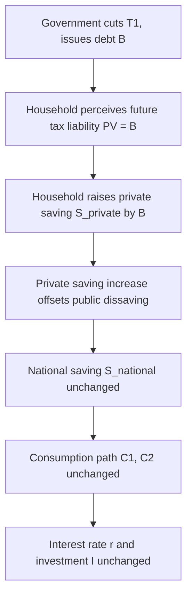

## Ricardian Equivalence and Consumption Smoothing

### Overview

Ricardian equivalence is the proposition that, under specific conditions, the method a government uses to finance its spending—current taxation versus debt issuance—has no effect on aggregate consumption or national saving. Forward-looking households, anticipating that today's deficit-financed spending implies future tax liabilities, adjust their saving behavior to offset the government's financing choice. This concept sits at the intersection of consumption theory and fiscal policy, drawing directly on the intertemporal consumption-smoothing frameworks of the Permanent Income Hypothesis (PIH) and the Life-Cycle Hypothesis (LCH).

### Theoretical Foundations

#### Consumption Smoothing Recap

Consumption smoothing theories (PIH, LCH) posit that rational, forward-looking consumers base current consumption on lifetime (permanent) resources rather than current income. A household facing a temporary income change will save or borrow to keep consumption relatively stable over time, since utility functions are typically assumed to exhibit diminishing marginal utility of consumption, making smooth consumption paths preferable to volatile ones.

#### The Ricardian Equivalence Proposition

Formalized by Robert Barro (1974) in "Are Government Bonds Net Wealth?", the theorem extends consumption-smoothing logic to government financing decisions. The core claim:

A tax cut financed by government borrowing does not stimulate consumption, because rational households recognize that the debt must eventually be repaid through future taxes. They save the tax cut (increase current saving one-for-one) to meet that future liability, leaving consumption unchanged.

**Key Points**

- Named after David Ricardo, who first raised the logical possibility in the 19th century but was skeptical of its practical relevance (hence "Ricardian" equivalence is a modern label, not Ricardo's own theory).
- Barro's contribution was to show that even with finite individual lifetimes, equivalence can hold if agents are linked by **intergenerational altruism** (operative bequest motives).
- Implies the timing of taxes is irrelevant to real economic variables—only the present value of government spending matters.

### The Government Budget Constraint

The mechanism operates through the intertemporal government budget constraint. Consider a two-period model:

$$G_1 + \frac{G_2}{1+r} = T_1 + \frac{T_2}{1+r}$$

Where $G$ is government spending, $T$ is taxes, and $r$ is the interest rate. If the government cuts $T_1$ (taxes today) while holding $G_1$ and $G_2$ fixed, it must issue debt $B = G_1 - T_1$, which requires raising $T_2$ in period 2 to service that debt:

$$T_2' = T_2 + B(1+r)$$

The present value of the household's lifetime tax burden is unchanged:

$$T_1 + \frac{T_2}{1+r} = T_1' + \frac{T_2'}{1+r}$$

### Household Optimization Under Ricardian Equivalence

#### Setup

A representative household maximizes lifetime utility subject to its intertemporal budget constraint:

$$\max U = u(C_1) + \beta u(C_2)$$

subject to:

$$C_1 + \frac{C_2}{1+r} = Y_1 - T_1 + \frac{Y_2 - T_2}{1+r}$$

Where $Y$ is pre-tax income and $\beta$ is the discount factor.

#### The Substitution Argument

If the government reduces $T_1$ by $\Delta$ and (by the budget constraint) must raise $T_2$ by $\Delta(1+r)$, then lifetime after-tax wealth is:

$$W = (Y_1 - T_1 + \Delta) + \frac{Y_2 - T_2 - \Delta(1+r)}{1+r} = Y_1 - T_1 + \frac{Y_2 - T_2}{1+r}$$

The $\Delta$ terms cancel exactly. Lifetime wealth $W$—and therefore the optimal consumption path $(C_1, C_2)$—is unaffected by the tax cut. The household simply saves the entire tax cut, increasing private saving by exactly the amount the government's saving fell (public dissaving), leaving **national saving** (private + public) constant.

**Example**

A government cuts taxes by $1,000 per household this year, financed by issuing bonds, and plans to raise taxes by $1,050 next year to repay the debt plus 5% interest ($r = 0.05$). A Ricardian household:

- Recognizes the $1,050 future liability has a present value of exactly $1,000 today.
- Saves the full $1,000 tax cut (e.g., by purchasing the newly issued government bonds).
- Leaves $C_1$ and $C_2$ unchanged.
- Aggregate demand, interest rates, and national saving remain unaffected—only the composition of saving (private vs. public) shifts.

### Diagrammatic Representation

### Conditions Required for Ricardian Equivalence to Hold

The theorem depends on a restrictive set of assumptions. Relaxing any one typically breaks equivalence.

#### 1. Perfect Capital Markets (No Borrowing Constraints)

Households must be able to borrow and lend freely at the same rate $r$ as the government. If a household is **liquidity-constrained** (cannot borrow against future income), a tax cut today relaxes that constraint and raises current consumption—equivalence fails.

#### 2. Infinite Horizons or Operative Intergenerational Altruism

If households have finite lives, equivalence requires that they care about their descendants' welfare (a bequest motive) enough to internalize the future tax burden that will fall on their children. Barro's key insight: a chain of altruistically linked generations behaves as a single infinite-horizon household. If bequest motives are absent or "non-operative" (e.g., bequests are already zero or constrained to be non-negative), equivalence breaks down.

#### 3. Non-Distortionary (Lump-Sum) Taxes

Taxes must be lump-sum, not distortionary (e.g., not income or capital taxes that alter marginal incentives to work or invest). If taxes are distortionary, the timing of taxation affects relative prices and behavior, independent of wealth effects.

#### 4. Certainty About Future Tax Liabilities

Households must correctly anticipate the size and timing of future tax increases and attribute them to the current deficit. Uncertainty about who will bear the future tax burden (which generation, which income group) can weaken the offsetting saving response.

#### 5. No Population Growth or Finite-Sample Effects that Break the Chain

If the population is growing, a debt burden can be spread over more future taxpayers than the number of current taxpayers, allowing a genuine intergenerational transfer even with altruism (this refines rather than fully negates Barro's result, but is a common textbook caveat).

#### 6. Rational Expectations and Full Information

Households must be rational, forward-looking optimizers who correctly process the government budget constraint. Myopic or "rule-of-thumb" consumers who consume out of current disposable income (a hallmark of Keynesian consumption functions) will treat the tax cut as a windfall and increase consumption.

**Key Points**

- These conditions are jointly restrictive; empirical departures from any one are the primary explanation for observed deviations from strict equivalence.
- The theorem is best understood as a **benchmark/null hypothesis**—a logical baseline against which real-world fiscal policy effects are measured, not a claim that debt financing is literally always neutral. [Inference — this characterization reflects the standard pedagogical framing in most macroeconomics texts, though how strongly individual economists endorse it as a "true" benchmark varies.]

### Ricardian Equivalence vs. Standard Keynesian View

| Dimension | Ricardian View | Standard Keynesian View |
| --- | --- | --- |
| Households | Forward-looking, permanent-income optimizers | Rule-of-thumb, consume from current disposable income |
| Tax cut (debt-financed) | No effect on consumption; saved fully | Increases consumption via higher disposable income |
| Government debt | Not perceived as net wealth | Perceived as net wealth |
| Fiscal multiplier | Near zero for tax changes | Positive, often > 1 for spending, positive for tax cuts |
| Interest rates | Unaffected by deficit financing | May rise with deficit-financed spending (crowding out) |

### Empirical Evidence and Departures

#### Evidence Against Strict Equivalence

- Consumption has been observed to respond to anticipated, debt-financed tax changes (e.g., studies of the 2001 and 2008 U.S. tax rebates found a meaningful share of the rebate was spent rather than fully saved), inconsistent with pure Ricardian behavior. [Unverified — exact magnitudes vary substantially across studies and specifications; commonly cited estimates suggest 20–40% of rebate income was spent within the following quarter(s), but this figure is sensitive to methodology.]
- Evidence of binding liquidity constraints among a significant share of households (the "hand-to-mouth" consumer literature, e.g., Kaplan and Violante) suggests many households cannot smooth consumption via borrowing, breaking a core Ricardian assumption.
- Bequest behavior does not always appear consistent with the operative, wealth-maximizing altruism Barro's model requires; some bequests appear accidental (arising from uncertain lifespans and annuity market imperfections) rather than intentional.

#### Evidence Consistent with Partial Equivalence

- Some studies find partial offsetting behavior—private saving rises when government deficits rise, though usually by less than one-for-one—a finding often labeled "Ricardian in spirit" or partial Ricardian equivalence.
- Cross-country studies occasionally find correlations between government dissaving and private saving increases consistent with weak-form equivalence, though causal identification is difficult. [Inference — correlation-based evidence of this kind is generally treated cautiously in the literature due to confounding factors like common responses to expected future income.]

**Key Points**

- The dominant view among macroeconomists is that Ricardian equivalence holds only partially in practice, due primarily to liquidity constraints, non-operative bequest motives, and myopic/rule-of-thumb consumption behavior.
- The debate remains empirically unsettled and politically salient, since it bears directly on the expected effectiveness of tax-cut-based fiscal stimulus.

### Policy Implications

#### For Fiscal Stimulus

If Ricardian equivalence holds strongly, tax cuts are an ineffective countercyclical tool relative to direct government spending, since households save rather than spend the cut. This has direct implications for the design of stimulus packages (e.g., debates over one-time rebates vs. sustained spending increases).

#### For Deficit Financing Debates

Under strict equivalence, government debt levels are not inherently destabilizing (no crowding out of investment, no upward pressure on interest rates) because private saving adjusts automatically. Critics of large deficits generally reject strict equivalence, arguing debt does raise interest rates and can crowd out investment.

#### For Generational Accounting

Ricardian equivalence interacts with generational accounting frameworks: if bequest motives are operative, debt-financed policy is a wash across generations; if not, current debt issuance is effectively an intergenerational transfer of resources from the future to the present.

### Illustrative Model Diagram

<svg xmlns="http://www.w3.org/2000/svg" viewBox="0 0 800 480">
<text x="400" y="30" font-size="18" font-weight="bold" text-anchor="middle" fill="#1a1a2e">Ricardian Equivalence Mechanism (svg_diagram)</text>
<rect x="40" y="70" width="220" height="90" rx="8" fill="#e8f0fe" stroke="#4a6fa5" stroke-width="2" />
<text x="150" y="100" font-size="14" text-anchor="middle" fill="#1a1a2e">Government cuts</text>
<text x="150" y="120" font-size="14" text-anchor="middle" fill="#1a1a2e">taxes today by ΔT</text>
<text x="150" y="145" font-size="12" text-anchor="middle" fill="#555">financed by issuing debt B = ΔT</text>
<rect x="300" y="70" width="220" height="90" rx="8" fill="#fef3e2" stroke="#c2872b" stroke-width="2" />
<text x="410" y="100" font-size="14" text-anchor="middle" fill="#1a1a2e">Household perceives</text>
<text x="410" y="120" font-size="14" text-anchor="middle" fill="#1a1a2e">future tax liability</text>
<text x="410" y="145" font-size="12" text-anchor="middle" fill="#555">PV(future tax) = B</text>
<rect x="560" y="70" width="200" height="90" rx="8" fill="#e6f4ea" stroke="#2e7d4f" stroke-width="2" />
<text x="660" y="100" font-size="14" text-anchor="middle" fill="#1a1a2e">Household saves</text>
<text x="660" y="120" font-size="14" text-anchor="middle" fill="#1a1a2e">the full ΔT</text>
<text x="660" y="145" font-size="12" text-anchor="middle" fill="#555">ΔS_private = ΔT</text>
<line x1="260" y1="115" x2="295" y2="115" stroke="#333" stroke-width="2" marker-end="url(#arrow)" />
<line x1="520" y1="115" x2="555" y2="115" stroke="#333" stroke-width="2" marker-end="url(#arrow)" />
<rect x="150" y="220" width="500" height="90" rx="8" fill="#f3e8fc" stroke="#7b3fa0" stroke-width="2" />
<text x="400" y="250" font-size="14" text-anchor="middle" fill="#1a1a2e">National saving unchanged:</text>
<text x="400" y="270" font-size="14" text-anchor="middle" fill="#1a1a2e">ΔS_national = ΔS_private + ΔS_public = ΔT + (−ΔT) = 0</text>
<line x1="410" y1="160" x2="410" y2="215" stroke="#333" stroke-width="2" marker-end="url(#arrow)" />
<rect x="80" y="360" width="280" height="90" rx="8" fill="#fce8ec" stroke="#a03f5f" stroke-width="2" />
<text x="220" y="390" font-size="14" text-anchor="middle" fill="#1a1a2e">Consumption path</text>
<text x="220" y="410" font-size="14" text-anchor="middle" fill="#1a1a2e">C1, C2 unchanged</text>
<text x="220" y="435" font-size="12" text-anchor="middle" fill="#555">Lifetime wealth W unchanged</text>
<rect x="440" y="360" width="280" height="90" rx="8" fill="#e2f0f7" stroke="#2f6f8f" stroke-width="2" />
<text x="580" y="390" font-size="14" text-anchor="middle" fill="#1a1a2e">Interest rate r,</text>
<text x="580" y="410" font-size="14" text-anchor="middle" fill="#1a1a2e">investment I unchanged</text>
<text x="580" y="435" font-size="12" text-anchor="middle" fill="#555">No crowding out</text>
<line x1="300" y1="310" x2="240" y2="355" stroke="#333" stroke-width="2" marker-end="url(#arrow)" />
<line x1="500" y1="310" x2="560" y2="355" stroke="#333" stroke-width="2" marker-end="url(#arrow)" />
</svg>

### Mathematical Summary Box

For an infinite-horizon representative agent (or altruistically linked dynasty), the equivalence result can be stated compactly. Lifetime wealth is:

$$W = \sum_{t=0}^{\infty} \frac{Y_t - T_t}{(1+r)^t}$$

Ricardian equivalence requires that any feasible reshuffling of $\{T_t\}$ satisfying the government's intertemporal budget constraint—

$$\sum_{t=0}^{\infty} \frac{G_t}{(1+r)^t} = \sum_{t=0}^{\infty} \frac{T_t}{(1+r)^t}$$

—leaves $W$, and hence the optimal $\{C_t\}$ path, unchanged. This is a direct extension of the PIH/LCH logic: consumption depends on the present value of resources, and the tax-timing reshuffle leaves that present value invariant by construction.

### Common Misconceptions

- **Misconception**: Ricardian equivalence claims deficits never matter.

  **Clarification**: It claims deficits don't matter *for consumption/aggregate demand under specific idealized conditions*; deficits can still matter for long-run growth, capital accumulation from distortionary taxation, and welfare if the underlying assumptions fail.
- **Misconception**: Ricardian equivalence means government debt is irrelevant to fiscal sustainability.

  **Clarification**: The theorem is about the neutrality of financing *timing*, not about the sustainability of the level of government spending itself; unsustainable spending paths (violating the intertemporal budget constraint) are a separate issue.
- **Misconception**: Ricardo endorsed this theory.

  **Clarification**: Ricardo raised the logical possibility but explicitly doubted that ordinary people reason this far ahead—an early anticipation of the liquidity-constraint and myopia critiques.

**Related Topics**

- Permanent Income Hypothesis and the random walk of consumption (Hall's model)
- Life-Cycle Hypothesis and hump-shaped wealth accumulation
- Liquidity constraints and hand-to-mouth consumers
- Barro-Ricardo intergenerational altruism and bequest motives
- Government intertemporal budget constraint and fiscal sustainability
- Crowding out and the loanable funds market
- Fiscal multipliers: tax cuts vs. government spending
- Distortionary vs. lump-sum taxation
- Generational accounting frameworks
- Empirical tests of Ricardian equivalence (tax rebate studies, cross-country saving data)