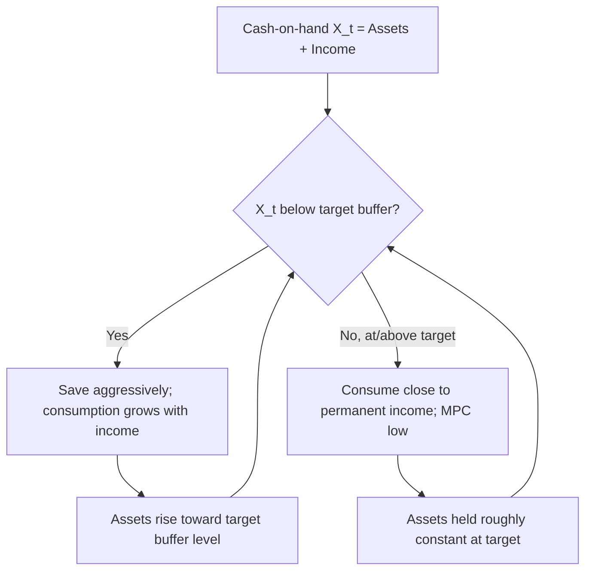
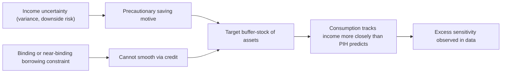

## Liquidity Constraints and Precautionary Saving

### Overview

Liquidity constraints and precautionary saving represent two of the most significant departures from the frictionless consumption-smoothing benchmark established by the Permanent Income Hypothesis (PIH) and Life-Cycle Hypothesis (LCH). Where the pure PIH assumes households can borrow and lend freely against future income and face no uncertainty beyond what certainty-equivalence handles, real-world consumers face **borrowing constraints** (limits on their ability to borrow against future income) and **income uncertainty** that induces **precautionary saving** (extra saving undertaken specifically to buffer against unpredictable future shocks). Together, these frictions explain much of the observed "excess sensitivity" of consumption to current income that pure PIH models fail to predict.

### Part I: Liquidity Constraints

#### Definition and Core Mechanism

A liquidity constraint (or borrowing constraint) exists when a household cannot borrow as much as it would like at the prevailing interest rate to smooth consumption, typically because:

- Lenders cannot fully verify or enforce claims against uncertain future income (asymmetric information, limited commitment).
- Collateral requirements exceed what the household can pledge.
- Institutional limits (credit card limits, loan-to-value ratios) cap borrowing below the unconstrained optimum.

Formally, in a standard two-period model, the household solves:

$$\max_{C_1, C_2} u(C_1) + \beta u(C_2)$$

subject to:

$$C_1 + \frac{C_2}{1+r} \leq Y_1 + \frac{Y_2}{1+r}$$

$$C_1 \leq Y_1 + \bar{B}$$

Where $\bar{B}$ is the maximum amount the household can borrow against period-2 income (often $\bar{B} = 0$ in the simplest constrained case, meaning no borrowing at all). When the unconstrained optimal $C_1^*$ exceeds $Y_1 + \bar{B}$, the constraint binds, and:

$$C_1 = Y_1 + \bar{B}$$

**Key Points**

- A binding constraint forces current consumption to track current (cash-on-hand) resources rather than permanent income.
- This directly contradicts the PIH prediction that consumption should be smooth relative to transitory income fluctuations.
- Constrained households exhibit a higher **marginal propensity to consume (MPC)** out of current income—often close to 1 for the constrained portion of income—compared to unconstrained households, whose MPC out of transitory income should approach 0 under pure PIH.

#### Sources of Liquidity Constraints

1. **Imperfect capital markets**: Lenders face information asymmetries about borrowers' true income prospects and repayment likelihood.
2. **Limited commitment / enforcement problems**: Absent collateral, lenders cannot compel repayment if a borrower's income is low or they default strategically.
3. **Human capital as non-collateralizable wealth**: Future labor income cannot be pledged as collateral in most legal systems (no debt bondage), unlike physical or financial assets.
4. **Institutional and regulatory limits**: Credit scoring cutoffs, debt-to-income ratio requirements, minimum down payments for mortgages.
5. **Behavioral/administrative frictions**: Even when credit is technically available, transaction costs or self-control considerations can generate constraint-like behavior.

#### Testable Implications and "Excess Sensitivity"

The key empirical signature of liquidity constraints is **excess sensitivity**: consumption responds to predictable (anticipated) changes in income that a pure PIH consumer should have already incorporated into their consumption plan.

Formally, under the PIH with rational expectations (Hall's random walk hypothesis):

$$C_t = E_{t-1}[C_t]$$

Any predictable component of income growth should not predict consumption growth. Liquidity-constrained households violate this: their consumption growth co-moves with predictable income growth, because they cannot borrow forward against income they know is coming.

**Example**

A household expecting a bonus payment in two months, who wants to increase consumption now in anticipation of it, cannot do so if credit-constrained. When the bonus arrives, consumption jumps—even though the bonus was fully anticipated. This produces a statistically detectable correlation between anticipated income changes and consumption changes, which is precisely the "excess sensitivity" result documented in studies such as Flavin (1981) and subsequent literature. [Unverified — the magnitude of excess sensitivity coefficients varies considerably by dataset, country, and time period, and remains an active area of empirical debate regarding how much reflects true constraints versus alternative explanations like myopia or measurement error.]

#### Buffer-Stock Behavior Under Constraints

When liquidity constraints are combined with income uncertainty, households often adopt **buffer-stock saving** behavior (formalized by Deaton, 1991, and Carroll, 1997): they hold a target level of liquid assets as a buffer against future income shocks, consuming close to current income once the buffer is at its target level, but saving aggressively when assets fall below it.

### Part II: Precautionary Saving

#### Definition and the Role of Prudence

Precautionary saving is saving undertaken specifically because of uncertainty about future income (or other resources), above and beyond what a household would save under certainty with the same expected future income. It arises formally from the curvature of the marginal utility function.

Consider the Euler equation from intertemporal optimization:

$$u'(C_t) = \beta(1+r) E_t[u'(C_{t+1})]$$

If $u'(\cdot)$ is **convex** (i.e., $u'''(\cdot) > 0$), then by Jensen's inequality:

$$E_t[u'(C_{t+1})] > u'(E_t[C_{t+1}])$$

This means uncertainty about $C_{t+1}$ raises the expected marginal utility of future consumption relative to the certainty case, which—via the Euler equation—requires lower current consumption (higher current saving) to satisfy the optimality condition. The household saves more today specifically *because* the future is uncertain.

**Key Points**

- The condition $u'''(\cdot) > 0$ is called **prudence** (a term coined by Kimball, 1990), distinct from risk aversion (which concerns $u''(\cdot) < 0$).
- A household can be risk-averse without being prudent, but standard utility functions used in macroeconomics (CRRA, CARA) exhibit both properties.
- Prudence, not risk aversion per se, is the precise condition generating precautionary saving.

#### The Coefficient of Absolute Prudence

Kimball's measure of absolute prudence is defined analogously to the Arrow-Pratt measure of absolute risk aversion:

$$P(C) = -\frac{u'''(C)}{u''(C)}$$

For the widely used CRRA utility function:

$$u(C) = \frac{C^{1-\gamma}}{1-\gamma}$$

The coefficient of relative prudence equals $\gamma + 1$ (compared to relative risk aversion of $\gamma$), meaning CRRA utility always implies positive prudence and therefore precautionary saving motives whenever $\gamma > 0$.

#### Precautionary Saving Under CARA Utility (Analytical Tractability)

A common tractable case uses **CARA (Constant Absolute Risk Aversion)** utility:

$$u(C) = -\frac{1}{\theta}e^{-\theta C}$$

Combined with a quadratic-free, normally distributed income shock, this yields a closed-form precautionary saving term. The optimal consumption rule (Caballero, 1990) takes the form:

$$C_t = \text{(permanent income component)} - \frac{\theta \sigma^2}{2} \times \text{(precautionary term)}$$

Where $\sigma^2$ is the variance of income shocks. Higher income variance $\sigma^2$ directly lowers current consumption (raises saving) — the hallmark precautionary effect. [Inference — the exact functional form depends on the specific model closure (infinite vs. finite horizon, AR(1) vs. i.i.d. income process); the qualitative comparative static (higher variance → higher saving) is the standard, well-established result.]

#### Quadratic Utility and the Certainty-Equivalence Counterexample

It is instructive to note where precautionary saving does *not* arise: under **quadratic utility**,

$$u(C) = C - \frac{a}{2}C^2$$

marginal utility $u'(C) = 1 - aC$ is linear, so $u'''(C) = 0$. This generates **certainty equivalence**: households behave as if future income were certain and equal to its expected value, with no precautionary motive whatsoever. This was the original Hall (1978) framework, and its failure to match observed excess saving behavior in the face of risk was a key motivation for the shift toward CRRA/CARA-based buffer-stock models.

**Key Points**

- Quadratic utility is analytically convenient (it delivers the linear-quadratic permanent income model and the random-walk consumption result) but is a special, empirically unrealistic case precisely because it rules out precautionary saving.
- The absence of precautionary motives under quadratic utility is often used pedagogically to isolate why prudence (third-derivative curvature) matters.

#### Precautionary Saving and Income Risk: Comparative Statics

| Factor | Effect on Precautionary Saving |
| --- | --- |
| Higher income variance $\sigma^2$ | Increases precautionary saving |
| Higher degree of prudence ($\gamma$ under CRRA) | Increases precautionary saving |
| Longer horizon over which risk is faced | Generally increases precautionary saving (more periods of exposure) |
| Availability of insurance markets | Decreases precautionary saving (risk is pooled/transferred) |
| Access to credit (relaxing liquidity constraints) | Ambiguous — may reduce need for buffer stock but interacts with constraint tightness |
| Skewness of income risk (downside risk) | Left-skewed (downside) risk increases precautionary saving more than symmetric risk of equal variance |

### Part III: The Interaction of Liquidity Constraints and Precautionary Saving

#### Why They Are Often Studied Together

Liquidity constraints and precautionary saving are conceptually distinct but empirically and theoretically intertwined:

1. **Constraints amplify the value of precautionary saving.** If a household cannot borrow during a bad income realization, the marginal utility cost of a shock is higher than in an unconstrained world, which *increases* the incentive to self-insure via precautionary saving. The two frictions are complementary, not merely additive.
2. **Both produce excess sensitivity of consumption to income**, making them difficult to disentangle empirically using aggregate consumption data alone; disentangling typically requires household-level panel data linking asset holdings, income risk, and consumption responses.
3. **Buffer-stock models formally unify both.** In Carroll's buffer-stock model, the "target" level of assets a household holds is determined jointly by (a) impatience relative to the interest rate, which pushes assets down, and (b) prudence and income risk combined with a borrowing constraint (often a "natural borrowing limit" or zero-borrowing constraint), which pushes assets up. The equilibrium buffer stock balances these forces.

#### The Buffer-Stock Target Formally

In Carroll's model, the household solves a dynamic program with value function:

$$V_t(X_t) = \max_{C_t} u(C_t) + \beta E_t[V_{t+1}(X_{t+1})]$$

subject to:

$$X_{t+1} = R(X_t - C_t) + Y_{t+1}$$

$$C_t \leq X_t$$

Where $X_t$ is cash-on-hand, $R = 1+r$, and the constraint $C_t \leq X_t$ reflects the inability to borrow. The model's key qualitative prediction is a **target wealth-to-income ratio**: households below the target save at a high rate (precautionary motive dominates impatience); households above the target dissave toward it (impatience dominates precaution).

**Example**

Two workers with identical expected lifetime income: one in a stable government job (low income variance), one a commission-based salesperson (high income variance). Buffer-stock theory predicts the salesperson holds a higher target ratio of liquid assets to income, purely due to greater income risk—even though expected income is the same for both. Survey evidence on saving rates across occupations with differing income volatility is broadly consistent with this prediction, though isolating the precautionary channel from other factors (self-employment tax treatment, risk-tolerance selection into occupations) is methodologically difficult. [Unverified — the direction of the prediction is well established theoretically and is supported qualitatively in several empirical studies, but precise quantitative magnitudes are sensitive to identification strategy.]

### Empirical Evidence

#### Evidence for Liquidity Constraints

- Zeldes (1989) split households by wealth level and found that consumption of low-wealth (plausibly constrained) households tracked current income much more closely than that of high-wealth households, consistent with binding constraints among the former group.
- The literature on "hand-to-mouth" consumers (notably Kaplan, Violante, and Weidner, 2014) documents that a substantial share of households hold little liquid wealth despite sometimes possessing illiquid wealth (housing, retirement accounts)—termed "wealthy hand-to-mouth"—and these households show high MPCs consistent with liquidity constraints even though they are not poor in a net-worth sense.
- Fiscal stimulus/rebate studies (e.g., responses to U.S. tax rebates in 2001 and 2008) find higher spending responses among households more likely to be liquidity-constrained (lower income, lower liquid assets), consistent with constraint-driven consumption behavior. [Unverified — estimated spending propensities out of rebates vary across studies (roughly one-fifth to one-half of the rebate spent within a quarter in commonly cited estimates), and the precise split attributable to constraints versus other motives is debated.]

#### Evidence for Precautionary Saving

- Studies exploiting variation in income uncertainty across occupations, industries, or self-employment status generally find higher saving rates associated with higher income volatility, consistent with a precautionary motive. [Inference — while the qualitative direction is a consistent finding across much of this literature, quantifying what share of aggregate saving is "precautionary" versus driven by other motives (life-cycle, bequest) remains an unresolved and actively debated empirical question.]
- Health-uninsured households and households facing greater unemployment risk have been found in various studies to hold more precautionary liquid savings, all else equal.
- Some studies using structural buffer-stock model calibrations find that a meaningful share of aggregate household wealth accumulation, particularly at younger ages and lower net-worth percentiles, is attributable to precautionary motives rather than pure life-cycle retirement saving. [Speculation on precise magnitude — the quantitative decomposition depends heavily on model calibration choices (risk aversion parameter, income process specification) and is not a settled number in the literature.]

### Policy Implications

#### Fiscal Stimulus Design

If a significant share of the population is liquidity-constrained, temporary tax rebates or transfers can generate meaningfully larger consumption responses than pure PIH models predict—strengthening the case for using such transfers as countercyclical stimulus, particularly if targeted toward likely-constrained (lower income, lower liquid wealth) households.

#### Social Insurance and Precautionary Saving

Public programs that reduce income uncertainty (unemployment insurance, health insurance, disability insurance) can reduce the need for private precautionary saving. This generates an important macroeconomic feedback: expansions of the social safety net may reduce private saving rates, partially offsetting effects on national saving, while potentially raising welfare by pooling risk more efficiently than self-insurance. [Inference — this is a standard theoretical implication drawn from the precautionary saving framework; the empirically estimated magnitude of the "crowding out" of private saving by public insurance varies across studies and contexts.]

#### Credit Market Development

Financial deepening and expanded access to credit relax liquidity constraints, which theory predicts should reduce excess sensitivity of consumption to income and smooth consumption more effectively over the business cycle—though it may also reduce precautionary buffer-stock accumulation, with ambiguous net effects on financial stability if it also encourages higher leverage.

### Comparison Table: PIH Benchmark vs. Constrained/Precautionary Models

| Feature | Pure PIH (Hall, quadratic utility) | Liquidity-Constrained Model | Precautionary/Buffer-Stock Model |
| --- | --- | --- | --- |
| Consumption path | Random walk; smooth | Tracks current income when constrained | Smoother than income but responsive to risk |
| MPC out of transitory income | ≈ 0 | High (≈1) when constrained | Moderate, rises near/below target buffer |
| Response to anticipated income changes | None (already incorporated) | Excess sensitivity | Partial excess sensitivity |
| Effect of income uncertainty | None (certainty equivalence) | Not directly modeled | Directly raises saving |
| Target wealth level | Not well-defined (random walk) | N/A / minimum feasible | Well-defined target buffer-stock ratio |

**Related Topics**

- Permanent Income Hypothesis and Hall's random walk result
- Buffer-stock saving models (Deaton, Carroll)
- Kimball's coefficient of prudence and higher-order risk preferences
- Hand-to-mouth consumers (wealthy vs. poor hand-to-mouth)
- Consumption Euler equation and excess sensitivity/excess smoothness puzzles
- Ricardian equivalence (contrast: assumes no liquidity constraints)
- Social insurance and the crowding-out of private saving
- Income process specifications (permanent-transitory decomposition, AR(1) persistence)
- Marginal propensity to consume (MPC) heterogeneity and fiscal multiplier design
- Household balance sheets: liquid vs. illiquid wealth