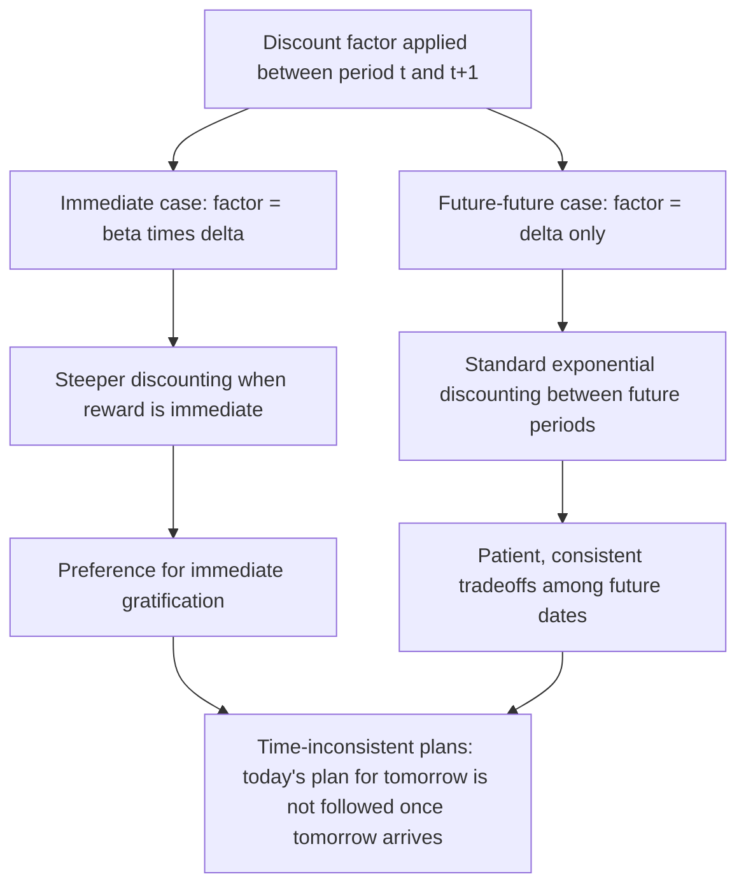

## Behavioral Consumption Models and Present Bias

### Overview

Behavioral consumption models relax the rational, exponentially discounting, fully self-controlled agent of standard intertemporal choice theory (PIH/LCH) to incorporate psychologically realistic features: **present bias** (a disproportionate preference for immediate gratification relative to delayed rewards), **self-control problems**, **mental accounting**, and **bounded rationality**. These models were developed to explain systematic empirical anomalies—undersaving for retirement, credit card borrowing coexisting with low-yield saving, and time-inconsistent planning—that rational exponential-discounting models struggle to rationalize without implausible parameter values.

### Time-Inconsistent Preferences: The Core Departure

#### Exponential Discounting (The Rational Benchmark)

Standard intertemporal utility uses **exponential discounting**:

$$U_t = u(C_t) + \delta u(C_{t+1}) + \delta^2 u(C_{t+2}) + \dots = \sum_{s=0}^{\infty} \delta^s u(C_{t+s})$$

Where $\delta \in (0,1)$ is a constant per-period discount factor. A defining property of exponential discounting is **time consistency**: the relative valuation of any two future periods, $s$ and $s+1$, depends only on the gap between them, not on when the evaluation is made. A plan made today for consumption at future dates will still be optimal when those dates arrive—no incentive to deviate exists.

#### Quasi-Hyperbolic (Beta-Delta) Discounting

The dominant tractable model of present bias, introduced by Phelps and Pollak (1968) and popularized in economics by Laibson (1997), is **quasi-hyperbolic** or **($\beta$, $\delta$) discounting**:

$$U_t = u(C_t) + \beta\left[\delta u(C_{t+1}) + \delta^2 u(C_{t+2}) + \dots\right] = u(C_t) + \beta\sum_{s=1}^{\infty}\delta^s u(C_{t+s})$$

Where $\beta \in (0,1)$ is the **present-bias parameter**. The key feature: all future periods (relative to each other) are discounted exponentially at rate $\delta$, but the **present period is discounted less** relative to *all* future periods by the extra factor $\beta < 1$ applied uniformly to everything beyond today.

**Key Points**

- When $\beta = 1$, the model collapses to standard exponential discounting (time-consistent).
- When $\beta < 1$, the discount factor between "today" and "tomorrow" ($\beta\delta$) is steeper than the discount factor between any two future periods ($\delta$)—generating a specific, testable form of time inconsistency.
- This structure captures the common experiential observation that people prefer $100 today over $110 tomorrow, but prefer $110 in 31 days over $100 in 30 days—the ordering flips depending on whether the earlier option is immediate.

#### Formal Illustration of Preference Reversal

Consider a reward of $X$ available at time $t+k$ versus $X + \epsilon$ available at $t+k+1$. Under quasi-hyperbolic discounting, evaluated from time $t$:

- If $k = 0$ (today vs. tomorrow): comparison is $u(X)$ vs. $\beta\delta \cdot u(X+\epsilon)$
- If $k > 0$ (both in the future): comparison is $\beta\delta^k u(X)$ vs. $\beta\delta^{k+1} u(X+\epsilon)$, which simplifies (dividing both sides by $\beta\delta^k$) to $u(X)$ vs. $\delta \cdot u(X+\epsilon)$

Because $\beta < 1$ appears only in the immediate-reward comparison, the household is relatively more willing to wait when both options are in the future than when one option is available right now. This is the mathematical source of preference reversals.

### Sophistication vs. Naivety

A crucial modeling distinction concerns whether agents are aware of their own future present bias.

#### Sophisticated Agents

A **sophisticated** hyperbolic discounter correctly anticipates that their future selves will also have $\beta < 1$ and will deviate from today's optimal plan. Sophisticated agents respond strategically:

- They may adopt **commitment devices** (illiquid savings accounts, automatic payroll deductions, Christmas club accounts) to bind their future selves.
- They correctly solve a game-theoretic problem against their own future selves, often modeled as an intrapersonal game among a sequence of "selves," each representing the agent at a different point in time.
- The equilibrium concept typically used is a form of subgame-perfect equilibrium among these temporal selves.

#### Naive Agents

A **naive** hyperbolic discounter incorrectly believes their future selves will behave with $\beta = 1$ (i.e., they believe today's plan will be followed exactly), even though their true $\beta < 1$ will cause deviation when the future arrives. Naive agents:

- Systematically underestimate their own future impatience.
- Repeatedly plan to save/diet/study "starting next period" but never follow through, because each period's self makes the same immediate-gratification error while still believing future selves will be different.
- Are the theoretical basis for the "procrastination" literature (O'Donoghue and Rabin, 1999), showing naive agents can delay one-time beneficial actions (e.g., signing up for a retirement plan) indefinitely, even beyond what a sophisticated agent with the same $\beta$ would delay.

#### Partial Naivety

Many applied models use an intermediate parameter $\hat{\beta} \in (\beta, 1]$ representing the agent's *belief* about their own future $\beta$, allowing for a continuum between full sophistication ($\hat{\beta} = \beta$) and full naivety ($\hat{\beta} = 1$).

**Key Points**

- The sophistication/naivety distinction has first-order welfare and policy implications: naive agents may benefit from paternalistic defaults (e.g., automatic enrollment in retirement savings), while sophisticated agents' demand for commitment devices reveals their own awareness of the problem.
- Empirical evidence on the prevalence of each type is mixed and elicitation-method dependent; most calibrated models assume partial sophistication as more empirically plausible than either polar case. [Inference — this reflects a common modeling convention in the literature rather than a single definitive empirical consensus on the true population split.]

### Self-Control and the Dual-Self / Temptation Framework

#### Gul and Pesendorfer's Temptation Utility

An alternative to quasi-hyperbolic discounting models self-control directly as costly resistance to temptation, rather than through discount-rate manipulation. In the Gul-Pesendorfer (2001) framework, utility over a *menu* of choices depends not just on the chosen option but on the temptation posed by the full choice set:

$$U(x, \text{menu}) = u(x) - \left[\max_{y \in \text{menu}} v(y) - v(x)\right]$$

Where $v(\cdot)$ represents "temptation utility" and the bracketed term is the **self-control cost**—the utility loss from not choosing the most tempting available option $y$. This generates a demand for **fewer options** (removing temptation from the choice set) that quasi-hyperbolic models do not naturally produce, since restricting a rational agent's choice set can never increase utility in standard models but can in temptation models.

#### Dual-Self / Planner-Doer Models

A related class of models (Thaler and Shefrin's 1981 "planner-doer" model; Fudenberg and Levine's 2006 dual-self model) represents the individual as an internal conflict between a **far-sighted planner** (long-run interests) and a **myopic doer** (short-run impulses), with self-control effort or institutional commitment mediating between them.

**Key Points**

- These frameworks generate testable implications distinct from quasi-hyperbolic discounting, notably a positive value for commitment even absent any change in the discounted-utility-maximizing consumption path—i.e., people may pay to have fewer options.
- Empirical evidence for demand for commitment devices (e.g., in savings products, gym memberships with restrictive contracts) is generally taken as support for self-control-based models, though quasi-hyperbolic models with sophistication also predict positive willingness to pay for commitment.

### Mental Accounting

Introduced by Richard Thaler (1980, 1985, 1999), **mental accounting** describes the tendency of households to categorize and treat money differently depending on its source or intended use, violating the fungibility assumption central to standard consumption theory.

#### Key Features

1. **Non-fungibility across accounts**: Households treat a tax refund, a bonus, regular salary, and windfall gains differently, even though a rational PIH consumer should treat all as additions to a single pool of lifetime wealth.
2. **Budgeting by category**: Households often set (and are reluctant to violate) category-specific budgets (e.g., "food," "entertainment"), leading to consumption patterns sensitive to how income is framed or labeled, not just its total amount.
3. **Asset segregation**: Households simultaneously hold high-interest debt (credit cards) and low-interest liquid savings, a pattern difficult to reconcile with a single rational lifetime budget but explainable if "savings" and "spending money" are mentally partitioned into separate accounts with different self-control rules governing access.

**Example**

A household receives a $2,000 tax refund and a $2,000 unexpected salary increase spread over the year. Standard PIH treats these identically (same present value addition to lifetime wealth), predicting similar smoothing of the marginal propensity to consume. Mental accounting predicts the lump-sum refund, often mentally coded as "found money" or allocated to a "windfall" account, may be spent differently (e.g., a larger discretionary purchase) than the same total amount received as smoothly spread salary increases, which get mentally coded as regular income and integrated into ongoing budgeting. [Unverified — while this qualitative prediction is a standard finding in the mental accounting literature, the size of the difference is sensitive to survey design and framing in specific studies.]

### The Credit Card Debt Puzzle

A canonical empirical anomaly motivating behavioral consumption models: many households simultaneously hold significant revolving credit card debt at high interest rates (often 15–25% APR) while also holding low-yield liquid savings or checking account balances earning near-zero interest.

#### Why This Is Puzzling for Standard Models

A rational, unconstrained, single-account optimizer should always pay down high-interest debt using low-yield liquid assets before the debt accrues further interest—this is a dominated strategy under the standard framework, with no offsetting benefit.

#### Behavioral Explanations

1. **Mental accounting**: Savings are mentally earmarked for a specific future purpose (e.g., "emergency fund," "down payment") and treated as inaccessible for current debt paydown, even though this is financially suboptimal.
2. **Self-control / commitment value**: Maintaining a separate illiquid-feeling savings balance serves as a self-imposed commitment device against overspending, and households may rationally (from a sophisticated hyperbolic perspective) accept the interest cost as the "price" of maintaining this discipline.
3. **Precautionary liquidity concerns interacting with credit access**: Some households retain a savings buffer against income shocks specifically because using it for debt paydown, followed by a shock, would require re-borrowing—potentially at a higher rate or without guaranteed access—suggesting some (though likely not all) of the puzzle may reflect rational precautionary motives interacting with credit market frictions rather than purely behavioral factors. [Inference — the relative contribution of purely rational versus behavioral explanations to this puzzle remains a debated and only partially resolved empirical question.]

### Empirical Evidence for Present Bias

#### Laboratory and Field Experiments

- Studies using intertemporal choice experiments (choosing between smaller-sooner and larger-later monetary rewards) have documented preference reversals consistent with hyperbolic/quasi-hyperbolic discounting patterns across a range of subject populations. [Unverified — estimated magnitudes of $\beta$ vary substantially across studies, elicitation methods (real vs. hypothetical rewards), and subject pools, and some methodological critiques argue certain lab designs may overstate present bias due to transaction cost or trust confounds.]
- Retirement savings behavior: enrollment and contribution rates in employer-sponsored retirement plans respond strongly to **default options** (e.g., automatic enrollment with an opt-out, versus opt-in), a pattern difficult to explain with standard rational models (which predict indifference to default framing under negligible switching costs) but consistent with present-bias-driven procrastination in the naive-agent framework.
- Thaler and Benartzi's "Save More Tomorrow" (SMarT) program, which allows workers to pre-commit to future automatic increases in savings contributions timed to coincide with future salary raises, achieved substantially higher realized savings rates among enrollees relative to standard opt-in savings education programs in the original studied firm. [Unverified — the specific magnitude of savings-rate increases reported in the original study is well known in the literature, but replication magnitudes vary across subsequent implementations in different firms and contexts.]

#### Field Evidence on Commitment Device Demand

- Studies offering voluntary commitment savings products (e.g., accounts that restrict withdrawal until a self-chosen goal or date) in field settings have found meaningful takeup among participants, interpreted as revealed demand for self-control assistance consistent with sophisticated present-biased behavior.

### Policy Implications: Behavioral (Libertarian) Paternalism

The recognition of present bias and self-control problems underpins the **libertarian paternalism** / **nudge** approach to policy (Thaler and Sunstein, 2008), which seeks to improve outcomes for present-biased agents without restricting choice for fully rational agents.

#### Key Policy Tools

1. **Default options**: Automatic enrollment in retirement savings plans with an opt-out, exploiting status-quo bias and procrastination to raise savings rates for naive/inattentive agents while preserving the ability of motivated agents to opt out.
2. **Commitment device provision**: Government or employer-facilitated commitment savings products, illiquid retirement accounts with early-withdrawal penalties (functioning partly as a commitment mechanism against present bias, independent of their tax-advantage rationale).
3. **Simplification and framing**: Reducing complexity in enrollment and choice architecture (e.g., simplified plan menus) to reduce the "procrastination cost" of a beneficial but effortful decision.
4. **Mandatory cooling-off periods / disclosure timing**: Requiring delays before high-stakes financial commitments to reduce decisions driven by immediate-gratification impulses.

**Key Points**

- These policies are termed "libertarian" because choice is preserved (opt-out remains available), and "paternalistic" because the default is deliberately chosen to benefit agents who would otherwise be harmed by inertia or present bias.
- A key normative complication: welfare evaluation for a present-biased agent is ambiguous, since it is unclear which set of preferences (the impatient "doer" preferences or the patient "long-run" preferences) should be used as the welfare criterion—a foundational and unresolved issue in behavioral welfare economics. [Inference — this welfare ambiguity is widely acknowledged as a genuinely open conceptual problem in the behavioral economics literature, not merely a technical detail.]

### Comparison Table: Standard vs. Behavioral Consumption Models

| Feature | Standard (Exponential/PIH) | Quasi-Hyperbolic ($\beta$-$\delta$) | Temptation/Dual-Self |
| --- | --- | --- | --- |
| Time consistency | Consistent | Inconsistent (unless $\beta=1$) | Inconsistent / conflict-based |
| Source of departure | None (rational benchmark) | Discount function shape | Utility over choice sets/menus |
| Demand for commitment | None (weakly negative or zero) | Positive if sophisticated | Positive by construction |
| Money fungibility | Fully fungible | Fungible within model, but often paired with mental accounts empirically | Not assumed fungible |
| Predicts credit card debt puzzle | No (anomalous) | Partially, with mental accounting extension | Yes, via self-control cost |
| Policy stance | Minimal intervention (Ricardian-style neutrality) | Justifies libertarian paternalism | Justifies commitment-enabling policy |

### Illustrative Diagram: The Beta-Delta Discount Profile

<svg xmlns="http://www.w3.org/2000/svg" viewBox="0 0 750 420">
<text x="375" y="30" font-size="18" font-weight="bold" text-anchor="middle" fill="#1a1a2e">Quasi-Hyperbolic vs. Exponential Discount Weights (svg_diagram)</text>
<line x1="80" y1="360" x2="700" y2="360" stroke="#333" stroke-width="2" />
<line x1="80" y1="360" x2="80" y2="60" stroke="#333" stroke-width="2" />
<text x="390" y="395" font-size="13" text-anchor="middle" fill="#333">Time period (t = 0 is present)</text>
<text x="35" y="210" font-size="13" text-anchor="middle" fill="#333" transform="rotate(-90 35 210)">Discount weight</text>

<circle cx="120" cy="90" r="4" fill="#2f6f8f" />
<circle cx="200" cy="140" r="4" fill="#2f6f8f" />
<circle cx="280" cy="185" r="4" fill="#2f6f8f" />
<circle cx="360" cy="222" r="4" fill="#2f6f8f" />
<circle cx="440" cy="253" r="4" fill="#2f6f8f" />
<circle cx="520" cy="279" r="4" fill="#2f6f8f" />
<circle cx="600" cy="300" r="4" fill="#2f6f8f" />
<polyline points="120,90 200,140 280,185 360,222 440,253 520,279 600,300" fill="none" stroke="#2f6f8f" stroke-width="2" />
<text x="610" y="300" font-size="12" fill="#2f6f8f">Exponential (δ^t)</text>

<circle cx="120" cy="90" r="4" fill="#a03f5f" />
<circle cx="200" cy="200" r="4" fill="#a03f5f" />
<circle cx="280" cy="235" r="4" fill="#a03f5f" />
<circle cx="360" cy="264" r="4" fill="#a03f5f" />
<circle cx="440" cy="288" r="4" fill="#a03f5f" />
<circle cx="520" cy="308" r="4" fill="#a03f5f" />
<circle cx="600" cy="324" r="4" fill="#a03f5f" />
<polyline points="120,90 200,200 280,235 360,264 440,288 520,308 600,324" fill="none" stroke="#a03f5f" stroke-width="2" stroke-dasharray="6,3" />
<text x="610" y="324" font-size="12" fill="#a03f5f">Quasi-hyperbolic (β·δ^t)</text>

<text x="120" y="75" font-size="11" text-anchor="middle" fill="#333">t=0</text>

<text x="200" y="215" font-size="10" text-anchor="middle" fill="`#a03f5f`">Sharp drop: β applied</text>

<text x="200" y="228" font-size="10" text-anchor="middle" fill="`#a03f5f`">once at t=1 onward</text>

</svg>

### Related Empirical Puzzles Explained by Behavioral Models

| Puzzle | Standard PIH Prediction | Behavioral Explanation |
| --- | --- | --- |
| Undersaving for retirement | Households optimally choose lifetime saving | Present bias + procrastination cause under-contribution |
| Credit card debt + low-yield savings | Should not coexist (dominated) | Mental accounting + commitment value of illiquid savings |
| High sensitivity to default enrollment options | Should be irrelevant with low switching costs | Status-quo bias, naive procrastination |
| High "small" windfall spending, low "large" windfall spending | Should be identical proportional response | Mental accounting: perceived account category differs by size/source |

**Related Topics**

- Permanent Income and Life-Cycle Hypotheses (rational benchmark contrast)
- Liquidity constraints and precautionary saving (interaction with self-control demand for illiquidity)
- Nudge theory and libertarian paternalism in public policy
- Retirement savings design: automatic enrollment and Save More Tomorrow (SMarT)
- Kimball's prudence and higher-order risk preferences (contrast with temptation-based models)
- Behavioral welfare economics and the multi-self welfare aggregation problem
- Status-quo bias and default effects in choice architecture
- Commitment devices in development economics (savings products in low-income settings)
- Time-inconsistency in macroeconomic policy (Kydland-Prescott, distinct but related concept)
- Loss aversion and prospect theory in consumption/savings decisions