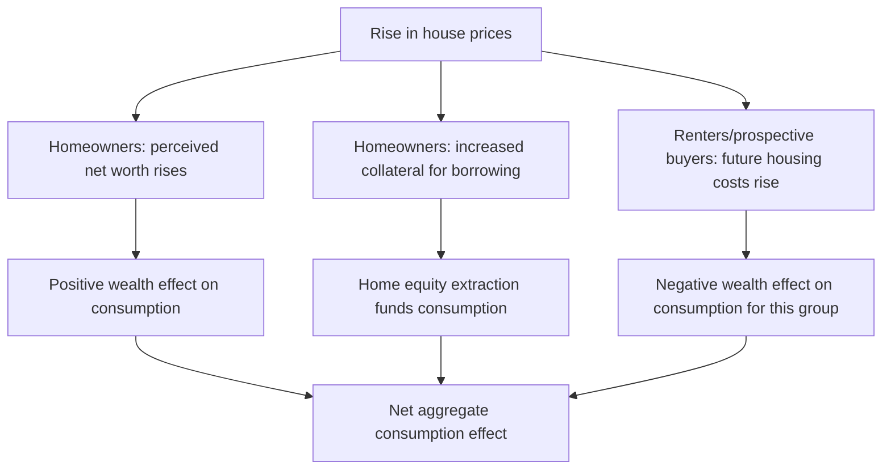
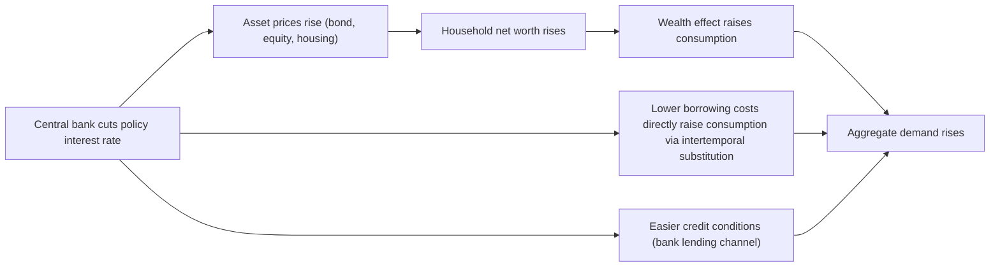

## Wealth Effects on Consumption

### Overview

Wealth effects on consumption refer to the change in household consumption spending resulting from a change in the value of household wealth—financial assets (stocks, bonds), housing wealth, and other net worth components—independent of any concurrent change in current income. Wealth effects are a direct extension of the Life-Cycle Hypothesis (LCH), which posits that consumption is a function of total lifetime resources, including accumulated and expected wealth, not merely current income. Understanding the magnitude and channels of wealth effects is central to interpreting the transmission of monetary policy, asset price fluctuations, and housing market cycles into aggregate demand.

### Theoretical Foundation: The Life-Cycle Budget Constraint

#### The Basic LCH Consumption Function

Under the Life-Cycle Hypothesis (Modigliani and Brumberg, 1954; Ando and Modigliani, 1963), a household's consumption in any period is a function of current wealth and the present value of expected future labor income:

$$C_t = \alpha W_t + \beta Y_t^L$$

Where:

- $W_t$ = current real net wealth (financial + housing + other assets, net of debt)
- $Y_t^L$ = expected present value of future labor income (human capital)
- $\alpha$ = the marginal propensity to consume (MPC) out of wealth
- $\beta$ = the marginal propensity to consume out of labor income

**Key Points**

- The MPC out of wealth, $\alpha$, is typically calibrated or estimated to be substantially smaller than the MPC out of a comparable increase in permanent labor income, because a stock of wealth is spread (annuitized) over a household's remaining lifetime, while permanent income increases are already "flow" equivalents.
- Under a simple annuitization logic, a permanent increase in wealth $\Delta W$ should raise annual consumption by roughly $\Delta W$ divided by remaining expected lifetime (or by $\Delta W \times r$ in a stylized infinite-horizon perpetuity approximation), rather than being spent in a single lump sum.

#### Derivation via Intertemporal Budget Constraint

For a household with $T$ remaining periods, real interest rate $r$, and existing wealth $W_t$, the lifetime budget constraint is:

$$\sum_{s=0}^{T} \frac{C_{t+s}}{(1+r)^s} = W_t + \sum_{s=0}^{T} \frac{Y_{t+s}^L}{(1+r)^s}$$

Assuming a smooth, constant consumption path (the core LCH/PIH prediction) and solving for $C_t$:

$$C_t = \frac{r(1+r)^T}{(1+r)^{T+1}-1}\left[W_t + \sum_{s=0}^{T}\frac{Y_{t+s}^L}{(1+r)^s}\right]$$

This confirms that a one-unit increase in $W_t$ raises $C_t$ by the annuity factor $\frac{r(1+r)^T}{(1+r)^{T+1}-1}$, which approaches $r$ as $T \to \infty$—i.e., in the simplest infinite-horizon approximation, the annual consumption response to a wealth change approximates the real interest rate times the wealth change.

**Example**

Using an illustrative approximation of $r \approx 0.03$ (3%) and treating the horizon as effectively long, a permanent $100,000 increase in household net worth would be predicted to raise annual consumption by roughly $3,000 under a simple perpetuity annuitization. [Inference — this is a simplified textbook approximation; actual empirically estimated wealth effect coefficients (see below) differ from this pure annuity calculation because of finite horizons, bequest motives, liquidity constraints, and the "permanence" assumption not always holding for observed wealth changes.]

### Channels of Wealth Effects

#### 1. Financial Wealth (Equity/Stock Market) Effects

Changes in the value of household-held equities, mutual funds, and other financial assets. The transmission channel:

$$\Delta(\text{Stock prices}) \rightarrow \Delta(\text{Financial wealth}) \rightarrow \Delta(\text{Perceived lifetime resources}) \rightarrow \Delta(\text{Consumption})$$

#### 2. Housing Wealth Effects

Changes in home values affect homeowner consumption through several distinct sub-channels, which is why housing wealth effects are often found empirically to differ in magnitude from financial wealth effects:

- **Pure wealth channel**: Higher home value increases perceived net worth, directly analogous to financial wealth.
- **Collateral/borrowing channel**: Higher home equity relaxes borrowing constraints, enabling home equity extraction (via home equity lines of credit, cash-out refinancing) that can fund current consumption even for otherwise liquidity-constrained households.
- **Substitution/user-cost channel**: For renters (or prospective first-time buyers), rising house prices represent a higher future cost of housing services, which can *reduce* their effective wealth and consumption—working in the opposite direction from the homeowner wealth effect.
- **Realization considerations**: Unlike financial assets, housing wealth is illiquid and typically realized only via sale, downsizing, or borrowing against it, which can dampen or delay the consumption response relative to an equivalent financial wealth gain.

#### 3. Human Capital / Labor Income Wealth

Although often modeled separately as $Y^L$ rather than $W$, the present value of expected future labor income is conceptually a component of total wealth. Changes in expected future earnings (e.g., due to changes in perceived job security, expected wage growth, or productivity trends) operate through the same annuitization logic as financial and housing wealth.

#### 4. Pension and Retirement Account Wealth

Defined-contribution pension wealth (401(k)-type accounts) fluctuates with financial markets similarly to directly held equities, but its illiquidity (early-withdrawal penalties, retirement-specific earmarking via mental accounting) may generate a smaller or more delayed consumption response than equivalent liquid financial wealth. [Inference — this differential response by asset liquidity/mental account type is a standard theoretical prediction combining LCH with the mental-accounting literature, and is broadly supported by several empirical studies, though the precise magnitude gap between liquid and illiquid wealth effect estimates varies by study and time period.]

### Marginal Propensity to Consume Out of Wealth (MPCW): Empirical Estimates

The MPCW is typically expressed as the change in annual consumption (in cents) per dollar increase in wealth.

| Wealth Type | Commonly Cited MPCW Range | Notes |
| --- | --- | --- |
| Financial/stock wealth | Roughly 2–7 cents per dollar | Wide variation by study, country, time period, and stock ownership concentration |
| Housing wealth | Roughly 3–10 cents per dollar (often higher than financial wealth in many studies) | Larger estimates often linked to borrowing/collateral channel, especially where home equity extraction is common |
| Aggregate/total wealth | Roughly 3–6 cents per dollar in many macro-level studies | Sensitive to model specification, time period, and country studied |

[Unverified — these ranges reflect commonly cited orders of magnitude across a large and heterogeneous empirical literature; specific point estimates vary substantially by country (e.g., U.S. vs. UK vs. euro area), time period (pre- vs. post-2008 financial crisis), housing/mortgage market institutional structure, and econometric methodology (time series vs. panel/microdata). No single MPCW figure should be treated as a precise universal constant.]

**Key Points**

- The finding that housing wealth effects are often estimated to be as large as or larger than financial wealth effects, despite housing being illiquid, is frequently attributed to the collateral/borrowing channel being empirically important, particularly in countries/periods with well-developed home equity extraction markets (e.g., the U.S. prior to 2008).
- Distributional considerations matter: financial wealth is typically concentrated among higher-income, higher-wealth households (who may have lower MPC due to already being unconstrained/consumption-satiated relative to lifetime wealth), while housing wealth is more broadly distributed across the middle of the wealth distribution, which can affect the aggregate MPCW estimated.

### Distinguishing Wealth Effects from Confounding Factors

A central empirical and methodological challenge is separating genuine causal wealth effects from several confounds:

#### 1. Reverse Causality / Common Shocks

Asset prices and consumption may both respond to a common underlying shock (e.g., improved expectations about future productivity or income growth) without wealth changes *causing* consumption changes directly—the correlation could instead reflect shared information about future income.

#### 2. Anticipated vs. Unanticipated Wealth Changes

Under rational expectations LCH/PIH logic, only **unanticipated** (surprise) wealth changes should generate a consumption response; anticipated wealth changes (e.g., an expected future inheritance) should already be incorporated into current consumption via the permanent-income channel.

#### 3. Permanent vs. Transitory Wealth Changes

Consistent with the permanent-income logic underlying LCH, a wealth change perceived as **permanent** should generate a much larger consumption response (via the annuity/lifetime-averaging logic) than a wealth change perceived as **transitory** (e.g., a short-lived stock market rally expected to reverse).

**Example**

A stock market rally interpreted by households as reflecting a permanent upward revision to expected corporate earnings and future dividend growth should generate a larger MPCW than an equal-sized rally interpreted as short-term speculative volatility likely to reverse. Empirically distinguishing these cases requires assumptions about household expectations formation, which is a persistent identification challenge in this literature. [Inference — the qualitative prediction (permanent changes matter more than transitory ones) follows directly from LCH/PIH logic and is widely accepted; empirically classifying real-world wealth changes as "permanent" versus "transitory" from the household's perspective in real time is inherently difficult and a genuine source of estimation uncertainty in this literature.]

#### 4. Credit Channel vs. Pure Wealth Channel (Housing Specifically)

As discussed above, disentangling the pure wealth effect from the collateral/borrowing effect in housing wealth studies requires identifying variation in house prices that is unrelated to changes in the ease of borrowing against that housing wealth (e.g., comparing regions or time periods with differing mortgage market liberalization).

### Methodological Approaches in the Empirical Literature

| Approach | Description | Key Consideration |
| --- | --- | --- |
| Aggregate time-series regression | Regress aggregate consumption growth on aggregate wealth changes (financial, housing) | Subject to endogeneity/reverse causality concerns; requires careful treatment of common shocks |
| Household panel microdata | Track individual/household consumption alongside changes in their specific asset holdings | Allows control for household-level income shocks; better identification of heterogeneous MPCW by wealth type/household characteristics |
| Natural experiments / quasi-experimental variation | Exploit regional or policy-driven variation in house price or stock price shocks (e.g., regional housing booms unrelated to local income growth) | Stronger causal identification but may have limited external validity beyond the specific setting studied |
| Structural life-cycle model calibration | Calibrate a full LCH/buffer-stock model and simulate wealth effect responses | Internally consistent with theory but sensitive to model assumptions (utility function, borrowing constraints, bequest motives) |

### Wealth Effects and Monetary Policy Transmission

Wealth effects constitute one of the principal channels through which monetary policy is believed to affect aggregate demand, alongside the traditional interest rate (intertemporal substitution) channel and the credit/bank lending channel.

**Key Points**

- The relative importance of the wealth-effect channel versus the direct interest-rate/substitution channel and the credit channel in overall monetary transmission is a subject of ongoing empirical and theoretical debate, and the answer likely varies by country given differing household balance sheet compositions (e.g., homeownership rates, prevalence of variable-rate versus fixed-rate mortgages, depth of equity markets, and the ease of home equity extraction). [Inference — this cross-country variation in the relative strength of transmission channels is a widely discussed theme in the monetary economics literature, though quantifying the precise relative weights remains empirically contested.]
- The housing collateral channel is generally considered a particularly important amplifier of monetary policy in economies where mortgage markets facilitate easy home equity extraction, since a rate cut then raises consumption both through higher house prices (pure wealth effect) and through the associated easing of borrowing constraints (collateral effect).

### Wealth Effects and Business Cycle/Financial Crisis Dynamics

The 2007–2009 U.S. financial crisis and subsequent housing bust are frequently cited as an important illustration of large negative wealth effects—the sharp decline in house prices was found in subsequent research to be strongly associated with reduced household consumption, particularly concentrated among more highly leveraged and previously credit-constrained households, consistent with the interaction of wealth effects and the collateral/borrowing channel discussed above. [Unverified — while the general direction and qualitative importance of this finding is well established in the post-crisis household finance literature (e.g., research associated with Mian and Sufi), specific quantitative decompositions of how much of the consumption decline is attributable to pure wealth effects versus deleveraging, tightened credit standards, or heightened precautionary saving in response to increased income/employment uncertainty vary across studies and remain subject to ongoing refinement.]

### Distributional Considerations

Wealth effects are not uniform across the population, which has significant implications for both empirical measurement and policy design:

1. **Wealth concentration**: Financial wealth (especially direct equity holding) is heavily concentrated among higher-income, higher-net-worth households, who—per standard LCH/precautionary-saving logic—likely have a lower marginal propensity to consume out of additional wealth than lower-wealth households closer to any binding liquidity constraint.
2. **Homeownership distribution**: Housing wealth effects are naturally concentrated among homeowners and absent (or negative, via the substitution channel) for renters, meaning the aggregate consumption response to a housing boom depends heavily on the homeownership rate and the distribution of home equity across the wealth spectrum.
3. **Heterogeneous MPCW by liquidity position**: Households near a binding liquidity constraint (see: liquidity-constrained/hand-to-mouth consumers) may show a disproportionately large consumption response to a wealth change that relaxes their constraint (e.g., via home equity extraction), even if their overall MPCW out of illiquid, non-collateralizable wealth would otherwise be small.

### Comparison: Wealth Effects vs. Related Consumption-Theory Concepts

| Concept | Relationship to Wealth Effects |
| --- | --- |
| Permanent Income Hypothesis | Wealth effects are the LCH/PIH-consistent response to a change in one component (asset wealth) of total lifetime resources |
| Liquidity constraints | Modulate wealth effect magnitude via the collateral/borrowing channel, especially for housing wealth |
| Precautionary saving | A wealth increase that reduces perceived future income risk (e.g., improved job security) can reduce precautionary saving, amplifying the measured consumption response beyond the pure annuitization effect |
| Ricardian equivalence | Concerns government debt-financed wealth (bonds); a genuinely analogous logic asks whether households treat government bond wealth as net wealth, a related but distinct question from private asset wealth effects |
| Present bias/behavioral models | May generate excess sensitivity to salient, easily "mentally accounted" wealth changes (e.g., a stock portfolio statement) relative to less salient forms of wealth |

**Related Topics**

- Life-Cycle Hypothesis and lifetime budget constraints
- Housing economics: house price determination and mortgage market structure
- Home equity extraction and the collateral channel of monetary policy
- Liquidity constraints and precautionary saving (interaction with wealth effect magnitude)
- Monetary policy transmission mechanisms (interest rate, credit, and wealth channels)
- Household balance sheets and the 2007–2009 financial crisis literature (deleveraging, Mian-Sufi household finance research)
- Marginal propensity to consume heterogeneity and fiscal/monetary multiplier analysis
- Behavioral consumption models and mental accounting (differential treatment of liquid vs. illiquid wealth)
- Q-theory of investment (asset price effects on firm investment, a parallel wealth-effect-like channel)
- Cross-country comparisons of household balance sheet composition and monetary transmission