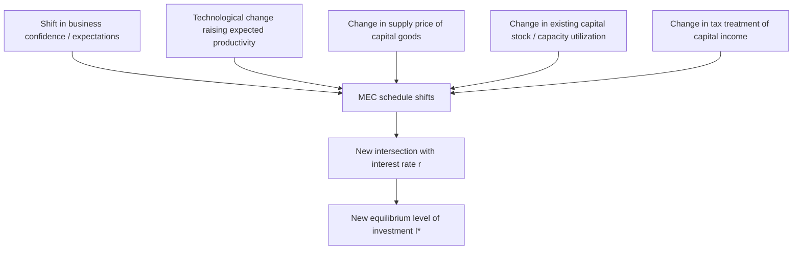

## Marginal Efficiency of Capital and Investment Decisions

### Overview

The marginal efficiency of capital (MEC) is a foundational concept in investment theory, introduced by John Maynard Keynes in *The General Theory of Employment, Interest and Money* (1936), that describes the expected rate of return on an additional unit of capital investment. It provides the theoretical link between the profitability of prospective investment projects and the interest rate, determining the profit-maximizing (or optimal) level of investment for a firm and, in aggregate, for the economy. The MEC framework remains a core building block for understanding investment demand curves and their role in the determination of aggregate output and employment.

### Definition and Formal Derivation

#### Keynes's Definition

The marginal efficiency of capital is defined as the discount rate, $\rho$, that equates the present value of the expected stream of returns (quasi-rents) from an additional unit of capital to its current supply price (replacement cost).

Formally, for a capital asset with expected annual net returns $R_1, R_2, \dots, R_n$ over its useful life of $n$ years, and supply price (cost) $C$:

$$C = \frac{R_1}{(1+\rho)} + \frac{R_2}{(1+\rho)^2} + \dots + \frac{R_n}{(1+\rho)^n} = \sum_{t=1}^{n} \frac{R_t}{(1+\rho)^t}$$

Where $\rho$ (rho) is the marginal efficiency of capital—the internal rate of return on the marginal unit of investment.

**Key Points**

- The MEC is analogous to the concept of the **internal rate of return (IRR)** used in modern corporate finance and capital budgeting.
- It depends jointly on (a) the expected future returns (prospective yield) of the capital good and (b) its current supply price (cost of production/replacement).
- Keynes emphasized that the MEC schedule is fundamentally driven by **expectations** about future returns, making it inherently volatile and subject to shifts in business confidence—a theme central to his broader theory of investment instability.

#### The MEC Schedule (Investment Demand Curve)

For the economy as a whole, different investment projects have different expected rates of return. Ranking all potential investment projects from highest to lowest expected $\rho$ produces a downward-sloping **MEC schedule**, analogous to a firm's or economy's investment demand curve:

$$I = I(\rho)$$

As more capital is added to the economy (moving rightward along the schedule), the expected marginal return on additional units of capital falls, due to diminishing marginal productivity of capital and rising supply prices for capital goods as investment demand increases.

### The Investment Decision Rule

#### Comparing MEC to the Market Interest Rate

The central decision rule of the MEC framework: a firm (or the economy) should undertake an investment project if and only if its expected marginal efficiency of capital $\rho$ exceeds (or equals) the market interest rate (cost of borrowing/opportunity cost of funds) $r$:

$$\rho \geq r \implies \text{Undertake the investment}$$

$$\rho < r \implies \text{Do not undertake the investment}$$

The profit-maximizing level of aggregate investment occurs where the MEC schedule intersects the prevailing interest rate:

$$\rho(I^*) = r$$

**Key Points**

- This yields the standard **inverse relationship between investment and the interest rate**: a lower interest rate makes a larger set of projects (those with lower, but still positive, expected returns) profitable, raising the equilibrium level of investment.
- The MEC concept thus provides the microfoundation for the downward-sloping investment schedule used in the IS curve of the IS-LM (Hicks-Hansen) model.

#### Diagrammatic Representation

<svg xmlns="http://www.w3.org/2000/svg" viewBox="0 0 750 420">
<text x="375" y="30" font-size="18" font-weight="bold" text-anchor="middle" fill="#1a1a2e">The MEC Schedule and Optimal Investment (svg_diagram)</text>
<line x1="90" y1="360" x2="680" y2="360" stroke="#333" stroke-width="2" />
<line x1="90" y1="360" x2="90" y2="60" stroke="#333" stroke-width="2" />
<text x="385" y="395" font-size="13" text-anchor="middle" fill="#333">Cumulative Investment, I</text>
<text x="40" y="210" font-size="13" text-anchor="middle" fill="#333" transform="rotate(-90 40 210)">Rate of return / interest rate</text>

<path d="M 120,90 Q 300,140 400,220 T 640,330" fill="none" stroke="#2f6f8f" stroke-width="3" />
<text x="500" y="200" font-size="13" fill="#2f6f8f">MEC schedule ρ(I)</text>

<line x1="90" y1="255" x2="680" y2="255" stroke="#a03f5f" stroke-width="2" stroke-dasharray="6,4" />
<text x="600" y="248" font-size="13" fill="#a03f5f">Market interest rate r</text>

<circle cx="405" cy="255" r="5" fill="#1a1a2e" />
<line x1="405" y1="255" x2="405" y2="360" stroke="#333" stroke-width="1.5" stroke-dasharray="3,3" />
<text x="405" y="378" font-size="12" text-anchor="middle" fill="#333">I*</text>
<text x="415" y="245" font-size="12" fill="#1a1a2e">ρ(I*) = r</text>

<text x="120" y="80" font-size="11" text-anchor="middle" fill="#333">Highest-return</text>

<text x="120" y="93" font-size="11" text-anchor="middle" fill="#333">projects first</text>

</svg>

### MEC vs. Marginal Efficiency of Investment (MEI)

A refinement introduced in subsequent literature distinguishes the MEC from the **Marginal Efficiency of Investment (MEI)**:

| Concept | Definition | Key Distinction |
| --- | --- | --- |
| Marginal Efficiency of Capital (MEC) | Return on the existing/planned total capital stock, holding the flow of new investment fixed | A stock concept; relates to the desired level of the capital stock |
| Marginal Efficiency of Investment (MEI) | Return on the flow of new investment given rising supply prices as investment increases within a period | A flow concept; explicitly incorporates the idea that supply prices of capital goods rise with the pace (not just level) of investment, due to short-run capacity constraints in the capital goods industry |

**Key Points**

- The MEI schedule is generally considered a more accurate representation of short-run investment behavior, since it accounts for rising costs of capital goods production as the *rate* of investment increases within a given period (e.g., construction industry capacity constraints), not merely the diminishing returns to the *level* of the capital stock.
- This distinction (attributed to later Keynesian and post-Keynesian elaborations of the original MEC concept) helps explain why investment adjusts gradually over time toward a desired capital stock rather than instantaneously, a feature the pure MEC concept alone does not fully capture. [Inference — this is the standard textbook rationale for introducing the MEI distinction, though the precise attribution and terminology vary somewhat across textbooks and secondary sources.]

### Determinants of the MEC Schedule (Shift Factors)

Unlike the interest rate, which determines *where along* the MEC schedule the economy operates, several factors shift the entire MEC schedule:

1. **Business expectations and confidence** ("animal spirits"): Since expected future returns $R_t$ are inherently uncertain and forward-looking, shifts in optimism or pessimism about future demand, profitability, or macroeconomic conditions shift the entire schedule. Keynes placed particular emphasis on this factor, arguing that investment decisions rest on inherently unstable, psychologically-driven expectations rather than objectively calculable probabilities.
2. **Technological change**: Innovations that raise the expected productivity of new capital raise expected returns $R_t$, shifting the MEC schedule rightward/upward.
3. **Cost of capital goods**: A fall in the supply price $C$ of capital goods (e.g., due to lower input costs or productivity gains in capital goods production) raises the MEC for any given expected return stream.
4. **Existing capital stock / capacity utilization**: A larger existing capital stock (holding demand fixed) implies lower marginal returns to additional capital, shifting the MEC schedule leftward/downward; conversely, high capacity utilization signals scope for profitable additional investment.
5. **Tax policy affecting after-tax returns**: Corporate tax rates, investment tax credits, and depreciation allowances directly affect the after-tax expected return stream $R_t$, shifting the schedule.
6. **Expected future demand growth**: Since $R_t$ reflects the profitability of output the new capital will help produce, expectations about future aggregate demand and sales growth are a central determinant of the schedule's position (this is also the conceptual seed of the **accelerator theory of investment**, discussed as a related model below).

### The Role of Uncertainty and "Animal Spirits"

A distinguishing and famous feature of Keynes's treatment of the MEC is his emphasis on the role of fundamentally irreducible uncertainty (as opposed to quantifiable, insurable risk) in forming expectations of $R_t$. Keynes argued that because investment decisions concern outcomes far in the future, and because the knowledge on which expected yields are based is ":

- Highly precarious and subject to sudden, substantial revision based on shifting waves of optimism and pessimism.
- Driven partly by **"animal spirits"**—a spontaneous urge to action rather than the outcome of a weighted average of quantitative benefits multiplied by quantitative probabilities.
- Susceptible to herd behavior and convention (e.g., relying on the assumption that the current state of affairs will persist, or following the views of financial markets as a proxy for aggregate expectations), which can generate sudden, large, self-reinforcing shifts in the MEC schedule and hence in aggregate investment—a key mechanism in Keynes's explanation of business cycle volatility and the potential for investment-driven demand-deficient recessions.

**Key Points**

- This treatment of expectations distinguishes the Keynesian MEC framework from later neoclassical investment theories (such as the user-cost-of-capital approach of Jorgenson, or Tobin's Q theory), which generally model investment as responding to more mechanically calculable variables (relative prices, tax parameters, stock market valuations) under an implicit assumption of well-defined, calculable expectations.
- The instability of the MEC schedule due to shifting expectations is central to Keynes's broader argument that investment (rather than consumption, which he viewed as comparatively stable) is the primary source of aggregate demand volatility and business cycle fluctuations.

### MEC and the Rate of Interest: Investment-Saving Interaction

In the classical (pre-Keynesian) loanable funds framework, the interest rate is determined by the intersection of investment demand (essentially the MEC schedule) and saving supply, with investment and saving always brought into equality via interest rate adjustment. Keynes's innovation was to argue that:

1. The interest rate is determined primarily in the money market (liquidity preference: money supply and money demand), not directly by the loanable funds market.
2. Because the MEC schedule is unstable (per the "animal spirits" argument above) while the interest rate is comparatively sticky (particularly at low levels, i.e., near a "liquidity trap"), fluctuations in the MEC schedule—not the interest rate—can be the primary driver of investment fluctuations and, through the multiplier, of aggregate output.
3. This provided the theoretical basis for Keynes's argument that monetary policy alone (adjusting $r$) may be insufficient to stabilize investment and output if the MEC schedule collapses sharply (e.g., during a severe economic downturn) or if the schedule becomes very interest-inelastic in the relevant range—motivating a role for fiscal policy (direct government spending) as a more reliable stabilization tool in such circumstances.

### Practical Application: Net Present Value (NPV) and the MEC in Modern Capital Budgeting

The MEC concept is the direct conceptual ancestor of the **Internal Rate of Return (IRR)** method used in modern corporate capital budgeting, and is closely related to the **Net Present Value (NPV)** decision rule:

$$NPV = -C + \sum_{t=1}^{n} \frac{R_t}{(1+r)^t}$$

A project should be undertaken if $NPV \geq 0$ at the firm's relevant discount rate (cost of capital) $r$—which is mathematically equivalent to the MEC decision rule ($\rho \geq r$), since $NPV = 0$ exactly when $r = \rho$ (the discount rate that sets NPV to zero is, by definition, the IRR/MEC).

**Example**

A firm considers purchasing a machine costing $500,000 that is expected to generate net cash flows of $150,000 per year for 5 years. Solving for the discount rate $\rho$ that sets the present value of these cash flows equal to $500,000 yields the machine's MEC/IRR (in this stylized example, a rate in the low-to-mid teens percent range would typically emerge, though the exact figure requires numerical solution of the polynomial equation). If the firm's cost of capital (market interest rate, $r$) is 8%, and the calculated $\rho$ exceeds 8%, the investment should proceed under both the MEC rule and the equivalent NPV rule. [Inference — this example is illustrative of the standard mechanical relationship between IRR/MEC and NPV decision rules taught in both macroeconomics and corporate finance; specific numerical outputs depend on precise cash flow timing assumptions.]

**Key Points**

- While the MEC/IRR and NPV rules generally agree for simple, conventional cash flow patterns (single upfront cost, followed by positive returns), they can diverge in ranking mutually exclusive projects of different scale or cash flow timing—a well-known limitation of the IRR method in corporate finance that is analogous to potential ambiguities in ranking projects purely by MEC in more complex real-world settings. [Inference — this is a standard, well-documented result in corporate finance capital budgeting theory regarding IRR versus NPV project ranking conflicts.]

### Comparison with Alternative Investment Theories

| Theory | Core Driving Variable | Relationship to MEC Framework |
| --- | --- | --- |
| Keynesian MEC | Expected return $\rho$ vs. interest rate $r$ | Foundational; other theories can be seen as refinements or alternative formalizations |
| Accelerator model | Change in output/demand ($\Delta Y$) | Can be seen as a proxy for shifts in the expected $R_t$ stream driving the MEC schedule |
| Neoclassical (Jorgenson) user-cost model | User cost of capital (interest rate, depreciation, relative prices, taxes) | More mechanically specified version of comparing return to cost, with explicit tax and depreciation parameters |
| Tobin's Q theory | Ratio of market value of capital to its replacement cost | Q > 1 is analogous to $\rho > r$: it signals that capital is expected to earn more than its cost, incentivizing new investment |

### Criticisms and Limitations of the MEC Framework

1. **Aggregation problems**: Aggregating heterogeneous capital goods with different expected return streams into a single MEC schedule for the economy raises well-known theoretical difficulties (related to the Cambridge capital controversies), since capital goods are not homogeneous and cannot always be meaningfully summed into a single "quantity of capital."
2. **Measurement of expectations**: Because $R_t$ is inherently a subjective expectation, the MEC schedule is not directly observable or measurable in the way the interest rate is, complicating empirical testing and estimation relative to alternative models with more directly observable variables (e.g., Q theory, which can be estimated using stock market data).
3. **Static framework**: The basic MEC framework, as originally presented, is a comparison of a one-time discrete investment decision to a single interest rate, and does not inherently model the dynamic adjustment path of investment over time toward a desired capital stock—a gap later addressed by dynamic investment models (adjustment cost models, Tobin's Q with quadratic adjustment costs) building on and extending the basic MEC insight.

**Related Topics**

- Tobin's Q theory of investment
- Accelerator theory of investment and the flexible accelerator model
- Jorgenson's neoclassical theory of investment and the user cost of capital
- Adjustment cost models of investment
- IS-LM model and the derivation of the IS curve
- Net Present Value (NPV) and Internal Rate of Return (IRR) in capital budgeting
- Animal spirits and Keynesian uncertainty in macroeconomic expectations
- Liquidity trap and the limits of monetary policy on investment
- Cambridge capital controversies (aggregation of heterogeneous capital)
- Business cycle theory: investment volatility as a driver of aggregate fluctuations