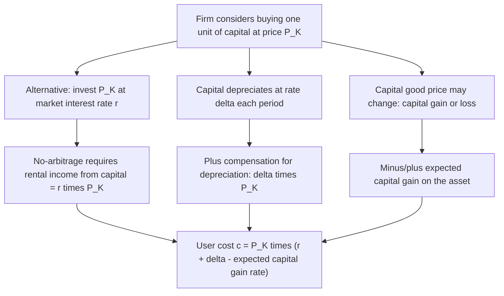
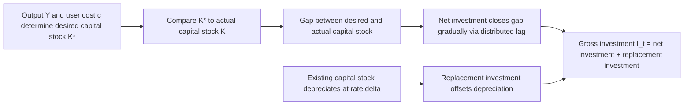

## Neoclassical Theory of Investment and the User Cost of Capital

### Overview

The neoclassical theory of investment, developed primarily by Dale Jorgenson (1963, 1967), provides a rigorous microeconomic foundation for investment demand by deriving the optimal capital stock from firm profit maximization subject to a production function and explicit prices for capital services. Its central analytical device is the **user cost of capital** (also called the **rental price of capital** or **implicit rental rate**), which translates the various costs of owning and using a unit of capital—financing costs, depreciation, taxes—into a single per-period "rental price," analogous to a wage rate for labor. This framework became the dominant paradigm for empirical investment research and remains foundational to modern dynamic general equilibrium models of investment.

### The Firm's Optimization Problem

#### Setup

Consider a representative firm with a neoclassical production function $F(K, L)$ (constant returns to scale, diminishing marginal products) that maximizes the present discounted value of profits over an infinite horizon, choosing capital $K_t$ and labor $L_t$ each period:

$$\max_{K_t, L_t} \sum_{t=0}^{\infty} \frac{1}{(1+r)^t}\left[P_t F(K_t, L_t) - W_t L_t - P_t^K I_t\right]$$

subject to the capital accumulation equation:

$$K_{t+1} = I_t + (1-\delta)K_t$$

Where $P_t$ is the output price, $W_t$ is the wage rate, $P_t^K$ is the price of capital goods, $I_t$ is gross investment, and $\delta$ is the physical depreciation rate.

#### First-Order Condition: The Marginal Productivity Condition

Static profit maximization at the margin requires that the firm employ capital up to the point where its **marginal product** equals its **real user cost**:

$$P_t \cdot \frac{\partial F}{\partial K_t} = c_t$$

Or, in real terms (dividing through by $P_t$):

$$MPK_t = \frac{c_t}{P_t}$$

Where $c_t$ is the (nominal) user cost of capital, defined below. This is the direct capital-market analogue of the standard labor market condition $MPL = W/P$.

**Key Points**

- This condition determines the firm's **desired (optimal) capital stock** $K_t^*$, given the production function, output price, and the user cost of capital.
- Investment is not directly determined by this static condition alone; rather, gross investment is what is required to move the actual capital stock toward the desired stock while also replacing depreciated capital (see the dynamic adjustment discussion below).

### Deriving the User Cost of Capital

#### Basic Formula (No Taxes)

In the simplest version, the user cost of capital represents the implicit "rental rate" a firm must earn per period on a unit of capital to justify holding it, accounting for the opportunity cost of the funds tied up and the loss in value from depreciation:

$$c_t = P_t^K \left(r + \delta - \frac{\dot{P}_t^K}{P_t^K}\right)$$

Where:

- $P_t^K$ = price of capital goods (purchase price)
- $r$ = the real interest rate (or required rate of return on the firm's funds, whether debt or equity)
- $\delta$ = the economic depreciation rate
- $\dot{P}_t^K / P_t^K$ = the expected rate of capital gain (or loss) on the capital good's price (i.e., how fast the price of the capital good itself is rising or falling)

**Key Points**

- The term $(r + \delta)$ represents the sum of the financing cost (foregone interest or required return) and depreciation cost of holding a unit of capital for one period.
- The subtraction of the expected capital gains term reflects that if capital goods are expected to appreciate in price, part of the cost of holding capital is offset by this expected gain (analogous to how expected housing price appreciation offsets the "cost" of homeownership in user-cost-of-housing models).
- If capital goods prices are expected to be stable (i.e., $\dot{P}_t^K = 0$), the formula simplifies to $c_t = P_t^K(r+\delta)$—the most commonly cited baseline form.

#### Intuitive Derivation via No-Arbitrage

The user cost formula can be derived from a no-arbitrage condition: a firm considering whether to buy a unit of capital, use it for one period, and then sell the (depreciated) remainder must be indifferent between this and simply investing the funds at the market rate of return $r$. The rental income the firm must earn to be indifferent is exactly the user cost $c_t$.

### Incorporating Corporate Taxation

Jorgenson's framework is particularly influential in public finance and tax policy analysis because it explicitly incorporates corporate tax parameters, allowing the user cost to capture how tax policy affects investment incentives.

#### User Cost with Corporate Income Tax, Depreciation Allowances, and Investment Tax Credit

A commonly used extended formula incorporating tax parameters:

$$c_t = P_t^K \left(r + \delta - \frac{\dot{P}_t^K}{P_t^K}\right) \cdot \frac{1 - \tau z - k}{1-\tau}$$

Where:

- $\tau$ = the corporate income tax rate
- $z$ = the present value of depreciation allowances (tax deductions) per dollar of investment, discounted at the firm's relevant discount rate
- $k$ = the rate of any investment tax credit (a direct tax credit for a fraction of the investment's cost)

**Key Points**

- The term $\frac{1-\tau z - k}{1-\tau}$ is often called the **tax-adjustment factor** or **effective tax wedge** on capital: it captures how much the corporate tax system raises or lowers the effective user cost relative to the pre-tax case.
- A higher present value of depreciation allowances $z$ (e.g., from accelerated depreciation schedules) *lowers* the user cost, since it means more of the investment cost is recovered sooner via tax deductions, reducing the effective after-tax cost of the investment.
- An investment tax credit $k$ directly lowers the user cost by effectively subsidizing a fraction of the purchase price.
- This formula is the standard analytical tool used in tax policy analysis to compute the **effective marginal tax rate on investment** and to compare the investment incentive effects of different depreciation schedules, tax credits, and statutory tax rates across asset types and time periods.

#### Illustrative Numerical Example

**Example**

Consider a firm facing $r = 5\%$, $\delta = 10\%$, no expected capital gains on the capital good ($\dot{P}^K/P^K = 0$), a corporate tax rate $\tau = 21\%$, present value of depreciation deductions $z = 0.85$ (i.e., 85 cents of tax deduction value per dollar invested, in present value terms, under the applicable depreciation schedule), and no investment tax credit ($k=0$).

Pre-tax user cost per dollar of capital: $r + \delta = 0.05 + 0.10 = 0.15$ (15 cents per dollar of capital per year)

Tax-adjustment factor: $\frac{1 - (0.21)(0.85) - 0}{1 - 0.21} = \frac{1 - 0.1785}{0.79} = \frac{0.8215}{0.79} \approx 1.040$

Adjusted user cost: $0.15 \times 1.040 \approx 0.156$, or about 15.6 cents per dollar of capital per year.

[Inference — this is a stylized numerical illustration constructed to demonstrate the mechanics of the formula using representative but illustrative parameter values; actual applicable depreciation schedules, present-value calculations of $z$, and effective tax rates depend on specific, frequently changing tax code provisions and should not be treated as current tax guidance.]

### From Desired Capital Stock to Investment: The Flexible Accelerator

#### The Gap-Adjustment Mechanism

The static first-order condition determines the firm's **desired capital stock** $K_t^*$:

$$K_t^* = K\left(\frac{P_t}{c_t}, Y_t\right)$$

Where $K^*$ depends positively on output $Y_t$ (via the marginal product of capital) and negatively on the user cost relative to output price. However, firms typically cannot (or choose not to) close the gap between actual capital $K_t$ and desired capital $K_t^*$ instantaneously, due to adjustment costs, delivery lags, and installation time. Jorgenson and subsequent researchers (notably incorporating earlier accelerator-model insights) modeled the resulting investment as a **flexible accelerator** process:

$$I_t = \sum_{j=0}^{n} \lambda_j \Delta K_{t-j}^* + \delta K_{t-1}$$

Where $\lambda_j$ are distributed lag weights (summing to a value related to the speed of adjustment) reflecting how changes in the desired capital stock translate into actual investment spending spread over multiple periods, and the final term $\delta K_{t-1}$ represents **replacement investment** needed to offset depreciation.

**Key Points**

- This decomposition separates gross investment into **net investment** (driven by changes in the desired capital stock, reflecting the $\lambda_j \Delta K^*_{t-j}$ terms) and **replacement investment** (offsetting depreciation of the existing capital stock).
- The distributed lag structure is an empirical, reduced-form addition to the theory (not derived from first principles in the original Jorgenson model), motivated by the observation that investment responds to changes in desired capital stock with a lag, consistent with the presence of adjustment costs, planning and construction time, and delivery lags for capital goods.
- This gap between the theoretically-derived desired capital stock (a stock concept) and the empirically-modeled flow of investment (requiring an additional adjustment mechanism) is a recognized limitation addressed more rigorously by later dynamic investment models incorporating explicit adjustment costs (see comparison table below).

### Comparative Statics: Determinants of Investment in the Neoclassical Model

| Variable | Effect on Desired Capital Stock $K^*$ | Effect on User Cost $c$ | Net Effect on Investment |
| --- | --- | --- | --- |
| Real interest rate $r$ ↑ | — | Increases $c$ | Decreases investment |
| Depreciation rate $\delta$ ↑ | — | Increases $c$ | Decreases investment |
| Corporate tax rate $\tau$ ↑ (holding $z$ fixed) | — | Generally increases $c$ (raises the tax wedge, though the precise direction depends on the interaction with $z$) | Generally decreases investment |
| Present value of depreciation allowances $z$ ↑ (accelerated depreciation) | — | Decreases $c$ | Increases investment |
| Investment tax credit $k$ ↑ | — | Decreases $c$ | Increases investment |
| Output/demand $Y$ ↑ | Increases $K^*$ | — | Increases investment |
| Price of capital goods $P^K$ ↑ | — | Increases $c$ (proportionally) | Decreases investment |
| Expected capital gains on capital goods $\dot{P}^K/P^K$ ↑ | — | Decreases $c$ | Increases investment |

### The Neoclassical Model and Tax Policy Analysis

The Jorgensonian user-cost framework became (and remains) the standard analytical tool for evaluating the investment incentive effects of tax policy changes, because it provides a precise, quantifiable channel—the user cost—through which specific tax parameters ($\tau$, $z$, $k$) map directly into predicted changes in the desired capital stock and investment.

#### Effective Marginal Tax Rate on Investment

Building on the user cost formula, researchers compute the **effective marginal tax rate (EMTR)** on a marginal investment as:

$$EMTR = \frac{\rho - r_{\text{net}}}{\rho}$$

Where $\rho$ is the pre-tax required rate of return implied by the user cost (gross-of-tax) and $r_{\text{net}}$ is the after-tax return required by savers/investors. This measure is widely used to compare how different tax provisions (accelerated depreciation, expensing, investment credits) affect investment incentives across asset types, industries, and financing methods (debt vs. equity).

**Key Points**

- Policies such as **full expensing** (allowing firms to deduct the entire cost of an investment immediately, i.e., $z=1$) reduce the user cost most powerfully among common tax policy tools, since they eliminate the time-value-of-money cost embedded in standard depreciation schedules.
- The framework also naturally accommodates analysis of differential tax treatment of debt- versus equity-financed investment (since $r$ can be modeled as a weighted average cost of capital reflecting the tax deductibility of interest payments), a central topic in corporate finance and tax policy debates. [Inference — the general applicability of the user-cost framework to debt/equity tax asymmetries is a standard extension found throughout the public finance literature; the specific weighted-average-cost-of-capital formulation and resulting numerical distortions depend on the applicable tax code details in a given country and time period.]

### Comparison with Alternative Investment Theories

| Theory | Core Mechanism | Relationship to Neoclassical/User-Cost Model |
| --- | --- | --- |
| Keynesian MEC | Compare expected internal rate of return $\rho$ to interest rate $r$ | User cost model can be seen as a more mechanically precise, tax-inclusive formalization of comparing return to cost |
| Accelerator model | Investment driven by changes in output ($\Delta Y$) | Embedded within the neoclassical model via the dependence of $K^*$ on $Y$; neoclassical model adds explicit relative-price (user cost) determinants absent from the pure accelerator model |
| Tobin's Q theory | Ratio of market value of capital to replacement cost | Closely related: under certain conditions (perfect capital markets, convex adjustment costs), marginal Q and the neoclassical user-cost framework yield consistent investment predictions; Q theory has the empirical advantage of being directly measurable from stock market data |
| Adjustment cost models | Explicit costs of rapidly changing the capital stock, generating smooth investment paths from first principles | Provides a more rigorous microfoundation for the ad hoc "flexible accelerator" lag structure used to bridge desired capital stock and actual investment in the basic Jorgenson model |

### Empirical Applications and Evidence

- The neoclassical/user-cost framework has been extensively used in empirical studies estimating the responsiveness of investment to changes in tax policy (e.g., studies of bonus depreciation provisions, investment tax credit changes, and corporate tax rate reforms), generally finding that investment does respond to user-cost changes, though estimated elasticities vary considerably across studies, industries, and time periods. [Unverified — the literature estimating the "elasticity of investment with respect to the user cost of capital" spans several decades and produces a wide range of point estimates; there is no single universally agreed-upon elasticity value, and results are sensitive to identification strategy (time-series vs. firm-level panel data), the specific tax policy episode studied, and control for confounding demand-side factors.]
- A long-standing debate in the empirical investment literature concerns whether user-cost/tax variables or output/demand variables (accelerator-type effects) are quantitatively more important in explaining observed investment fluctuations, with substantial evidence supporting a meaningful role for both channels depending on the context and time horizon examined.

### Limitations of the Basic Neoclassical Model

1. **Ad hoc adjustment dynamics**: As noted above, the transition from desired capital stock to actual investment via a distributed lag structure is empirically motivated rather than derived from optimizing behavior in the original model—a gap subsequently addressed by explicit adjustment-cost models (Lucas, Treadway, Hayashi) that derive investment dynamics from firm optimization with convex costs of adjusting the capital stock.
2. **Assumption of perfect capital markets**: The basic model generally assumes firms can access funds at the market rate $r$ without financing constraints, an assumption relaxed in later literature on financing constraints and their effects on investment (particularly relevant for smaller or credit-constrained firms).
3. **Certainty/simplified expectations**: The basic model typically treats future prices and demand as known or evolving deterministically, understating the role of uncertainty and irreversibility in investment timing—a gap addressed by the subsequent **real options** approach to investment under uncertainty.
4. **Homogeneous capital assumption**: Like other aggregate investment theories, the model often abstracts from the heterogeneity of capital goods (different asset types with different depreciation profiles, tax treatments, and adjustment costs), which matters significantly for detailed tax policy analysis (addressed in practice by disaggregating the user cost calculation by asset type).

**Related Topics**

- Tobin's Q theory of investment and adjustment cost models
- Marginal efficiency of capital and Keynesian investment theory
- Accelerator theory of investment and the flexible accelerator
- Corporate tax policy: depreciation schedules, expensing, and investment tax credits
- Effective marginal tax rate (EMTR) and effective average tax rate (EATR) on capital
- Real options theory and investment under uncertainty/irreversibility
- Financing constraints and investment-cash flow sensitivity
- Weighted average cost of capital (WACC) and debt-equity tax asymmetries
- Capital accumulation equations and steady-state capital stock in growth models
- Empirical estimation of investment elasticities with respect to user cost