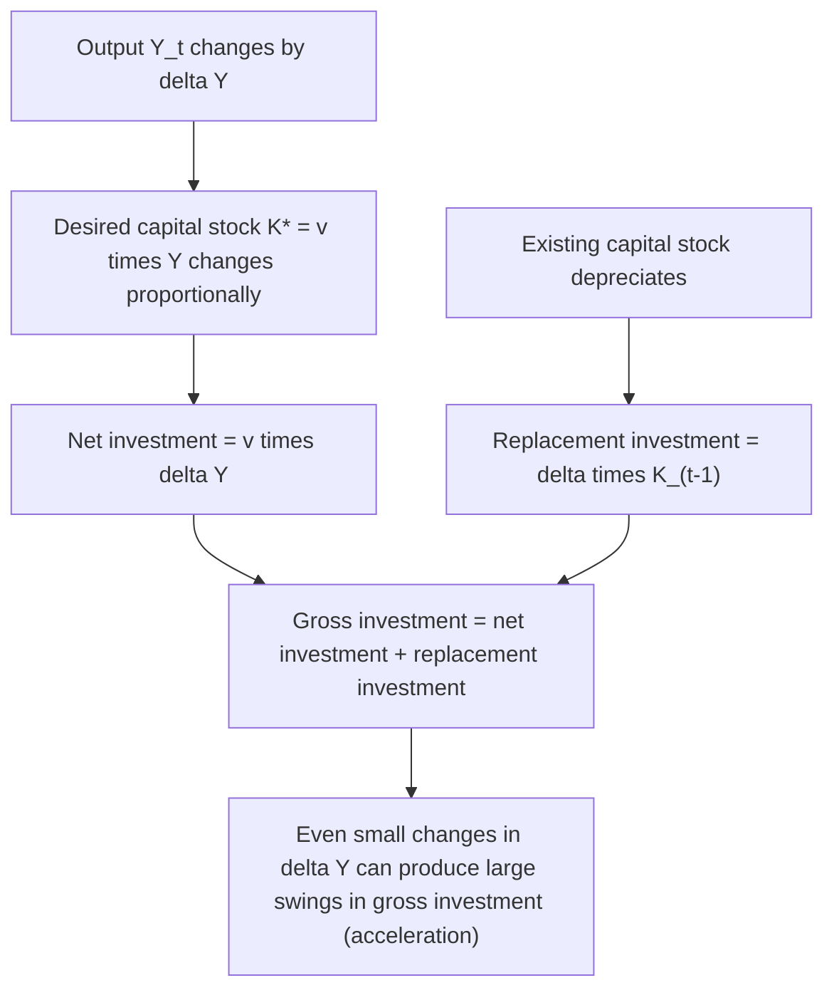
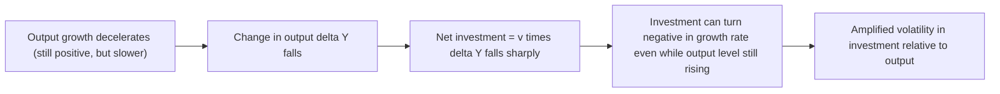
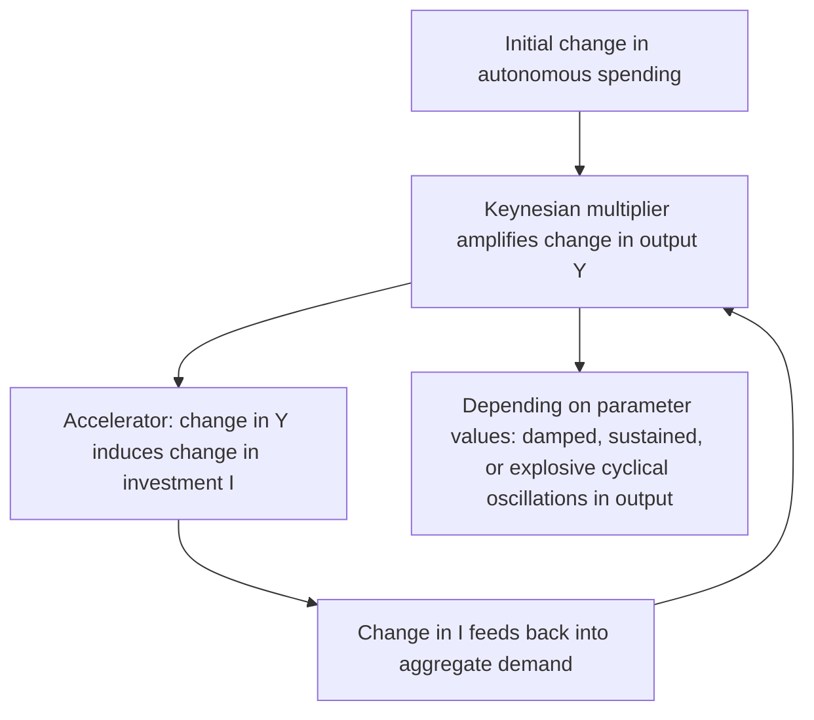

## Accelerator Model of Investment

### Overview

The accelerator model of investment posits that net investment is driven primarily by changes in the level of output (or aggregate demand), rather than by the level of the interest rate or the absolute level of output itself. Rooted in the fixed capital-output ratio assumption, the model provides one of the earliest formal explanations for why investment is empirically far more volatile than output or consumption over the business cycle, and why investment spending tends to amplify (accelerate) fluctuations in aggregate demand. The theory traces back to work by Aftalion (1909) and Clark (1917), and was later refined into the more empirically tractable "flexible accelerator" by Chenery (1952) and Koyck (1954).

### The Simple (Rigid) Accelerator Model

#### The Fixed Capital-Output Ratio Assumption

The simple accelerator model assumes a fixed, technologically determined **capital-output ratio**, $v$, such that the desired (or required) capital stock is a constant multiple of output:

$$K_t^* = v \cdot Y_t$$

Where $K_t^*$ is the desired capital stock in period $t$, $Y_t$ is output in period $t$, and $v$ (the accelerator coefficient) is assumed fixed by the prevailing technology (analogous to a fixed capital-labor ratio assumption in early growth models such as the Harrod-Domar framework).

#### Deriving Net Investment

If firms adjust the capital stock instantaneously and fully to match the desired level each period, net investment is simply the change in the desired capital stock:

$$I_t^{net} = K_t^* - K_{t-1}^* = v(Y_t - Y_{t-1}) = v \cdot \Delta Y_t$$

Adding replacement investment (to offset depreciation of the existing capital stock at rate $\delta$) gives **gross investment**:

$$I_t^{gross} = v \cdot \Delta Y_t + \delta K_{t-1}$$

**Key Points**

- The defining feature of the accelerator model: net investment depends on the **change** in output ($\Delta Y_t$), not the level of output itself. This is what gives the model its "acceleration" property and its name.
- A constant level of output, even if very high, implies **zero net investment** under this model (since $\Delta Y_t = 0$), with only replacement investment occurring—an empirically important and sometimes counterintuitive implication.
- Output must be *growing*, not just *high*, to generate positive net investment.

### The Amplification/Volatility Mechanism

#### Why Investment Is More Volatile Than Output

The accelerator relationship implies that investment volatility is mechanically amplified relative to output volatility, because investment responds to the *rate of change* of output rather than its level.

**Example**

Suppose the capital-output ratio $v = 3$ and output grows as follows: Year 1: $Y=100$; Year 2: $Y=105$ (5% growth); Year 3: $Y=108$ (a slowdown to below 3% growth, though still positive growth); Year 4: $Y=108$ (zero growth, output plateaus).

- Year 2 net investment: $v \times \Delta Y = 3 \times 5 = 15$
- Year 3 net investment: $v \times \Delta Y = 3 \times 3 = 9$ (investment *falls* by 40%, even though output is still *growing*, just at a slower rate)
- Year 4 net investment: $v \times \Delta Y = 3 \times 0 = 0$ (net investment collapses to zero even though output has not declined at all, merely stopped growing)

This example illustrates the model's central and often-cited insight: a mere **deceleration** in the growth rate of output (not an actual decline in output) can produce an absolute collapse in net investment—a mechanism frequently invoked to help explain why investment spending can turn sharply negative in the early stages of a business cycle downturn, even before output itself declines. [Inference — this qualitative amplification mechanism is a standard, well-established theoretical implication of the accelerator model's algebra; the numerical example here is illustrative rather than drawn from a specific empirical episode.]

### The Flexible Accelerator Model

#### Motivation: Relaxing Instantaneous Adjustment

The simple/rigid accelerator model's assumption that firms adjust the capital stock instantaneously and fully to the desired level each period is empirically unrealistic, given delivery lags, construction time, adjustment costs, and uncertainty about whether output changes are permanent or transitory. The **flexible accelerator** (or "capital stock adjustment" model), developed by Chenery (1952) and Koyck (1954), relaxes this by allowing only **partial adjustment** toward the desired capital stock each period:

$$I_t^{net} = K_t - K_{t-1} = \lambda(K_t^* - K_{t-1})$$

Where $\lambda \in (0,1]$ is the **coefficient of adjustment** (or speed of adjustment), representing the fraction of the gap between desired and actual capital stock that is closed within a single period.

**Key Points**

- When $\lambda = 1$, the flexible accelerator collapses to the simple/rigid accelerator model (full, instantaneous adjustment).
- When $\lambda < 1$, investment responds only partially each period, with the remaining gap closed gradually over subsequent periods—producing a smoother, more realistic, distributed-lag investment response to output changes.
- A smaller $\lambda$ implies slower adjustment, consistent with higher adjustment costs, longer delivery/construction lags, or greater caution/uncertainty about whether output changes are permanent.

#### Distributed Lag Representation (Koyck Transformation)

Substituting the desired capital stock rule $K_t^* = vY_t$ into the partial adjustment equation and applying repeated substitution (the Koyck transformation) yields an investment equation expressed as a distributed lag on *past* output changes:

$$I_t^{net} = \lambda v Y_t - \lambda(1-\lambda)^0 v Y_{t-1}(1) + \dots$$

More generally, this can be written in an autoregressive distributed-lag form:

$$K_t = \lambda v Y_t + (1-\lambda)K_{t-1}$$

Which, solved forward, implies actual capital stock (and hence investment) responds to a **geometrically declining weighted average of current and past output levels**, rather than to the single most recent change in output as in the rigid model.

**Key Points**

- This distributed-lag structure is empirically important: it means investment in any given period reflects an accumulated, smoothed response to output changes over several preceding periods, not merely the most recent quarter's output change.
- The flexible accelerator's distributed-lag structure fits observed investment data (which shows smoother, more persistent responses to demand changes than the rigid model predicts) considerably better, and became the standard workhorse specification in early empirical investment studies (e.g., work by Chenery, Koyck, and later Eisner and others).

### Interaction with Uncertainty About Permanence of Output Changes

A recognized refinement of the flexible accelerator concerns the distinction between **permanent** and **transitory** output changes:

- A change in output believed to be **permanent** should induce a substantial upward revision to the desired capital stock $K^*$, generating a strong investment response.
- A change in output believed to be **transitory** (e.g., a temporary demand surge expected to reverse) should induce a much smaller (or negligible) capital stock adjustment, since firms would not want to incur the costs of installing capital that will soon be underutilized.

**Key Points**

- This distinction parallels the permanent/transitory income distinction central to the Permanent Income Hypothesis in consumption theory, and represents an important theoretical refinement addressing a key limitation of the basic accelerator models (which typically do not distinguish permanent from transitory output changes in their basic algebraic form).
- Empirically, this refinement helps explain why investment sometimes appears to respond weakly to short-lived demand fluctuations but strongly to demand changes perceived as reflecting durable shifts in the economy's growth trajectory. [Inference — this is a standard theoretical extension discussed in investment theory textbooks; precisely measuring firms' real-time beliefs about the permanence of a given output change is an inherent empirical challenge, similar to analogous difficulties in testing the Permanent Income Hypothesis.]

### The Accelerator Model and Business Cycle Theory

#### Multiplier-Accelerator Interaction

The accelerator model gained particular theoretical prominence through its combination with the Keynesian multiplier in early formal business cycle models, most notably **Samuelson's multiplier-accelerator model** (1939). In this framework:

1. An initial change in autonomous spending is amplified via the standard Keynesian multiplier into a larger change in output.
2. This change in output, via the accelerator mechanism, induces a change in investment.
3. This induced investment change feeds back into aggregate demand, further affecting output via the multiplier.
4. Depending on the parameter values (the marginal propensity to consume and the accelerator coefficient $v$), this multiplier-accelerator interaction can generate: (a) smooth convergence to a new equilibrium, (b) damped cyclical oscillations, (c) sustained (undamped) cyclical oscillations, or (d) explosive oscillations—providing one of the earliest formal, endogenous mathematical explanations for business cycle periodicity within a simple linear macroeconomic model.

**Key Points**

- The multiplier-accelerator model is historically significant as an early example of an endogenous business cycle model generating cyclical behavior purely from the interaction of two behavioral relationships (the consumption function and the accelerator investment function), without requiring exogenous cyclical shocks to generate cycle-like dynamics.
- The model's cyclical properties are highly sensitive to the specific numerical values of its parameters, which is often cited as both a strength (it can generate a rich variety of dynamic behaviors) and a weakness (a small change in an empirically uncertain parameter, like the accelerator coefficient $v$, can flip the model's qualitative prediction from stable convergence to explosive oscillation). [Inference — this sensitivity property is a well-established mathematical feature of the Samuelson multiplier-accelerator model's difference-equation structure, widely discussed in business cycle theory textbooks as both a notable contribution and a significant limitation.]

### Comparison with the Neoclassical/User-Cost Model

| Feature | Simple/Flexible Accelerator | Neoclassical (Jorgenson) User-Cost Model |
| --- | --- | --- |
| Primary driver of desired capital stock | Output level ($Y_t$) only | Output level *and* relative price of capital services (user cost) |
| Role of interest rate | None (absent from the basic model) | Central (directly enters the user cost of capital) |
| Role of tax policy | None (absent from the basic model) | Central (tax parameters directly affect user cost) |
| Capital-output ratio | Assumed fixed/exogenous ($v$) | Endogenously determined by relative factor prices and the production function's elasticity of substitution |
| Theoretical rigor | Relatively ad hoc; not derived from firm optimization in the basic version | Explicitly derived from firm profit-maximization subject to a production function |
| Empirical tractability | Simple, minimal data requirements (only output data needed) | Requires data on interest rates, capital goods prices, and tax parameters |

**Key Points**

- The neoclassical model can be seen as nesting and generalizing the accelerator model: if the user cost of capital is held constant (assumed unaffected by interest rate or tax changes) and the production function has a fixed capital-output ratio (a Leontief-type technology with no substitutability between capital and labor), the neoclassical model's desired capital stock reduces mathematically to the simple accelerator formula $K^* = vY$.
- The key limitation of the pure accelerator model relative to the neoclassical model is its omission of relative price effects (the interest rate, cost of capital goods, and tax policy), which limits its usefulness for analyzing how monetary or tax policy affects investment—a gap the neoclassical model was specifically designed to address.

### Empirical Evidence and Assessment

- Early empirical tests of the accelerator model (particularly using aggregate time-series data) found reasonably good explanatory power for output-driven investment fluctuations, particularly in explaining the strong positive correlation between output growth and investment observed in the data, but the simple/rigid accelerator model in isolation was generally found to fit the data less well than models incorporating both accelerator (demand) effects and relative price/cost-of-capital effects (i.e., hybrid or neoclassical specifications). [Unverified — the relative empirical performance of pure accelerator models versus neoclassical or hybrid models varies across the specific studies, time periods, countries, and levels of aggregation examined in this extensive literature, and there is no single universally agreed "winning" specification.]
- The flexible accelerator's distributed-lag structure (a geometrically declining weight on past output changes) has generally been found to fit observed investment dynamics considerably better than the instantaneous-adjustment rigid accelerator, supporting the empirical relevance of partial adjustment/adjustment cost considerations in investment behavior.
- Modern investment research has largely moved toward richer dynamic models (Tobin's Q with explicit adjustment costs, structural neoclassical models with financing frictions) that nest accelerator-type output effects alongside relative price and financing variables, rather than treating the pure accelerator model as a standalone complete theory; the accelerator mechanism is nonetheless still widely used as a simplified, tractable component embedded within larger macroeconomic models (e.g., inventory investment equations in many applied and DSGE-style models continue to use accelerator-type specifications). [Inference — this characterization of the accelerator model's role as a component within larger modern frameworks, rather than a standalone dominant theory, reflects the general trajectory of the investment theory literature as commonly presented in macroeconomics textbooks.]

### Limitations of the Accelerator Model

1. **Omission of relative prices**: As discussed, the basic model contains no role for the interest rate, cost of capital, or tax policy—a significant limitation for policy analysis, since it implies investment cannot be influenced by monetary or tax policy at all in the pure accelerator framework, which is empirically implausible.
2. **Assumption of a fixed capital-output ratio**: Assumes no substitutability between capital and labor and no technological change affecting the optimal capital intensity of production, which is a strong simplification relative to the more flexible production functions underlying the neoclassical model.
3. **No role for expectations about future output beyond simple extrapolation**: The basic model typically assumes desired capital stock depends only on current (or recently observed) output, without explicitly modeling forward-looking expectations about future demand, in contrast to more modern investment theories incorporating rational expectations and forward-looking optimization.
4. **Ambiguity regarding capacity utilization**: The model implicitly assumes firms are always operating at desired capacity relative to their capital stock; if firms hold excess capacity (below full utilization), an increase in output may be met by increased utilization of existing capital rather than new investment, weakening the accelerator relationship in the short run—a consideration sometimes incorporated into extended versions of the model via a capacity-utilization-adjusted accelerator specification.

### Summary Comparison of Investment Theories Covered

| Theory | Key Driving Variable(s) | Best Suited For |
| --- | --- | --- |
| Keynesian MEC | Expected return vs. interest rate; expectations/animal spirits | Explaining investment instability and the role of business confidence |
| Accelerator (simple/flexible) | Change in output ($\Delta Y$) | Explaining investment volatility relative to output; business cycle amplification |
| Neoclassical (Jorgenson user-cost) | Output level and relative price of capital (interest rate, taxes, depreciation) | Tax policy analysis; quantifying investment responsiveness to relative prices |
| Tobin's Q / adjustment cost models | Market valuation of capital relative to replacement cost; explicit adjustment costs | Modern empirical investment research; linking investment to observable financial market data |

**Related Topics**

- Marginal efficiency of capital and Keynesian investment theory
- Neoclassical theory of investment and the user cost of capital
- Tobin's Q theory and adjustment cost models of investment
- Samuelson's multiplier-accelerator model and endogenous business cycle theory
- Capacity utilization and its interaction with investment decisions
- Inventory investment and accelerator-type models in modern macroeconomic models
- Permanent vs. transitory shocks (parallel concept from consumption theory, applied to output changes)
- Harrod-Domar growth model (related fixed capital-output ratio assumption)
- Difference equations and stability conditions in dynamic macroeconomic models
- Empirical investment equations: distributed lag and partial adjustment specifications