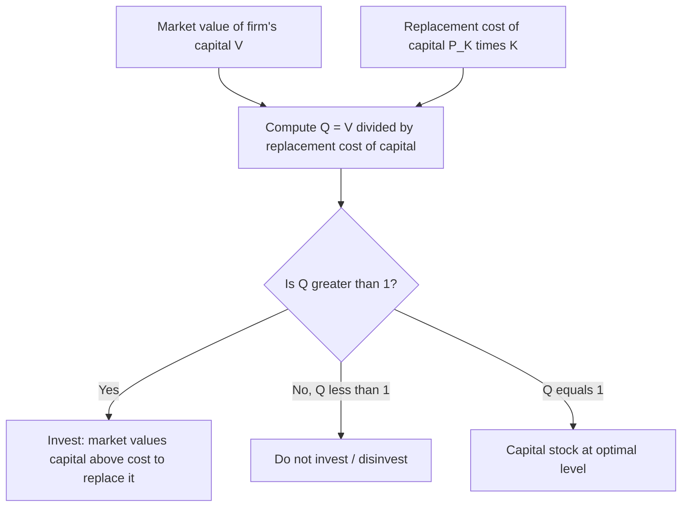
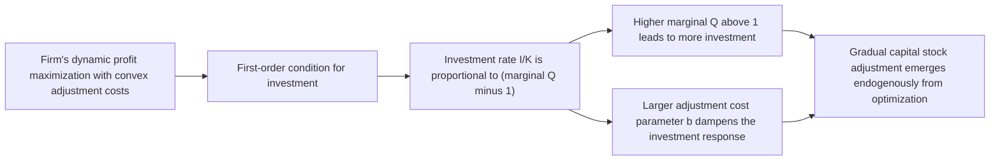
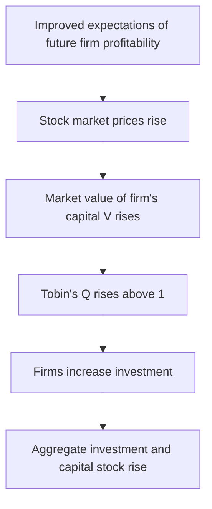

## Tobin's Q Theory of Investment

### Overview

Tobin's Q theory of investment, developed by James Tobin (1969), provides a forward-looking, market-valuation-based framework for explaining firm investment decisions. Its central insight is elegantly simple: a firm should invest in new capital whenever the market value of that capital exceeds its replacement cost, and should refrain from investing (or even disinvest) when the reverse holds. The ratio of these two values—market value to replacement cost—is "Q," and it serves as a single sufficient statistic summarizing all the forward-looking information (expected future profitability, interest rates, taxes) relevant to the investment decision. The theory's key empirical advantage over the Keynesian MEC and neoclassical user-cost models is that Q can, in principle, be directly measured using observable stock market data.

### Definition of Q

#### Average Q (Tobin's Original Formulation)

$$Q = \frac{\text{Market value of the firm's existing capital}}{\text{Replacement cost of that capital}}$$

For a publicly traded firm, the numerator is typically proxied by the firm's total market value (market capitalization of equity plus market value of debt), and the denominator is the current replacement cost of the firm's physical capital stock.

$$Q_t = \frac{V_t}{P_t^K K_t}$$

Where $V_t$ is the firm's total market value, $P_t^K$ is the price of capital goods, and $K_t$ is the existing capital stock.

#### The Investment Decision Rule

$$Q > 1 \implies \text{Invest (market values capital above its replacement cost)}$$

$$Q < 1 \implies \text{Do not invest / disinvest (market values capital below its replacement cost)}$$

$$Q = 1 \implies \text{Capital stock is at its optimal level; no incentive to change it}$$

**Key Points**

- The intuitive logic: if $Q > 1$, a firm (or investors generally) can create one dollar's worth of new market value by spending less than one dollar on new capital—a profitable arbitrage that competitive firms should exploit by investing.
- Conversely, if $Q < 1$, the market values the firm's assets at less than it would cost to replace them, implying the firm could theoretically profit more by not investing (or even by acquiring another firm's existing capital via merger rather than building new capital, since existing capital is "cheaper" via acquisition than via new construction).
- Q theory thus links the **stock market** directly to the **real economy**: investment demand can be predicted from equity market valuations.

### Average Q vs. Marginal Q

#### The Theoretical Distinction

The investment decision is, strictly speaking, governed by **marginal Q**—the ratio of the value of an *additional* unit of capital to its replacement cost—not average Q (the ratio for the *entire existing* capital stock):

$$q_t^{marginal} = \frac{\text{Value of an additional unit of capital}}{\text{Replacement cost of that unit}}$$

Average Q, as originally proposed by Tobin, is what is empirically observable (from stock market valuation and capital stock data), while marginal Q is the theoretically correct decision variable derived from firm optimization.

#### When Average Q Equals Marginal Q: Hayashi's Conditions

Fumio Hayashi (1982) established the precise conditions under which average Q and marginal Q are equal, making the empirically observable average Q a valid proxy for the theoretically relevant marginal Q:

1. **Perfect competition** in both output and capital goods markets.
2. **Constant returns to scale** in the production function and in the (convex) adjustment cost function.
3. **Linear homogeneity** of the adjustment cost function in investment and capital.

**Key Points**

- Under Hayashi's conditions, the firm's value function is linear in the capital stock, which implies the average value per unit of capital equals the marginal value per unit of capital—hence average Q = marginal Q.
- This result (often called the **Hayashi theorem**) is what justifies the widespread empirical practice of using directly observable average Q (constructed from stock market data) as a proxy for the theoretically-motivated marginal Q in investment regressions.
- If these conditions fail (e.g., under decreasing returns to scale, monopoly power/market power generating economic rents unrelated to the marginal value of capital, or non-convex adjustment costs), average Q and marginal Q can diverge, and average Q may be a biased or noisy proxy for the true investment-relevant marginal Q. [Inference — this divergence and its implications for measurement error in empirical Q-theory studies is a standard, widely-discussed caveat in the investment literature following Hayashi's contribution.]

### Formal Derivation: Investment with Convex Adjustment Costs

#### The Firm's Dynamic Optimization Problem

Q theory's rigorous microfoundation comes from combining the neoclassical firm optimization problem with an explicit **cost of adjusting** the capital stock, typically assumed convex (increasing marginal cost of installing capital more quickly). The firm maximizes:

$$\max_{I_t} \sum_{t=0}^{\infty} \frac{1}{(1+r)^t}\left[\pi(K_t) - P_t^K I_t - C(I_t, K_t)\right]$$

subject to $K_{t+1} = I_t + (1-\delta)K_t$, where $\pi(K_t)$ is operating profit as a function of the capital stock and $C(I_t, K_t)$ is the (convex) adjustment cost function, commonly specified as quadratic:

$$C(I_t, K_t) = \frac{b}{2}\left(\frac{I_t}{K_t}\right)^2 K_t$$

Where $b > 0$ is an adjustment cost parameter.

#### First-Order Condition and the Investment Function

Solving this dynamic optimization problem, the first-order condition with respect to investment yields an investment rule directly proportional to marginal Q:

$$\frac{I_t}{K_t} = \frac{q_t - 1}{b}$$

Where $q_t$ is marginal Q (the shadow value of an additional unit of capital, in units of the numeraire, divided by its replacement cost). This is the central quantitative result of the modern Q-theoretic investment literature: the investment rate is a linear function of $(q_t - 1)$, scaled by the inverse of the adjustment cost parameter.

**Key Points**

- The adjustment cost parameter $b$ determines the *speed* of investment response to a given deviation of Q from 1: a smaller $b$ (lower adjustment costs) implies a larger, more rapid investment response to a given gap between $q$ and 1; a larger $b$ implies a smoother, more gradual response.
- This formulation directly resolves the ad hoc distributed-lag adjustment mechanism used in the flexible accelerator model: here, the gradual adjustment of the capital stock toward its desired level emerges endogenously from the firm's own optimization problem (given convex adjustment costs), rather than being imposed as an external assumption.
- Marginal Q, $q_t$, is formally the shadow price (Lagrange multiplier) on the capital accumulation constraint in the firm's dynamic optimization problem—the present value, in utility/profit terms, of relaxing the constraint by one additional unit of capital.

### Q Theory and Tax Policy

Q theory can also incorporate the effects of corporate taxation, depreciation allowances, and investment credits, similar to the neoclassical user-cost framework, by adjusting the definition of Q to reflect after-tax valuations:

$$q_t^{after-tax} = \frac{(1-\tau)V_t + \tau z K_t}{(1-\tau)P_t^K K_t}$$

Where $\tau$ is the corporate tax rate and $z$ reflects the present value of depreciation allowances (analogous to its role in the Jorgensonian user-cost formula). Tax policies that increase after-tax firm value relative to replacement cost (e.g., accelerated depreciation, investment tax credits) raise Q and stimulate investment, consistent with predictions from the neoclassical user-cost model. [Inference — this tax-adjusted formulation is a standard extension found across the Q-theory literature connecting it to public finance applications, though the exact functional form of tax adjustments varies somewhat across specific studies and textbook treatments.]

### Q Theory and the Stock Market as a Leading Indicator

A prominent implication of Q theory is that stock market valuations should serve as a **leading indicator** of aggregate investment: if the market's assessment of future corporate profitability rises (reflected in higher equity prices and hence higher Q), a subsequent rise in investment should follow.

**Key Points**

- This mechanism provides a coherent theoretical channel linking asset price movements to real economic activity, distinct from (though related to) the wealth-effect channel connecting asset prices to household consumption.
- It also provides a theoretical channel for monetary policy transmission: a monetary easing that raises equity valuations (e.g., by lowering the discount rate applied to expected future corporate cash flows) raises Q and stimulates investment, complementing the traditional interest-rate/user-cost channel.

### Empirical Performance of Q Theory

#### Documented Strengths

- Q theory provides a theoretically elegant, internally consistent framework connecting financial markets directly to real investment decisions, with a clear testable prediction (investment should respond positively to Q).
- Empirical studies consistently find a statistically significant positive relationship between measured average Q and subsequent investment rates across firms and over time, providing qualitative support for the theory's core prediction. [Unverified — while the qualitative sign of this relationship is a robust and widely replicated empirical finding, the quantitative strength of the relationship (the R-squared or explained variance) is a separate matter addressed below.]

#### Documented Weaknesses

- A long-standing and well-documented empirical puzzle is that measured average Q typically explains only a modest fraction of the variation in observed investment rates across firms and over time, and estimated coefficients on Q are often considered implausibly small relative to what the theory would predict given plausible adjustment cost parameters. [Unverified — the specific magnitude of this "low explanatory power" finding varies across studies, datasets (firm-level panel vs. aggregate time series), time periods, and econometric specifications, but the general qualitative finding that Q alone leaves substantial unexplained investment variation is widely replicated and discussed in the literature.]
- Investment has frequently been found to exhibit **excess sensitivity to cash flow** even after controlling for Q—i.e., firms with higher current cash flow invest more than Q theory alone predicts, holding Q constant. This finding is commonly interpreted as evidence of financing constraints (firms facing external financing frictions rely more heavily on internally generated cash flow than a frictionless Q-theoretic model would predict), though some researchers have also proposed that this finding could partly reflect measurement error in Q (since cash flow may proxy for information about future profitability not fully captured in current stock prices) rather than financing constraints per se—a debate that remains only partially resolved in the literature. [Inference — the existence of a robust cash-flow/investment correlation controlling for Q is a well-established empirical regularity; the correct causal interpretation (financing constraints vs. measurement error in Q vs. other explanations) remains a genuinely contested question among researchers in this literature.]
- Measurement of average Q is subject to substantial practical difficulties: constructing an accurate replacement cost of capital requires assumptions about depreciation and capital goods price indices, and using average Q (rather than the theoretically correct marginal Q) requires the restrictive Hayashi conditions to hold, which are frequently violated in practice (e.g., due to market power, decreasing returns to scale, or non-convex/lumpy adjustment costs).

### Comparison Table: Investment Theories

| Feature | Keynesian MEC | Neoclassical (Jorgenson) | Accelerator | Tobin's Q |
| --- | --- | --- | --- | --- |
| Core variable | Expected return $\rho$ vs. interest rate $r$ | User cost of capital (interest rate, taxes, depreciation) | Change in output $\Delta Y$ | Ratio of market value to replacement cost of capital |
| Data source for empirical estimation | Not directly observable; requires assumed expectations | Interest rates, capital goods prices, tax parameters | Output data only | Stock market valuation and capital stock data |
| Explicit adjustment cost microfoundation | No | No (ad hoc distributed lag) | No (ad hoc distributed lag) | Yes (convex adjustment costs derive the investment rule directly) |
| Role of financial markets | Indirect (via interest rate) | Indirect (via interest rate/cost of capital) | None | Direct and central (Q is constructed from market valuations) |
| Key documented empirical weakness | Expectations not directly measurable/testable | Reasonable fit but often requires accelerator-type output terms to fit well | Explains volatility but omits price effects | Low explanatory power alone; residual cash-flow sensitivity |

### Q Theory, Financing Constraints, and Extensions

The excess cash-flow sensitivity finding described above motivated a substantial subsequent literature examining how **financing constraints**—arising from asymmetric information between firms and external investors, or from limited collateral—interact with the Q-theoretic investment framework.

#### Key Extensions

1. **Fazzari, Hubbard, and Petersen (1988)** and subsequent work classified firms by proxies for financing constraint severity (e.g., dividend payout ratios) and found that more likely-constrained firms exhibited greater investment-cash-flow sensitivity, interpreted as evidence that internal funds matter independently of Q for financially constrained firms.
2. Subsequent literature has debated this interpretation, with some researchers arguing that cash-flow sensitivity does not monotonically increase with a priori measures of financial constraint severity across all samples and specifications, suggesting the relationship between financing constraints and investment-cash-flow sensitivity may be more complex than initially proposed. [Unverified — this remains an actively debated and only partially resolved methodological controversy within the corporate finance and investment literature, with different studies reaching different conclusions depending on sample construction and constraint-classification methodology.]
3. Modern structural models often incorporate financing frictions directly into the firm's dynamic optimization problem (rather than testing for them via reduced-form cash-flow regressions), generating richer, more nuanced predictions about how financial constraints interact with the marginal Q-investment relationship.

### Practical/Applied Use of Q Theory

- **Corporate finance and capital budgeting**: Q theory's logic underlies practical corporate decisions about whether to expand via internal capital investment (building new capacity) versus mergers and acquisitions (acquiring existing capacity)—when industry-wide Q is below 1, acquiring existing firms' capital can be cheaper than building new capital, providing a stylized explanation for merger wave patterns correlating with periods of depressed equity valuations relative to replacement costs. [Inference — this is a commonly cited stylized application of Q-theoretic logic to merger and acquisition activity found in corporate finance textbooks and research, though the empirical relationship between aggregate Q and merger wave timing involves additional considerations beyond the simple theory (e.g., financing conditions, regulatory environment, and strategic motives).]
- **Macroeconomic forecasting**: Aggregate stock market valuation measures (aggregate Q, sometimes approximated using measures like the aggregate market value of equity relative to the replacement cost of the corporate capital stock) have been used as one input among many in forecasting aggregate investment spending, though with the same caveats about limited standalone explanatory power noted above.

**Related Topics**

- Neoclassical theory of investment and the user cost of capital
- Marginal efficiency of capital and Keynesian investment theory
- Accelerator theory of investment and the flexible accelerator
- Adjustment cost models of investment (Lucas, Treadway, Hayashi)
- Financing constraints and the investment-cash-flow sensitivity debate
- Hayashi's theorem: conditions equating average and marginal Q
- Wealth effects on consumption (parallel asset-price-to-real-activity channel)
- Monetary policy transmission via asset prices and equity valuations
- Mergers and acquisitions: Q theory and the "buy vs. build" decision
- Real options theory and investment under uncertainty