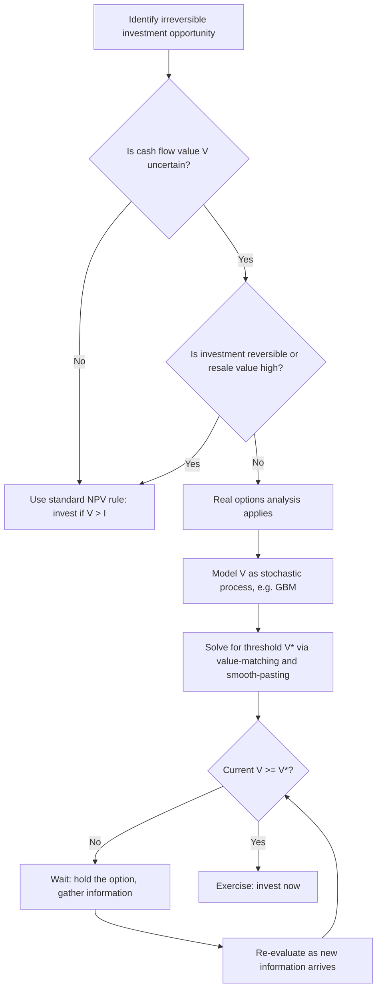

## Investment under Uncertainty and Real Options

### Overview

Investment under uncertainty examines how firms make irreversible capital-spending decisions when future payoffs are unknown. The **real options** approach extends this by treating investment opportunities as analogous to financial options — the firm holds the *right, but not the obligation*, to invest, and this right has value that traditional Net Present Value (NPV) analysis ignores. This framework was formalized primarily by Avinash Dixit and Robert Pindyck, building on earlier option-pricing insights from Black-Scholes-Merton.

The central insight: when investment is irreversible (sunk cost cannot be recovered) and can be delayed (timing is flexible), the standard NPV rule of "invest if NPV > 0" is generally wrong. Waiting has value because it allows the firm to observe more information before committing capital.

---

### Why Standard NPV Fails under Uncertainty

The textbook NPV rule states:

$$NPV = -I_0 + \sum_{t=1}^{n} \frac{CF_t}{(1+r)^t}$$

Invest if $NPV > 0$. This rule implicitly assumes:

1. The investment is **reversible** (can be undone, capital recovered if conditions worsen), or
2. The investment is a **now-or-never** decision (no option to delay).

In reality, most capital investments are **irreversible** — a factory, a drilling rig, or an R&D program cannot be costlessly liquidated — and firms usually **can delay** the decision to gather more information. When both irreversibility and the option to wait are present, the correct decision rule requires investing only when NPV exceeds a threshold well above zero. This threshold is the **value of waiting**, and ignoring it causes firms to over-invest relative to the option-adjusted optimum.

---

### The Three Conditions for Real Options to Matter

**Key Points**

- **Irreversibility**: The investment cost is (at least partly) a sunk cost; the asset has little or no resale/scrap value if the decision proves wrong.
- **Uncertainty**: Future cash flows, prices, or demand evolve stochastically; new information arrives over time.
- **Flexibility (discretion over timing)**: The firm is not forced to invest immediately — it can wait, and waiting has some value.

If any one of these three is absent, real options largely collapse back to standard NPV. For example, if investment is fully reversible (equipment can be resold at cost), delay has little value even under high uncertainty.

---

### The Option Analogy

An investment opportunity is treated as a **call option**:

| Financial Call Option | Real Investment Option |
| --- | --- |
| Stock price $S$ | Present value of expected project cash flows |
| Strike price $K$ | Investment cost $I$ |
| Time to expiration $T$ | Time until the opportunity disappears (competitive erosion, license expiry) |
| Volatility $\sigma$ | Volatility of project value / underlying cash flows |
| Risk-free rate $r$ | Risk-free rate |
| Option value | Value of the *right* to invest |

Just as a financial call option gains value from volatility (upside is captured, downside is capped by not exercising), the option to invest gains value from uncertainty in project cash flows — the firm can walk away from bad outcomes and only invest when conditions are favorable.

---

### Formal Framework: The McDonald-Siegel / Dixit-Pindyck Model

**Setup**

Let $V$ denote the present value of the expected cash flow stream generated by an investment project, evolving as a **Geometric Brownian Motion (GBM)**:

$$dV = \alpha V\, dt + \sigma V\, dz$$

where $\alpha$ is the expected growth rate, $\sigma$ is instantaneous volatility, and $dz$ is the increment of a Wiener process. Let $I$ be the fixed, irreversible investment cost. The firm holds a **perpetual option** to pay $I$ and receive $V$.

**The Value-Matching and Smooth-Pasting Conditions**

Let $F(V)$ be the value of the option to invest. Standard option-pricing / dynamic-programming logic (Bellman equation combined with Itô's Lemma) yields the following ordinary differential equation in the continuation (waiting) region:

$$\frac{1}{2}\sigma^2 V^2 F''(V) + rV F'(V) - rF(V) = 0$$

The general solution takes the form $F(V) = AV^{\beta_1} + BV^{\beta_2}$. Since $F(0) = 0$ (an option on a worthless project is worthless), $B = 0$, leaving:

$$F(V) = A V^{\beta_1}$$

The firm invests at a threshold $V^*$, determined by two boundary conditions:

1. **Value-matching**: at the trigger point, the option's value equals the net payoff from exercising:

   $$F(V^*) = V^* - I$$
2. **Smooth-pasting**: the option value function meets the exercise payoff tangentially (no kink), ensuring optimality:

   $$F'(V^*) = 1$$

Solving these two equations simultaneously for $A$ and $V^*$ gives the classic result:

$$V^* = \frac{\beta_1}{\beta_1 - 1} I$$

where $\beta_1 > 1$ is the positive root of the fundamental quadratic:

$$\frac{1}{2}\sigma^2 \beta(\beta-1) + r\beta - r = 0$$

**Interpretation**: the term $\frac{\beta_1}{\beta_1 - 1}$ is always **greater than 1**, meaning the firm should not invest merely when $V = I$ (standard NPV break-even), but wait until $V$ exceeds $I$ by a multiplicative "hurdle" factor. As $\sigma \to 0$ (no uncertainty), $\beta_1 \to \infty$ and the hurdle collapses to 1, recovering the standard NPV rule as a special case. As uncertainty rises, the hurdle multiple rises, meaning firms optimally require a substantially higher expected return before committing.

---

### Types of Real Options

**Key Points**

- **Option to Delay (Timing Option)**: The core option described above — waiting for better information before an irreversible investment.
- **Option to Expand**: Initial investment creates the right (not obligation) to scale up if conditions turn favorable (e.g., building a plant with excess land for a future second production line).
- **Option to Abandon (Contract/Exit)**: The right to shut down and salvage some value if conditions deteriorate; analogous to a **put option** on the project.
- **Option to Switch (Flexibility Option)**: The ability to alter inputs or outputs (e.g., a dual-fuel power plant switching between gas and oil based on relative prices).
- **Growth Options (Compound Options)**: Early-stage investments (e.g., R&D, pilot plants, market entry) that are valuable primarily because they open up further investment opportunities — an option on an option.
- **Option to Contract**: The right to scale down operations, reducing costs during a downturn without full abandonment.

---

### Valuation Approaches

**1. Contingent Claims Analysis (Risk-Neutral / Black-Scholes-Style)**

When a **traded twin security** (spanning asset) exists whose risk profile matches the project, the option can be valued using the **risk-neutral valuation** framework, replacing the actual drift $\alpha$ with the risk-free rate $r$ (or risk-adjusted equivalent) — as in the Black-Scholes-Merton machinery. This is theoretically clean but requires the "spanning" assumption: that capital markets are complete enough to replicate the project's risk.

**2. Dynamic Programming (Decision-Tree / Binomial Lattice)**

When no traded twin exists, the more general approach uses **dynamic programming** with a risk-adjusted discount rate, working backward through a decision tree or **binomial lattice**:

- Model the underlying value $V$ as moving up (to $uV$) or down (to $dV$) each period with risk-neutral probabilities $p$ and $(1-p)$.
- At each terminal node, compute the payoff $\max(V - I, 0)$.
- Roll back through the tree, discounting at the risk-free rate under the risk-neutral measure, applying the optimal exercise decision at each node.

This approach is more flexible for American-style (early-exercise) real options and multi-stage / compound options where closed-form solutions do not exist.

**3. Monte Carlo Simulation**

For path-dependent or multi-factor real options (e.g., correlated price and demand uncertainty, multiple stages of R&D), **Monte Carlo simulation** generates thousands of simulated paths for $V$, computes the optimal exercise policy along each path (often via the **Least-Squares Monte Carlo** method of Longstaff-Schwartz for American-style flexibility), and averages discounted payoffs.

---

### Worked Numerical Example

**Example**

A firm considers building a factory costing $I = \$1{,}600$ (a one-time, irreversible outlay). The project, once built, generates a perpetual cash-flow stream whose present value today is $V_0 = \$2{,}000$. Standard NPV:

$$NPV = V_0 - I = 2{,}000 - 1{,}600 = \$400 > 0$$

By the naive rule, the firm should invest immediately. However, suppose $V$ follows a GBM with volatility $\sigma = 0.20$ (20% annual), risk-free rate $r = 0.05$, and the project has no dividend-like payout leakage in the interim.

Solving the fundamental quadratic $\frac{1}{2}(0.20)^2 \beta(\beta - 1) + 0.05\beta - 0.05 = 0$ yields $\beta_1 \approx 2.0$ (illustrative rounded value for this parameter set). Then:

$$V^* = \frac{\beta_1}{\beta_1 - 1} I = \frac{2.0}{1.0}(1{,}600) = \$3{,}200$$

Since current $V_0 = \$2{,}000 < V^* = \$3{,}200$, the option-adjusted rule says **wait** — even though static NPV is positive. The firm should only invest once the project's value nearly doubles the investment cost, because the value of preserving flexibility (avoiding a bad, irreversible commitment) outweighs the immediate $400 NPV gain.

**[Inference]** The specific value of $\beta_1 \approx 2.0$ depends sensitively on the chosen $\sigma$ and $r$; different parameterizations of the same model will produce different hurdle multiples, and this example is illustrative of the mechanism rather than a universal numeric benchmark.

---

### Diagram: Investment Timing Decision under the Real Options Framework (svg_diagram)

<svg xmlns="http://www.w3.org/2000/svg" viewBox="0 0 760 420" font-family="Arial, sans-serif">
<text x="380" y="25" text-anchor="middle" font-size="16" font-weight="bold">Investment Trigger under Uncertainty (svg_diagram)</text>

<line x1="80" y1="360" x2="720" y2="360" stroke="black" stroke-width="2" />
<line x1="80" y1="360" x2="80" y2="50" stroke="black" stroke-width="2" />
<text x="400" y="395" text-anchor="middle" font-size="13">Project Value, V</text>
<text x="30" y="200" text-anchor="middle" font-size="13" transform="rotate(-90 30 200)">Value / Payoff</text>

<line x1="200" y1="360" x2="700" y2="60" stroke="#1f77b4" stroke-width="2" />
<text x="620" y="90" font-size="12" fill="#1f77b4">Payoff if invest: V - I</text>

<path d="M 80 355 C 250 345, 380 300, 480 220 C 560 155, 620 110, 700 60" stroke="#d62728" stroke-width="2.5" fill="none" />
<text x="480" y="200" font-size="12" fill="#d62728">Option value, F(V)</text>

<line x1="200" y1="360" x2="200" y2="70" stroke="gray" stroke-dasharray="4,3" />
<text x="200" y="380" text-anchor="middle" font-size="12">I (NPV = 0)</text>

<line x1="480" y1="360" x2="480" y2="70" stroke="#2ca02c" stroke-dasharray="4,3" stroke-width="2" />
<text x="480" y="380" text-anchor="middle" font-size="12" fill="#2ca02c">V* (optimal trigger)</text>

<text x="330" y="120" text-anchor="middle" font-size="12" font-style="italic">Wait Region</text>

<text x="600" y="120" text-anchor="middle" font-size="12" font-style="italic">Invest Region</text>

<circle cx="480" cy="220" r="5" fill="#d62728" />
<text x="500" y="240" font-size="11">Value-matching &amp;</text>
<text x="500" y="255" font-size="11">smooth-pasting point</text>
</svg>

---

### Diagram: Decision Process Flow

---

### Comparative Statics: What Increases the Investment Trigger $V^*$

| Parameter | Change | Effect on $V^*$ (hurdle) | Intuition |
| --- | --- | --- | --- |
| Volatility $\sigma$ | Increases | Increases | Higher uncertainty raises the value of waiting to resolve information |
| Investment cost $I$ | Increases | Increases (proportionally) | Larger sunk cost raises the bar for exercise |
| Risk-free rate $r$ | Increases | Ambiguous / typically increases $\beta_1$, lowering multiple somewhat, but effect on discounting dominates in most calibrations | [Inference] Net effect depends on model specification and payout assumptions |
| Reversibility (salvage value) | Increases | Decreases | Less sunk cost means less penalty for a wrong decision, closer to standard NPV |
| Competitive threat (erosion of option, entry by rivals) | Increases | Decreases | Competition reduces the value of waiting, since delay risks losing the opportunity entirely |

**[Inference]** The ambiguous sign for $r$ reflects the fact that the risk-free rate affects both the discounting of future payoffs and the root $\beta_1$ of the fundamental quadratic in offsetting ways; the net direction is model- and parameter-dependent rather than a universal law.

---

### Real Options and Competitive Dynamics

The baseline Dixit-Pindyck model assumes a monopolist facing no competitive erosion of the option. In competitive or oligopolistic markets, the analysis becomes a **game-theoretic real options** problem:

- **Preemption effect**: If being first-mover captures a strategic advantage (e.g., market share, patent priority), competition can *erode* the option value of waiting, pushing firms to invest earlier than the monopoly threshold $V^*$ would suggest — potentially even sooner than in the naive NPV case in some models.
- **Rivalry-induced volatility**: The threat of competitor entry itself can act like a "dividend" that decreases the value of holding the option unexercised, analogous to a dividend-paying stock reducing the value of an American call held to expiration.

**[Inference]** The precise degree to which preemption reverses the "wait" conclusion is highly sensitive to market structure assumptions (Stackelberg vs. simultaneous-move, symmetric vs. asymmetric information) and is an active area of theoretical modeling rather than a single settled result.

---

### Relationship to Q-Theory of Investment

Real options theory complements (rather than replaces) Tobin's **Q-theory of investment**, where investment is a function of marginal Q (the ratio of the market value of an additional unit of capital to its replacement cost). Standard Q-theory predicts investment resumes as soon as $Q > 1$. Real options theory shows that under irreversibility, firms require $Q$ to exceed a threshold *greater than 1* (analogous to $V^*/I > 1$ derived above) before investing — providing a microfoundation for empirically observed investment "inertia" or hysteresis, where firms fail to invest even when conventional profitability signals appear favorable.

---

### Hysteresis in Investment and Disinvestment

A related implication is **hysteresis**: because both entry (investment) and exit (disinvestment/abandonment) involve sunk costs, there exists a *band of inaction* between the trigger price for entry ($P^*_{entry}$) and the trigger price for exit ($P^*_{exit}$), with $P^*_{entry} > P^*_{exit}$. Within this band, firms rationally take no action even as prices fluctuate — they neither enter a profitable-looking market nor exit an apparently unprofitable one, because switching costs are sunk in both directions. This explains empirically observed phenomena such as firms remaining in an industry despite sustained losses, or exchange-rate pass-through delays in trade responses to currency movements.

---

### Empirical and Policy Applications

**Key Points**

- **Natural resource extraction**: Classic real options applications (Brennan-Schwartz) value mines and oil fields as options to extract when commodity prices exceed extraction cost thresholds — extraction is paused ("mothballing") when prices fall below a lower trigger, and resumed when prices recover above an upper trigger (hysteresis band).
- **R&D and pharmaceutical pipelines**: Staged R&D investment (pre-clinical → Phase I → Phase II → Phase III) is naturally modeled as a sequence of **compound options**, where each stage's investment buys the option to proceed to the next, conditional on results.
- **Environmental and climate policy**: Real options logic informs debates about the timing of costly, irreversible environmental regulation or infrastructure (e.g., carbon abatement investments) under uncertain future climate damage estimates — sometimes used to argue for waiting for better information, though this application is contested because irreversibility can cut both ways (delaying abatement may itself be irreversible in terms of accumulated emissions).
- **Venture capital and staged financing**: VC investors structure financing in rounds (seed, Series A, B, C) partly to preserve abandonment options, capping downside exposure while retaining upside participation.
- **Land development and real estate**: Vacant land is valued partly as an option to develop, explaining why land often trades above the NPV of "develop now" cash flows.

---

### Key Limitations and Criticisms

**Key Points**

- **Spanning assumption**: Contingent-claims valuation requires a traded asset correlated with project risk; many real investment projects (idiosyncratic R&D outcomes, unique physical assets) lack a clean market twin, weakening the risk-neutral valuation approach. [Inference] In practice, analysts often substitute a subjectively chosen risk-adjusted discount rate, which reintroduces estimation uncertainty the framework was meant to avoid.
- **Parameter estimation difficulty**: Volatility $\sigma$ of project value is rarely directly observable (unlike stock volatility) and must be proxied or estimated from comparable firms, introducing significant model risk.
- **Complexity vs. adoption**: Despite strong theoretical grounding, survey evidence on corporate capital budgeting practice suggests many firms still rely primarily on NPV and payback-period rules, using real options reasoning more qualitatively than through formal PDE or lattice solutions. [Unverified] The exact proportion of firms using formal real-options valuation varies across surveys and time periods and should not be treated as a fixed, current statistic without checking recent sources.
- **Overstated flexibility**: Critics note that real options models can overstate the practical value of managerial flexibility if organizational or contractual rigidities (labor contracts, regulatory approval lags) prevent firms from actually exercising the option in a timely manner when conditions change.

---

### Formula Summary

$$NPV_{static} = V_0 - I$$

$$\text{Optimal exercise threshold: } V^* = \frac{\beta_1}{\beta_1 - 1} I, \quad \beta_1 > 1$$

$$\text{Characteristic root equation: } \frac{1}{2}\sigma^2 \beta(\beta - 1) + r\beta - r = 0$$

$$\text{Option value (waiting region): } F(V) = A V^{\beta_1}, \quad V < V^*$$

$$\text{Value-matching: } F(V^*) = V^* - I \qquad \text{Smooth-pasting: } F'(V^*) = 1$$

---

**Related Topics**

- Q-theory of investment and adjustment costs
- Black-Scholes-Merton option pricing model
- Binomial (Cox-Ross-Rubinstein) lattice methods
- Least-Squares Monte Carlo (Longstaff-Schwartz) for American options
- Hysteresis and sunk-cost-driven inertia in trade and exchange rates
- Game-theoretic models of preemption and strategic real options
- Capital budgeting and the cost of capital
- Compound options and staged R&D valuation
- Tobin's Q and neoclassical investment theory
- Irreversibility and environmental policy under uncertainty (precautionary principle debates)