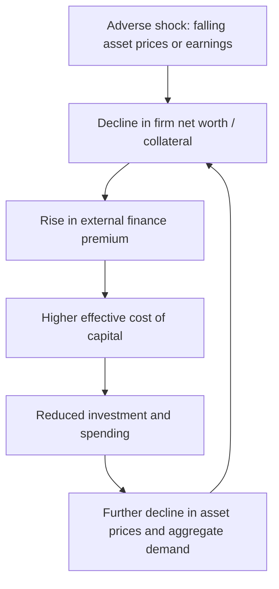
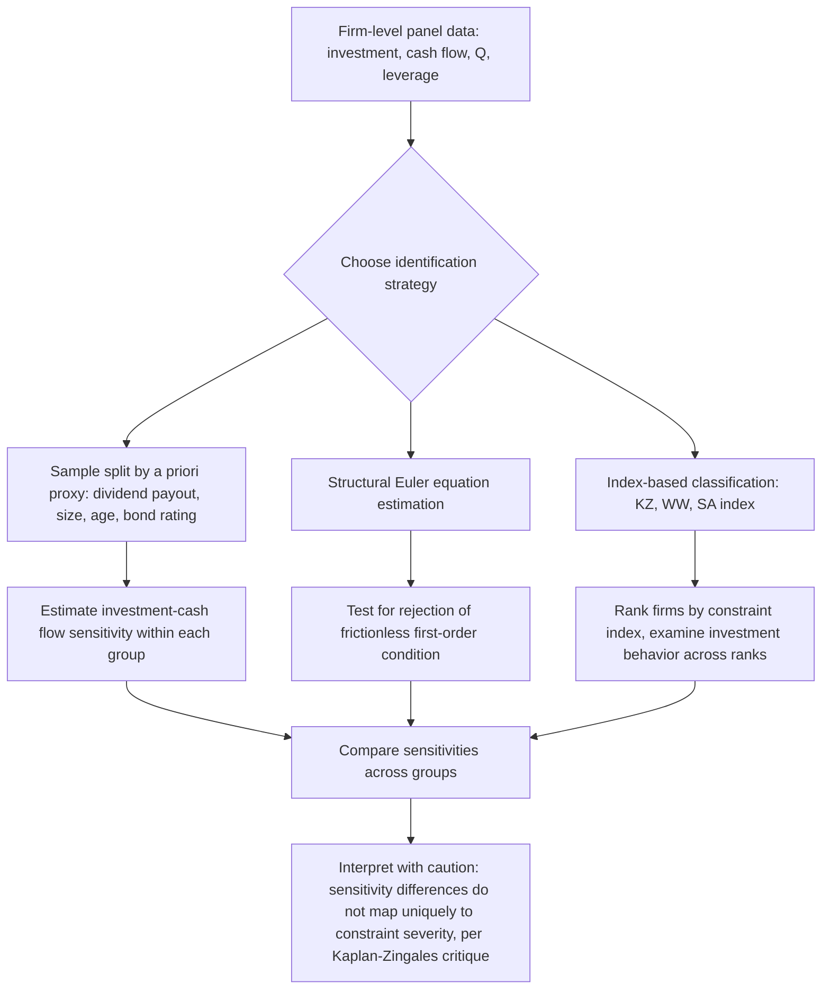

## Financing Constraints and Investment

### Overview

Financing constraints refer to frictions that drive a wedge between the cost of internal funds (retained earnings) and external funds (new debt or equity), causing firm investment to depend on financial factors — cash flow, balance-sheet strength, collateral — beyond what is predicted by the frictionless neoclassical investment model. Under the **Modigliani-Miller (M-M) theorem**, capital structure and financing sources are irrelevant to investment decisions when capital markets are perfect. Financing constraints theory relaxes M-M's assumptions (no taxes, no bankruptcy costs, no information asymmetries, no transaction costs) to explain why, empirically, investment often tracks internal cash flow far more closely than the frictionless benchmark predicts.

---

### The Modigliani-Miller Benchmark and Its Failure

**Key Points**

- **M-M Proposition I**: In perfect capital markets, firm value is independent of financing mix; a firm can always raise external funds at the same (risk-adjusted) cost as internal funds.
- **Implication for investment**: Under M-M, investment should depend only on the marginal product of capital and the cost of capital (Q-theory / user cost of capital), not on the firm's cash position, leverage, or liquidity.
- **Empirical departure**: A large empirical literature beginning with Fazzari, Hubbard, and Petersen (1988) documents that investment is significantly and positively correlated with **cash flow**, even after controlling for Tobin's Q (the standard proxy for investment opportunities) — a pattern inconsistent with frictionless M-M.

This correlation is interpreted as evidence that external finance is more costly than internal finance for at least some firms, causing investment to be constrained by the availability of internal funds or borrowing capacity rather than purely by investment opportunities.

---

### Sources of the External Finance Premium

**1. Asymmetric Information (Adverse Selection)**

Building on Akerlof's "lemons" problem, Myers and Majluf (1984) show that when managers know more about firm value than outside investors, issuing new equity signals that shares may be overvalued, causing the stock price to fall on announcement. This creates a **pecking order** of financing preferences:

$$\text{Internal funds} \succ \text{Debt} \succ \text{External equity}$$

Firms prefer retained earnings first, then debt (less information-sensitive because of its fixed, prioritized claim), and external equity only as a last resort. This pecking order implies that firms with insufficient internal funds may forgo positive-NPV projects rather than issue undervalued equity, directly linking investment to cash flow availability.

**2. Costly State Verification and Agency Costs of Debt**

Townsend (1979) and Gale-Hellwig (1985) formalize **costly state verification**: lenders cannot costlessly observe a borrower's true cash flow realization, so debt contracts must include costly monitoring or bankruptcy procedures to deter misreporting. This generates an **external finance premium** — the wedge between the cost of externally and internally-raised funds — that rises as the borrower's net worth falls, since low net worth increases the lender's exposure to moral hazard and default risk.

**3. Moral Hazard**

Because firm insiders bear only part of the downside of a failed project (limited liability) while capturing private benefits, they may have incentives to take on excessive risk, divert funds, or under-exert effort once financed ("asset substitution" or "risk-shifting"). Lenders anticipate this and ration credit or raise rates accordingly (Jensen and Meckling, 1976; Stiglitz and Weiss, 1981).

**4. Costly Contracting and Bankruptcy Costs**

Direct costs (legal, administrative) and indirect costs (loss of customer/supplier confidence, fire-sale asset liquidation) of financial distress raise the effective cost of debt finance as leverage rises, reinforcing the wedge between internal and external funds.

---

### The Financial Accelerator and the Net Worth Channel

**Bernanke, Gertler, and Gilchrist (1996, 1999)** formalize the **financial accelerator** mechanism, linking firm (or aggregate) net worth to the external finance premium:

$$\text{External Finance Premium} = f\left(\frac{1}{\text{Net Worth}}\right), \quad f' < 0 \text{ (premium falls as net worth rises)}$$

**Mechanism**:

1. A negative shock to firm net worth (e.g., falling asset prices, an earnings shock) reduces collateral available to pledge against loans.
2. Lower collateral raises the agency/monitoring costs lenders bear, so lenders demand a higher external finance premium.
3. The higher cost of external capital reduces investment (and consumption, for durable-goods purchases) beyond what the initial shock alone would imply.
4. Reduced investment and spending further depress asset prices and net worth, amplifying the initial shock — a mechanism termed the **financial accelerator** because it *amplifies and propagates* business cycle shocks rather than merely transmitting them one-for-one.

This creates a **procyclical** external finance premium: constraints tighten in recessions (when net worth falls) and loosen in expansions, amplifying cyclical volatility in investment relative to a frictionless benchmark.

---

### Diagram: The Financial Accelerator Feedback Loop

---

### Empirical Methodology: Investment-Cash Flow Sensitivity

**The Baseline Regression Specification**

The canonical empirical test regresses firm-level investment on Tobin's Q (controlling for investment opportunities) and cash flow (proxying for internal funds availability):

$$\frac{I_{it}}{K_{it-1}} = \alpha + \beta_1 Q_{it} + \beta_2 \frac{CF_{it}}{K_{it-1}} + \varepsilon_{it}$$

where $I_{it}$ is investment, $K_{it-1}$ is the beginning-of-period capital stock, $Q_{it}$ is (average) Tobin's Q, and $CF_{it}$ is cash flow. Under frictionless neoclassical/Q-theory investment, $\beta_2$ should be statistically indistinguishable from zero once $Q$ is properly controlled for, because $Q$ is a sufficient statistic for investment opportunities. A significantly positive $\hat\beta_2$ is interpreted as evidence of financing constraints.

**Sample Splitting Approach (Fazzari-Hubbard-Petersen, 1988)**

FHP sorted firms by dividend payout ratio (low-payout firms presumed more likely to be financially constrained, since they retain earnings rather than distributing them, often because external finance is costly) and found investment-cash flow sensitivity ($\hat\beta_2$) was **higher** for low-payout (presumptively constrained) firms than for high-payout (presumptively unconstrained) firms — interpreted as supporting the financing-constraints hypothesis.

**The Kaplan-Zingales (1997) Critique**

Kaplan and Zingales challenged the FHP interpretation on two grounds:

1. **Monotonicity is not theoretically guaranteed**: A higher investment-cash flow sensitivity does not necessarily map monotonically to a higher degree of financial constraint; the relationship can be non-monotonic or even reversed depending on the underlying model structure. [Inference] This is a theoretical critique about identification rather than a claim that cash-flow sensitivity is entirely uninformative.
2. **Measurement error in Q**: Tobin's Q, especially average Q computed from market values, may be a noisy or mismeasured proxy for marginal Q (the theoretically relevant object), so a positive coefficient on cash flow may partly reflect Q's measurement error rather than true financing constraints — cash flow could be picking up information about future profitability that Q fails to capture.

This critique launched a substantial subsequent literature debating whether investment-cash flow sensitivity is a valid measure of financing constraints at all, with the consensus shifting toward more caution in interpreting the coefficient in isolation.

---

### Alternative and Refined Measures of Financing Constraints

**Key Points**

- **KZ Index (Kaplan-Zingales Index)**: A firm-level index combining cash flow, Q, debt, dividends, and cash holdings, estimated from a subsample of firms independently classified as constrained/unconstrained, then applied out-of-sample.
- **WW Index (Whited-Wu, 2006)**: Derived from a structural Euler-equation estimation, avoiding reliance on Q as a sufficient statistic; uses firm size, age, leverage, cash flow, and industry sales growth.
- **SA Index (Size-Age Index, Hadlock-Pierce, 2010)**: A simpler index based only on firm size and age (both plausibly exogenous to financial policy), designed to avoid the endogeneity criticisms leveled at indices built from financial variables directly. Hadlock and Pierce specifically argue firm size and age are the most robust predictors of constraint status.
- **Bond ratings and commercial paper ratings**: Firms with public debt ratings, or with access to commercial paper markets, are considered less constrained (as rated firms have passed a screening/certification process that improves market access); firms lacking ratings are often used as a "constrained" proxy group (Whited, 1992; Calomiris et al., 1995).
- **Euler-equation approach (Bond and Meghir, 1994)**: Structurally estimates the firm's intertemporal investment first-order condition; a rejection of the frictionless Euler equation (e.g., via significant coefficients on cash flow or debt terms within the structural equation) is interpreted as direct evidence of binding financing constraints, sidestepping the need for a Q proxy at all.

---

### Diagram: Classifying and Testing for Financing Constraints

---

### Worked Numerical Illustration

**Example**

Consider two firms, both with identical Tobin's Q of 1.5 (suggesting similar investment opportunities), but different cash flow positions:

- **Firm A** (high cash flow / internal funds available): $CF_A/K = 0.20$
- **Firm B** (low cash flow, constrained): $CF_B/K = 0.05$

Using an estimated regression $\frac{I}{K} = 0.02 + 0.10\,Q + 0.40\,\frac{CF}{K}$ (illustrative coefficients drawn from typical magnitudes found in this literature):

$$\frac{I_A}{K} = 0.02 + 0.10(1.5) + 0.40(0.20) = 0.02 + 0.15 + 0.08 = 0.25$$

$$\frac{I_B}{K} = 0.02 + 0.10(1.5) + 0.40(0.05) = 0.02 + 0.15 + 0.02 = 0.19$$

Despite identical investment opportunities (same $Q$), Firm A invests at a rate of 25% of capital stock versus 19% for Firm B — a six-percentage-point gap attributable entirely to differing internal funds availability. Under frictionless M-M, this gap should not exist; its presence (holding $Q$ fixed) is the empirical signature financing-constraints researchers seek. **[Inference]** The specific coefficient values (0.10, 0.40) are illustrative of typical orders of magnitude reported in the literature, not universal constants; actual estimates vary substantially by sample, time period, and country.

---

### Precautionary Cash Holdings and Investment Smoothing

Financing constraints also motivate **precautionary corporate cash holdings**. If external finance is costly or unavailable in bad states of the world, firms facing financing constraints optimally hold larger cash buffers (or unused credit lines) to self-insure against future cash-flow shortfalls, smoothing investment across states. This generates a testable prediction: financially constrained firms should exhibit a significant **cash-flow sensitivity of cash** (Almeida, Campello, and Weisbach, 2004) — that is, constrained firms save a higher fraction of incremental cash flow as cash rather than spending it immediately, precisely because they cannot reliably access external funds later.

$$\frac{\Delta Cash_{it}}{K_{it-1}} = \alpha + \beta \frac{CF_{it}}{K_{it-1}} + \text{controls}$$

A significantly positive $\beta$ for constrained firms (and insignificant $\beta$ for unconstrained firms, who can access external funds on demand and thus have no precautionary motive) is interpreted as complementary evidence to the investment-cash flow sensitivity tests, and was proposed partly as a robustness check against the Kaplan-Zingales critique.

---

### Credit Rationing: The Stiglitz-Weiss Model

**Stiglitz and Weiss (1981)** show that **equilibrium credit rationing** can arise even without price (interest rate) adjustment clearing the loan market, because raising the interest rate charged to borrowers has two offsetting effects on a lender's expected return:

1. **Direct effect**: Higher rates increase revenue per unit lent, for a given borrower pool.
2. **Adverse selection effect**: Higher rates drive safer borrowers out of the applicant pool (since only riskier borrowers with high-variance projects find it worthwhile to borrow at high rates, given limited liability caps their downside), worsening the average riskiness of the remaining applicant pool.
3. **Moral hazard / incentive effect**: Higher rates on existing loans encourage borrowers to shift toward riskier projects to boost the (limited-liability-protected) upside of successful outcomes.

Beyond some rate $r^*$, the adverse selection and moral hazard effects can dominate, causing the lender's **expected** return to actually **decline** as the contract rate rises further. Because of this non-monotonicity, lenders may find it optimal to hold the interest rate below the market-clearing level and **ration credit quantity** instead — some observationally identical borrowers are denied credit entirely, even though they are willing to pay the going rate, because raising rates further to accommodate them would lower the lender's expected profit from the entire pool.

---

### Diagram: Lender's Expected Return vs. Interest Rate (Stiglitz-Weiss)

<svg xmlns="http://www.w3.org/2000/svg" viewBox="0 0 700 400" font-family="Arial, sans-serif">
<text x="350" y="25" text-anchor="middle" font-size="16" font-weight="bold">Credit Rationing: Lender Return vs. Contract Rate (svg_diagram)</text>
<line x1="80" y1="340" x2="650" y2="340" stroke="black" stroke-width="2" />
<line x1="80" y1="340" x2="80" y2="60" stroke="black" stroke-width="2" />
<text x="365" y="375" text-anchor="middle" font-size="13">Contract Interest Rate, r</text>
<text x="30" y="200" text-anchor="middle" font-size="13" transform="rotate(-90 30 200)">Lender's Expected Return</text>
<path d="M 90 330 Q 250 100, 400 100 Q 500 100, 620 260" stroke="#1f77b4" stroke-width="2.5" fill="none" />
<line x1="400" y1="340" x2="400" y2="100" stroke="gray" stroke-dasharray="4,3" />
<text x="400" y="358" text-anchor="middle" font-size="12">r* (optimal rate)</text>
<circle cx="400" cy="100" r="5" fill="#d62728" />
<text x="400" y="85" text-anchor="middle" font-size="11">Maximum expected return</text>

<text x="200" y="200" font-size="12" fill="`#2ca02c`">Direct effect dominates</text>

<text x="480" y="220" font-size="12" fill="`#d62728`">Adverse selection / moral hazard dominates</text>

</svg>

---

### Macroeconomic and Aggregate Implications

**Key Points**

- **Amplification of business cycles**: The financial accelerator implies that shocks to the financial sector (bank capital, asset prices) can have outsized effects on aggregate investment, contributing to boom-bust cycles beyond what productivity or demand shocks alone would generate.
- **Bank lending channel of monetary policy**: Monetary tightening reduces bank reserves/deposits, constraining bank loan supply; firms dependent on bank credit (particularly small and medium enterprises lacking access to public debt/equity markets) see investment fall disproportionately, providing an additional transmission channel for monetary policy beyond the standard interest-rate channel (Bernanke and Blinder, 1988; Kashyap and Stein, 2000).
- **Balance-sheet channel of monetary policy**: Monetary policy also affects investment by altering borrower net worth (via asset prices and interest expense on floating-rate debt), independent of the direct bank-lending-supply channel.
- **Cross-country and financial development literature**: Countries with better-developed financial systems (deeper credit markets, stronger creditor protection, more efficient bankruptcy procedures) exhibit lower average investment-cash flow sensitivities and, in growth literature (Rajan and Zingales, 1998), industries more dependent on external finance grow disproportionately faster in financially developed countries — interpreted as evidence that financing constraints have first-order effects on capital allocation and growth.
- **Constraints and misallocation**: In development macroeconomics, financing constraints are a leading candidate explanation (alongside other frictions) for capital misallocation across firms within a country, where measured marginal products of capital differ systematically across firms — a pattern inconsistent with a frictionless capital market that would equalize marginal returns.

---

### Policy and Corporate Responses to Financing Constraints

**Key Points**

- **Credit lines and revolving facilities**: Firms negotiate pre-committed credit lines specifically to hedge against future financing-constraint states, effectively pre-purchasing access to external finance before a shock hits.
- **Trade credit**: Constrained firms (especially smaller ones lacking bank/market access) may rely more heavily on supplier trade credit as a substitute financing channel, though trade credit itself can be rationed in downturns (contagion of constraints along supply chains).
- **Government interventions**: Loan guarantee programs, targeted lending facilities, and central bank credit-easing programs (e.g., asset purchase programs targeting corporate bonds or commercial paper during the 2008 and 2020 crises) are explicitly motivated by financial-accelerator logic — aiming to substitute for impaired private credit intermediation during periods when the external finance premium spikes.
- **Capital structure choices**: Anticipation of future financing constraints incentivizes firms to maintain lower leverage in normal times ("debt capacity" preservation), a motive documented in the corporate cash-holdings and capital-structure literatures as distinct from the static trade-off theory of leverage.

---

**Related Topics**

- Modigliani-Miller theorem and capital structure irrelevance
- Pecking order theory of capital structure (Myers-Majluf)
- Q-theory of investment and Tobin's Q
- Bank lending channel and the balance-sheet channel of monetary policy
- Credit rationing and adverse selection (Stiglitz-Weiss model)
- Corporate cash holdings and precautionary savings motives
- Financial accelerator and business cycle amplification (Bernanke-Gertler-Gilchrist)
- Capital misallocation and total factor productivity in development macroeconomics
- Small and medium enterprise (SME) access to finance
- Bankruptcy costs and the trade-off theory of capital structure